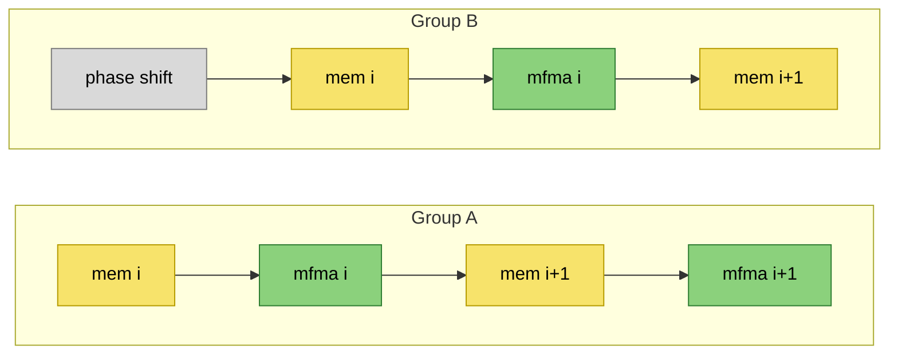
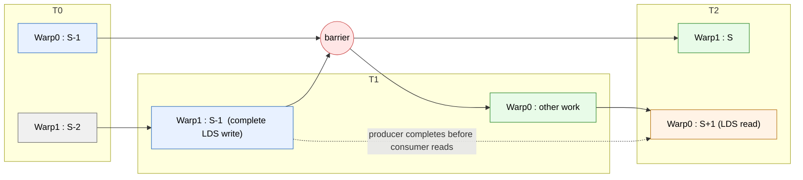

# Warp-Pipelining on gfx950

A reference for the theory behind the [`inter_wave/a16w16`](../kernels/gemm/inter_wave/a16w16/README.md)
warp-pipeline GEMM kernels: what warp-pipelining is, why it raises MFMA
utilization, how its barriers work, and the dependency model a kernel author has
to keep in mind.

> [!NOTE]
> **Attribution.** The warp-pipeline schedule and the analysis distilled here
> originate with **Jungwook Park**, who designed the `WarpPipeliner` /
> `ConvertWarpPipeline` passes in the Triton AMD backend and wrote the original
> [*Warp-pipelining in Triton AMDGPU*](https://github.com/jungpark-mlir/triton/blob/wp-document/third_party/amd/docs/warpPipeline.md)
> write-up. This page adapts that material — condensed and re-grounded in the
> gfx950 tutorial kernels — with his permission. Any errors introduced in the
> adaptation are ours.

## 1. What warp-pipelining is

Warp-pipelining is a **phase-shifted, barrier-rendezvous scheduling scheme** that
raises **MFMA compute utilization** in compute-bound GEMM-like kernels. It splits
the warps of one workgroup into **two groups** and keeps them permanently *out of
phase*: while one group executes a **compute stage** (MFMA-heavy), the other
executes a **memory/prep stage** (global loads, LDS reads, address arithmetic,
waits). At each stage boundary the two groups rendezvous and swap roles.

```
SIMD issue slots over time  (one SIMD, two resident warps)
   group A   │ MFMA  MFMA  MFMA │ ld/addr/wait     │ MFMA  MFMA  MFMA │ ...
   group B   │ ld/addr/wait     │ MFMA  MFMA  MFMA │ ld/addr/wait     │ ...
             └── stage boundary ┴── stage boundary ┴── stage boundary ┘
```

The two groups never run the same stage at the same time, so whenever one group
is forced to wait — on LDS readiness or an address computation — the other group
still has MFMA work ready to issue, and the matrix pipes stay busy. The scheme
does **not** reduce raw memory latency; it hides it behind the *other group's*
compute.

In this tutorial the technique is realized by the two `inter_wave/a16w16` kernels.
Both launch **8 warps/CTA**, which on a gfx950 CU (4 SIMDs) is **2 waves/SIMD** —
exactly the two resident warps per SIMD the scheme needs to interleave. The
phase split puts one of each SIMD's two warps in group A and the other in
group B (one warp per SIMD per group, 4 warps per group):

| Kernel | Loop shape | Notable for warp-pipelining |
|---|---|---|
| [`v0_BK32_nS3`](../kernels/gemm/inter_wave/a16w16/v0_BK32_nS3/README.md) | full 256×256 tile, triple-buffered ring | uses **relaxed** LDS loads to keep a memory fence out of the compute stage (§6) |
| [`v1_sliceMN_BK64_nS2`](../kernels/gemm/inter_wave/a16w16/v1_sliceMN_BK64_nS2/README.md) | 2×2 quadrants, double-buffered | separate per-quadrant LDS allocations make the fence unnecessary (§6) |

## 2. Where warp-pipelining sits

Several nearby techniques share vocabulary with warp-pipelining; distinguishing
them sharpens what it is.

**vs. BlockPingpong (its predecessor).** BlockPingpong is the earlier AMD pass
that pursues the *same* runtime target — out-of-phase compute/memory overlap —
but encodes a mostly concrete schedule directly in transformed IR, inserting
synchronization as it builds the schedule. Warp-pipelining encodes **stage
structure first** (as clusters), then decides concrete synchronization during
lowering. Same intent, but a representation that is easier to analyze, compose,
and eventually auto-partition. Warp-pipelining is the generalization;
[§8](#8-the-blockpingpong-lineage) sketches the lineage.

**vs. warp-specialization.** Both give different roles to different warp groups,
but they solve different problems. Warp-specialization runs **intentionally
different code paths** per group (e.g. a producer warp doing DMA and a consumer
warp doing math). Warp-pipelining runs the **same kernel logic** in every group,
only with a temporal phase offset. Warp-specialization is a *work-partitioning*
shape; warp-pipelining is a *scheduling* shape.

**vs. backend instruction scheduling.** Warp-pipelining is higher-level: it
decides **which stage boundaries exist** and which stages may overlap.
Instruction scheduling reorders instructions *within* the synchronization
constraints those boundaries already establish. Because stage relationships are
semantic, they must be made explicit *before* lowering flattens the program into
individual instructions — a backend scheduler cannot recover them.

**vs. double buffering / "ping-pong buffers."** A classic ping-pong *buffer*
swaps two memory banks so a DMA can fill one while compute drains the other.
That is a *data-movement* pattern and is orthogonal to warp-pipelining (which is
about *who issues what when*). The `inter_wave/a16w16` kernels do both: they
double/triple-buffer LDS **and** warp-pipeline the issue schedule. Don't conflate
the two uses of "ping-pong."

### Clusters / stages as semantic units

In warp-pipeline IR the **cluster** (exposed to the kernel author as a *stage*)
is the primary unit of staging. A cluster is simultaneously:

- a set of operations intended to execute as one stage slice,
- a boundary that constrains cross-stage reordering, and
- the unit over which dependency and synchronization decisions are made.

Barriers enforce safety *at* boundaries, but it is cluster membership that
carries the stage meaning.

## 3. The core mechanism: phase-shift barrier rendezvous

### The goal

Create a **stable, systematic phase offset** between the two warp groups: they
repeatedly rendezvous at cluster boundaries but never run the same stage at the
same time. Steady state, viewed at any boundary, is "group A at the compute
cluster, group B at the memory cluster."

### `cond_barrier`: the enabling primitive

The phase offset is established and torn down with a **conditional barrier**
(`amdg.cond_barrier` in the AMD backend). It is a partial-synchronization tool
with three load-bearing properties:

1. it executes a barrier **conditionally** (only the selected warps take it),
2. it deliberately **diverges** execution to create the offset, and requires
   explicit **reconvergence** later, and
3. it sets **no memory fence** — it is an *execution* rendezvous only.

Property (3) is what makes a phase offset cheap: shifting the groups must not
drag memory-ordering waits into the schedule.

> Conceptually the offset can be built from nothing more than control flow and a
> standard barrier: route some warps through a helper block that contains a
> barrier while the others skip it, then have everyone reach a common barrier
> inside the loop. Convergence happens because all participating warps reach the
> *same barrier PC*, not because they followed the same path to get there. The
> dedicated `cond_barrier` op is the clean, analyzable form of that trick.

### Loop structure: shift, lock, reconverge

The conversion wraps the pipelined loop in three parts:

- **Pre-loop** — drain any outstanding synchronization, then **phase-shift** one
  group with `cond_barrier`.
- **In-loop** — at every cluster boundary, keep the groups phase-locked. The
  conversion emits a **scheduler barrier** (a compile-time wall, below) and then
  *either* a **local-fencing barrier** *or* a bare **execution-rendezvous
  barrier**, chosen by whether the boundary actually carries an LDS dependency
  that needs a fence (§6–§7).
- **Post-loop** — **reconverge** the phase shift with a complementary
  `cond_barrier`.

### The hardware mapping on gfx950

The converter's model is exactly the `inter_wave/a16w16` launch: a workgroup of
**8 warps** runs as **2 warps on each of the 4 SIMDs**, and warp-pipelining
splits them into **two groups of four** (one warp per SIMD per group) that
execute different stages at different times. Per SIMD, that means one warp in the
compute phase and one in the memory phase, sharing the SIMD's issue ports — which
is precisely why the per-SIMD MFMA efficiency can approach 100% even though a
single warp alone could never keep the matrix unit saturated (see
[`mfma_efficiency.md`](mfma_efficiency.md); `collect_perf.py` reports the per-SIMD
figure as the per-wave MFMA fraction × 2 waves/SIMD).

## 4. The Gluon API as used in the tutorial

A kernel opts into warp-pipelining by wrapping regions of the loop body in
`warp_pipeline_stage`:

```python
from triton.experimental.gluon.language.amd import warp_pipeline_stage
```

Each `with warp_pipeline_stage(name, priority=...)` block becomes one cluster.
`name` ("mfma" / "mem" in these kernels) is a label; `priority` is an integer
**0–3** that lowers to the hardware `s_setprio` hint (higher = more eagerly
scheduled). The hot loop of [`v1_sliceMN_BK64_nS2`](../kernels/gemm/inter_wave/a16w16/v1_sliceMN_BK64_nS2/matmul_kernel.py)
alternates an MFMA cluster and a memory cluster per quadrant:

```python
cdna4_async.wait_group(5)
with warp_pipeline_stage("mfma", priority=0):
    acc_tl = mfma_cdna4(a_top, b_left, acc_tl)        # compute cluster
with warp_pipeline_stage("mem", priority=1):
    a_bot = smemA_bot.index(0).load(dotOpLayoutA)     # LDS read for the next region
    cdna4_async.buffer_load_to_shared(smemB_left.index(0), b_base, b_left_offsets)  # refill
    cdna4_async.commit_group()
```

Three details matter for the schedule:

- **The memory cluster carries the higher priority (1 vs 0).** This is
  deliberate and explained in §5: the memory group must be able to issue its
  VALU address-update instructions even while the other group is hammering the
  matrix unit. If compute outranked memory, it could monopolize the shared issue
  slots and the overlap would collapse.
- **`wait_group(5)` sits *before* the MFMA cluster**, not inside it. It drains
  the async copy whose data the *upcoming* load needs, so the load→MFMA
  dependency is satisfied without parking a wait in the middle of the compute
  phase (§6).
- **The loop is unrolled** (2× in v1 → 8 mfma + 8 mem clusters; 3× in v0) so the
  ring-buffer indices are compile-time constants and there is a long run of
  alternating clusters for the two groups to stripe across.

The launch sets `num_warps = 8`; occupancy must allow both waves to be resident
per SIMD, or there is only one instruction stream to issue and nothing to
interleave (§5, occupancy).

## 5. Why MFMA utilization improves

The benefit is a **scheduling-shape** benefit, not a latency reduction. Three
forces decide whether it materializes.

**Overlap.** When one group stalls — LDS not yet readable, an address still being
computed, an outstanding `s_waitcnt` — the other group is, by construction, in
its compute stage and still has MFMA work queued. The matrix pipeline keeps
issuing across the stall instead of draining.

**Priority / issue-slot contention.** Both the compute and memory clusters
contain VALU (`v_*`) instructions — the memory cluster needs them for address
arithmetic. The two resident warps share one SIMD's issue ports. If the compute
group is allowed to monopolize those ports, the memory group cannot advance its
address updates, its next loads never launch, and the overlap collapses. Giving
the **memory cluster the higher `s_setprio`** keeps it able to make forward
progress underneath the compute group — this is the single most important knob,
and why `priority=1` guards the `"mem"` stage in the kernels above.

**Occupancy (the background condition).** All of the above assumes two warps are
actually resident per SIMD. If register or LDS pressure forces occupancy below
2 waves/SIMD, there is only one instruction stream and nothing to interleave —
the schedule degenerates. This is why the `inter_wave/a16w16` kernels work hard to
fit the register budget (forbidding AGPRs via `llvm_fn_attrs`, de-interleaving
the epilogue to kill spills); the warp-pipeline schedule is only as good as the
occupancy underneath it.



*Time flows left→right. The pre-loop phase shift offsets group B by one stage, so
B's `mem` always overlaps A's `mfma` and vice-versa.*

## 6. Barriers, fences, and the membar pitfall

This is where warp-pipelining most directly shapes how the tutorial kernels are
written, so it is worth being precise about the primitives.

### Barrier taxonomy

| Primitive | Role in warp-pipelining | Memory semantics |
|---|---|---|
| `s_barrier` (`rocdl.s.barrier`) | execution rendezvous | **none** — does not order memory by itself |
| `cond_barrier` (`amdg.cond_barrier`) | conditional rendezvous for the phase shift; needs reconvergence | **none** — explicitly no fence |
| `ttg.barrier` (local) | rendezvous **+** make shared-memory writes visible CTA-wide | LDS fence |
| `sched.barrier` (`rocdl.sched.barrier`, mask 0) | compile-time scheduler wall; blocks the backend from moving instructions across the boundary | n/a (compile-time only) |

The crucial distinction is **execution synchronization** (everyone reaches the
same point) versus **memory visibility** (a fence/wait that makes prior memory
effects observable). `s_barrier` and `cond_barrier` provide the first only; the
local `ttg.barrier` provides both. A `sched.barrier` provides neither at runtime
— it just stops the *compiler* from reordering across the boundary, which keeps
the carefully built cluster structure from being shuffled back together.

### Why a fence inside the compute stage breaks overlap

A local-fencing barrier doesn't just synchronize execution — it pulls in the
`s_waitcnt lgkmcnt(0)` needed to make LDS writes visible. If that wait lands
inside (or at the head of) a **compute** cluster, it forces the MFMA stream to
drain before proceeding, fragmenting exactly the continuous MFMA issue the whole
scheme exists to protect. So the rule is: **fence only at boundaries that
genuinely carry an LDS hazard, and keep the wait at the *end of the memory
cluster*, never inside compute.** The warp-pipeline conversion encodes this by
choosing a bare `s_barrier` (execution-only) at boundaries that don't need a
fence and a local `ttg.barrier` only where an LDS dependency requires it.

### The tutorial's live example

The two `inter_wave/a16w16` kernels are two different answers to this exact problem:

- **`v0_BK32_nS3`** drives its triple-buffered ring from a *single* LDS
  allocation, reading `smem.index(k+1)` while a previous `index(k)` write is
  still in flight. Triton's membar analysis cannot disambiguate sub-buffers of
  one allocation, so it conservatively inserts a redundant `lgkmcnt(0)` +
  `s_barrier` — a memory fence right where the compute stage wants to issue.
  v0 dodges it by switching the LDS read to
  `cdna4_async.load_shared_relaxed`, whose async-wait token the AMD `membarFilter`
  recognizes and skips; that single change lifts per-SIMD MFMA efficiency from
  ~79% to ~85% (see [v0 §3.1](../kernels/gemm/inter_wave/a16w16/v0_BK32_nS3/README.md#31-relaxed-local_load-to-drop-a-redundant-lds-barrier)).
- **`v1_sliceMN_BK64_nS2`** sidesteps the problem structurally: its four quadrant
  half-tiles live in four **separate** LDS allocations with distinct buffer IDs,
  so the membar disambiguates the read-vs-refill by allocation and never inserts
  the redundant fence in the first place. No relaxed-load trick needed.

Both are the same lesson from §6 in practice: a fence the analysis inserts for
safety is, in a phase-shifted schedule, a performance hazard if it lands in the
wrong stage.

### Membar as a standing risk

Even when a kernel is correct, the membar pass can *move* synchronization in ways
that blur stage separation — most notably it can reorder an `s_waitcnt` to sit
before an `s_barrier`, shifting wait pressure across an intended boundary. This is
not a one-time bug to fix but a standing interaction to watch whenever the loop
body or the buffering scheme changes.

## 7. The stage-level dependency model

Standard membar analysis answers a narrow question: *where must a fence go so
that instruction reordering stays legal?* Warp-pipelining adds a question membar
does not ask: *can stage S and stage T run concurrently on different warp groups
safely?* That has to be reasoned at **stage granularity**, before the backend
flattens clusters into instructions.

Practically, dependency analysis treats each cluster as a stage and works over
stage-level access sets — shared-memory reads per stage, writes per stage, and
the allocation lifetimes behind them — asking whether two stages' access sets
intersect unsafely when they overlap in time.

### LDS hazards must be closed a stage early

Because one group runs a full stage **behind** the other, an LDS dependency
cannot be resolved by an adjacent-only `S → S+1` barrier. Consider a same-slot
reuse:

- stage `S` writes an LDS slot,
- stage `S+1` reads that slot,
- but warp 0 can reach `S+1` while warp 1 is still at `S`.

If the producer-side write is only guaranteed complete *at* `S`, warp 0's read at
`S+1` can race it. The fix is to require the producer to finish by `S-1` and to
reason about the LDS synchronization window across **`S-1 → S+1`** — two stages
apart, not one. This is the structural reason the kernels place each
`wait_group(...)` *before* the MFMA cluster that consumes the data, rather than
relying on a fence at the immediately following boundary.



### Ring (cross-iteration) dependencies

Pipeline stages form a **logical ring** across loop iterations, not a one-way
chain: the first stage of iteration `i+1` can depend on the last stage of
iteration `i` (the buffer it refills is the one the next iteration reads).
Dependency analysis therefore has to include the wrap-around edge — a schedule
that looks safe within a single iteration can still violate cross-iteration
safety if the ring edge is ignored. This is why the kernels prime the ring with a
prologue of `buffer_load_to_shared` + staged `wait_group(6/5/4/...)` calls before
entering the steady-state loop.

## 8. The BlockPingpong lineage

Warp-pipelining generalizes a family of hand-built **BlockPingpong** schedules.
They are worth knowing because the primitives warp-pipelining selects
automatically (`s_setprio`, `sched.barrier` walls, selective fencing, waitcnt
discipline) were each introduced to solve a concrete problem in one of these
variants:

| Schedule | Mechanism | Best for | Main risk |
|---|---|---|---|
| Pingpong ×2 | dot sliced ×2 + interleaved mem/prep | medium tiles | a fence/wait spilling into compute |
| Pingpong ×4 | dot sliced ×4, more alternation points | large tiles; cut dot live-range | barrier overhead + backend motion sensitivity |
| Pingpong async | async copy isolated, special MFMA lowering | async-copy-heavy paths | fragile to lowering + wait-placement drift |
| Pingpong chained-dot | prioritize memory + explicit waitcnt discipline | VALU-heavy address math | overlap collapses if memory starves or compute is polluted |
| **Warp-pipelining** | phase shift + ring boundaries + stage priority | stage-structured Gluon kernels | misjudging fence need or poor stage partitioning |

The throughline is the chained-dot insight, which warp-pipelining promotes to a
first-class option: **keep the compute clusters clean and let the memory cluster
keep its priority**, so address updates always issue and the overlap never
starves.

## 9. Where it runs in the compiler

For orientation when reading IR dumps (see
[`regenerating_ir_dumps.md`](regenerating_ir_dumps.md)):

- **Gluon → TTGIR.** `add_warp_pipeline` runs *before* warp-group allocation: it
  reads the `warp_pipeline_stage` regions and builds the cluster structure.
- **TTGIR → LLVM.** `add_warp_pipeline_conversion` runs after async-wait counts
  are finalized and before `scf` is lowered to control flow: it emits the
  phase-shift `cond_barrier`s, the per-boundary scheduler walls, and the
  selective fence-vs-rendezvous barriers.
- **Pipeline bubbles.** If a kernel places two stage borders back-to-back, the
  frontend inserts a dummy cluster so the requested bubble is preserved rather
  than collapsed — a deliberate way to leave an empty slot in the schedule.

## 10. Practical checklist

When writing or debugging a warp-pipeline kernel on gfx950:

1. **Launch 8 warps** and confirm occupancy actually reaches 2 waves/SIMD — check
   VGPR/spills (`collect_perf.py`). Below 2 waves/SIMD there is nothing to
   interleave.
2. **Give the memory stage the higher priority.** `priority=1` on `"mem"`,
   `priority=0` on `"mfma"`.
3. **Keep waits and fences out of the compute stage.** Put `wait_group(...)`
   before the MFMA cluster; resolve LDS hazards a stage early (`S-1 → S+1`).
4. **Watch the membar.** If MFMA efficiency drops after a buffering change, look
   for a redundant `s_barrier`/`s_waitcnt` the analysis inserted — relaxed loads
   (v0) or separate allocations (v1) are the two escape hatches.
5. **Measure per-SIMD MFMA efficiency**, not just TFLOPS — it is the
   frequency-independent signal that the overlap is working
   ([`mfma_efficiency.md`](mfma_efficiency.md)).

## References

- Jungwook Park, [*Warp-pipelining in Triton AMDGPU*](https://github.com/jungpark-mlir/triton/blob/wp-document/third_party/amd/docs/warpPipeline.md)
  — the original and more implementation-detailed write-up (BlockPingpong
  variants, exact pass line references, gfx1250 Gluon example).
- [`inter_wave/a16w16` README](../kernels/gemm/inter_wave/a16w16/README.md) — the two
  tutorial kernels and their measured performance.
- [`mfma_efficiency.md`](mfma_efficiency.md) — how the per-SIMD efficiency metric
  is defined and collected.
- [`performance_philosophy.md`](performance_philosophy.md) — the block-level
  co-design model these kernels are built on.
