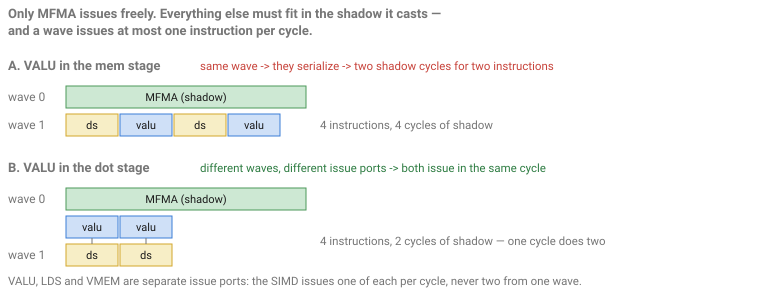
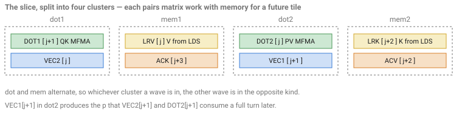
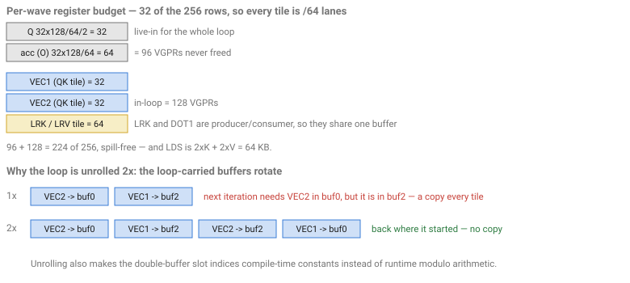
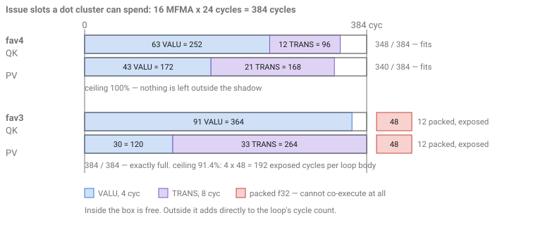

# Flash Attention on gfx950 (CDNA4) in Gluon

Forward flash-attention kernels for gfx950 (MI350 / MI355X), written in Triton Experimental
**Gluon**. Two kernels, `fav3` and `fav4`, share one pipeline architecture and differ in how
they handle the softmax rescale.

The GEMM tutorial in [`../gemm/`](../gemm/README.md) asks where scheduling intelligence should
live, and answers it for a kernel with **two** kinds of instruction competing for a SIMD:
`mfma` that computes, and `buffer_load`/`ds_read` that prepare operands. Put them in different
`warp_pipeline_stage`s, run two waves phase-offset, and the matrix pipe never idles.

Attention has **three**. Between its two MFMA chains sits a softmax — row max, `exp2`, row sum,
and a rescale of the accumulator — that is neither memory nor matrix work, and that the next
MFMA chain depends on. So:

> **Where does the third one go?**

That question generates this entire document. Answering it needs one hardware rule (§1), gives
a cycle budget to spend (§2), places attention in the GEMM tutorial's taxonomy (§3), and then
determines the loop structure (§5), the difference between the two kernels (§6), and what the
compiler has to do for them (§7).

---

## 1. Three competitors, one issue port each

Start from how a CDNA SIMD issues. Two rules, and everything below is a corollary:

1. A wave issues **at most one instruction per cycle**.
2. VALU, LDS and VMEM are **separate issue ports**. The SIMD can issue one of each in the same
   cycle — but they must come from **different waves**, by rule 1.

An MFMA occupies the matrix core for many cycles while those ports sit free. Instructions
placed in that shadow cost nothing. Instructions that do not fit add directly to the loop's
cycle count. So the design question is really an allocation question: *the shadow is the
resource, and we have two kinds of non-matrix work to fit into it.*

There are three places the softmax could go.



**In the mem stage, with the loads.** Then the VALU and the `ds_read` issue from the *same*
wave, so by rule 1 they serialize — two shadow cycles to retire two instructions. The shadow
is finite and this halves its value.

**In a stage of its own.** Now three categories are live at once, which needs **three waves per
SIMD**: one in the mem stage, one in the VALU stage, one in the MFMA stage. With `num_warps=8`
a workgroup puts two waves on each SIMD, so a third has to come from a *different* workgroup —
three resident per CU. Each one carries its own `Q` and accumulator (§5: 96 VGPRs of live-in
before any working set), and `s_barrier` synchronizes within a workgroup only, so the three
could not be kept in phase even if they fit.

**In the dot stage, with the MFMA.** The VALU now issues from the wave that is running the
MFMA, while the *other* wave supplies the memory traffic. Different waves, different ports —
**both issue in the same shadow cycle.** One cycle retires two instructions, and the shadow
does twice the work it does in the first option.

That is the answer, and it is the reason these kernels look the way they do: **the softmax
rides with the MFMA, and must be interleaved into it carefully enough to actually fit.**

## 2. The co-execution budget

`V_MFMA_F32_32X32X16_F16` runs 8 passes of 4 cycles = **32 cycles**. The first 8 cycles cannot
issue anything else; the remaining **24 cycles** are the co-execution window. What fits:

| | cost in the window | why |
|---|---|---|
| VALU (`v_fma`, `v_add`, `v_max3`, `v_cvt`…) | **4 cycles** | 64 lanes over a 16-lane VALU |
| TRANS (`v_exp_f32`) | **8 cycles** | the transcendental unit is 8 lanes wide, not 16 |
| packed f32 (`v_pk_*`) | **cannot co-execute** | shares its source staging buffers with the XDL pipe |

So one MFMA hides **6 VALU** (24 / 4), or 3 transcendentals, or some mix. A dot cluster of 16
MFMAs has a budget of **16 × 24 = 384 cycles**.

Two consequences worth internalizing before reading any further:

- A transcendental is not un-hideable, it is merely **twice as expensive** as a VALU. `fav3`'s
  PV cluster spends 264 of its 384 cycles on 33 `v_exp` alone.
- **Packed math is worse than useless inside the window.** `v_pk_mul` retires two elements in
  one issue slot, which is exactly what you want for work you cannot hide — and it is
  unschedulable for work you can. Which form to use is therefore a per-instruction decision
  that depends on whether that instruction got a window slot. §7 is about making it.

## 3. Where attention sits in the taxonomy — a hybrid, per region

The GEMM tutorial classifies kernels as **intra-wave** (one wave per SIMD, the compiler weaves
memory into the MFMA stream) or **inter-wave** (two waves ping-pong, the overlap is structural
and needs almost no compiler help). Attention does not fit either box, and the reason is
instructive: **the taxonomy's real unit is not the kernel, it is the region.**

The discriminator is one question — *does this region need two instruction categories to issue
from the same wave?*

- **No**, one category per wave: the overlap is supplied by the ping-pong. Nothing to schedule.
- **Yes**, two categories in one wave: the overlap has to be manufactured by instruction
  ordering, and only the compiler can do it.

Read that way, the GEMM table falls out as arithmetic rather than assertion:

| | waves / SIMD | regions | region kind | compiler involvement |
|---|---|---|---|---|
| `gemm/intra_wave` | 1 | `mfma` + `mem`, one wave | all intra-wave | **very high** |
| `gemm/inter_wave` | 2 | `mem` \| `mfma`, split by stage | all inter-wave | **medium** |
| **attention** | 2 | `mem` \| **`mfma` + VALU** | mem: inter-wave, **dot: intra-wave** | **high, in half the regions** |

Attention is **inter-wave between memory and compute, and intra-wave inside each compute
cluster.** §1 forced both halves of that: memory has to live in the other wave so it can share
a shadow cycle, and the VALU has to live with the MFMA, which puts two categories in one wave
and hands the dot clusters to the compiler.

This also says something the kernel-level table cannot: "compiler involvement" is not a
property of a scheduling model. It is a count of how many intra-wave regions a kernel has.

And it is not just a narrative device — it is literally the scheduler's dispatch table. The
[llirSched](../../plugins/llir_scheduler/llir_scheduler.html) plugin classifies every region
and routes it: `mfma` + `mem` to a throughput model, `mfma` + VALU to the co-execution model of
§7, and it deliberately declines regions that mix all three.

## 4. The algorithm: attention without an S×S matrix

Attention is `O = softmax(Q·Kᵀ · scale) · V`. Done literally the `S×S` score matrix fits in
neither registers nor LDS, so flash attention streams it: walk K/V in tiles and keep the
softmax **running** rather than finishing it.

Softmax needs a row max (to keep the exponent in range) and a row sum (to normalize), and
neither is known until the last tile. The insight is that both can be carried and later
corrected. Per query row the kernel holds

```
m    running max of the scores seen so far
l    running sum of exp2(score − m)
acc  running Σ exp2(score − m)·V, the unnormalized output
```

and for tile `j`:

```
s      = Q·Kⱼᵀ · scale                    first MFMA chain    ("QK" / DOT1)
m_new  = max(m, rowmax(s))
p      = exp2(s − m_new)                  the transcendental burst
alpha  = exp2(m − m_new)                  how far the frame moved
l      = l·alpha + rowsum(p)
acc    = acc·alpha + p·Vⱼ                 second MFMA chain   ("PV" / DOT2)
```

The single division `acc / l` happens after the loop. Everything inside is exact: `alpha`
retroactively rebases the earlier partial sums into the new frame, which is what makes the
streaming form equal the literal one.

**`acc·alpha` is the term this document is mostly about.** `acc` is the largest live value in
the kernel — 64 VGPRs per lane at this tile size — so rescaling it every iteration costs 64
vector instructions in the budget of §2, and they are pure overhead whenever the row max did
not actually move. §6 is the story of removing them.

## 5. Designing the loop: from eight operations to four rotated clusters

One workgroup owns a `BLOCK_M`=256-row slab of the output for one head and walks all of K/V;
the grid is `(HQ, ceil(S/BLOCK_M), B)`. Per tile there are eight things to do — two async
global→LDS copies (`ACK`, `ACV`), two LDS→register reads (`LRK`, `LRV`), two MFMA chains
(`DOT1`, `DOT2`) and the two halves of the softmax (`VEC1`, `VEC2`).

§1 already fixed the shape of the answer: every cluster must pair MFMA with VALU, and face a
memory cluster in the other wave. Four clusters do it.



```
dot1 :  DOT1 = QK MFMA (tile j+1)   +  VEC2  row sum, cast p to fp16
mem1 :  LRV  = LDS read of V(j)     +  ACK   async global→LDS copy of K(j+3)
dot2 :  DOT2 = PV MFMA (tile j)     +  VEC1  new row max, the exp2 burst
mem2 :  LRK  = LDS read of K(j+2)   +  ACV   async global→LDS copy of V(j+2)
```

`warp_pipeline_stage("…")` marks each cluster and the compiler lowers each boundary to a
barrier. The two waves on a SIMD run **one cluster apart**, so in every time slot one wave is
in a dot cluster and the other is in a mem cluster — which is precisely the arrangement §1
requires for a VALU and a `ds_read` to share a cycle.

**Why the softmax is split in two.** Cutting it into `VEC1` and `VEC2` and putting them in
*different* dot clusters means neither cluster has to hide the whole softmax, and both MFMA
chains have independent vector work available. The split is not even: `VEC1` carries the `exp2`
burst, which at 8 cycles apiece is the single most expensive thing in the budget.

One consequence to hold on to while reading the code: `VEC1` of tile `j+1` runs in `dot2`
alongside the PV MFMA of tile `j`, and produces the `p` that `VEC2` and `DOT2` consume a
cluster-pair later. **The software pipeline is skewed by one iteration**, and the tile indices
in the diagram are the easiest way to keep track.

### Register budget, and why the loop is unrolled 2×

With `warps_per_cta=[8,1]` each of the 8 waves owns 32 of the 256 rows, so the row-wise softmax
reductions are per-wave — one cross-lane shuffle each, no cross-workgroup reduction. That also
sets every tile's register cost.



96 VGPRs are live for the whole loop (`Q` staged once through LDS into MFMA operand layout and
then never reloaded, plus `acc`), and 128 more are the working set: 224 of 256 by this
accounting, with nothing to spare. `fav4` compiles spill-free at 256 VGPRs; `fav3`, which also
has to keep the rescale's operands alive, spills a handful — so watch `vgpr_spill_count` on any
change. `LRK` and `DOT1` are producer and consumer of the same tile so they
share one buffer; `VEC1` and `VEC2` are not, so they need two.

That last point is what forces the unroll. Over one iteration the two softmax buffers *swap*,
so a 1× loop would need a register-to-register copy of a 32-VGPR tile every tile. Unrolling by
two returns each buffer to where it started. It also makes the double-buffer slot indices
(`BUF_DEPTH=2`) compile-time constants instead of runtime modulo arithmetic.

**Two more hardware details that shape the code.** Accumulators are pinned to VGPRs rather than
AGPRs (`llvm_fn_attrs amdgpu-agpr-alloc="0,0"`): with the 2×-unrolled loop the default AGPR
placement makes the backend shuffle accumulators through `v_accvgpr` moves on the critical
path, worth ~50 TFLOPS here. And `waves_per_eu=2` is what puts the two waves on each SIMD that
§1 depends on.

## 6. `fav3` → `fav4`: getting under the budget

`fav3` is the honest implementation of §4 — every iteration multiplies `acc` by `alpha`, 64
`v_mul` per tile straight into `dot1`'s budget. `fav4` keeps the identical pipeline and removes
them. That is the whole difference between the two kernels, and it is worth **+6.7%**
(1167 → 1245 TFLOPS) plus a qualitative change in what the compiler has to do (§7).

**Lazy rescaling.** Softmax is shift-invariant, so the running max does not have to be *tight*;
it only has to keep `exp2`'s argument in range. `fav4` lets it **lag**: the max is bumped, and
`acc` rescaled, only when a tile's max exceeds the running max by more than a log2 threshold of
8 — a 256× safety margin, trivially inside fp32's range. When the max is stable, which is the
common case after the first few tiles, `p` is allowed to rise as high as 256 and the correction
is skipped entirely. `acc` and `l` are carried in the same lagging frame, so the result is
unchanged.

Skipping needs a branch, and the useful granularity is the wave: each wave owns 32 rows and can
decide independently. `gl.warp_predicate` expresses exactly that — it lowers to
`s_and_saveexec` + `s_cbranch_execz`, with no cross-wave reduction and no barrier. Rows that did
not advance carry `alpha == 1`, so even an unskipped multiply is a no-op for them.

### Four design rules the final kernel embodies

Getting from a working lazy-rescale kernel to the committed one was worth a further **+7.5%**
(1158 → 1245), spread over half a dozen steps that are all the same idea seen from different
angles. Rather than a version-by-version journey, they are more useful as rules — each one a
consequence of §2:

| rule | why the hardware demands it |
|---|---|
| **Nothing that branches may lead a dot cluster.** The rescale's `warp_predicate` was moved out of `VEC2` into the `mem2` cluster, and the `p`→fp16 cast hoisted to the top of `VEC2`. | The matrix core stalls on control flow. A branch's latency should overlap memory, not stand in front of an MFMA chain. `dot1` now begins `[sum + cast] + QK MFMA` with nothing branching ahead of it. |
| **Balance the two dot clusters' budgets.** The score tile is sliced along N and the `sub`+`exp2` for 3/8 of the slices is computed in the *other* cluster. | One cluster overflowing while the other has slack wastes shadow. After the rescale moved out, `VEC1` had roughly twice `VEC2`'s work. |
| **Rebalancing must not cost data movement.** `reshape` → `permute` → `split` on an MFMA-layout tensor is a pure re-interpretation: every slice keeps the same layout, so the split partitions each lane's own registers and emits **no instructions at all**. `assert_trivial=True` makes the compiler prove that at build time and fail the compile otherwise. | A distributed-tensor slice normally costs a shuffle. Free slicing is what makes the previous rule affordable — and it is a Gluon-level technique worth knowing well beyond attention. |
| **Move per-element work out of the loop when the math allows.** `qk_scale` is folded into `Q` once before the loop, turning a per-score `fma(qk, scale, −m)` into a plain `sub`. | 64 elements per tile per wave, every tile. Kept as the `SCALE_ON_Q` constexpr: `--scale-on-q 0` restores the fma, costing ~0.9% but slightly *more* accurate, since pre-scaling rounds `q·scale` back to fp16 before the loop. |

A fifth rule belongs to the scheduler rather than the kernel: **pace the mem clusters.** A
couple of `s_nop`s at the head of each mem cluster shift that wave's LDS burst slightly later so
it does not collide with the other wave's. It is on by default at the measured optimum.

## 7. Making the compiler co-operate

Everything above is about *having* independent vector work beside each MFMA. Actually issuing it
there is the compiler's job, and by §3 the dot clusters are intra-wave regions, so it needs
help. The out-of-tree **llirSched** plugin computes which vector ops belong behind which MFMA
and *declares* that schedule with `sched_group_barrier`, which AMDGPU's IGroupLP then builds in
the machine scheduler.

Measured from the compiled kernels, here is what the two are asking of the 384-cycle budget:



**`fav4` fits.** 348 and 340 cycles of 384. Every op can be given a window slot, so the
scheduler's job is simply to spread the work evenly — and because packed math cannot co-execute
at all (§2), every packed op must first be split into per-element scalars. That is what
`AMDGCN_SCALARIZE_PACKED_FOPS=1` does, and why `fav4` requires it.

**`fav3` does not.** Its eager rescale adds 64 `v_mul` to `dot1`, and its PV cluster fills the
window exactly with `exp2` alone. There the scheduler answers a different question — not *how do
I spread this*, but *what gets a slot and what shape should the rest take*:

- ops that **cannot** be packed (`v_max3`, `v_exp`) are covered first, since packing is not an
  option for them anyway;
- whatever window is left goes to packable ops, **split into scalars** so they can use it;
- everything still uncovered stays **packed**, because one `v_pk_mul` retires two elements in a
  single issue slot and it is going to be exposed either way.

Which is why **`fav3` must not set `AMDGCN_SCALARIZE_PACKED_FOPS`** — a blanket split would
double the issue cost of exactly the work that failed to get a slot. The asymmetry is the
sharpest statement of what lazy rescaling bought: `fav4` removed enough vector work from the
matrix core's shadow that scheduling became a packing problem instead of a triage problem.

## 8. Results

`B=1, HQ=HK=64, D=128, S=16320, fp16`, non-causal, MI355X, `rocm-smi` GPU[0]. TFLOPS from
`rocprofv3` kernel time with a prepared launch; MFMA efficiency from an ATT instruction trace,
per SIMD. Every row does the same 2048 MFMA cycles of work per loop body, so the columns are
comparable across implementations.

| kernel | TFLOPS | cyc/iter | MFMA eff / SIMD | ceiling from §7 |
|---|---:|---:|---:|---:|
| **`fav4`** (`SCALE_ON_Q=1`) | **1245** | **4306** | **95.1%** | **100%** |
| `fav4`, `--scale-on-q 0` | 1231 | 4419 | 92.7% | 100% |
| `fav3` | 1167 | 4802 | 85.3% | **91.4%** |
| `fav3`, no scheduling plugin | 1127 | — | — | 91.4% |
| *ROCm/FlyDSL, lazy rescale* | *1242* | *4747* | *86.3%* | |
| *ROCm/FlyDSL, eager rescale* | *1044* | *6695* | *61.2%* | |

**The ceilings come straight from §7's budget**, and they are what make the efficiency column
readable. `fav4`'s demand fits inside the window, so nothing is exposed and its ceiling is
100%; it reaches 95.1%. `fav3` has 4 × 48 = 192 exposed cycles per loop body against 2048 of
MFMA, so its ceiling is 2048/2240 = **91.4%**; it reaches 85.3%.

That reframes the comparison. The two kernels are 9.8 points apart in efficiency, but their
*ceilings* are 8.6 points apart — so almost the whole gap is the exposed packed work that
`fav3`'s budget cannot absorb, not the scheduler doing a worse job on it. Each kernel is within
about 5–6 points of its own ceiling, and that remainder is barrier and pacing overhead.

Three things worth reading off the table.

**MFMA efficiency is derived from the cycle count**, not measured independently: it is
`mfma_count × 32 / loop_cycles` per wave, doubled for the per-SIMD figure because two waves
share the matrix unit. It is the right metric for judging a *scheduling* change,
because that is exactly what a scheduling change moves — but it is the reciprocal of `cyc/iter`
and never adds information beyond it.

**Cycles and TFLOPS disagree, and both are honest about different things.** `fav4` needs 9%
fewer cycles per iteration than the FlyDSL kernel yet only ties it on wall time: a denser MFMA
stream draws more power, and on a board already at 96% of its power cap that buys a lower
clock. Judge a scheduling change by cycles; judge a kernel by both.

**The eager/lazy gap is far larger in the hand-scheduled kernel** — −16% for FlyDSL against
−6.7% here — because `fav3`'s over-capacity handling in §7 recovers most of it. A scheduler can
compensate for vector work it cannot hide, but not completely.

## 9. Files, and how to run

| file | what it is |
|---|---|
| `fav3.py` | eager rescale: Gluon kernel + its autotune config + host launcher `run_gluon_attention` |
| `fav4.py` | `fav3` plus lazy rescaling and the rules of §6 |
| `f16_fa_gfx950_common.py` | shared helpers (`input_helper`, `sdpa_reference`, `compute_flops`, layout/stride plumbing) |
| `bench.py` | correctness against torch SDPA + `do_bench` TFLOPS; `--rocprof` / `--prepared` dispatch loops for external timing |
| `note.md` | the optimization notebook: what was tried, what it measured, and why |
| `att_attn*.json` | `rocprofv3` ATT (instruction-trace) configurations |

```bash
# correctness + do_bench TFLOPS
FA_MODULE=fav4 python bench.py --seqlen 16320

# the reported metric: kernel time from rocprofv3, prepared launch
FA_MODULE=fav4 python ../../scripts/fa_kernel_time.py --seqlen 16320
```

Pick the kernel with `FA_MODULE=fav3` (default) or `FA_MODULE=fav4`. Defaults are
`B=1, HQ=HK=64 (MHA), D=128, fp16, bhsd`, non-causal.

Both need the scheduling plugin loaded and two other passes configured. The exact variables,
which component owns each, and which are cache-invalidating are tabulated under **Environment
variables** in [`note.md`](note.md). One asymmetry bears repeating because it is easy to get
backwards: **`AMDGCN_SCALARIZE_PACKED_FOPS=1` is for `fav4` only — `fav3` must not set it**
(§7 explains why).

**Scope.** Both kernels are reduced to the single most-performant path: non-causal, head dim
128, fp16/bf16, `bhsd`/`bshd`, MHA/GQA/MQA, and a K length that is a multiple of `BLOCK_N`=64
with an odd number of tiles (a `static_assert` checks it — 16320 is fine, 16384 is not). Causal
masking, ragged tails, other head dims and the wide autotune space were removed to keep the
code readable; see the provenance note below.

## 10. Where to go deeper

- [`../gemm/README.md`](../gemm/README.md) — read this **first** if you have not. §3 above
  assumes its intra-wave / inter-wave taxonomy, and `gemm/inter_wave/` is the two-wave
  ping-pong that attention builds on.
- [`note.md`](note.md) — the optimization notebook: every step with its measurement, the
  per-stage instruction inventories, the environment-variable reference, the measurement
  protocol, and the comparison methodology.
- [`../../plugins/llir_scheduler/llir_scheduler.html`](../../plugins/llir_scheduler/llir_scheduler.html)
  — how the scheduler classifies a region, and how it packs or triages the windows.
- **Provenance.** Ported from
  [`AMD-Triton/gluon-kernels`](https://github.com/AMD-Triton/gluon-kernels)
  (`kernels/cdna4/fa/`). `f16_fa_gfx950_common.py` is verbatim; `fav3.py` is the upstream
  rotated-4-cluster kernel reduced to the single best config for this shape — the
  per-`(D, BLOCK_N, warps)` layout dispatch, causal/masked-tail scheduling, non-pipelined
  fallbacks, head-dim padding and the multi-config autotune space were removed and the pipelined
  loop inlined into one flat `gluon_attn_fwd`. The full version is upstream and in git history.
  Both vendored files are excluded from this repo's black/ruff (see `pyproject.toml`);
  `bench.py` is tutorial-native and linted.
