# Flash Attention on gfx950 (CDNA4) in Gluon

Forward flash-attention kernels for gfx950 (MI350 / MI355X), written in Triton Experimental
**Gluon**. Two kernels, `fmha_v3` and `fmha_v4`, share one pipeline architecture and differ in how
they handle the softmax rescale.

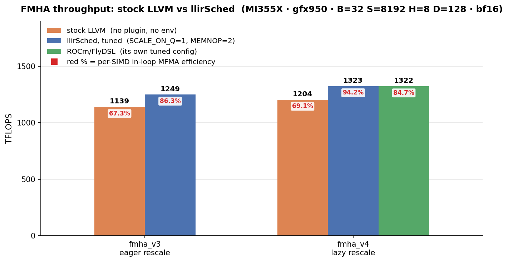

The chart holds two comparisons, and each one has a price.

**Lazy rescaling.** `fmha_v4` defers the accumulator rescale instead of paying it on every tile:
**+5.0%** on stock LLVM, **+6.0%** tuned. Its price is that it cannot be written in stock Gluon —
skipping the rescale per wave needs `gl.warp_predicate` — and that removing it unbalances the two
dot clusters enough that part of the softmax has to be moved between them by hand ([§5](#5-fmha_v3--fmha_v4-getting-under-the-budget)).

**Scheduling.** The same kernel source built with the llirSched plugin instead of stock LLVM:
**+8.9%** on `fmha_v3` and **+10.0%** on `fmha_v4`, worth **+18.4** and **+26.0 points** of MFMA
efficiency. Its price is that the interleave has to be *declared* — every vector op assigned to a
specific MFMA's shadow, emitted as a `sched_group_barrier` sequence — rather than left to the
machine scheduler ([§6](#6-making-the-compiler-co-operate)).

Together they put `fmha_v4` level with ROCm/FlyDSL's published figure, 1318 against 1320, from
94.5% MFMA efficiency against its 84.7%. [§9](#9-results) takes that apart — how two kernels tie on throughput
while ten points apart on cycles, and why the ranking moves with the shape.

**On the name.** Flash attention is a *technique*, not a kernel. `fmha` is the kernel these two
implement — flash **multi-head** attention — and other flash-attention kernels (MLA, and the
decode-shaped MQA/GQA designs) will sit beside them rather than inside them. `v3` and `v4` track
the softmax-rescale generation, not a file version: `fmha_v3` rescales the accumulator on every
tile, `fmha_v4` defers it ([§5](#5-fmha_v3--fmha_v4-getting-under-the-budget)). Note the *layouts* MQA and GQA are already handled here via
`--hk` — what a future kernel would change is the pipeline, not the head mapping.

**Before you start.** Read [`../gemm/README.md`](../gemm/README.md) first: [§3](#3-where-attention-sits-in-the-taxonomy--a-hybrid-per-region) below uses its
intra-wave / inter-wave taxonomy, and the two-wave ping-pong of `gemm/inter_wave/` is the
structure these kernels are built on. This also assumes you know the flash-attention algorithm
— the streaming softmax that carries a running max `m`, a running sum `l` and an unnormalized
accumulator `acc`, and rebases them with `alpha = exp2(m − m_new)` as the max moves. The term
to keep in mind is **`acc·alpha`**: `acc` is the largest live value in the kernel, so rescaling
it every tile is 64 vector instructions that are pure overhead whenever the row max did not
actually move. [§5](#5-fmha_v3--fmha_v4-getting-under-the-budget) is the story of removing them.

**Toolchain.** These kernels need Triton built from the [`gfx950-tutorial-v2.0`](https://github.com/triton-lang/triton/releases/tag/gfx950-tutorial-v2.0)
tag or later — `fmha_v4` does not compile without `gl.warp_predicate`, which that tag
introduces. [§9](#9-results) has the build and run commands.

---

The GEMM tutorial in [`../gemm/`](../gemm/README.md) asks where scheduling intelligence should
live, and answers it for a kernel with **two** kinds of instruction competing for a SIMD:
`mfma` that computes, and `buffer_load`/`ds_read` that prepare operands. Put them in different
`warp_pipeline_stage`s, run two waves phase-offset, and the matrix pipe never idles.

Attention has **three**. Between its two MFMA chains sits a softmax — row max, `exp2`, row sum,
and a rescale of the accumulator — that is neither memory nor matrix work, and that the next
MFMA chain depends on. So:

> **Where does the third one go?**

That question generates this entire document. Answering it needs the SIMD's issue rules ([§1](#1-three-competitors-two-issue-ports)),
gives a cycle budget to spend ([§2](#2-the-budget-what-fits-before-the-next-mfma-can-issue)), places attention in the GEMM tutorial's taxonomy ([§3](#3-where-attention-sits-in-the-taxonomy--a-hybrid-per-region)), and
then determines the loop structure ([§4](#4-designing-the-loop)), the difference between the two kernels ([§5](#5-fmha_v3--fmha_v4-getting-under-the-budget)), and what
the compiler has to do for them ([§6](#6-making-the-compiler-co-operate)). [§7](#7-advanced-the-lds-burst-and-the-head-of-a-dot-cluster) is an appendix for one conflict too subtle to belong in
the main line. [§8](#8-applying-this-to-your-own-kernel) is the part meant to travel: the rules the kernel author owns, a procedure for
diagnosing a kernel of your own, and which of these numbers are gfx950's rather than the
architecture's. [§9](#9-results) measures the result and takes the comparison above apart; [§10](#10-where-to-go-deeper) is where to read
further.

---

## 1. Three competitors, two issue ports

Start from how a CDNA SIMD issues. Two rules, and everything through [§6](#6-making-the-compiler-co-operate) is a corollary:

1. A wave issues **at most one instruction per cycle**.
2. The **VALU** and the **memory pipe** are separate issue ports, so the SIMD can issue one of
   each in the same cycle — but they must come from **different waves**, by rule 1. Note that
   LDS and VMEM *share* the memory port: a `ds_read` and a `buffer_load` cannot pair with each
   other, only with a VALU.

There is a third resource, and it is worth naming now even though nothing needs it until [§7](#7-advanced-the-lds-burst-and-the-head-of-a-dot-cluster):
behind both ports sits **one register file**. Issuing in the same cycle is necessary for two
instructions to overlap, not sufficient — a 3-source VALU op wants more read ports in its cycle
than a 1- or 2-source one, and an arriving LDS return wants the register file to write into. Two
instructions that issue together can still collide there. [§7](#7-advanced-the-lds-burst-and-the-head-of-a-dot-cluster) is the case where they do.

While an MFMA runs, those ports are free. Work issued there is free too. Work that does not fit
adds directly to the loop's cycle count. So the question is an allocation question: *the
MFMA's shadow is the resource, and there are two kinds of non-matrix work competing for it.*

There are three places the softmax could go.

### In the mem stage, with the loads

Then the VALU and the `ds_read` issue from the **same wave**, and by rule 1 a wave issues one
instruction per cycle — so they take turns.

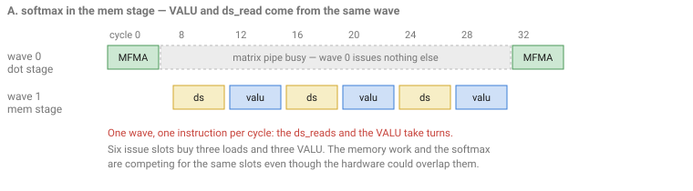

Six issue slots buy three loads and three VALU. The memory port sits idle on the VALU cycles
and the VALU port sits idle on the load cycles, even though the hardware was willing to run
both at once. Half the shadow is wasted.

### In a stage of its own

Now three categories are live at the same time, which needs **three waves per SIMD**: one in
the mem stage, one in the VALU stage, one in the MFMA stage.

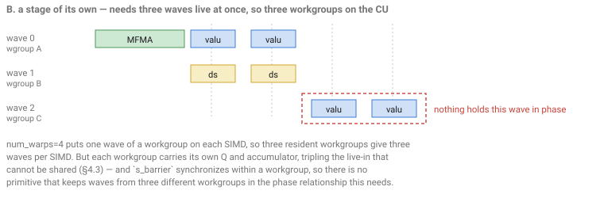

It is reachable, and the pairing works — the memory and the VALU do come from different waves. It
is the *third* wave that is the problem, because it has to come from a different workgroup, and
nothing can keep three workgroups in step.

### In the dot stage, with the MFMA

The VALU now issues from the **same wave as the MFMA**, while the *other* wave supplies the
memory traffic.

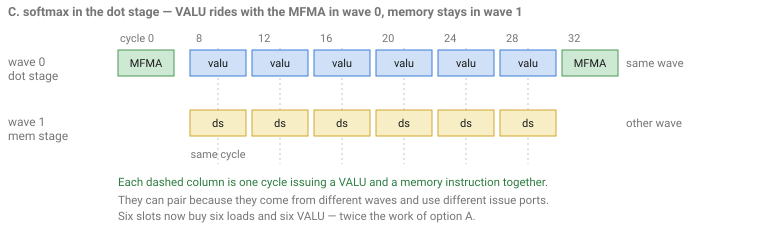

Different waves, different ports — **the VALU and the `ds_read` pair up in the same cycle.**
Six slots now buy six loads *and* six VALU: twice the work of the first option, out of the same
shadow.

That is the answer, and it is why these kernels look the way they do: **the softmax rides with
the MFMA, and has to be interleaved into it carefully enough to actually fit.**

## 2. The budget: what fits before the next MFMA can issue

The useful mental model is not "how long does an MFMA take" — nothing waits for it to finish —
but **when can the SIMD issue the next instruction**.

The public [CDNA4 ISA][isa] gives the two numbers this rests on: `PASS = 4 clock cycles`
(§7.6), and `V_MFMA_F32_32X32X16_F16` "performs 8 passes". So issue one at cycle 0 and the
**next MFMA of that shape cannot issue before cycle 32**. Meanwhile a plain VALU can issue from
cycle 8. Cycles 8–31 are therefore free real estate: **24 cycles of issue opportunity that cost
nothing**, because the matrix pipe was not going to accept anything until 32 regardless.

What can be spent there, and at what price:

| | issue cost | consequence |
|---|---|---|
| VALU (`v_fma`, `v_add`, `v_max3`, `v_cvt`…) | **4 cycles** | 6 fit in one MFMA's window |
| TRANS (`v_exp_f32`) | **8 cycles** | 3 fit — a transcendental is not un-hideable, just twice the price |
| packed f32 (`v_pk_*`) | **4 cycles for 2 elements** | but **does not fit**: a packed op cannot be placed in the window at all, and issuing one pushes the next MFMA past its 32-cycle interval |

A dot cluster of 16 MFMAs therefore has **16 × 24 = 384 cycles** to spend.

Read the packed row carefully, because it says two things at once. Per element, packed is the
*cheapest* form on this machine — one issue slot retires two — and it is simultaneously the one
form that can never be hidden. Those are not in tension; they apply to different work.

> The 32-cycle interval is derived from the public ISA as above. The per-class issue costs are
> the cost model the scheduler uses and that these kernels were measured against; the
> microarchitectural reasons behind them are not in the public document, so they are stated
> here as behaviour rather than mechanism. You do not have to take them on faith either — an
> ATT instruction trace timestamps every issue, so the cost of each class, and whether a given
> op landed inside a shadow or outside it, can be read straight off a trace of your own kernel.
> [§8.2](#82-diagnosing-a-kernel-budget-it-measure-it-route-the-gap) is how.

The packed-math row has a consequence worth pausing on, because it is counter-intuitive.
`v_pk_mul` retires two elements in one issue slot, so it is *exactly* what you want for work
that has to be exposed — and it is unusable for work you were hoping to hide. Whether to emit
packed or scalar is therefore a per-instruction decision that depends on whether that
instruction won a window slot. [§6](#6-making-the-compiler-co-operate) is about making that decision.

[isa]: https://www.amd.com/content/dam/amd/en/documents/instinct-tech-docs/instruction-set-architectures/amd-instinct-cdna4-instruction-set-architecture.pdf

## 3. Where attention sits in the taxonomy — a hybrid, per region

The GEMM tutorial classifies kernels as **intra-wave** (one wave per SIMD, the compiler weaves
memory into the MFMA stream) or **inter-wave** (two waves ping-pong, the overlap is structural
and needs almost no compiler help). Attention does not fit either box, and the reason is
instructive: **the taxonomy's real unit is not the kernel, it is the region.**

The discriminator is one question — *does this region need two instruction categories to issue
from the same wave?*

- **No**, one category per wave: the overlap is supplied by the ping-pong. Nothing to schedule.
- **Yes**, two categories in one wave: the overlap has to be manufactured by instruction
  ordering, and only the compiler can do it.

Read that way, the GEMM table falls out as a consequence rather than an assertion:

| | waves / SIMD | regions | region kind | scheduling model |
|---|---|---|---|---|
| `gemm/intra_wave` | 1 | `mfma` + `mem`, one wave | all intra-wave | throughput |
| `gemm/inter_wave` | 2 | `mem` \| `mfma`, split by stage | all inter-wave | none needed |
| **attention** | 2 | `mem` \| **`mfma` + VALU** | mem: inter-wave, **dot: intra-wave** | **co-execution** |

Attention is **inter-wave between memory and compute, and intra-wave inside each compute
cluster.** [§1](#1-three-competitors-two-issue-ports) forced both halves of that: memory has to live in the other wave so it can pair
with a VALU in one cycle, and the VALU has to live with the MFMA, which puts two categories in
one wave and hands the dot clusters to the compiler.

This also sharpens what "compiler involvement" means. It is not how *many* intra-wave regions a
kernel has — it is how hard the model for those regions is. `gemm/intra_wave` interleaves
`mfma` with memory, which is a **throughput** problem: keep the memory pipe fed far enough
ahead and the matrix pipe never starves. Attention's dot clusters interleave `mfma` with VALU,
which is a **co-execution** problem: every vector op has to be assigned to a specific MFMA's
window, in the right form, or it falls outside and costs cycles. Same "intra-wave" label, a
markedly harder question.

That distinction is exactly how the scheduler is built. The
[llirSched](../../plugins/llir_scheduler/llir_scheduler.html) plugin classifies every region
and routes it: `mfma` + `mem` to the throughput model, `mfma` + VALU to the co-execution model
of [§6](#6-making-the-compiler-co-operate). Regions mixing all three do not arise here, and on gfx950 they should not: [§1](#1-three-competitors-two-issue-ports) showed that
putting VALU and memory in one wave wastes shadow cycles, so an FA kernel has no reason to
build such a region. It is a question for future parts, where a different issue rule could make
a three-category region worth scheduling — at which point the two models would have to be
reconciled rather than selected between.

## 4. Designing the loop

One workgroup owns a `BLOCK_M`=256-row slab of the output for one head and walks all of K/V;
the grid is `(HQ, ceil(S/BLOCK_M), B)`. Per tile there are eight things to do.

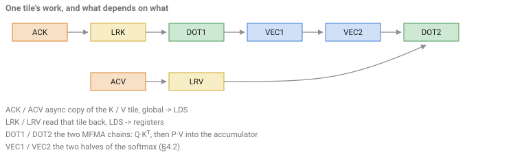

These eight names are used by the rest of this document and by the kernels' own comments, so
they are worth fixing here:

| | |
|---|---|
| `ACK` / `ACV` | async copy of the K / V tile, global → LDS |
| `LRK` / `LRV` | read that tile back, LDS → registers |
| `DOT1` / `DOT2` | the two MFMA chains: Q·Kᵀ producing the scores, then P·V into the accumulator |
| `VEC1` / `VEC2` | the two halves of the softmax, split in [§4.2](#42-how-the-softmax-is-split) |

### 4.1 Four pipeline stages, four clusters

Run them in dependency order and the matrix core idles through every copy and every LDS read,
and the memory pipe idles through all the math. The fix is the standard one — software-pipeline
the loop so that the memory for a *future* tile overlaps the matrix work of the current one.

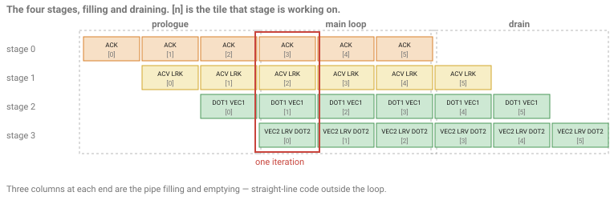

Each row is a pipeline stage and each column one loop iteration. Read down a column and the wave
is working on **four different tiles at once**: copying tile *j+3* into LDS, reading tile *j+2*
back out, running the QK chain of *j+1* and the PV chain of *j*. That column is the loop body,
and each op's tile index says how far ahead of the current tile that stage runs.

The two ends are the cost of the arrangement. Three columns at the start have stages with no tile
to work on yet, and three at the end are finishing tiles with no copies left to issue; both are
straight-line code outside the loop, which is why a trace reports them separately as the prologue
and epilogue. A four-stage pipeline costs three of each.

[§1](#1-three-competitors-two-issue-ports) then fixes how the slice is subdivided: every group must pair matrix work with memory so
that a wave in one kind of group always faces a wave in the other. Four clusters do it.


`warp_pipeline_stage("…")` marks each cluster and the compiler lowers each boundary to a
barrier. With `waves_per_eu=2` the two waves on a SIMD run **one cluster apart**:

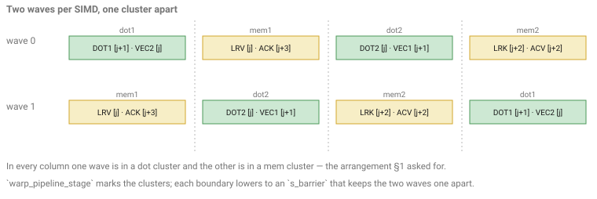

One naming note, since both conventions appear below and in the code. The clusters are
`dot1`/`mem1`/`dot2`/`mem2`, and because `dot1` carries the QK MFMA and `dot2` the PV MFMA, this
document also calls them the **QK cluster** and the **PV cluster**. `dot1` = QK, `dot2` = PV
throughout.

### 4.2 How the softmax is split

The softmax is cut into two groups that land in *different* dot clusters, so that neither cluster
has to hide all of it and both MFMA chains have independent vector work beside them. Where the cut
can go is not a free choice — the softmax is a single dependency chain:

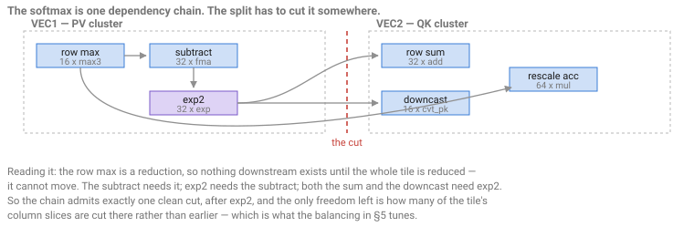

| | work | lands in |
|---|---|---|
| **VEC1** | the new row max, then `fma` (subtract the max) and `exp2` on the score tile | `dot2`, beside the PV MFMA |
| **VEC2** | the row sum, the downcast of `p` to fp16 for the next PV MFMA, and the accumulator rescale | `dot1`, beside the QK MFMA |

Two properties of that chain decide everything about the balance. The row max is a **reduction**,
so nothing downstream of it exists until the entire tile has been reduced — it cannot be moved,
and the subtract depends on it. And both consumers of `exp2`, the row sum and the downcast, sit on
the far side of the cut. So the chain admits one natural cut point, after `exp2`, and the split
above is that cut applied to the whole tile.

What makes the balance tunable is that the tile is a set of independent **column slices**, and each
slice can be cut in a different place. A slice cut after `exp2` leaves its subtract and exponential
in VEC1; a slice cut *before* the subtract is carried across raw and has both computed in VEC2.
[§5](#5-fmha_v3--fmha_v4-getting-under-the-budget) tunes how many slices go each way — which is balancing two clusters without ever breaking the
chain.

The consequence to hold on to while reading the code: `VEC1` runs in `dot2` on tile *j+1* while
the PV MFMA there is still working on tile *j*, so the `p` it produces is consumed a full turn
of the pipeline later. Every buffer in the kernel is sized around that skew.

### 4.3 Register budget, and why the loop is unrolled 2×

With `warps_per_cta=[8,1]` each of the 8 waves owns 32 of the 256 rows, so the row-wise softmax
reductions are per-wave — one cross-lane shuffle each, no cross-workgroup reduction. That also
sets what each wave has to hold.

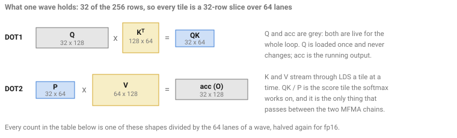

Each count below is one of those shapes divided by the 64 lanes of a wave, and halved again for
fp16 since two elements share a register.

| tile | shape, dtype | VGPRs / lane | buffer |
|---|---|---:|---|
| `Q` | 32 × 128 fp16 | 32×128 / 64 / 2 = **32** | live-in; loaded once, never reloaded |
| `acc` (O) | 32 × 128 fp32 | 32×128 / 64 = **64** | live-in; the running output |
| `K` via `LRK` | 128 × 64 fp16 | 128×64 / 64 / 2 = **64** | the **operand** buffer |
| `V` via `LRV` | 64 × 128 fp16 | 64×128 / 64 / 2 = **64** | the same one — K and V are never live together |
| score tile, `VEC1` writes | 32 × 64 fp32 | 32×64 / 64 = **32** | **score A** |
| score tile, `VEC2` reads | 32 × 64 fp32 | 32×64 / 64 = **32** | **score B** |

96 VGPRs are live for the whole loop and 128 more are the working set: **224 of 256**, with
LDS holding 2 × K + 2 × V = 64 KB. K and V share one buffer because each is consumed by its MFMA
before the other is read. The two score tiles cannot share: by [§4.2](#42-how-the-softmax-is-split)'s skew, `VEC1` is writing
tile *j+1*'s scores while `VEC2` is still reading tile *j*'s. Two buffers, and that is what
forces the unroll.

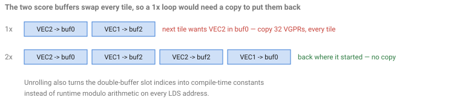

Over one tile the two score buffers exchange places, so a 1× loop would copy a 32-VGPR tile
every iteration just to restore the naming. Unrolling by two returns each buffer to where it
started. This is the same motivation as
[`gemm/intra_wave/a16w16/v6_loop_unroll`](../gemm/intra_wave/a16w16/v6_loop_unroll) — in both
kernels the unroll exists to make loop-carried buffers land in the same registers each time
around, not to reduce loop overhead.

## 5. `fmha_v3` → `fmha_v4`: getting under the budget

Start by pricing the softmax against [§2](#2-the-budget-what-fits-before-the-next-mfma-can-issue)'s budget. Each Gluon op below expands to a fixed number
of machine instructions per wave per tile — the score tile is 32 × 64 over 64 lanes, so 32
registers, and the accumulator is 32 × 128, so 64:

| Gluon op | instructions | class | cycles | packed | cluster |
|---|---:|---|---:|---:|---|
| row max | 16 × `v_max3` | VALU | 64 | — | PV |
| subtract the max | 32 × `v_fma` | VALU | 128 | 16 × `v_pk_fma` = **64** | PV |
| `exp2` | 32 × `v_exp` | TRANS | **256** | — | PV |
| row sum | 32 × `v_add` | VALU | 128 | 16 × `v_pk_add` = **64** | QK |
| downcast `p` to fp16 | 16 × `v_cvt_pk` | VALU | 64 | already packed | QK |
| rescale the accumulator | 64 × `v_mul` | VALU | **256** | 32 × `v_pk_mul` = **128** | QK |

The packed column is the same work at half the issue cost — and it is a trap here, because a packed
op cannot go in an MFMA's shadow at all ([§2](#2-the-budget-what-fits-before-the-next-mfma-can-issue)). Halving the cost only helps for work that was never
going to be hidden, which is why the column matters for `fmha_v3` and not for `fmha_v4`, and why [§6](#6-making-the-compiler-co-operate) has
to decide the two forms per instruction rather than globally. Read the cycles column as the price
of work you intend to hide.

Two items dominate, and they are the two that scale with a *whole tile* rather than with a row:
the `exp2` burst and the accumulator rescale. Totalled per cluster against the 384 cycles each
one has to spend:


These are the Gluon-level counts. The compiled kernels land near but not exactly on them — the
backend adds address arithmetic, and `fmha_v3`'s scheduler leaves some work packed, which halves
its instruction count — so [§9](#9-results)'s ceilings are computed from the compiled inventory rather than
from this table. The shape of the argument is the same either way.

**`fmha_v3` is over capacity in both clusters** — 448 against 384, twice. Whatever does not fit is
issued in the open and lands directly on the loop's cycle count. Note this is a budget
statement, not a scheduling one: no ordering of these instructions can help, because there are
simply more cycles of vector work than there is shadow to hide it in.

**Lazy rescaling** is what removes the larger of the two. Softmax is shift-invariant, so the
running max does not have to be *tight*; it only has to keep `exp2`'s argument in range. `fmha_v4`
lets it **lag**: the max is bumped, and `acc` rescaled, only when a tile's max exceeds the
running max by more than a log2 threshold of 8 — a 256× safety margin, trivially inside fp32's
range. When the max is stable, which is the common case after the first few tiles, `p` is
allowed to rise as high as 256 and the correction is skipped entirely. `acc` and `l` are carried
in the same lagging frame, so the result is unchanged.

Skipping needs a branch, and the useful granularity is the wave: each wave owns 32 rows and can
decide independently. `gl.warp_predicate` expresses exactly that — it lowers to
`s_and_saveexec` + `s_cbranch_execz`, with no cross-wave reduction and no barrier. Rows that did
not advance carry `alpha == 1`, which leaves their values unchanged — but the multiply still
issues and still costs its four cycles, which is exactly why the skip has to be a real branch
rather than a multiply by one.

That empties the QK cluster to 192 of 384 — and leaves PV untouched at 448. The kernel is now
badly unbalanced rather than uniformly over: 192 cycles of QK shadow go unused while PV pays 64
cycles for its overflow.

**Balancing them is the final piece.** Only the totals matter, so move work from PV to QK until
both fit. The candidates are the three elementwise items in `VEC1` — the row max, the subtract,
and the `exp2` — and the row max is not one of them: it is a *reduction*, so the whole tile has
to be reduced before `m_new` exists, and it is what the subtract depends on.

That leaves the subtract and the `exp2`, and **they have to move as a pair.** Moving the `exp2`
alone was tried first, and it fails in an instructive way. The subtract stays behind in PV while
its only consumer is now in the other cluster — and a scheduler that can see a consumer
downstream will drag the producer toward it, because a pure `fsub` carries no chain edge and
therefore no `s_barrier` or `sched.barrier` orders it ([§6](#6-making-the-compiler-co-operate)). Half the subtracts end up in a mem
stage: the work leaves the cluster it was meant to leave without arriving in the one it was meant
to reach. *Which* pass does the moving is worth knowing if you are debugging your own kernel — it
is ISel's pre-RA list scheduler, not `MachineSink`: its very first MIR dump already shows the
subtracts in the mem region, before `MachineSink` runs at all, and re-running the same IR under
`-pre-RA-sched=linearize` keeps every one of them in the dot cluster.

Moving both ops instead removes the opportunity. The **raw** slice is carried across and subtracted
where it is exponentiated, so the subtract is born in the cluster that consumes it and there is
nothing left downstream to be pulled toward.

So the score tile is sliced along N and the subtract + `exp2` for some fraction of the slices is
computed in `dot1` instead. The fraction was found by bisection, not derived — and from here the
numbers are the **compiled** ones rather than the table's, because the margins are what the decision
turns on and the backend's own address arithmetic is part of them. Measured, the two clusters start
at 204 and 484 rather than the table's 192 and 448:

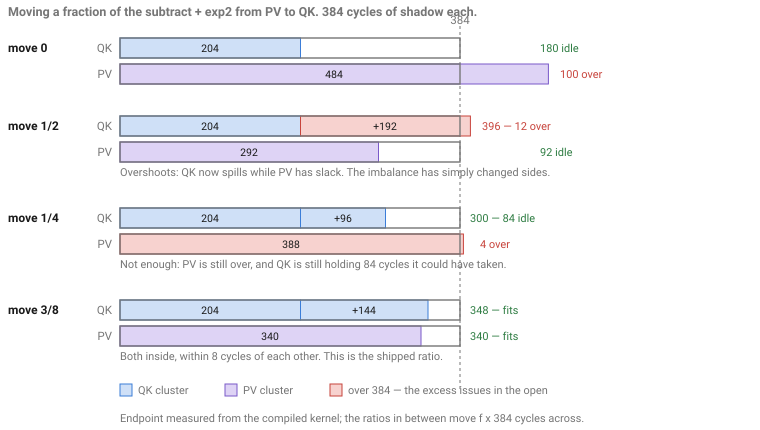

A half overshoots — QK goes over while PV is left with slack, the same imbalance with the sides
swapped. A quarter does not move enough: PV is still over, and QK is still holding cycles it could
have taken. **Three eighths** puts both inside with the two clusters within 8 cycles of each other,
and that is why the tile is sliced into eighths rather than halves — the granularity exists to make
the ratio adjustable.

The three kernel-side rules this section established — keep control flow out of the dot clusters,
balance the two of them, and make the rebalancing itself free — are collected with the one [§6](#6-making-the-compiler-co-operate) adds
in [§8](#8-applying-this-to-your-own-kernel).

## 6. Making the compiler co-operate

The budget in [§5](#5-fmha_v3--fmha_v4-getting-under-the-budget) says the work *fits*. Getting it actually issued inside the shadow is the
compiler's job, and by [§3](#3-where-attention-sits-in-the-taxonomy--a-hybrid-per-region) the dot clusters are intra-wave regions, so it needs help in three
places.

### Keeping each op in the cluster it was assigned to

[§5](#5-fmha_v3--fmha_v4-getting-under-the-budget)'s whole argument is an assignment of vector ops to clusters — this `exp2` belongs beside the
PV MFMA, that subtract beside the QK MFMA. `MachineSink` runs on MIR, long after any IR pass,
and undoes it: it moves an op toward its consumer, and since `VEC1` of one tile feeds `VEC2` of
the next, "toward its consumer" means *out of its cluster and into the following one*. An
`s_barrier` is no obstacle — it is `IntrNoMem`, so it is not a code-motion fence for pure ALU
ops, and a chain-free `fsub` has no dependency edge on it at all.

The result is a cluster that was carefully balanced arriving at the scheduler with its work
somewhere else, and most of a cluster's shadow left empty. Hence
`DISABLE_LLVM_OPT=disable-machine-sink`. Note this is not a scheduling decision being overridden —
it is a placement decision being *preserved* so that scheduling has something to work with.

### Packed or scalar: whose job is it?

[§2](#2-the-budget-what-fits-before-the-next-mfma-can-issue)'s rule makes this a real decision. A packed op cannot go in the shadow, but retires two
elements per issue when it is outside. So the ideal is precise: **work that will be covered should
be scalar, and work that will be left over should be packed** — and which is which is not known
until the assignment is done.

Both kernels therefore start from **packed** math, which is what Gluon emits anyway, and the
decision is made where the budget is known. `fmha_v3` has genuine leftovers: its over-capacity path
splits only the ops it managed to cover and leaves the remainder packed, halving their issue cost
since they are going to be exposed either way. `fmha_v4` has no leftovers, so everything it declares
gets covered and everything gets split.

The split itself is performed by LLVM's `SIPreEmitPeephole`, which finds a packed op sitting in an
MFMA's shadow, recognizes that it cannot co-execute there, and breaks it into scalars — the
correct local decision, made at the one point where the answer is known, after scheduling has
settled what sits where.

What the scheduler has to get right for that to work is the **unit** it declares in.
`sched_group_barrier` takes a class and a count of *instructions*, so a window holding three packed
ops must be declared as three, not as the six elements they will become. Declared in instructions
the group is satisfiable whether or not the ops are still packed, and the peephole takes care of
the rest:

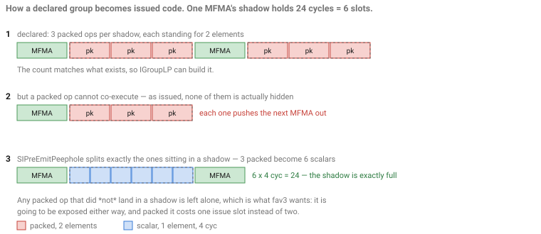

Which is also why one kernel no longer needs a different environment from the other: nothing
upstream has to normalize the packing first.

The third panel is a detail that belongs to the kernel rather than the compiler, and it is the
fourth kernel-side rule of [§8](#8-applying-this-to-your-own-kernel). A packed op cannot follow an MFMA back to back, so the *first*
uncovered packed op in a cluster pays a hazard on top of being exposed. Ordering the uncovered
work ahead of the cluster's first MFMA removes that stall — same instructions, same count, only
the order differs. Nothing in the toolchain will do it for you, because only the kernel knows
which work was never going to be covered.

### Declaring the interleave

The out-of-tree **llirSched** plugin does the assignment itself. It classifies each region ([§3](#3-where-attention-sits-in-the-taxonomy--a-hybrid-per-region)),
and for a dot cluster it walks the vector ops against the MFMA windows, then *declares* the
result with `sched_group_barrier` — a sequence of "N instructions of this class, then M of that"
which AMDGPU's IGroupLP builds in the machine scheduler. When the region fits it spreads the work
evenly; when it does not, it covers the ops that cannot be packed first, spends what window is
left on packable ops split into scalars, and leaves the remainder packed — which is what gets
`fmha_v3` close to its 91.4% ceiling despite being over capacity in both clusters.

Declaring rather than reordering is the load-bearing choice, and `sched_barrier` is the
alternative that does not work:

- **It is advisory.** `sched_barrier(0)` asks the machine scheduler not to move instructions
  across a point; it does not oblige it. We measured codegen consolidating a stage's last two
  sub-regions anyway. `sched_group_barrier` does not ask the scheduler to preserve an order — it
  tells IGroupLP to *construct* one.
- **It does not fence what we care about.** A barrier is a chain node, so it orders memory
  operations. Chain-free arithmetic — a pure `fsub` — has no edge to it and drifts across freely.
  This is the same property that lets `MachineSink` move `exp2` over an `s_barrier` above.
- **Pinning an order throws away the scheduler's knowledge.** Physically reordering the IR and
  fencing it fixes one order for good, and a fixed order cannot respond to the latencies and
  register pressure the machine scheduler can see. Declaring says *what* the pipeline should look
  like and leaves the scheduler to choose which instruction fills each slot.

One detail worth knowing if you read the plugin: the declaration has to be emitted **after**
every real instruction of the region, because IGroupLP forms its groups scanning upward. A
declaration at the top of a region yields empty groups and silently does nothing. The algorithm,
the region classifier and the cost model are in
[`llir_scheduler.html`](../../plugins/llir_scheduler/llir_scheduler.html).

## 7. Advanced: the LDS burst and the head of a dot cluster

Two settings in these kernels are worth about a percent each and are easy to mistake for tuning
noise. They are not — they attack the same hardware conflict from opposite ends, and the numbers
behave the way the explanation predicts.

By [§1](#1-three-competitors-two-issue-ports)'s design, a wave in a dot cluster always faces a wave in a mem cluster, and its VALU shares
each cycle with that wave's `ds_read`. That pairing is the whole point. But not every VALU is
equally cheap to pair: a **3-source** op needs more register-file read ports in its cycle than a
1- or 2-source one, and an LDS return needs the register file too. Where the two coincide, they
contend.

The dot clusters put their 3-source work exactly where the collision is worst. Read the head of a
compiled PV cluster and the first two MFMA shadows are filled entirely with `v_maximum3` — the row
max is first in dependency order, so the scheduler has nowhere else to put it — and with
`SCALE_ON_Q` off, the subtract that follows is an `fma`, also 3-source.

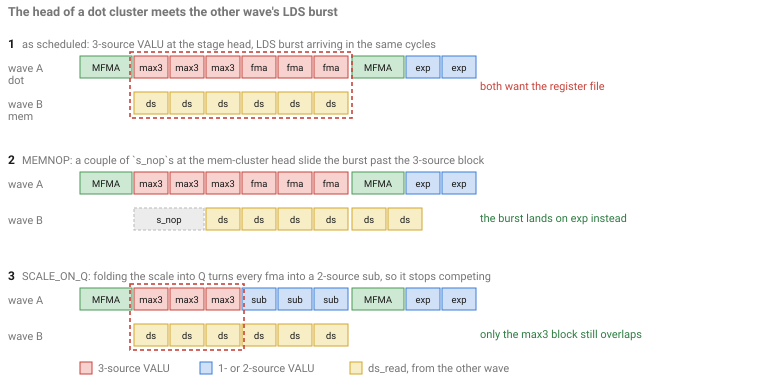

**`MEMNOP` moves the burst.** A couple of `s_nop`s at the head of each mem cluster delay that
wave's `ds_read`s just enough that they arrive past the `max3` block and land on the `exp2` and
sum work instead, which is 1- and 2-source. The kernel is unchanged; only the phase relationship
between the two waves moves. `MEMNOP=2` is the optimum for both kernels at either `SCALE_ON_Q`
setting — and the sweep is not smooth, which is what you would expect from a phase effect rather
than a quantity.

**`SCALE_ON_Q` removes the ops.** Folding `qk_scale` into `Q` before the loop turns every
`fma(qk, qk_scale, −m_new)` into a plain `sub`, so those stop competing for the register file at
all. It is visible in a count of 3-source VALU in `fmha_v4`'s loop body: **98 with the fold off, 34
with it on** — and 98 − 34 = 64 is exactly the 32 subtracts of each of the two unrolled tiles. The
34 that remain are the `max3` reduction, which is the part only `MEMNOP` can help.

Measured at `B=1, S=16320, H=64, fp16` on GPU[0] — TFLOPS and in-loop MFMA efficiency per SIMD.
(A different shape and dtype from [§9](#9-results), so read the two tables separately; the *deltas* are what
matter here.)

| | `fmha_v3` | `fmha_v4` |
|---|---|---|
| no `s_nop`, no fold | 1165 / 83.9% | 1223 / 89.5% |
| `MEMNOP=2` | 1169 / 85.3% | 1233 / 92.4% |
| `MEMNOP=2` + `SCALE_ON_Q` | **1177 / 86.2%** | **1243 / 93.8%** |

Each step is worth well under a percent of throughput, and together about 1% on `fmha_v3` and 1.6% on
`fmha_v4`. Both kernels gain the same ~0.8% from the fold, which is the check that matters: it is the
same op count leaving the same cluster in both, so a mechanism tied to that op count should pay the
same, and it does. The efficiency column moves further than the throughput column for the reason
[§9](#9-results) gives — a denser MFMA stream costs clock on a power-capped part.

`SCALE_ON_Q` is not free: pre-scaling rounds `q · scale` back to fp16 before the loop, so max error
goes from 3.05e-05 to 1.22e-04 on `fmha_v3`, and from 6.10e-05 to the same 1.22e-04 on `fmha_v4`. All
are far inside the 1e-3 tolerance, and `--scale-on-q 0` restores the tighter numerics on either
kernel.

## 8. Applying this to your own kernel

Everything above is one worked example. This section is the part meant to survive contact with a
different kernel: the decisions that stayed with the author, the procedure for finding out which
of [§5](#5-fmha_v3--fmha_v4-getting-under-the-budget)–[§7](#7-advanced-the-lds-burst-and-the-head-of-a-dot-cluster) your own stall belongs to, and which numbers you have to re-derive on other hardware.

### 8.1 The four rules the kernel author owns

The compiler cannot make these calls, because each depends on something only the kernel knows.

| rule | why the hardware demands it |
|---|---|
| **Keep control flow out of the compute clusters.** The rescale's `warp_predicate` block lives in `mem2`, not in `VEC2` beside the arithmetic it belongs to. | Control-flow instructions are scheduled ahead of everything else in their region, so a branch inside a dot cluster issues *before* the first MFMA and the matrix core waits on it. In a mem cluster the same cost lands against memory latency instead. |
| **Balance the clusters that share a budget.** The score tile is sliced along N and the subtract + `exp2` for 3/8 of the slices is computed in the *other* cluster, bringing PV to 340 and QK to 348 of 384. | 204 against 484 wastes the whole of one cluster's slack while the other pays for its overflow. Only the per-cluster totals matter, so any work made of the same elementwise pieces can be moved to level them. |
| **Make the rebalancing itself free.** `gl.amd.slice` takes a register-only view of a distributed tensor: the slice keeps the source layout, so it is a partition of each lane's own registers and emits **no instructions**. | A distributed-tensor slice normally costs a shuffle, which would eat the imbalance you were trying to recover. Free slicing is what makes the previous rule affordable — a Gluon technique worth knowing well beyond attention. |
| **Put work you know will be exposed *before* the first MFMA of its cluster.** | A packed op cannot follow an MFMA back to back, so the first uncovered packed op otherwise pays a hazard on top of already being outside the shadow. Same instructions, same count, only the order differs — and only you know which work was never going to be covered. |

### 8.2 Diagnosing a kernel: budget it, measure it, route the gap

**Budget it, on paper, before measuring anything.** For each region that mixes MFMA with other
work:

```
per region:   capacity = (number of MFMAs in the region) × 24 cycles
              demand   = Σ 4 cycles per VALU op + 8 cycles per TRANS op
                         (a packed op cannot be covered at all — count it as already exposed)
              exposed  = max(0, demand − capacity)

per loop body: ceiling = mfma_cycles / (mfma_cycles + Σ exposed over all regions)
```

That ceiling is the best MFMA efficiency any schedule of that kernel can reach. `fmha_v3`'s four dot
clusters leave 48 cycles exposed each against 2048 cycles of MFMA, which is where [§9](#9-results)'s 91.4% comes
from; `fmha_v4` leaves none, so its ceiling is 100%. The calculation costs ten minutes and it decides
which of the sections above you are in — [§5](#5-fmha_v3--fmha_v4-getting-under-the-budget) if you are over the budget, [§6](#6-making-the-compiler-co-operate) if you are under it and
still not reaching the ceiling.

**Then measure.** Take an ATT instruction trace and run
[`scripts/process_json.py`](../../scripts/process_json.py); it prints in-loop MFMA efficiency
**per wave**, so double it for the per-SIMD figure when two waves share the SIMD. Aim the trace
with [`scripts/att_pick_cu.py`](../../scripts/att_pick_cu.py): parts harvest one CU per shader
array, and ATT records nothing at all — exit 0, a trace file with no wave data — if you target a
CU that does not exist on your die.

**Then route the gap.** What you see, what it means, and where in this document it is worked
through:

| symptom | what it means | section |
|---|---|---|
| demand exceeds capacity in a region | no ordering can win; the work itself has to shrink or move to another region | [§5](#5-fmha_v3--fmha_v4-getting-under-the-budget) |
| demand fits, but measured efficiency sits far under the ceiling and windows are visibly empty | the ops are not where you put them — a pass moved them, or the request you made was unsatisfiable | [§6](#6-making-the-compiler-co-operate) |
| a stage's tail is vector work while the matrix pipe is idle | the interleave was requested but never constructed | [§6](#6-making-the-compiler-co-operate) — declare it, don't pin it |
| efficiency is at its ceiling but throughput is flat or worse | you bought cycles and paid for them in clock | [§9](#9-results) — power cap |
| a small delay at a stage head changes things sharply and non-monotonically | a phase relationship between two waves, not a quantity | [§7](#7-advanced-the-lds-burst-and-the-head-of-a-dot-cluster) — sweep it, bisection will mislead you |
| two regions that should be identical report different op counts to the scheduler | something is being counted that never gets emitted (source modifiers like `fneg`, folded `max3`) | [§6](#6-making-the-compiler-co-operate) |
| in-loop numbers are good but whole-dispatch throughput is not | prologue and drain are not amortizing — short loops, or too many pipeline stages | [§9](#9-results) |

The habit underneath all of it: **judge a scheduling change by cycles, and a kernel by both cycles
and wall time.** They disagree for real reasons ([§9](#9-results)), and a change that improves one while flat on
the other is usually still the right change.

### 8.3 What is gfx950-specific, and what is not

Re-derive these on another part; do not assume them.

| structural — expect it to hold across CDNA | specific to gfx950, and to this MFMA shape |
|---|---|
| an MFMA occupies the matrix pipe for a fixed number of passes, during which other pipes are free | `PASS = 4 cycles`, and `V_MFMA_F32_32X32X16_F16` takes 8 of them → a **32-cycle** issue interval |
| there is a read phase at the head of an MFMA in which nothing co-issues | that phase is **8 cycles**, leaving a **24-cycle** window |
| VALU and memory are separate issue ports, one instruction per wave per cycle | VALU **4** cycles, TRANS **8**, so **6** VALU or **3** TRANS per window |
| some instruction classes cannot co-issue with the matrix pipe at all | on gfx950 that class is packed f32 (`v_pk_*`) — and packed is *also* the cheapest form per element |
| the register file is shared behind both ports | 3-source VALU against an LDS return is where it shows up here ([§7](#7-advanced-the-lds-burst-and-the-head-of-a-dot-cluster)) |
| waves per SIMD determines whether inter-wave overlap is available | `waves_per_eu=2` here; with one wave per SIMD every region becomes intra-wave (see `gemm/intra_wave`) |

The pass count for your instruction is in your ISA document. The window, and the per-class costs,
are read off an ATT trace of your own kernel — which is the same evidence this document's numbers
rest on.

## 9. Results

`B=32, S=8192, H=8, D=128, bf16`, non-causal, MI355X, `rocm-smi` GPU[0] — ROCm/FlyDSL's published
benchmark shape. TFLOPS is the mean of three runs of `rocprofv3 --kernel-trace` with
`AMD_SERIALIZE_KERNEL=3`, averaging the last 100 of 1000 dispatches; MFMA efficiency is the
in-loop per-SIMD figure from an ATT instruction trace. The five configurations were run
**interleaved** — one of each, three times round — so any drift in the board hits every row
equally. Every row here is stable to about 2 TFLOPS.

| | TFLOPS | MFMA eff / SIMD |
|---|---:|---:|
| *ROCm/FlyDSL* — its own tuned config | *1320* | 84.7% |
| **`fmha_v4`** — llirSched, `SCALE_ON_Q=1`, `MEMNOP=2` | **1318** | **94.5%** |
| **`fmha_v3`** — llirSched, `SCALE_ON_Q=1`, `MEMNOP=2` | **1243** | 86.2% |
| `fmha_v4` — stock LLVM, no plugin, no env | 1198 | 68.5% |
| `fmha_v3` — stock LLVM, no plugin, no env | 1141 | 67.8% |

**What the compiler work is worth** is the distance between the tuned rows and the stock ones:
**+10.0%** of throughput on `fmha_v4` and **+8.9%** on `fmha_v3`, and in efficiency terms **+26.0** and
**+18.4 points**. Everything in [§5](#5-fmha_v3--fmha_v4-getting-under-the-budget) and [§6](#6-making-the-compiler-co-operate) lives in that gap.

**Stock LLVM cannot tell the two kernels apart** where it counts — 68.5% against 67.8%. Without a
scheduler, `fmha_v4`'s lazy rescale barely moves the loop at all; the 8.3-point efficiency gap
between the tuned rows is the scheduler exploiting budget headroom that lazy rescaling created,
not the algorithm on its own. A design that creates headroom only pays if something downstream
spends it.

**The ceilings from [§5](#5-fmha_v3--fmha_v4-getting-under-the-budget) still frame the tuned rows.** `fmha_v4`'s demand fits its window, so its
ceiling is 100% and it reaches 94.5%. `fmha_v3` leaves 4 × 48 = 192 cycles exposed per loop body
against 2048 of MFMA, so its ceiling is 2048/2240 = **91.4%** and it reaches 86.2%. The two are
8.3 points apart while their ceilings are 8.6 apart — so the whole difference is work `fmha_v3`'s
budget cannot absorb rather than a worse schedule, and each lands within about 5.5 points of its
own ceiling.

**On the FlyDSL row.** This is its published configuration, and its published figure of 1320
TFLOPS reproduces exactly (1319.4 / 1319.6 / 1320.2). `fmha_v4` ties it — 0.2% apart, well inside
any spread — and `fmha_v3` is 5.8% behind.

The interesting part is *how* they tie, because the two kernels are strong in different places.
`fmha_v4` needs about 10% fewer cycles for the same work (94.5% against 84.7%). FlyDSL spends more of
its time in the loop (94.1% against our 88.3% — its pipeline fill and drain are cheaper than our
four-stage one) and clocks **5.2% higher** at comparable power. Those cancel:

```
fmha_v4 cycle advantage    (0.945 x 0.8833) / (0.847 x 0.9413)  = +4.8%
FlyDSL clock advantage   1650.9 MHz / 1569.8 MHz             = +5.2%
```

**And the ranking is shape-dependent, so treat one number with care.** At `B=1, S=16384` the board
runs pinned to its ~1400 W cap; there cycles are what matter and `fmha_v4` leads FlyDSL by 9.3%. At
the shape above there is power headroom, FlyDSL's clock advantage cashes in, and the two are level.
Neither shape is *the* answer — that one flatters us, this one flatters them. The quantity that
does not move between them is the in-loop MFMA efficiency, which is the only thing in this table
the scheduler actually controls.

**Before trusting any cross-implementation row, check that the work was handed out the same way** —
a difference in grid or occupancy would confound the whole table. It does not here: both sides
launch `(HQ, ceil(S/BLOCK_M), B)` with `BLOCK_M=256`, `BLOCK_N=64`, 8 waves per workgroup, 32 rows
per wave and `waves_per_eu=2`, so both issue 8192 workgroups, one resident per CU, 32 rounds, no
tail imbalance. The differences in the table are what happens inside the loop, and power. One
caveat runs against the Gluon rows rather than for them: `S=8192` makes `(n_blocks − 3)` odd, so
both kernels run an unpipelined `ODD_TAIL` tile in the drain and FlyDSL has no such constraint.
Two more were checked the same way and are also clean: neither side remaps workgroups across XCDs
at this shape, and FlyDSL's shipped configuration is its own optimum, so nothing here is a
strawman of it.

Two things about the metrics themselves, worth knowing before quoting either:

**MFMA efficiency is derived from the cycle count**, not measured independently: it is
`mfma_count × 32 / loop_cycles` per wave, doubled for the per-SIMD figure because two waves share
the matrix unit. It is the right metric for judging a *scheduling* change, since that is exactly
what a scheduling change moves — but it carries no information a cycle count does not.

**Cycles and TFLOPS disagree, and both are honest about different things.** A denser MFMA stream
draws more power, and against a power cap that buys back a lower clock — so a change can be worth
several percent of cycles and under one percent of wall time. bf16 is the cleanest example: it
measures 3–7% faster than fp16 at *identical* cycle counts and identical in-loop efficiency, with
the whole difference coming from clock, because its narrower mantissa toggles less of the
multiplier array. Judge a scheduling change by cycles; judge a kernel by both.

Both harnesses were run under one protocol — `scripts/fly_kernel_time.py` builds FlyDSL's
`flash_attn_dualwave_swp` through its own builder and then times it exactly as
`scripts/fa_kernel_time.py` times ours, same rocprofv3 invocation, serialization, rotating-buffer
rule and averaging window. That is the only reason the rows can share a table, and it matters more
than it sounds: measured with its own shallower window, FlyDSL reads up to 7% high on a cool die,
which is enough to invert the top two rows of the table.

### Building and running

The kernels need Triton built from the
[`gfx950-tutorial-v2.0`](https://github.com/triton-lang/triton/releases/tag/gfx950-tutorial-v2.0)
tag or later — `fmha_v4` does not compile without `gl.warp_predicate`, which that tag introduces.
Build it with default symbol visibility so the scheduler plugin can resolve LLVM symbols:

```bash
git clone https://github.com/triton-lang/triton -b gfx950-tutorial-v2.0 /tmp/triton
cd /tmp/triton && TRITON_EXT_ENABLED=1 pip install -e .
```

Then, from `kernels/attention/`:

```bash
FA_MODULE=fmha_v4 DISABLE_LLVM_OPT=disable-machine-sink \
LLVM_PASS_PLUGIN_PATH=$PWD/../../plugins/llir_scheduler/libLlirSched.so \
LLVM_PASS_PLUGIN_KEEP_TARGET_MACHINE=1 \
python bench.py --seqlen 16320
```

Those three variables are not tuning knobs — they are what [§6](#6-making-the-compiler-co-operate) is about, and dropping
them measures the stock-LLVM bars of the chart above instead. `scripts/fa_kernel_time.py` takes the
same environment and reports the kernel-time TFLOPS this table quotes.

## 10. Where to go deeper

- [`../gemm/README.md`](../gemm/README.md) — read this **first** if you have not. [§3](#3-where-attention-sits-in-the-taxonomy--a-hybrid-per-region) above
  assumes its intra-wave / inter-wave taxonomy, and `gemm/inter_wave/` is the two-wave
  ping-pong that attention builds on.
- [`../../plugins/llir_scheduler/llir_scheduler.html`](../../plugins/llir_scheduler/llir_scheduler.html)
  — how the scheduler classifies a region, and how it packs or triages the windows.
- [`../../docs/warp_pipelining.md`](../../docs/warp_pipelining.md) and
  [`../../docs/mfma_efficiency.md`](../../docs/mfma_efficiency.md) — the theory behind
  `warp_pipeline_stage` ([§4](#4-designing-the-loop)) and behind the metric [§9](#9-results) reports.
- **Provenance.** Ported from
  [`AMD-Triton/gluon-kernels`](https://github.com/AMD-Triton/gluon-kernels)
  (`kernels/cdna4/fa/`). `fmha_v3.py` is the upstream rotated-4-cluster kernel reduced to the
  single best config for this shape — the per-`(D, BLOCK_N, warps)` layout dispatch,
  causal/masked-tail scheduling, non-pipelined fallbacks, head-dim padding and the multi-config
  autotune space were removed and the pipelined loop inlined into one flat `gluon_attn_fwd`.
  `common.py` came over with it and has since been cut down to what these two
  kernels and `bench.py` actually call: the non-pipelined `attn_fwd_inner` and its building
  blocks, the arch dispatch, the ragged/`thd` paths and the results-table plumbing are all gone
  with the features that used them. The full version is upstream and in git history. `fmha_v3.py`
  and `fmha_v4.py` are still excluded from this repo's black/ruff (see `pyproject.toml`) to keep
  them diffable against upstream; everything else here is linted.
