# FMHA on gfx950 (CDNA4) in Gluon

Forward **FMHA** — flash multi-head attention — kernels for gfx950 (MI350 / MI355X), written in
Triton Experimental **Gluon**. Two kernels, `fmha_v3` and `fmha_v4`, share one pipeline
architecture and differ in how they handle the softmax rescale.

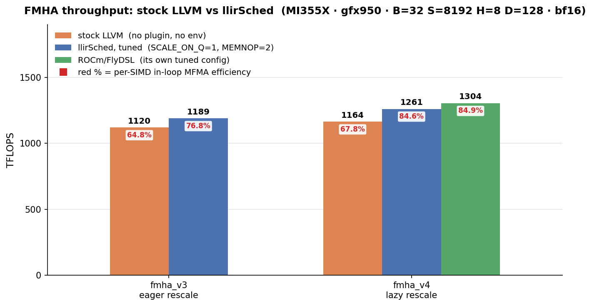

Tuned, `fmha_v4` reaches **1285 TFLOPS** at **89.2%** in-loop MFMA efficiency per SIMD, and
`fmha_v3` 1213 at 81.0%. The reference point is ROCm/FlyDSL, which reaches **1304** on this shape
from **84.8%** efficiency — so on this pin FlyDSL is **~1.4% ahead**, where on `v2.0` the two were
level (1323 vs 1322). The orange bar in each group is the same kernel
source built without the scheduling plugin. [§9](#9-results) works through what separates all five,
and what each step costs.

That efficiency number is what the rest of this document is about. 89.2% means the matrix pipe
takes a new MFMA in 89.2% of the loop's cycles, and the missing 10.7% is time the SIMD spent
issuing something it could not hide behind one. So the design question is what *else* an FMHA
kernel has to issue, and where that work can go.

---

The GEMM tutorial in [`../gemm/`](../gemm/README.md) asks where scheduling intelligence should
live, and answers it for a kernel with **two** kinds of instruction competing for a SIMD:
`mfma` that computes, and `buffer_load`/`ds_read` that prepare operands. Put them in different
`warp_pipeline_stage`s, run two waves phase-offset, and the matrix pipe never idles.

Attention has **three**. Between its two MFMA chains sits a softmax — row max, `exp2`, row sum,
and a rescale of the accumulator — that is neither memory nor matrix work, and that the next
MFMA chain depends on. So:

> **Where does the third one go?**

That question generates this entire document. Answering it needs the SIMD's issue rules ([§1](#1-three-competitors-two-issue-ports)),
gives a cycle budget to spend ([§2](#2-the-budget-what-fits-before-the-next-mfma-can-issue)), places attention in the GEMM tutorial's taxonomy ([§3](#3-where-attention-sits-in-the-taxonomy--a-hybrid-per-region)), and
then determines the loop structure ([§4](#4-designing-the-loop)), the difference between the two kernels ([§5](#5-fmha_v3--fmha_v4-getting-under-the-budget)), and what
the compiler has to do for them ([§6](#6-making-the-compiler-co-operate)). [§7](#7-advanced-the-lds-burst-and-the-head-of-a-dot-cluster) is an appendix for one conflict too subtle to belong in
the main line. [§8](#8-applying-this-to-your-own-kernel) is the part meant to travel: the rules the kernel author owns, a procedure for
diagnosing a kernel of your own, and which of these numbers are gfx950's rather than the
architecture's. [§9](#9-results) measures the result and prices each step of it; [§10](#10-causal-attention-fmha_v5) adds causal
masking; [§11](#11-where-to-go-deeper) is where to read further.

**Before you start.** Read [`../gemm/README.md`](../gemm/README.md) first: [§3](#3-where-attention-sits-in-the-taxonomy--a-hybrid-per-region) below uses its
intra-wave / inter-wave taxonomy, and the two-wave ping-pong of `gemm/inter_wave/` is the
structure these kernels are built on. This also assumes you know the flash-attention algorithm
— the streaming softmax that carries a running max `m`, a running sum `l` and an unnormalized
accumulator `acc`, and rebases them with `alpha = exp2(m − m_new)` as the max moves. The term
to keep in mind is **`acc·alpha`**: `acc` is the largest live value in the kernel, so rescaling
it every tile is 64 vector instructions that are pure overhead whenever the row max did not
actually move. [§5](#5-fmha_v3--fmha_v4-getting-under-the-budget) is the story of removing them.

**Toolchain.** These kernels need Triton built from the [`gfx950-tutorial-v3.0`](https://github.com/triton-lang/triton/releases/tag/gfx950-tutorial-v3.0)
tag. They are written in upstream Gluon: `fmha_v4`'s per-wave skip uses `gl.map_elementwise`
([§5](#5-fmha_v3--fmha_v4-getting-under-the-budget)), so its stock build needs nothing beyond upstream Triton.
[§9](#9-results) has the build and run commands.

---

## 1. Three competitors, two issue ports

Start from how a CDNA SIMD issues. Two rules, and everything through [§6](#6-making-the-compiler-co-operate) is a corollary:

1. A wave issues **at most one instruction per cycle**.
2. The **VALU** and the **memory pipe** are separate issue ports, so the SIMD can issue one of
   each in the same cycle — but they must come from **different waves**, by rule 1. Note that
   LDS and VMEM *share* the memory port: a `ds_read` and a `buffer_load` cannot pair with each
   other, only with a VALU.

There is a third resource, and it is worth naming now even though nothing needs it until [§7](#7-advanced-the-lds-burst-and-the-head-of-a-dot-cluster):
behind both ports sits **one register file**. Issuing in the same cycle is necessary for two
instructions to overlap, not sufficient — a 3-source VALU op wants more read ports in its cycle
than a 1- or 2-source one, and an arriving LDS return wants the register file to write into. Two
instructions that issue together can still collide there. [§7](#7-advanced-the-lds-burst-and-the-head-of-a-dot-cluster) is the case where they do.

While an MFMA runs, those ports are free. Work issued there is free too. Work that does not fit
adds directly to the loop's cycle count. So the question is an allocation question: *the
MFMA's shadow is the resource, and there are two kinds of non-matrix work competing for it.*

There are three places the softmax could go.

### In the mem stage, with the loads

Then the VALU and the `ds_read` issue from the **same wave**, and by rule 1 a wave issues one
instruction per cycle — so they take turns.

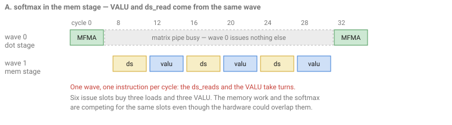

Six issue slots buy three loads and three VALU. The memory port sits idle on the VALU cycles
and the VALU port sits idle on the load cycles, even though the hardware was willing to run
both at once. Half the shadow is wasted.

### In a stage of its own

Now three categories are live at the same time, which needs **three waves per SIMD**: one in
the mem stage, one in the VALU stage, one in the MFMA stage.

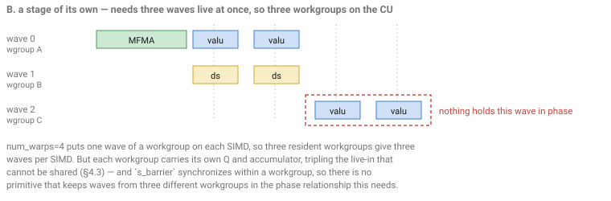

It is reachable, and the pairing works — the memory and the VALU do come from different waves. It
is the *third* wave that is the problem, because it has to come from a different workgroup, and
nothing can keep three workgroups in step.

### In the dot stage, with the MFMA

The VALU now issues from the **same wave as the MFMA**, while the *other* wave supplies the
memory traffic.

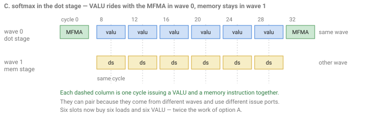

Different waves, different ports — **the VALU and the `ds_read` pair up in the same cycle.**
Six slots now buy six loads *and* six VALU: twice the work of the first option, out of the same
shadow.

That is the answer, and it is why these kernels look the way they do: **the softmax rides with
the MFMA, and has to be interleaved into it carefully enough to actually fit.**

## 2. The budget: what fits before the next MFMA can issue

The useful mental model is not "how long does an MFMA take" but **when can the SIMD issue the
next instruction**.

The public [CDNA4 ISA][isa] gives the two numbers this rests on: `PASS = 4 clock cycles`
(§7.6), and `V_MFMA_F32_32X32X16_F16` "performs 8 passes". So issue one at cycle 0 and the
**next MFMA of that shape cannot issue before cycle 32**. Meanwhile a plain VALU can issue from
cycle 8. Cycles 8–31 are therefore free real estate: **24 cycles of issue opportunity that cost
nothing**, because the matrix pipe was not going to accept anything until 32 regardless.

What can be spent there, and at what price:

| | issue cost | consequence |
|---|---|---|
| VALU (`v_fma`, `v_add`, `v_max3`, `v_cvt`…) | **4 cycles** | 6 fit in one MFMA's window |
| TRANS (`v_exp_f32`) | **8 cycles** | 3 fit — a transcendental is not un-hideable, just twice the price |
| cross-lane (`v_permlane32_swap`) | **20 cycles** | one window holds a permlane and a single 4-cycle op beside it |
| packed f32 (`v_pk_*`) | **4 cycles for 2 elements** | but **does not fit**: a packed op cannot be placed in the window at all, and issuing one pushes the next MFMA past its 32-cycle interval |

A dot cluster of 16 MFMAs therefore has **16 × 24 = 384 cycles** to spend.

Read the packed row carefully, because it says two things at once. Per element, packed is the
*cheapest* form on this machine — one issue slot retires two — and it is simultaneously the one
form that can never be hidden. Those are not in tension; they apply to different work.

> The 32-cycle interval is derived from the public ISA as above. The per-class issue costs are
> the cost model the scheduler uses and that these kernels were measured against; the
> microarchitectural reasons behind them are not in the public document, so they are stated
> here as behaviour rather than mechanism. You do not have to take them on faith either — an
> ATT instruction trace timestamps every issue, so the cost of each class, and whether a given
> op landed inside a shadow or outside it, can be read straight off a trace of your own kernel.
> [§8.2](#82-diagnosing-a-kernel-budget-it-measure-it-route-the-gap) is how.

The packed-math row has a consequence worth pausing on, because it is counter-intuitive.
`v_pk_mul` retires two elements in one issue slot, so it is *exactly* what you want for work
that has to be exposed — and it is unusable for work you were hoping to hide. Whether to emit
packed or scalar is therefore a per-instruction decision that depends on whether that
instruction won a window slot. [§6](#6-making-the-compiler-co-operate) is about making that decision.

[isa]: https://www.amd.com/content/dam/amd/en/documents/instinct-tech-docs/instruction-set-architectures/amd-instinct-cdna4-instruction-set-architecture.pdf

## 3. Where attention sits in the taxonomy — a hybrid, per region

The GEMM tutorial classifies kernels as **intra-wave** (one wave per SIMD, the compiler weaves
memory into the MFMA stream) or **inter-wave** (two waves ping-pong, the overlap is structural
and needs almost no compiler help). Attention does not fit either box, and the reason is
instructive: **the taxonomy's real unit is not the kernel, it is the region.**

The discriminator is one question — *does this region need two instruction categories to issue
from the same wave?*

- **No**, one category per wave: the overlap is supplied by the ping-pong. Nothing to schedule.
- **Yes**, two categories in one wave: the overlap has to be manufactured by instruction
  ordering, and only the compiler can do it.

Read that way, the GEMM table falls out as a consequence rather than an assertion:

| | waves / SIMD | regions | region kind | scheduling model |
|---|---|---|---|---|
| `gemm/intra_wave` | 1 | `mfma` + `mem`, one wave | all intra-wave | throughput |
| `gemm/inter_wave` | 2 | `mem` \| `mfma`, split by stage | all inter-wave | none needed |
| **attention** | 2 | `mem` \| **`mfma` + VALU** | mem: inter-wave, **dot: intra-wave** | **co-execution** |

Attention is **inter-wave between memory and compute, and intra-wave inside each compute
cluster.** [§1](#1-three-competitors-two-issue-ports) forced both halves of that: memory has to live in the other wave so it can pair
with a VALU in one cycle, and the VALU has to live with the MFMA, which puts two categories in
one wave and hands the dot clusters to the compiler.

This also sharpens what "compiler involvement" means. It is not how *many* intra-wave regions a
kernel has — it is how hard the model for those regions is. `gemm/intra_wave` interleaves
`mfma` with memory, which is a **throughput** problem: keep the memory pipe fed far enough
ahead and the matrix pipe never starves. Attention's dot clusters interleave `mfma` with VALU,
which is a **co-execution** problem: every vector op has to be assigned to a specific MFMA's
window, in the right form, or it falls outside and costs cycles. Same "intra-wave" label, a
markedly harder question.

That distinction is exactly how the scheduler is built. The
[llirSched](../../plugins/llir_scheduler/llir_scheduler.html) plugin classifies every region
and routes it: `mfma` + `mem` to the throughput model, `mfma` + VALU to the co-execution model
of [§6](#6-making-the-compiler-co-operate). Regions mixing all three do not arise here, and on gfx950 they should not: [§1](#1-three-competitors-two-issue-ports) showed that
putting VALU and memory in one wave wastes shadow cycles, so an FA kernel has no reason to
build such a region. It is a question for future parts, where a different issue rule could make
a three-category region worth scheduling — at which point the two models would have to be
reconciled rather than selected between.

## 4. Designing the loop

One workgroup owns a `BLOCK_M`=256-row slab of the output for one head and walks all of K/V;
the grid is `(HQ, ceil(S/BLOCK_M), B)`. Per tile there are eight things to do.

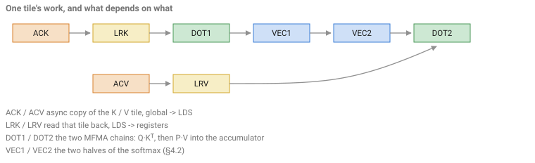

These eight names are used by the rest of this document and by the kernels' own comments, so
they are worth fixing here:

| | |
|---|---|
| `ACK` / `ACV` | async copy of the K / V tile, global → LDS |
| `LRK` / `LRV` | read that tile back, LDS → registers |
| `DOT1` / `DOT2` | the two MFMA chains: Q·Kᵀ producing the scores, then P·V into the accumulator |
| `VEC1` / `VEC2` | the two halves of the softmax, split in [§4.2](#42-how-the-softmax-is-split) |

### 4.1 Four pipeline stages, four clusters

Run them in dependency order and the matrix core idles through every copy and every LDS read,
and the memory pipe idles through all the math. The fix is the standard one — software-pipeline
the loop so that the memory for a *future* tile overlaps the matrix work of the current one.

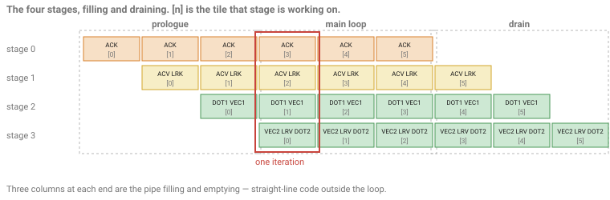

Each row is a pipeline stage and each column one loop iteration. Read down a column and the wave
is working on **four different tiles at once**: copying tile *j+3* into LDS, reading tile *j+2*
back out, running the QK chain of *j+1* and the PV chain of *j*. That column is the loop body,
and each op's tile index says how far ahead of the current tile that stage runs.

The two ends are the cost of the arrangement. Three columns at the start have stages with no tile
to work on yet, and three at the end are finishing tiles with no copies left to issue; both are
straight-line code outside the loop, which is why a trace reports them separately as the prologue
and epilogue. A four-stage pipeline costs three of each.

[§1](#1-three-competitors-two-issue-ports) then fixes how the slice is subdivided: every group must pair matrix work with memory so
that a wave in one kind of group always faces a wave in the other. Four clusters do it.

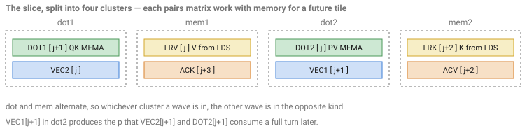

`warp_pipeline_stage("…")` marks each cluster and the compiler lowers each boundary to a
barrier. With `waves_per_eu=2` the two waves on a SIMD run **one cluster apart**:

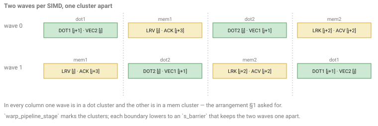

One naming note, since both conventions appear below and in the code. The clusters are
`dot1`/`mem1`/`dot2`/`mem2`, and because `dot1` carries the QK MFMA and `dot2` the PV MFMA, this
document also calls them the **QK cluster** and the **PV cluster**. `dot1` = QK, `dot2` = PV
throughout.

### 4.2 How the softmax is split

The softmax is cut into two groups that land in *different* dot clusters, so that neither cluster
has to hide all of it and both MFMA chains have independent vector work beside them. Where the cut
can go is not a free choice — the softmax is a single dependency chain:

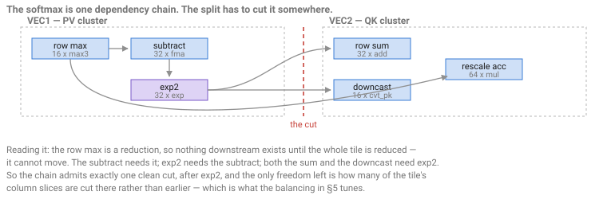

| | work | lands in |
|---|---|---|
| **VEC1** | the new row max, then `fma` (subtract the max) and `exp2` on the score tile | `dot2`, beside the PV MFMA |
| **VEC2** | the row sum, the downcast of `p` to fp16 for the next PV MFMA, and the accumulator rescale | `dot1`, beside the QK MFMA |

Two properties of that chain decide everything about the balance. The row max is a **reduction**,
so nothing downstream of it exists until the entire tile has been reduced — it cannot be moved,
and the subtract depends on it. And both consumers of `exp2`, the row sum and the downcast, sit on
the far side of the cut. So the chain admits one natural cut point, after `exp2`, and the split
above is that cut applied to the whole tile.

What makes the balance tunable is that the tile is a set of independent **column slices**, and each
slice can be cut in a different place. A slice cut after `exp2` leaves its subtract and exponential
in VEC1; a slice cut *before* the subtract is carried across raw and has both computed in VEC2.
[§5](#5-fmha_v3--fmha_v4-getting-under-the-budget) tunes how many slices go each way — which is balancing two clusters without ever breaking the
chain.

The consequence to hold on to while reading the code: `VEC1` runs in `dot2` on tile *j+1* while
the PV MFMA there is still working on tile *j*, so the `p` it produces is consumed a full turn
of the pipeline later. Every buffer in the kernel is sized around that skew.

### 4.3 Register budget, and why the loop is unrolled 2×

With `warps_per_cta=[8,1]` each of the 8 waves owns 32 of the 256 rows, so the row-wise softmax
reductions are per-wave — one cross-lane shuffle each, no cross-workgroup reduction. That also
sets what each wave has to hold.

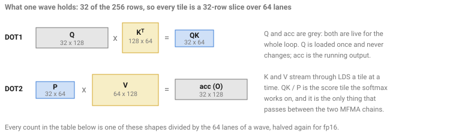

Each count below is one of those shapes divided by the 64 lanes of a wave, and halved again for
fp16 since two elements share a register.

| tile | shape, dtype | VGPRs / lane | buffer |
|---|---|---:|---|
| `Q` | 32 × 128 fp16 | 32×128 / 64 / 2 = **32** | live-in; loaded once, never reloaded |
| `acc` (O) | 32 × 128 fp32 | 32×128 / 64 = **64** | live-in; the running output |
| `K` via `LRK` | 128 × 64 fp16 | 128×64 / 64 / 2 = **64** | the **operand** buffer |
| `V` via `LRV` | 64 × 128 fp16 | 64×128 / 64 / 2 = **64** | the same one — K and V are never live together |
| score tile, `VEC1` writes | 32 × 64 fp32 | 32×64 / 64 = **32** | **score A** |
| score tile, `VEC2` reads | 32 × 64 fp32 | 32×64 / 64 = **32** | **score B** |

96 VGPRs are live for the whole loop and 128 more are the working set: **224 of 256**, with
LDS holding 2 × K + 2 × V = 64 KB. K and V share one buffer because each is consumed by its MFMA
before the other is read. The two score tiles cannot share: by [§4.2](#42-how-the-softmax-is-split)'s skew, `VEC1` is writing
tile *j+1*'s scores while `VEC2` is still reading tile *j*'s. Two buffers, and that is what
forces the unroll.

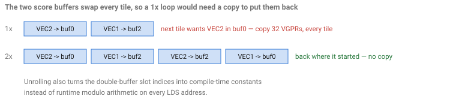

Over one tile the two score buffers exchange places, so a 1× loop would copy a 32-VGPR tile
every iteration just to restore the naming. Unrolling by two returns each buffer to where it
started. This is the same motivation as
[`gemm/intra_wave/a16w16/v6_loop_unroll`](../gemm/intra_wave/a16w16/v6_loop_unroll) — in both
kernels the unroll exists to make loop-carried buffers land in the same registers each time
around, not to reduce loop overhead.

## 5. `fmha_v3` → `fmha_v4`: getting under the budget

Start by pricing the softmax against [§2](#2-the-budget-what-fits-before-the-next-mfma-can-issue)'s budget. Each Gluon op below expands to a fixed number
of machine instructions per wave per tile — the score tile is 32 × 64 over 64 lanes, so 32
registers, and the accumulator is 32 × 128, so 64:

| Gluon op | instructions | class | cycles | packed | cluster |
|---|---:|---|---:|---:|---|
| row max | 16 × `v_max3` | VALU | 64 | — | PV |
| subtract the max | 32 × `v_fma` | VALU | 128 | 16 × `v_pk_fma` = **64** | PV |
| `exp2` | 32 × `v_exp` | TRANS | **256** | — | PV |
| row sum | 32 × `v_add` | VALU | 128 | 16 × `v_pk_add` = **64** | QK |
| downcast `p` to fp16 | 16 × `v_cvt_pk` | VALU | 64 | already packed | QK |
| rescale the accumulator | 64 × `v_mul` | VALU | **256** | 32 × `v_pk_mul` = **128** | QK |
| finish the reduction across lanes | `v_permlane32_swap` + copies + nop | VALU | 20 | — | one in **each** |

The last row is the cross-lane tail of the two reductions above it, at [§2](#2-the-budget-what-fits-before-the-next-mfma-can-issue)'s price for that class.
In the 32 × 32 MFMA layout a lane and its partner 32 lanes away hold different columns of the
same row, so a row-wise reduction cannot finish inside a lane: the per-lane tree ends in one
`v_permlane32_swap_b32`, with the copies it needs and the wait state the hazard recognizer
inserts after it. It appears once in PV, closing the row max, and once in QK, closing the row
sum — the shuffle [§4.3](#43-register-budget-and-why-the-loop-is-unrolled-2) counted per wave.

The packed column is the same work at half the issue cost — and it is a trap here, because a packed
op cannot go in an MFMA's shadow at all ([§2](#2-the-budget-what-fits-before-the-next-mfma-can-issue)). Halving the cost only helps for work that was never
going to be hidden, which is why the column matters for `fmha_v3` and not for `fmha_v4`, and why [§6](#6-making-the-compiler-co-operate) has
to decide the two forms per instruction rather than globally. Read the cycles column as the price
of work you intend to hide.

Two items dominate, and they are the two that scale with a *whole tile* rather than with a row:
the `exp2` burst and the accumulator rescale. Totalled per cluster against the 384 cycles each
one has to spend:

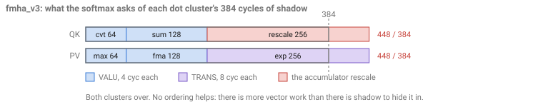

These are the Gluon-level counts. The compiled kernels land near but not exactly on them — the
backend adds address arithmetic, and `fmha_v3`'s scheduler leaves some work packed, which halves
its instruction count — so [§9](#9-results)'s ceilings are computed from the compiled inventory rather than
from this table. The shape of the argument is the same either way.

**`fmha_v3` is over capacity in both clusters** — 468 against 384, twice. Whatever does not fit is
issued in the open and lands directly on the loop's cycle count. Note this is a budget
statement, not a scheduling one: no ordering of these instructions can help, because there are
simply more cycles of vector work than there is shadow to hide it in.

**Lazy rescaling** is what removes the larger of the two. The trick is not ours — we took it from
ROCm/FlyDSL's
[`dualwave_swp_lazy_rescale`](https://github.com/ROCm/FlyDSL/blob/63eb891/kernels/attention/flash_attn_gfx950.py)
path, which is also where the log2 threshold of 8 comes from. Softmax is shift-invariant, so the
running max does not have to be *tight*; it only has to keep `exp2`'s argument in range. `fmha_v4`
lets it **lag**: the max is bumped, and `acc` rescaled, only when a tile's max exceeds the
running max by more than a log2 threshold of 8 — a 256× safety margin, trivially inside fp32's
range. When the max is stable, which is the common case after the first few tiles, `p` is
allowed to rise as high as 256 and the correction is skipped entirely. `acc` and `l` are carried
in the same lagging frame, so the result is unchanged.

Skipping needs a branch, and the useful granularity is the wave: each wave owns 32 rows and can
decide independently. [`gl.map_elementwise`](https://triton-lang.org/main/python-api/generated/triton.language.map_elementwise.html) expresses exactly that: it hands each thread's
elements to a scalar function, and that function's `if alpha != 1` becomes one branch per
thread, which the backend lowers to `s_and_saveexec` + `s_cbranch_execz`, with no cross-wave
reduction and no barrier. A thread holds 64 accumulator elements, all in one row, so the scalar
body takes all 64 as arguments (`pack=64`); it is generated, in
[`fmha_v4_map_elementwise.py`](fmha_v4_map_elementwise.py), and is specific to `BLOCK_M=256`,
`BLOCK_DMODEL=128` and 8 warps. Rows that did
not advance carry `alpha == 1`, which leaves their values unchanged — but the multiply still
issues and still costs its four cycles, which is exactly why the skip has to be a real branch
rather than a multiply by one.

That empties the QK cluster to 212 of 384 — and leaves PV untouched at 468. The kernel is now
badly unbalanced rather than uniformly over: 172 cycles of QK shadow go unused while PV pays 84
cycles for its overflow.

**Balancing them is the final piece.** Only the totals matter, so move work from PV to QK until
both fit. The candidates are the three elementwise items in `VEC1` — the row max, the subtract,
and the `exp2` — and the row max is not one of them: it is a *reduction*, so the whole tile has
to be reduced before `m_new` exists, and it is what the subtract depends on.

That leaves the subtract and the `exp2`, and **they have to move as a pair.** Moving the `exp2`
alone was tried first, and it fails in an instructive way. The subtract stays behind in PV while
its only consumer is now in the other cluster — and a scheduler that can see a consumer
downstream will drag the producer toward it, because a pure `fsub` carries no chain edge and
therefore no `s_barrier` or `sched.barrier` orders it ([§6](#6-making-the-compiler-co-operate)). Half the subtracts end up in a mem
stage: the work leaves the cluster it was meant to leave without arriving in the one it was meant
to reach.

Moving both ops instead removes the opportunity. The **raw** slice is carried across and subtracted
where it is exponentiated, so the subtract is born in the cluster that consumes it and there is
nothing left downstream to be pulled toward.

So the score tile is sliced along N and the subtract + `exp2` for some fraction of the slices is
computed in `dot1` instead. Sweeping that fraction against the same table:

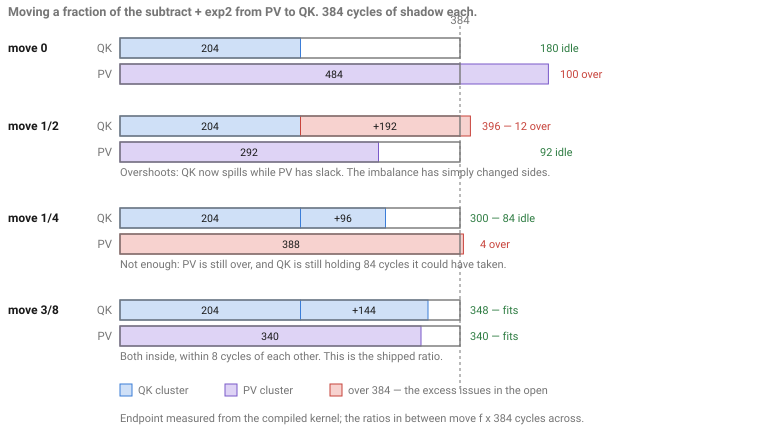

A half overshoots — QK goes over while PV is left with slack, the same imbalance with the sides
swapped. A quarter is the interesting near-miss: both clusters technically fit, but PV clears the
window by 12 cycles, which is three instructions. Nothing in the table is exact to three
instructions — the backend adds address arithmetic the table does not price, and a margin that
thin is consumed by any of it. **Three eighths** keeps both inside with 28 and 60 cycles of room,
enough that the fit survives what the compiler adds, and that is why the tile is sliced into
eighths rather than halves: the granularity exists to make the ratio adjustable.

The three kernel-side rules this section established — keep control flow out of the dot clusters,
balance the two of them, and make the rebalancing itself free — are collected with the one [§6](#6-making-the-compiler-co-operate) adds
in [§8](#8-applying-this-to-your-own-kernel).

## 6. Making the compiler co-operate

The budget in [§5](#5-fmha_v3--fmha_v4-getting-under-the-budget) says the work *fits*. Getting it actually issued inside the shadow is the
compiler's job, and by [§3](#3-where-attention-sits-in-the-taxonomy--a-hybrid-per-region) the dot clusters are intra-wave regions, so it needs help in three
places.

### Keeping each op in the cluster it was assigned to

[§5](#5-fmha_v3--fmha_v4-getting-under-the-budget)'s whole argument is an assignment of vector ops to clusters — this `exp2` belongs beside the
PV MFMA, that subtract beside the QK MFMA. `MachineSink` runs on MIR, long after any IR pass,
and undoes it: it moves an op toward its consumer, and since `VEC1` of one tile feeds `VEC2` of
the next, "toward its consumer" means *out of its cluster and into the following one*.

The result is a cluster that was carefully balanced arriving at the scheduler with its work
somewhere else, and most of a cluster's shadow left empty. Hence
`DISABLE_LLVM_OPT=disable-machine-sink`. Note this is not a scheduling decision being overridden —
it is a placement decision being *preserved* so that scheduling has something to work with.

### Packed or scalar: whose job is it?

[§2](#2-the-budget-what-fits-before-the-next-mfma-can-issue)'s rule makes this a real decision. A packed op cannot go in the shadow, but retires two
elements per issue when it is outside. So the ideal is precise: **work that will be covered should
be scalar, and work that will be left over should be packed** — and which is which is not known
until the assignment is done.

Both kernels therefore start from **packed** math, which is what Gluon emits anyway, and the
decision is made where the budget is known. `fmha_v3` has genuine leftovers: its over-capacity path
splits only the ops it managed to cover and leaves the remainder packed, halving their issue cost
since they are going to be exposed either way. `fmha_v4` has no leftovers, so everything it declares
gets covered and everything gets split.

The split itself is performed by LLVM's `SIPreEmitPeephole`, which finds a packed op sitting in an
MFMA's shadow, recognizes that it cannot co-execute there, and breaks it into scalars — the
correct local decision, made at the one point where the answer is known, after scheduling has
settled what sits where.

What the scheduler has to get right for that to work is the **unit** it declares in.
`sched_group_barrier` takes a class and a count of *instructions*, so a window holding three packed
ops must be declared as three, not as the six elements they will become. Declared in instructions
the group is satisfiable whether or not the ops are still packed, and the peephole takes care of
the rest:

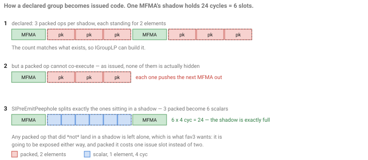

The third panel is a detail that belongs to the kernel rather than the compiler, and it is the
fourth kernel-side rule of [§8](#8-applying-this-to-your-own-kernel). A packed op cannot follow an MFMA back to back, so the *first*
uncovered packed op in a cluster pays a hazard on top of being exposed. Ordering the uncovered
work ahead of the cluster's first MFMA removes that stall — same instructions, same count, only
the order differs. Nothing in the toolchain will do it for you, because only the kernel knows
which work was never going to be covered.

### Declaring the interleave

The out-of-tree **llirSched** plugin does the assignment itself. It classifies each region ([§3](#3-where-attention-sits-in-the-taxonomy--a-hybrid-per-region)),
and for a dot cluster it walks the vector ops against the MFMA windows, then *declares* the
result with `sched_group_barrier` — a sequence of "N instructions of this class, then M of that"
which AMDGPU's IGroupLP builds in the machine scheduler. When the region fits it spreads the work
evenly; when it does not, it covers the ops that cannot be packed first, spends what window is
left on packable ops split into scalars, and leaves the remainder packed.

One detail worth knowing if you read the plugin: the declaration has to be emitted **after**
every real instruction of the region, because IGroupLP forms its groups scanning upward. A
declaration at the top of a region yields empty groups and silently does nothing. The algorithm,
the region classifier and the cost model are in
[`llir_scheduler.html`](../../plugins/llir_scheduler/llir_scheduler.html).

## 7. Advanced: the LDS burst and the head of a dot cluster

Two settings in these kernels are worth about a percent each and are easy to mistake for tuning
noise. They are not — they attack the same hardware conflict from opposite ends, and the numbers
behave the way the explanation predicts.

By [§1](#1-three-competitors-two-issue-ports)'s design, a wave in a dot cluster always faces a wave in a mem cluster, and its VALU shares
each cycle with that wave's `ds_read`. That pairing is the whole point. But not every VALU is
equally cheap to pair: a **3-source** op needs more register-file read ports in its cycle than a
1- or 2-source one, and an LDS return needs the register file too. Where the two coincide, they
contend.

The dot clusters put their 3-source work exactly where the collision is worst. Read the head of a
compiled PV cluster and the first two MFMA shadows are filled entirely with `v_maximum3` — the row
max is first in dependency order, so the scheduler has nowhere else to put it — and with
`SCALE_ON_Q` off, the subtract that follows is an `fma`, also 3-source.

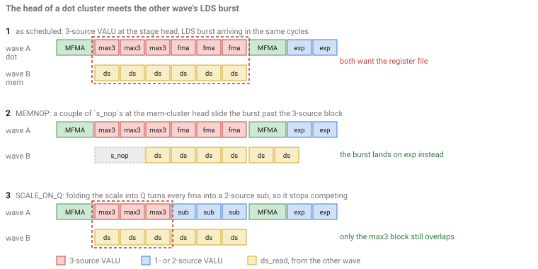

**Pacing moves the burst.** Two `s_nop`s at the head of each mem cluster delay that
wave's `ds_read`s just enough that they arrive past the `max3` block and land on the `exp2` and
sum work instead, which is 1- and 2-source. The kernel is unchanged; only the phase relationship
between the two waves moves. Two was the optimum for both kernels at either `SCALE_ON_Q`
setting — and the sweep was not smooth, which is what you would expect from a phase effect rather
than a quantity. The plugin inserts them on its own (its `kDefaultMemNops`); the knob that swept
them is gone, so the table below only separates the fold.

**`SCALE_ON_Q` removes the ops.** Folding `qk_scale` into `Q` before the loop turns every
`fma(qk, qk_scale, −m_new)` into a plain `sub`, so those stop competing for the register file at
all. It is visible in a count of 3-source VALU in `fmha_v4`'s loop body: **98 with the fold off, 34
with it on** — and 98 − 34 = 64 is exactly the 32 subtracts of each of the two unrolled tiles. The
34 that remain are the `max3` reduction, which is the part only the pacing can help.

Measured at [§9](#9-results)'s shape and protocol — `B=32, S=8192, H=8, D=128, bf16`, non-causal, same GPU,
rocprofv3 kernel time for TFLOPS (single run per configuration, `--launch jit`), an ATT instruction
trace for the in-loop MFMA efficiency per SIMD. The top row sets `--scale-on-q 0` and is a single
run; the bottom row is [§9](#9-results)'s tuned config and carries its three-round mean.

| | `fmha_v3` | `fmha_v4` |
|---|---|---|
| pacing, no fold | 1202 / 80.3% | 1280 / 88.0% |
| pacing + `SCALE_ON_Q` | **1213 / 81.0%** | **1285 / 89.2%** |

The fold is worth **+0.7** and **+1.2 points** of efficiency on `fmha_v3` and `fmha_v4`; the pacing,
measured at the `v2.3` re-pin when the plugin still had a switch for it, **+0.8** and **+2.1** (see
the `v2.3` entry in [`CHANGELOG.md`](../../CHANGELOG.md)). The efficiency column is the firmer
signal here. In throughput the fold is **+0.9%** and **+0.4%**, about the size of the tuned rows'
round-to-round spread in [§9](#9-results) (0.4–0.5%), so the TFLOPS column alone does not separate
the two settings.

`SCALE_ON_Q` is not free: pre-scaling rounds `q · scale` back to the input dtype before the loop, so
max error against the fp32 reference goes from 4.69e-04 to 7.84e-04 on `fmha_v3`, and from 7.38e-04
to 9.99e-04 on `fmha_v4`, at this shape in bf16. All four are inside tolerance, and
`--scale-on-q 0` restores the tighter numerics on either kernel.

## 8. Applying this to your own kernel

Everything above is one worked example. This section is the part meant to survive contact with a
different kernel: the decisions that stayed with the author, the procedure for finding out which
of [§5](#5-fmha_v3--fmha_v4-getting-under-the-budget)–[§7](#7-advanced-the-lds-burst-and-the-head-of-a-dot-cluster) your own stall belongs to, and which numbers you have to re-derive on other hardware.

### 8.1 The four rules the kernel author owns

The compiler cannot make these calls, because each depends on something only the kernel knows.

| rule | why the hardware demands it |
|---|---|
| **Keep control flow out of the compute clusters.** The rescale's `map_elementwise` branch lives in `mem2`, not in `VEC2` beside the arithmetic it belongs to. | Control-flow instructions are scheduled ahead of everything else in their region, so a branch inside a dot cluster issues *before* the first MFMA and the matrix core waits on it. In a mem cluster the same cost lands against memory latency instead. |
| **Balance the clusters that share a budget.** The score tile is sliced along N and the subtract + `exp2` for 3/8 of the slices is computed in the *other* cluster, bringing PV to 324 and QK to 356 of 384. | 212 against 468 wastes the whole of one cluster's slack while the other pays for its overflow. Only the per-cluster totals matter, so any work made of the same elementwise pieces can be moved to level them. |
| **Make the rebalancing itself free.** `gl.amd.slice` takes a register-only view of a distributed tensor: the slice keeps the source layout, so it is a partition of each lane's own registers and emits **no instructions**. | A distributed-tensor slice normally costs a shuffle, which would eat the imbalance you were trying to recover. Free slicing is what makes the previous rule affordable — a Gluon technique worth knowing well beyond attention. |
| **Put work you know will be exposed *before* the first MFMA of its cluster.** | A packed op cannot follow an MFMA back to back, so the first uncovered packed op otherwise pays a hazard on top of already being outside the shadow. Same instructions, same count, only the order differs — and only you know which work was never going to be covered. |

### 8.2 Diagnosing a kernel: budget it, measure it, route the gap

**Budget it, on paper, before measuring anything.** For each region that mixes MFMA with other
work:

```
per region:   capacity = (number of MFMAs in the region) × 24 cycles
              demand   = Σ 4 cycles per VALU op + 8 per TRANS + 20 per cross-lane op
                         (a packed op cannot be covered at all — count it as already exposed)
              exposed  = max(0, demand − capacity)

per loop body: ceiling = mfma_cycles / (mfma_cycles + Σ exposed over all regions)
```

That ceiling is the best MFMA efficiency any schedule of that kernel can reach. `fmha_v3`'s four dot
clusters leave 48 cycles exposed each against 2048 cycles of MFMA, which is where [§9](#9-results)'s 91.4% comes
from; `fmha_v4` leaves none, so its ceiling is 100%. The calculation costs ten minutes and it decides
which of the sections above you are in — [§5](#5-fmha_v3--fmha_v4-getting-under-the-budget) if you are over the budget, [§6](#6-making-the-compiler-co-operate) if you are under it and
still not reaching the ceiling.

**Then measure.** Take an ATT instruction trace and run
[`scripts/process_json.py`](../../scripts/process_json.py); it prints in-loop MFMA efficiency
**per wave**, so double it for the per-SIMD figure when two waves share the SIMD.

**Then route the gap.** What you see, what it means, and where in this document it is worked
through:

| symptom | what it means | section |
|---|---|---|
| demand exceeds capacity in a region | no ordering can win; the work itself has to shrink or move to another region | [§5](#5-fmha_v3--fmha_v4-getting-under-the-budget) |
| demand fits, but measured efficiency sits far under the ceiling and windows are visibly empty | the ops are not where you put them — a pass moved them, or the request you made was unsatisfiable | [§6](#6-making-the-compiler-co-operate) |
| a stage's tail is vector work while the matrix pipe is idle | the interleave was requested but never constructed | [§6](#6-making-the-compiler-co-operate) — declare it, don't pin it |
| efficiency is at its ceiling but throughput is flat or worse | you bought cycles and paid for them in clock: a denser MFMA stream draws more power, and against a power cap that buys back frequency | not a scheduling problem — see the note below |
| a small delay at a stage head changes things sharply and non-monotonically | a phase relationship between two waves, not a quantity | [§7](#7-advanced-the-lds-burst-and-the-head-of-a-dot-cluster) — sweep it, bisection will mislead you |
| two regions that should be identical report different op counts to the scheduler | something is being counted that never gets emitted (source modifiers like `fneg`, folded `max3`) | [§6](#6-making-the-compiler-co-operate) |
| in-loop numbers are good but whole-dispatch throughput is not | prologue and drain are not amortizing — short loops, or too many pipeline stages | [§9](#9-results) |

The habit underneath all of it: **judge a scheduling change by cycles, and a kernel by both cycles
and wall time.** They disagree for real reasons — the power row above is one — and a change that
improves one while flat on the other is usually still the right change.

### 8.3 What is gfx950-specific, and what is not

Re-derive these on another part; do not assume them.

| structural — expect it to hold across CDNA | specific to gfx950, and to this MFMA shape |
|---|---|
| an MFMA occupies the matrix pipe for a fixed number of passes, during which other pipes are free | `PASS = 4 cycles`, and `V_MFMA_F32_32X32X16_F16` takes 8 of them → a **32-cycle** issue interval |
| there is a read phase at the head of an MFMA in which nothing co-issues | that phase is **8 cycles**, leaving a **24-cycle** window |
| VALU and memory are separate issue ports, one instruction per wave per cycle | VALU **4** cycles, TRANS **8**, so **6** VALU or **3** TRANS per window |
| some instruction classes cannot co-issue with the matrix pipe at all | on gfx950 that class is packed f32 (`v_pk_*`) — and packed is *also* the cheapest form per element |
| the register file is shared behind both ports | 3-source VALU against an LDS return is where it shows up here ([§7](#7-advanced-the-lds-burst-and-the-head-of-a-dot-cluster)) |
| waves per SIMD determines whether inter-wave overlap is available | `waves_per_eu=2` here; with one wave per SIMD every region becomes intra-wave (see `gemm/intra_wave`) |

The pass count for your instruction is in your ISA document. The window, and the per-class costs,
are read off an ATT trace of your own kernel — which is the same evidence this document's numbers
rest on.

## 9. Results

`B=32, S=8192, H=8, D=128, bf16`, non-causal, a well-performing MI355X — ROCm/FlyDSL's published
benchmark shape. TFLOPS is the mean of three runs of `rocprofv3 --kernel-trace` with
`AMD_SERIALIZE_KERNEL=3`, averaging the last 100 of 1000 dispatches; MFMA efficiency and the loop
fraction come from an ATT instruction trace of one dispatch. The five configurations were run
**interleaved** — one of each, three times round — so any drift in the board hits every row
equally. Round-to-round spread was 1.1 to 10.2 TFLOPS, widest on FlyDSL, whose first round was its lowest.

| | TFLOPS | MFMA eff / SIMD | in loop | cyc/iter |
|---|---:|---:|---:|---:|
| *ROCm/FlyDSL* — its own tuned config | *1304* | 84.8% | 94.2% | 4831 |
| **`fmha_v4`** — llirSched, `SCALE_ON_Q=1` | **1285** | **89.2%** | 89.9% | **4591** |
| **`fmha_v3`** — llirSched, `SCALE_ON_Q=1` | **1213** | 81.0% | 91.9% | 5058 |
| `fmha_v4` — stock LLVM, no plugin, no env | 1171 | 68.7% | 91.8% | 5965 |
| `fmha_v3` — stock LLVM, no plugin, no env | 1116 | 64.7% | 93.3% | 6332 |

At the `v2.3` re-pin, the `v2.2` build re-measured on the same GPU the same day put the tuned
`fmha_v4` at 1261 TFLOPS / 84.7% / 4836 cyc/iter and the tuned `fmha_v3` at 1191 / 76.9% / 5330,
so that pin was worth about **+2%** of throughput and **+4.6** and **+4.1 points** of in-loop
efficiency on the tuned rows, with the stock rows moving by less than 1%; `v3.0` compiles these
kernels to the same code (same cycles per iteration). What changed in `v2.3` is below, and in its
entry in [`CHANGELOG.md`](../../CHANGELOG.md).

**What lazy rescaling is worth** is the distance between the two kernels: **+4.9%** on stock LLVM
(1116 → 1171) and **+6.0%** tuned (1213 → 1285). The efficiency column says something the throughput
column does not, though. Stock LLVM barely tells the two kernels apart where it counts — 64.7%
against 68.7%, **+4.0 points** — while the tuned rows are **8.3 points** apart, twice as far.
Lazy rescaling does not make the loop faster by itself: it *frees budget* ([§5](#5-fmha_v3--fmha_v4-getting-under-the-budget)), and only something
downstream that spends that budget converts it into cycles. A design that creates headroom only pays
if something spends it. **Its price** is that the per-wave skip needs a real branch — `gl.map_elementwise` with a
generated scalar body that takes all 64 of a thread's accumulator elements — and that removing the rescale unbalances the two dot
clusters enough that part of the softmax has to be moved between them by hand ([§5](#5-fmha_v3--fmha_v4-getting-under-the-budget)).

**What the scheduling is worth** is the distance within each kernel, from its stock build to its
tuned one: **+8.7%** of throughput on `fmha_v3` and **+9.9%** on `fmha_v4`, and in efficiency terms
**+16.3** and **+20.6 points**. It is the larger of the two effects, and everything in [§5](#5-fmha_v3--fmha_v4-getting-under-the-budget) and
[§6](#6-making-the-compiler-co-operate) lives in that gap. **Its price** is that the interleave has to be *declared* rather than left
to the machine scheduler — every vector op assigned to a specific MFMA's shadow and emitted as a
`sched_group_barrier` sequence for IGroupLP to construct — and the ops then kept in the cluster
they were assigned to ([§6](#6-making-the-compiler-co-operate)).

**The ceilings from [§5](#5-fmha_v3--fmha_v4-getting-under-the-budget) still frame the tuned rows.** `fmha_v4`'s demand fits its window, so its
ceiling is 100% and it reaches 89.2%. `fmha_v3` leaves 4 × 48 = 192 cycles exposed per loop body
against 2048 of MFMA, so its ceiling is 2048/2240 = **91.4%** and it reaches 81.0%. The two are
8.3 points apart while their ceilings are 8.6 apart — so the whole difference is still work
`fmha_v3`'s budget cannot absorb rather than a worse schedule. Both now sit about **10.5 points**
below their own ceiling (10.7 and 10.4), against ~5.5 on the `gfx950-tutorial-v2.0` measurement and
~15 on `v2.1` and `v2.2`: those two toolchains gave up roughly 9 points of in-loop MFMA efficiency
on both kernels, and this pin takes about half of that back.

**Both moves come from the barriers `ConvertWarpPipeline` places, not from LLVM.**

*What cost 9 points in `v2.1`.* `v2.0` placed the loop-carried wrap-around barrier at the **top**
of the loop body unconditionally, so that barrier's `setprio` primed cluster 0's priority every
iteration. `v2.1` gates that behind `shouldPlaceBackedgeBarrierAtHead()` and keeps `setprio` at
section ends instead, and upstream still does at `v2.3`. Rebuilding v2.1 with `v2.0`'s
`ConvertWarpPipeline.cpp` and `warp_pipeline.py` and changing nothing else recovered `fmha_v4` to
**1327 TFLOPS at 91.7%** in-loop MFMA (4467 cyc/iter) against the v2.0 published 1323 / 94.2%, and
`fmha_v3` to **1265** (measured on v2.1, 2026-09-03; not repeated on this pin).

*What gives 4.5 back in `v2.3`.* The loop alternates four memory stages (`ds_read`s and the next
tile's `buffer_load`s) with four compute stages (16 MFMAs and the softmax work in their shadow),
and a barrier closes each stage. A barrier is either plain (`s_barrier`) or *local*
(`s_waitcnt lgkmcnt(0)`, then `s_barrier`: every LDS access of this wave has completed before the
other wave runs). Which one a boundary gets depends on whether the LDS accesses of the stages around
it conflict, and
[triton-lang/triton#11719](https://github.com/triton-lang/triton/pull/11719) makes that test
direction-aware: a `ds_read` followed by a direct-to-LDS refill of the same buffer now counts, where
it used to be filtered out together with the opposite order. It is a correctness change, and here
it turns the barrier that closes each memory stage from plain into local. The speed-up is a side
effect of where the waits go:

| per loop body | `v2.2` | `v2.3` |
|---|---:|---:|
| LDS waits inside the compute stages, between the MFMAs | 42 | 0 |
| LDS waits at the end of the memory stages | 0 | 4 |
| instructions | 594 | 556 |

With a plain barrier LLVM waits for each `ds_read` result where it is first used, which is inside
the next compute stage: a staircase of `s_waitcnt lgkmcnt(14)` … `lgkmcnt(0)` spread through the
MFMA chain. With a local barrier one wait at the end of the memory stage covers them all. Nothing
else in the loop changes. The compiler flags are not part of it: the assembly is identical with the
register-pressure trackers forced on, with FP fusion turned back on, and the efficiency follows the
Triton build when the two AMD codegen LLVMs are swapped (84.7% with `v2.2`'s Triton and either
LLVM, 89.2% with `v2.3`'s). The 8-wave GEMMs are not affected: their barriers and waits are the
same on both pins.

The two LLVM bugs recorded in [`CHANGELOG.md`](../../CHANGELOG.md) hit the GEMM kernels; neither
was shown to affect these.

**On the FlyDSL row.** ROCm/FlyDSL at
[`63eb891`](https://github.com/ROCm/FlyDSL/tree/63eb891/kernels/attention) (`v0.2.4-26-g63eb891`),
`build_flash_attn_dualwave_swp_module` in its own tuned configuration, timed by
[`scripts/fly_kernel_time.py`](../../scripts/fly_kernel_time.py) under the same protocol as our
rows: **1304 TFLOPS** (1296.9 / 1306.2 / 1308.0), re-measured on this pin on the same GPU,
interleaved with the `fmha_v4` rounds (1279.4 / 1285.8 / 1290.2) so the two sides share thermal
state. Its ATT figures are unchanged from the `v2.0` measurement — 84.8% vs 84.7%, 94.2% loop
fraction both times, 4831 vs 4837 cyc/iter — which is expected: **FlyDSL does not go through Triton**, so no
Triton or LLVM change reaches it. That is what makes it a useful control here.

> [!NOTE]
> The runtime is the `flydsl==0.2.4` PyPI wheel (installed on the side, off the main environment's
> `PYTHONPATH`) driving the pinned checkout's kernel source. The
> pin is 26 commits past the `v0.2.4` tag and four of those touch the attention kernel, so the
> *kernel* is the pinned one but the *compiler* is v0.2.4. Reproducing the exact `63eb891` build
> needs a from-source build of its embedded MLIR.

**What this changes.** On `v2.0` `fmha_v4` matched FlyDSL (1323 vs 1322) from a much higher in-loop
efficiency (94.2% vs 84.7%) — it was doing more per cycle and spending it on a shorter loop
fraction. On `v2.1` and `v2.2` it had lost ~9 points of that efficiency and sat level with FlyDSL
(84.6% vs 84.9% on `v2.2`), so FlyDSL's better loop fraction decided it by 3.4%. On this pin
`fmha_v4` is 4.6 points ahead again in the loop (89.2% vs 84.8%) and still behind on loop fraction
(89.9% vs 94.2%), and the gap is down to 1.4%. The head-barrier experiment above says the rest is
also the toolchain's rather than a design difference, but it has not been repeated on this pin.

### Building and running

The kernels need Triton built from the
[`gfx950-tutorial-v3.0`](https://github.com/triton-lang/triton/releases/tag/gfx950-tutorial-v3.0)
tag. Build it with default symbol visibility so the scheduler plugin can resolve LLVM symbols:

```bash
git clone https://github.com/triton-lang/triton -b gfx950-tutorial-v3.0 /tmp/triton
cd /tmp/triton && TRITON_EXT_ENABLED=1 pip install -e .      # Triton requires Python >= 3.11 at this pin
```

Then, from `kernels/attention/`, at the shape the table above uses:

```bash
FA_MODULE=fmha_v4 DISABLE_LLVM_OPT=disable-machine-sink \
LLVM_PASS_PLUGIN_PATH=$PWD/../../plugins/llir_scheduler/libLlirSched.so \
python bench.py --batch 32 --hq 8 --hk 8 --seqlen 8192
```

Those variables are not tuning knobs — they are what [§6](#6-making-the-compiler-co-operate) is about, and dropping
them measures the stock-LLVM bars of the chart above instead. The two settings the table names are
already the defaults: `SCALE_ON_Q` is on unless you pass `--scale-on-q 0`, and the plugin paces the
mem stages with two `s_nop`s on its own (built in, not configurable). `bench.py` reports `do_bench` wall time;
`scripts/fa_kernel_time.py` takes the same environment and reports the rocprofv3 kernel-time TFLOPS
the table quotes — **pass `--launch jit`**, since its default is `prepared` and every number in
[§9](#9-results) and [§8](#8-applying-this-to-your-own-kernel) was taken with the plain (jit) launch:

```bash
FA_MODULE=fmha_v4 DISABLE_LLVM_OPT=disable-machine-sink \
LLVM_PASS_PLUGIN_PATH=$PWD/../../plugins/llir_scheduler/libLlirSched.so \
python ../../scripts/fa_kernel_time.py --batch 32 --hq 8 --hk 8 --seqlen 8192 --launch jit
```

## 10. Causal attention: `fmha_v5`

Causal masking halves the work -- a 256-row q-block `m` attends to `(m + 1) * 256` keys -- and the
FLOP count halves with it (`(N² + N) / 2` score entries). The bar this section sets is **causal
TFLOPS within 5% of non-causal**, on the same shape. Two kernels:

* [`fmha_v4_causal.py`](fmha_v4_causal.py) -- `fmha_v4` with the causal bounds and the mask, and
  little else: the direct port, and the home of `causal_mask`.
* [`fmha_v5.py`](fmha_v5.py) -- the same pipeline run persistently. Its hot loop is `fmha_v4`'s;
  everything new is around the loop. It also runs non-causal.

`B=32, S=8192, H=8, D=128, bf16`, rocprofv3 kernel time (`fa_kernel_time.py --launch jit`), five
configurations interleaved, three rounds, spread under 1.5 TFLOPS. This GPU is a power-capped
part (~20% below the §9 board), so compare rows with each other, not with §9:

| | TFLOPS | vs `fmha_v4` non-causal |
|---|---:|---:|
| `fmha_v4` non-causal | 998.7 | -- |
| `fmha_v5` non-causal | 1003.1 | 100.4% |
| **`fmha_v5` causal** | **959.1** | **96.0%** |
| `fmha_v5` causal, pinned Triton (no `gl.amd.warp_id`) | 955.5 | 95.7% |
| `fmha_v4_causal` | 868.0 | 86.9% |
| `fmha_v4_causal`, generic `gl.where` mask (`FA_MASK_IMPL=generic`) ¹ | 793.9 | 79.5% |
| first port: generic mask, runtime drain slots ¹ | 743.8 | 74.5% |

¹ single runs, outside the interleaved rounds.

### 10.1 What causal changes

Only the last four K/V tiles of a q-block straddle the diagonal. Everything before them is a
plain `fmha_v4` tile, so the per-tile work is unchanged; what changes is the *shape* of the work.
Blocks now range from 4 to 128 tiles, every block carries the same prologue, drain and epilogue,
and the diagonal tiles compute a full 256 x 64 tile of which only the lower triangle is kept:
2112 tiles per `(batch, head)` computed for 2048 tiles' worth of useful FLOPs, **3.0% of the
work is waste** that no schedule of a 256-row block removes. That makes the 5% budget mostly a
question of how much of the rest goes to the edges of each block.

### 10.2 The mask ([triton-tickets#812](https://github.com/AMD-Triton/triton-tickets/issues/812))

The generic mask, `gl.where(row - col >= delta, qk, -inf)`, is the one the issue describes: it
computes `row - col` for each of a thread's 32 score registers. LLVM sees those as loop-invariant,
hoists them, keeps them live through the hot loop, and a kernel at 256 VGPRs spills (96 VGPRs in
`fmha_v4_causal`) -- the 794-to-868 step in the table.

The issue's observation is that a causal mask is not generic: with the layout known, the pattern
is a compile-time fact. In the transposed 32x32 MFMA layout, register `e` of a lane holds column
`e%4 + 8*(e//4 % 4) + 32*(e//16)` (plus 4 in the upper half of the wave) of that lane's row. So:

* per wave, each 32x32 block of the score tile is in one of **three states** -- fully kept, fully
  masked, or the diagonal block -- and the state is wave-uniform;
* in the diagonal block, register `e` is kept iff `d0 >= COL[e]`, where `d0 = row - delta - 4h` is
  one per-lane value and `COL[e]` a constant. One compare and one `v_cndmask`, no extra VGPRs.

`causal_mask` implements both through `gl.map_elementwise(pack=32)`, which hands a thread's 32
registers to a scalar body as separate arguments (the bodies are generated:
[`fmha_causal_mask.py`](fmha_causal_mask.py), by `scripts/gen_causal_mask.py`). In plain code the
3-state body branches per wave; inside the warp-pipelined loop the branch-free one compares every
register. Measured end to end, **all masking costs 0.6%** of the causal run, so the issue's further
step -- SGPR lane masks advanced by `s_lshl` to halve the VALU -- would buy at most 0.3% here.

Where the mask goes mattered more than what it costs. The masked tiles are the last three loop
iterations; a uniform branch inside the loop (skip the mask on the other iterations) costs **5% on
every tile**: it splits the PV cluster's basic block, LLVM sinks the `p` downcast into the join, and
IGroupLP no longer builds the cluster's MFMA/VALU interleave. `fmha_v5` instead runs two
warp-pipelined loops -- the plain pairs, then the masked pairs -- each branch-free.

### 10.3 The launch: persistent, in balanced pairs

`fmha_v4_causal` launches one workgroup per q-block, longest first. Per-workgroup timestamps
(`s_memrealtime` at start and end) show the dispatcher leaving a CU idle ~10 µs at every handover
between such uneven workgroups -- ~6% of all CU time -- where `fmha_v4`'s uniform workgroups hand
over in under 1 µs.

`fmha_v5` launches one workgroup per CU, and each walks a fixed list of q-blocks in pairs `(M-1-j,
j)`: every pair is `(M + 1) * 4` tiles, so every workgroup does the same work and they finish
together. Jobs are numbered `(batch, head)`-major and the workgroups on one XCD take consecutive
jobs, so an XCD's L2 serves one or two `(batch, head)` at a time. (Walking the short block of each
pair backwards would put an XCD's workgroups on the same two tiles at every step; it measured the
same, because causal's L2 misses are already near the compulsory floor -- its hit *rate* is lower
than non-causal's only because it re-reads K/V half as often.)

### 10.4 The hand-over between q-blocks

With 32 q-blocks per CU, each one's prologue, drain and epilogue are paid as often as in
non-causal, against half the tiles. A persistent workgroup can overlap them:

* **Prefetch the next q-block** as soon as this one's last K/V read is done: its Q straight into the
  MFMA operand registers (the current Q is dead after the last QK, so no LDS staging), and its first
  three K/V tiles into the ring.
* **O through LDS in two 32 KB halves.** A single 64 KB conversion scratch is the largest buffer, so
  the size-sorted allocator places it first and pushes the K/V ring above 64 KB, where its `ds_read`
  offsets no longer fit the 16-bit immediate (the same effect that sank `FA_Q_DIRECT_LDS` in
  `fmha_v4`); each half is smaller than a K or V buffer, so the ring stays at the bottom. Storing
  straight from the MFMA layout avoids LDS but makes every 8-byte store span 32 rows: +4 µs per block.
* **LSE straight from the row layout** -- the two lanes that share a row write the same value -- which
  saves an LDS round trip and two barriers.

Fitting `fmha_v5`'s non-causal time over `S = 2048, 4096, 8192` at a constant 8192 q-blocks gives
**~2.13 µs per tile and ~3 µs per q-block** of hand-over; the causal run's 2112 tiles and 32 blocks
per CU predict 4595 µs against 4590 measured. The causal kernel runs at non-causal efficiency per
tile and per block, and the remaining 4% is the diagonal's waste (3%) plus the hand-over weighing
twice as much (1%).

An ATT trace says the same from inside the loop. One dispatch, one CU, read with
[`scripts/att_loops.py`](../../scripts/att_loops.py) (`process_json.py` times a loop from its first
entry, which assumes one entry per wave; `fmha_v5` enters its inner loops once per q-block). MFMA
efficiency is per SIMD (per wave x 2), and one iteration is two K/V tiles:

| kernel | loop | iterations / wave | cycles / iteration | share of wave time | MFMA eff |
|---|---|---:|---:|---:|---:|
| `fmha_v4` non-causal | main loop | 62 | 4660 | 92.3% | 87.90% |
| `fmha_v5` non-causal | inner loop | 2016 | 4662 | 94.6% | 87.86% |
| | whole q-block (outer loop) | 32 | -- | 100% | 84.45% |
| **`fmha_v5` causal** | **plain inner loop** | 960 | 4644 | 82.3% | **88.21%** |
| | masked inner loop | 64 | 6029 | 7.1% | 67.94% |
| | whole q-block (outer loop) | 32 | -- | 99.9% | 79.43% |
| `fmha_v4_causal` | main loop | 32 | 5485 | 79.9% | 74.68% |

* **The hot loop does not know it is causal.** The plain inner loop, 82% of the causal kernel's
  time, matches `fmha_v4`'s loop in both cycles and MFMA efficiency.
* **The gap is everything around it:** the masked loop (two iterations per pair, at 68%) and code
  outside the loops, 10.6% of the wave's time against 5.4% non-causal -- the hand-over paid against
  half the tiles.
* **`fmha_v4_causal`'s loop is 18% slower per iteration** with no scratch access inside it (its
  spills are all in the prologue and drain): that is the in-loop mask branch of §10.2 costing the PV
  cluster its interleave.

MFMA efficiency counts the diagonal's masked-out MFMAs as busy, so the 3% waste of §10.1 does not
show here, only in TFLOPS. These are cycles, not time: on this power-capped part a less MFMA-dense
kernel can run at a higher clock, so cycle ratios do not carry over one to one to the table above.

### 10.5 Skipping fully masked waves: `gl.amd.warp_id()`

Within a diagonal tile, a wave whose rows are all above the diagonal has nothing to compute, but
every wave executes every MFMA. Skipping them needs control flow that differs between waves, which
Gluon has no way to express: its scalars are uniform across the program. The Triton branch adds
`gl.amd.warp_id()` -- the existing `ttg.warp_id`, lowered to `v_readfirstlane(tid / 64)`, so branches
on it are wave-uniform. The drain's last tile is masked entirely for waves 0-5, which now skip its QK
MFMA (+0.4%). The same skip around the PV MFMAs would save more, but the accumulator then merges two
control-flow paths and the register allocator spills ~170 VGPRs. Without `warp_id` the kernel runs
as before.

### 10.6 What spilled, and why

The kernel sits at 256 VGPRs, and most of the work on `fmha_v5` was keeping it there. Every one of
these cost between a few and ~650 spilled VGPRs, and is now avoided (see the comments in the code):

| cause | fix |
|---|---|
| `row - col` per register, hoisted by LLVM (generic mask) | the 3-state mask (§10.2) |
| runtime LDS slot indices in the drain | slots are constants again (`n` is a multiple of 4) |
| setup hoisted out of the persistent loop and kept live through the hot loop | `tl.range(..., disable_licm=True)` + `DISABLE_LLVM_OPT=disable-machine-licm` |
| LLVM's zero-trip guard on a runtime-count loop (a second path into the drain) | `gl.assume(main_loop_pairs > 0)` |
| next q-block's Q offsets computed before the loop | computed at the prefetch |
| a branch merging the accumulator | none: the PV skip stays off (§10.5) |
| plain-code peeling of the masked iterations | the masked loop is a warp-pipelined loop |

### 10.7 Running it

`fmha_v5` takes the `fmha_v4` environment plus `disable-machine-licm`; `--causal` selects the mask.
`gl.amd.warp_id()` is on the Triton branch `fa-causal-warp-id` (the pinned tag plus that one op);
on the pinned tag the drain skip is simply off.

```bash
FA_MODULE=fmha_v5 DISABLE_LLVM_OPT=disable-machine-sink,disable-machine-licm \
LLVM_PASS_PLUGIN_PATH=$PWD/../../plugins/llir_scheduler/libLlirSched.so \
python ../../scripts/fa_kernel_time.py --batch 32 --hq 8 --hk 8 --seqlen 8192 --causal --launch jit
```

`scripts/fa_check.py` checks O and LSE against fp32 references and that repeated launches are
bit-identical (a race between the async copies and the LDS reads shows up as drift first);
`scripts/fa_qblock_timing.py` prints the per-q-block breakdown from in-kernel clocks
(`FA_WG_TIMING=1`); `scripts/att_loops.py <ui_output_dir>` prints the per-loop table of §10.4 from
an ATT trace. The persistent kernel needs `S % 512 == 0` and `S >= 1024` for causal: with a
single pair per `(batch, head)`, every trip count becomes a compile-time 1, MLIR folds the
warp-pipelined loops away, and their stage markers land in the outer loop.

## 11. Where to go deeper

- [`../gemm/README.md`](../gemm/README.md) — read this **first** if you have not. [§3](#3-where-attention-sits-in-the-taxonomy--a-hybrid-per-region) above
  assumes its intra-wave / inter-wave taxonomy, and `gemm/inter_wave/` is the two-wave
  ping-pong that attention builds on.
- [`../../plugins/llir_scheduler/llir_scheduler.html`](../../plugins/llir_scheduler/llir_scheduler.html)
  — how the scheduler classifies a region, and how it packs or triages the windows.
- [`../../docs/warp_pipelining.md`](../../docs/warp_pipelining.md) and
  [`../../docs/mfma_efficiency.md`](../../docs/mfma_efficiency.md) — the theory behind
  `warp_pipeline_stage` ([§4](#4-designing-the-loop)) and behind the metric [§9](#9-results) reports.
- **Provenance.** Ported from
  [`AMD-Triton/gluon-kernels`](https://github.com/AMD-Triton/gluon-kernels)
  (`kernels/cdna4/fa/`). `fmha_v3.py` is the upstream rotated-4-cluster kernel reduced to the
  single best config for this shape — the per-`(D, BLOCK_N, warps)` layout dispatch,
  causal/masked-tail scheduling, non-pipelined fallbacks, head-dim padding and the multi-config
  autotune space were removed and the pipelined loop inlined into one flat `gluon_attn_fwd`.
  `common.py` came over with it and has since been cut down to what these two
  kernels and `bench.py` actually call: the non-pipelined `attn_fwd_inner` and its building
  blocks, the arch dispatch, the ragged/`thd` paths and the results-table plumbing are all gone
  with the features that used them. The full version is upstream and in git history. `fmha_v3.py`
  and `fmha_v4.py` are still excluded from this repo's black/ruff (see `pyproject.toml`) to keep
  them diffable against upstream; everything else here is linted.
