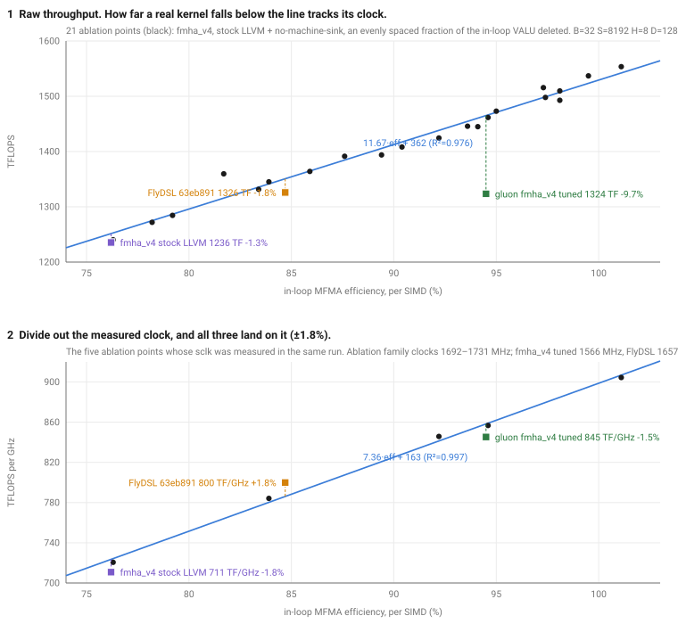
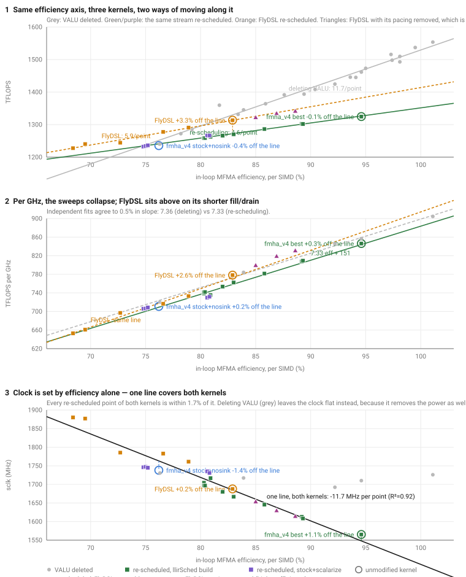

# 1 FAv3 gfx950 — MFMA/VALU co-issue scheduling exploration

Companion to `mfma_coissue_scheduling.md` (the formal cycle-cost proof). What we
tried to better overlap VALU with MFMA in the rotated-4-cluster gluon kernel.

**Setup.** `gluon_attn_fwd`, 1×16320 bshd fp16 non-causal, 32×32×16 MFMA,
BLOCK_M=256 BLOCK_N=64 nw=8. Mechanism: emit `rocdl.sched.group.barrier` groups
at the END of each DOT cluster in Triton's `ConvertWarpPipeline.cpp`, built on the
pinned upstream LLVM (no LLVM rebuild); env-gated `TRITON_HIP_DOT_COISSUE=1`.
Measured via do_bench TFLOPS + ATT `process_json.py` (MFMA eff = mfma_cyc/iter;
2 waves/SIMD, so ~100%/SIMD ≈ 50%/wave).

## 1.1 Results (1×16320)

| variant | iter cyc | MFMA eff/wave | TFLOPS |
|---|---:|---:|---:|
| baseline | 6282 | 32.60% | 1018 |
| K=3 co-issue (packed math present) | 5768 | 35.51% | 1046 |
| scalarize + uniform K=8 | 5451 | 37.57% | 1066 |
| **scalarize + VALU/TRANS split (best)** | **5390** | **38.00%** | **1071** |
| mfma-only floor (ablation, numerically wrong) | 4105 | 49.89% | 1322 |

Net baseline → best: **+5.2% TFLOPS**, MFMA eff 32.6 → 38.0% (~76%/SIMD).

## 1.2 SOL sweep — 5-way build comparison (per-SIMD MFMA eff)

End-to-end sweep across compiler branch + LLVM variant, one config each. MFMA
efficiency is **per-SIMD** (= 2× the per-wave number `process_json.py` prints;
`waves_per_eu=2`). Configs 1–4 are the gluon kernel with the `gl.fma` source
fusion at `b1 h64 d128 sq16320 bshd fp16`; config 5 is the reference kernel at
`sq16384`. All correctness `match`. ATT traces in `/data/sol_sweep_*`.

| # | implementation | build | TFLOPS | eff/SIMD | eff/wave | iter cyc |
|---|---|---|---:|---:|---:|---:|
| 1 | baseline | gfx950-tutorial + pinned LLVM, no llirSched | 1002 | 62.4% | 31.2% | 6561 |
| 2 | fix_boundary | llir_FAv3 + pinned LLVM, no llirSched | 1008 | 65.1% | 32.6% | 6288 |
| 4 | sched.group.barrier | schedGroupBarrier + peephole LLVM (AUTO split) | 1038 | 70.1% | 35.1% | 5839 |
| 3 | llirSched_FAv3 | llir_FAv3 + peephole LLVM + llirSched ON | 1046 | 71.9% | 35.9% | 5701 |
| 5 | triton_reference | fav3_padded + Austin's LLVM | 1077 | 76.4% | 38.2% | 2681 |

**Caveat on #4:** this run used the *auto-derived* co-issue split on *packed* math
(no scalarize) — the weaker Path A variant. The hand-tuned **scalarize + VALU/TRANS
split** (Results table above: 1071 / 38.0%/wave ≈ 76%/SIMD) is Path A's real
ceiling and matches the reference; reproduce with `AMDGCN_SCALARIZE_PACKED_FOPS=1`
+ the reference split. Iter-cycles are not comparable across kernels (reference
2681 vs gluon 5701 is loop structure — 2×-unroll — not speed); **MFMA eff/SIMD is
the comparable microarch metric**.

## 1.3 Findings

1. **Placement.** `SCHED_GROUP_BARRIER` groups are formed scanning *upward*
   (`AMDGPUIGroupLP::initSchedGroupBarrierPipelineStage`), so the whole sequence
   must sit *after* every real op in the region. Top-of-region = empty groups = no-op.
2. **Masks.** VALU=0x2, MFMA=0x8, TRANS(transcendental)=0x400. `canAddMI`'s VALU
   branch *excludes* TRANS — `v_exp` matches only the TRANS mask. This mirrors
   `isNeverCoissue` (gfx950): TRANS, packed (`v_pk_*`), and DOT/MFMA cannot
   co-issue with an MFMA.
3. **Packed ambiguity.** With packed math present, `[VALU K]` conflates packed
   (2 units) and unpacked (1). K=3 "worked" only because `SIPreEmitPeephole`
   unpacks packed ops that land inside an MFMA window (3 packed → 6 unpacked).
   Fragile; some windows stayed under-filled (dependency-limited, not schedulable).
4. **Start unpacked.** `AMDGCN_SCALARIZE_PACKED_FOPS=1` makes all math unpacked,
   so `[VALU K]` is unambiguous (K ops = K units). Cleaner windows; beats K=3.
5. **Even-spread, not window-fill.** The best K is the *smallest* that drives a
   stage's end-of-stage VALU leftover ("tail") to zero — i.e. *over-demand*
   (K > available). Leftover VALU runs with the MFMA unit idle → cool-down →
   the next stage's first MFMA pays a jump-start stall (barrier-gated in the warp
   pipeline). K=8 is the smallest tail-zero for DOT1; K=10/12 stall the cadence and
   regress. Ablation confirms: deleting *only* DOT2's 19-op softmax tail = +3.3%
   (≈73% of K=3's entire gain).
6. **VALU/TRANS split (best).** Don't load every MFMA with both types. Dedicate
   some MFMAs to VALU and others to exp — DOT2 = `[MFMA][VALU 8]×7` then
   `[MFMA][TRANS 4]×9`. `K2 = K1/2` keeps each MFMA's co-execute load equal *in
   cycles* (8·4cyc = 4·8cyc). Homogeneous per-MFMA load + exp block placed *last*
   respects the softmax dependency chain. Interleaving valu+exp on every MFMA
   *loses* (over-constrains). Order matters: valu-first 1071, exp-first 1047.
   - Split math: pretend 1 exp = 2 valu; `K1=⌈(V+2E)/M⌉`, `K2=⌈K1/2⌉`,
     `g0=round(V/K1)`, `g1=M-g0`. (M16 V54 E33 → 8/4/7/9.)

**Per-stage optimal ceiling** (proof, 24-cyc window): DOT1 86.5%, DOT2 83.7%.
DOT2 is the tighter stage — its 33 `v_exp` (8 cyc, never-co-issue) cap it.

## 1.4 Dead ends

- **Count-matched K = V/M**: loses to uniform over-demand (matching leaves a tail).
- **Interleaved `[VALU][TRANS]` on every MFMA**: loses (mixing types over-constrains).
- **Deriving the split params at TTGIR**: M is exact from `instr_shape` +
  `warpsPerCTA` + tile (no kWidth needed); E is exact from `getTotalElemsPerThread`;
  g0/g1 reproduce the reference. But V is only *approximate* at TTGIR — element
  counts there ≠ post-codegen scalar-instruction counts (canonicalization/CSE), and
  `tt.reduce` is cross-lane shuffles, not arith. Auto landed at 1054 vs 1071.
  **Conclusion: this instruction-level accounting doesn't belong at TTGIR** — it
  should live in the LLIR / LLVM backend, where real MFMA/VALU/TRANS instructions
  are countable, keeping TTGIR free of instruction-level detail.

## 1.5 Recommendation

Productionize as an LLVM pass (a new `IGLPStrategy`, or a `SIPreEmitPeephole`
extension) that, per scheduling region, counts MFMA / co-issuable VALU / TRANS,
computes the `K1/K2/g0/g1` split, and emits the valu-first
`[MFMA][VALU]×g0 + [MFMA][TRANS]×g1` sequence — with math scalarized first. The
throwaway Triton prototype (hardcoded reference split, env-gated) is in
`ConvertWarpPipeline.cpp`; ATT traces are archived at `/data/att_gluon_1x16320_bshd_*`.

## 1.6 Stage-boundary barriers & di/dt — the biggest single win (+21 TFLOPS)

Independent of the interleave: at each `mem → DOT` stage boundary
`ConvertWarpPipeline` emits either a **LOCAL** barrier (`ds_wait + s_barrier` →
`s_waitcnt lgkmcnt(0); s_barrier`) or a **bare** `s_barrier`. In the shipped asm
the QK boundary was LOCAL, the PV boundary bare:

```
QK:  s_waitcnt lgkmcnt(0)      PV:  s_barrier
     s_barrier                      s_waitcnt lgkmcnt(14)   ┐ progressive drain
                                     s_waitcnt lgkmcnt(11)  │ hoisted INTO the
                                     ... lgkmcnt(3,2,1,0)   ┘ MFMA stage
```

A bare barrier lets the backend hoist a **progressive `lgkmcnt(N..0)` into the
following MFMA stage**. Each `s_waitcnt` costs a **4-cyc MFMA co-exec slot and
stalls the matrix unit** — the di/dt trigger we'd been fighting with the
interleave. The LOCAL barrier instead drains once with a single `lgkmcnt(0)` at
the *mem-stage* end, hidden by inter-wave scheduling (`waves_per_eu=2`).

**Why QK≠PV — it's arbitrary, not intrinsic** (`TRITON_WP_DEBUG` dump of the
cluster LDS effects): the **DOT clusters have zero LDS effects** (register-only);
only the mem clusters touch LDS. The one hazard is `mem1↔mem1` across iterations
(K/V buffer reuse). `analyzePipelineDependencies` places the required LOCAL
barrier at slot `dst-1` — a "somewhat arbitrary" (its own comment) choice that
happens to land on the QK (`dot1`) slot. PV just isn't where the heuristic put it.

**Fix:** emit LOCAL unconditionally (LOCAL strictly dominates bare, always
correctness-safe; the extra barriers only order the mem clusters, which the
minimal placement already had to do). Triton `llir_FAv3` commit *"[AMD]
warp-pipeline: always emit LOCAL cluster barriers"*.

**Result:** loop `lgkmcnt` 14→4, bare barriers 2→0, **~1050 → ~1071 TFLOPS**,
MFMA eff **71.4 → 76.2% per-SIMD** — matching the `triton_reference` (1077 /
76.4%). This barrier/lgkmcnt handling was the single largest gap to the
reference, larger than all the interleave tuning combined.

**GEMM regression check.** The unconditional-LOCAL emission fires for *every*
warp-pipeline kernel, so we A/B'd force-local vs the old minimal `bars[i]`
placement on all three inter-wave GEMMs (`a16w16` fp16/bf16, `a8w8` f8, `a4w4`)
across M=N=4096, K=512…65536. Correctness matches everywhere; TFLOPS is within
run-to-run noise (this f8 kernel alone swings ~10% at large K from thermal),
and force-local *slightly helps* small/mid-K a4w4/a8w8 (up to +1.0%). Expected:
DOT clusters have no LDS effects, so the extra LOCAL barriers only re-order the
mem clusters (already ordered) — no added work. **No regression.**

**Isolation** (hand-edited asm via `TRITON_KERNEL_OVERRIDE`, `s_barrier`+lgkmcnt
in the PV boundary): the win needs a single `lgkmcnt(0)` **and** it before the
barrier — neither change alone suffices.

| variant | lgkmcnt inside MFMA stage | drain position | TFLOPS |
|---|---:|---|---:|
| baseline (multiple, after) | 6 | after | 1049 |
| single lgkmcnt(0), after | 1 | after | 1054 |
| reorder only (keep multiple) | 6 | before | 1050 |
| **single lgkmcnt(0), before** | **0** | before | **1070** |

The benefit is monotonic in **#lgkmcnt inside the MFMA stage** (6→1049, 1→1054,
0→1070); the win is getting to **zero** in-stage waits, which needs both the
single-drain *and* the reorder before the barrier.

**Revisit of the di/dt / interleave tradeoff.** The earlier "spread VALU so the
stage tail has few VALU, else di/dt" reasoning was working around the *bare-
barrier* stall. With the LOCAL-barrier fix removing the in-stage `lgkmcnt`
stalls, the interleave is freer — even-spread is no longer forced by di/dt, so a
front-loaded VALU prologue + tightly-packed `[MFMA][6-7 VALU]` groups becomes
worth trying (WIP).

---

# 2 FAv4 — opt1 / opt2 / opt3 (DOT1-stage restructuring)

Follow-on to the co-issue/barrier work above, on `fav4.py` (lazy-softmax-rescale
FA). Same 2×-unrolled rotated 4-stage ping-pong (`dot1`/`mem1`/`dot2`/`mem2`), but
the online-softmax correction (`acc *= alpha`, `l_i *= alpha`) is applied **lazily**
and skipped per-wave via `gl.warp_predicate(alpha < 1.0, …)` (an
`s_and_saveexec`/`s_cbranch_execz` skip, no cross-warp reduction). Numbers are
at `b1 h64 d128 sq16320 fp16` on rocm-smi GPU[4]. **CORRECTION:** the eff column
below is what `process_json.py` prints, which is **per WAVE**
(`mfma_cycles / iteration`), not per SIMD -- with `waves_per_eu=2` the matrix
unit's occupancy is 2x these numbers. See the metric note in the opt4-6 section.

| version | commit | change | eff/wave | TFLOPS |
|---|---|---|:---:|:---:|
| baseline | `8f1410b` | per-wave lazy rescale via `gl.warp_predicate` | 36.6% | — |
| **opt1** | `4f29b69` | hoist p→fp16 cvt to top of `sc_vec2` (mfma still leads dot1) | 36.8% | — |
| **opt2** | `f33b86e` | `sc_vec2` **before** `compute_dot1_qk` (branch leads dot1) | 31.9% → 38.5% | — |
| **opt3** | `26eca45` | rescale hoisted out of dot1 into the prior `mem2` stage | **41.7%** | ~1156 |

opt2's 31.9% is the *naive* build; 38.5% is after the three compiler fixes it
surfaced (below). opt3 is the current best (41.7%, 41.96% with the wrap-around drain).

## 2.1 opt1 — hoist the p→fp16 convert (+1.4%)

`sc_vec2` did rescale → `sum(p)` → `p.to(fp16)` cvt (DOT2 operand). Moving the cvt
to the **top** of `sc_vec2` overlaps it earlier; `compute_dot1_qk` still leads the
dot1 stage. 36.6 → 36.8%.

## 2.2 opt2 — interleave DOT1 mfma with sum+cvt (negative, but surfaced 3 real bugs)

Reversed dot1 so `sc_vec2` runs **before** `compute_dot1_qk`, to let the llir
scheduler interleave the QK mfma with the sum/cvt VALU. **-8%** — the reversal puts
the `warp_predicate` *branch* ahead of the QK mfma, exposing three backend issues:

1. **block-placement out-of-lining.** `MachineBlockPlacement` laid the cold rescale
   block ~50/50. Fix: `gl.warp_predicate(…, unlikely=True)` → branch weights
   `[1,2000]` → cold block out of line. (Committed to triton `llir_FAv3` as a
   frontend param; opt3 no longer needs it.)
2. **MachineSink leaked exp/fma.** `MachineSink` sinks dot2's `exp2`/`fma` (VEC1)
   toward its consumer (dot1's `sum`/`cvt`) **across** the mem2 `s_barrier` —
   `s_barrier` is `IntrNoMem`, so it's not a code-motion fence for pure ALU ops.
   Fix: `DISABLE_LLVM_OPT=disable-machine-sink`.
3. **the llir scheduler was silently rolling back its ENTIRE interleave.** The QK
   region is the first span of the loop's merge block, so its `Begin` is a PHI; the
   plugin moved an mfma above a phi → invalid IR → the whole warp-pipeline
   interleave reverted (the `interleaved N/M` log prints *before* the verify, so it
   looked applied). Every "+llir" number was actually un-interleaved. Fix in
   `LlirSchedPlugin.cpp`: **advance the region start past leading phis** → interleave
   applies → **+8%** (32.6 → 38.5%). A second tweak (adaptive group weight for
   VALU-light stages) spreads the QK mfma instead of clustering; perf-neutral.

Lesson: "branch-leads-dot1" is the wrong shape; it just happened to surface bugs.

## 2.3 opt3 — hoist the rescale into mem2 (+2%, current best)

Split the rescale out of `sc_vec2` into `rescale_lazy()` and run it in the **mem2**
stage (with LRK/ACV), leaving dot1 as `[sum + cvt] + QK mfma` with **no branch
ahead of the mfma** — the branch's latency overlaps the mem stage. The rescale for
tile *i+1* uses `alpha` from tile *i*'s DOT2 `sc_vec1` (live in tile *i*'s mem2);
prologue rescales tile 0, drain rescales n-2/n-1 (n-3 done by the loop's last mem2).
Semantically identical. **38.5 → 41.7%/SIMD, ~1156 TFLOPS.**

## 2.4 Wrap-around barrier — the slot force-LOCAL can't reach

The "always emit LOCAL cluster barriers" win above covers 3 of the 4 dot boundaries.
The 4th — the **wrap-around barrier** (cluster 0, loop-top QK) — behaved as if bare:
the loop-top QK stage carried a staggered `lgkmcnt(14→0)` instead of one drain.

**Root cause — not a missing barrier.** The wrap-around barrier's LOCAL *release*
fence **does** ask for the drain, but `SIMemoryLegalizer` materializes it as
**`S_WAITCNT_soft`** — an *advisory* wait that `SIInsertWaitcnts` is free to relax.
At the seven other cluster boundaries the soft wait survives as
`s_waitcnt lgkmcnt(0)`; at the loop *header* `SIInsertWaitcnts` **deletes** it and
re-places minimal **per-consumer** waits instead (`lgkmcnt(14), 13, 12, …` before
each mfma), because the first mfma only needs 2 of the 16 backedge-carried
`ds_read`s. The staggering is the backend deliberately maximizing overlap. Confirm by
diffing the *"SI Memory Legalizer"* vs *"SI insert wait instructions"* MIR dumps
(`DISABLE_LLVM_OPT=print-after-all`):

```
after SI Memory Legalizer          after SI insert wait instructions
  SCHED_BARRIER 0                    SCHED_BARRIER 0
  S_WAITCNT_soft .Lgkmcnt_0   <--    S_BARRIER            (soft wait deleted)
  S_WAITCNT_lds_direct               V_PK_ADD
  S_BARRIER                          S_WAITCNT .Lgkmcnt_14   <-- re-placed
                                     V_MFMA ...  (_13, _12, ...)
```

**So no fence/barrier change can fix it** — everything the memory model emits is
soft; the drain must be a **hard** wait.

**Fix, in the lowering (default on).** `ConvertWarpPipeline` emits
`amdgpu.memory_counter_wait(ds = 0)` immediately before the cluster-0 barrier —
arch-portable (`s_waitcnt lgkmcnt(0)` on gfx9, `s_wait_dscnt 0` on gfx12+, encoding
derived from the ISA version) and hard, so `SIInsertWaitcnts` must honor it. With no
env flags:

```
.LBB0_19 (latch):   s_or exec; s_add x5; s_cmp; s_cbranch   <- all s_xxx here
.LBB0_20 (header):  s_waitcnt lgkmcnt(0); s_barrier;        <- drain + boundary
                    v_pk_add; v_mfma ...                    <- MFMA stage clean
```

Loop: 15 staggered waits → **4 single `lgkmcnt(0)` drains**. **Perf-neutral** on fav4
(~1157 TFLOPS either way, 41.96%) — unlike the *bare*-barrier PV case above, these
staggered waits were already hidden by inter-wave scheduling, so this is a
cleanliness/robustness fix rather than a perf one. Inter-wave a16w16 warp-pipeline
GEMM: correct, within run-to-run noise. `TRITON_WP_NO_WRAP_DRAIN` opts out.

**Dead end:** `TRITON_WP_WRAP_BOTTOM` (move the wrap-around barrier to the loop
bottom) also drains once, but it reverts the top-barrier prototype (`fc55d65df`) and
costs **-1%** — and it was never needed; the hard drain alone yields the layout above.

## 2.5 Run recipe (opt3)

```bash
HIP_VISIBLE_DEVICES=5 \                    # rocm-smi GPU[4] (shared box)
DISABLE_LLVM_OPT=disable-machine-sink \    # opt2 finding #2 (exp/fma leak)
LLVM_PASS_PLUGIN_PATH=<repo>/plugins/llir_scheduler/libLlirSched.so \
LLVM_PASS_PLUGIN_KEEP_TARGET_MACHINE=1 \   # or the plugin regresses hard
FA_MODULE=fav4 python bench.py --seqlen 16320
```

- Needs triton from `llir_FAv3` (warp_predicate + `unlikely` + force-LOCAL barriers +
  the wrap-around hard drain) and `libLlirSched.so` rebuilt with the phi-rollback fix.
  The wrap-around drain is on by default — no env var needed.
- **Cache trap:** `DISABLE_LLVM_OPT` / `LLVM_PASS_PLUGIN_*` / `TRITON_WP_*` are NOT
  in Triton's cache key → `rm -rf ~/.triton/cache` when switching configs, or you
  silently benchmark a stale kernel.
- **Seqlen:** `ceil(N_CTX/64)` must be odd (static_assert). 16320 OK, 16384 not.
- Traces: `/data/fav4_opt{1,2,3}_*_seqlen16320_se0_all4simd_att`.

---

# 3 FAv4 — opt4 / opt5 / opt6, and the compiler defects they exposed

Continuation of the opt1–opt3 log above. Same shape (`b1 h64 d128 sq16320 fp16`,
rocm-smi GPU[4] = `HIP_VISIBLE_DEVICES=5`).

**Metric note (important).** `process_json.py`'s `"mfma efficiency"` is
`total_mfma_cycles_in_loop / average_iteration_duration` — that is **per WAVE**.
With `waves_per_eu=2` the matrix unit's occupancy is **2x** that number. Both are
quoted below (`eff/wave` and `eff/SIMD`). The opt1–opt3 table above lists per-wave
numbers despite what its header used to say.

## 3.1 Where it ended up

| step | TFLOPS | eff/wave | eff/SIMD | iter cyc |
|---|---:|---:|---:|---:|
| opt3 (previous best) | 1158 | 41.95% | 83.9% | — |
| opt4 alone (no scheduler fixes) | 1151 | 41.24% | 82.5% | — |
| + max-counting/fold + head fix | 1173 | 43.83% | 87.7% | 4672 |
| + `sched_group_barrier` mode + scalarize-fma | 1181 | 45.47% | 90.9% | 4504 |
| + opt5 (`qk_scale` on Q) | 1189 | 46.31% | 92.6% | 4423 |
| **+ opt6 (`s_nop` at mem-stage head)** | **1196** | **46.78%** | **93.6%** | **4377** |
| reference: no llir scheduler at all | 1132 | 37.97% | 75.9% | 5394 |

For scale: 4377 cyc/iteration against 4096 cyc of mfma work (64 mfma x 32 cyc x 2
waves) leaves only 281 cycles of non-mfma time. The kernel is **spill-free at 256
VGPRs** (`vgpr_spill_count=0`, `private_segment_fixed_size=0`, no `v_accvgpr` in the
loop), so there is no register headroom for further work — watch
`vgpr_spill_count` on any change.

## 3.2 opt4 — split the exp2 burst across both DOT stages (`2f5b9ee`)

Once opt3 moved the rescale out of DOT1, VEC1 (DOT2) had ~2x the VALU of VEC2
(DOT1). Fix: `sc_vec1` computes `t = fma(qk, scale, -m_new)` and exp2's only the
LEFT half, handing the right half's *argument* `t_r` to `sc_vec2`, which exp2's it
in the DOT1 stage and rejoins before the sum. Exact (exp2 is elementwise) and
register-neutral. exp per stage 0/33 -> 16/17; llir-weighted VALU 51/105 -> 83/91.

`_split_halves`/`_concat_halves` are reshape/permute/split and join/permute/reshape
with `convert_layout(..., assert_trivial=True)`, so the compiler *proves* the split
is free — confirmed in the ISA: whole-kernel `v_mov` count unchanged (114 both
ways). Same pattern as `split_subtile()` in the upstream `mxfp_fa_gfx1250` example.

**opt4 alone is a small regression** (1151 vs opt3's 1158). The win came from three
defects it exposed:

### 3.2.1 (a) The max3 reduction was invisible to the interleave

`valuWeight()` returned **0** for `maximum`/`minimum` unless opted in, so the
softmax row-max reduction was never grouped and its 16 `v_maximum3` piled up
*before* the stage's first mfma, covered by nothing: **76 cycles stranded at the PV
head while that stage's own windows sat 92 cycles under-filled.** Counting them
(fold-aware, so the inner max/mins that isel merges into `v_maximum3` count 0) is
now the default: head 76 -> 0 cyc, fill 292 -> 368/384, **+1.1%**. (The
`LLIRSCHED_WP_NOCOUNTMAX` / `NOMAX3FOLD` opt-outs have since been removed -- both
behaviours are hardwired to the measured winner.)

Also fixed: the reverse group-walk only closed a group at G weight, so the
front-most partial run got no mfma ahead of it (2 x exp2 stranded at the QK head).
Now a leftover mfma is spent on it. **+0.2%.**

Tried and rejected: sizing groups by the window (`G=6`) instead of `X/Y`. Bigger
groups made codegen pile a heavier tail into the last sub-region (asm overflow
16/20 -> 32/32 cyc) and measured **worse** (1162 vs 1174). The
`LLIRSCHED_WP_WINDOWG` opt-in has since been removed.

### 3.2.2 (b) LLVM `SIPreEmitPeephole` bails on TRANS, hiding packed ops from unpacking

`collectUnpackingCandidates()` returns at the first instruction that is
`isNeverCoissue() && !isUnpackable`, and `SIInstrInfo::isNeverCoissue()` has
`if (isTRANS(MI)) return true;`. So in `mfma + 2 x v_exp + v_pk_add` the scan
**terminates at the first `v_exp`** and never reaches the `v_pk_add`, which stays
packed (8 cyc, cannot co-issue with an MFMA at all) even though the window had room.
LLVM treats a TRANS op as ending the co-exec window; on gfx950 it does not.

Fix: make a never-coissue non-unpackable op a *latency consumer* rather than a scan
terminator (stop only at a following MFMA/DOT, which opens its own window). Proved
with `llc` A/B on identical IR: `v_pk_add` 31 -> 27, `v_add_f32` 105 -> 113,
`v_pk_mul` unchanged. End-to-end +0.2%. **Later made redundant** by (c) — the patch
lives in a `/data/llvm-pin` worktree at triton's pin and is NOT needed for the
current recipe.

### 3.2.3 (c) `ScalarizePackedFOps` missed `fmuladd`/`fma` (`fbe309e1d`)

The pass matched only `m_BinOp` (FMul/FAdd/FSub); `llvm.fmuladd`/`llvm.fma` are
intrinsic **calls**, so vector ones survived as `v_pk_fma_f32`. Extended with
`maybeReplaceVectorFMAWithScalarFMAs()` (per-element scalar intrinsics, fast-math
flags copied). PV fill 344 -> 368/384 with zero packed ops left; **+0.3%** on the
physical interleave, **+0.6%** with `sched_group_barrier`.

Consequence worth noting: with all packed fp ops gone before codegen, the
peephole bug in (b) is unreachable, so **no custom LLVM build is needed** — the
whole optimization now runs on triton's stock pinned LLVM.

## 3.3 What FlyDSL does (and does not) do differently

- **LLVM:** `/root/llvm-project` at upstream `7f77ca0db` (Mar 2026, 23.0.0git),
  **no local patches**. Not a fork, no custom pass. So its edge is not the backend.
- **Hints:** it emits `llvm.amdgcn.sched.group.barrier(mask, size, syncID)` — 321 of
  them vs 60 plain `sched.barrier` — with masks MFMA `0x8` / VALU `0x2` / TRANS
  `0x400` and **one syncID per cluster**, e.g. `16 x [MFMA 1] + 10 x [VALU 5] +
  6 x [TRANS 3]`. Plain `sched_barrier` is used only at cluster boundaries.
- **It never reorders instructions.** Its clusters are written mfma-led with the
  VALU after, so IGroupLP only has to *confirm* a schedule, not construct one.
- `_s_nop(7)` (raw side-effecting `llvm.inline_asm`, since ROCDL has no `s.nop` op)
  as the first statement of every mem cluster — see opt6.

## 3.4 `sched_group_barrier` declaration in llirSched (now the default)

Motivation: `sched_barrier(0)` is only advisory to the machine scheduler, and we
measured codegen consolidating a stage's last two sub-regions anyway. IGroupLP
instead *builds* the requested pipeline. `declareRegionGroups()` counts the region
(M mfma, per-op cycle lists for VALU/TRANS, max3-fold-aware) and emits the
declaration **after every real op of the region** (IGroupLP forms groups scanning
upward; a declaration at the top yields empty groups and silently does nothing).

Three things had to be right, each found the hard way:

1. **Declaration order must follow the dependency order.** In `sc_vec2` the
   adds/cvt *consume* the exps (`exp2(t_r) -> concat -> sum/cvt`), so a VALU-first
   declaration is unsatisfiable: IGroupLP formed ~5 of 16 groups, left 11 mfma bare
   and overflowed 216 cyc -> **1114 TFLOPS**. Declaring TRANS-first for QK and
   VALU-first for PV (chosen automatically from the first co-issuable op in the
   region) fixed it -> **1174**. FlyDSL orders its `exp_pairs`/`valu_pairs`
   per cluster by hand for the same reason.
2. **Scalarize is load-bearing.** IGroupLP counts *instructions*; a packed op
   becomes two after `ScalarizePackedFOps`. Without scalarize, QK keeps 24 cyc of
   `v_pk` and fill drops 336 -> 288 (-1.2%).
3. **Group sizes must be packed by CYCLES, counted in INSTRUCTIONS.** Deriving
   `g1 = M - g0` over-claimed groups for a class that could not fill them (3 starved
   windows). Now each class's group count comes from its own cycle cost, and the
   per-group instruction count from packing the region's ops in program order.

Not a silver bullet: SGB **without** a feasible starting order fails badly (QK
60/384 fill, 156 cyc stranded), and interleave+SGB was worse than either
(1120). Only pure-declaration + dependency order + scalarize wins.

## 3.5 opt5 — fold `qk_scale` into Q before the loop (`75f40a0`)

Removes both uses of the scale from the loop: `fma(qk, qk_scale, -m_new)` becomes a
plain subtract, and the row max drops its scale multiply (which also shortens the
row-max dependency chain — `max(qk)` feeds the compare directly). Costs one extra
fp16 rounding of Q: max error 1.22e-04 vs 6.10e-05, both far inside the 1e-3
tolerance. Selectable via the `SCALE_ON_Q` constexpr kernel arg (default = on);
`False` reproduces pre-opt5 numerics bit-for-bit at ~-1%.

## 3.6 opt6 — `s_nop` at the head of each mem stage (FlyDSL trick)

`LLIRSCHED_WP_MEMNOP=k` emits `k x s_nop 7` (8 idle cycles each) at the head of
every mem stage, via the real `llvm.amdgcn.s.nop(i16)` intrinsic. Not wasted time —
it is **phase tuning**: in the two-wave ping-pong a delay at the mem-stage head
shifts this wave's `ds_read` burst so it does not collide with the other wave's LDS
traffic and issue slots.

| idle cyc / mem stage | 0 | 8 | 16 | 24 | 32 |
|---|---|---|---|---|---|
| TFLOPS | 1190.7 | 1193.1 | 1194.7 | **1196.5** | 1176.8 |

Sharp optimum at 24 (`k=3`), falling off hard after. Paying 96 idle cycles/iteration
*reduced* iteration time by 46 cycles.

Bug worth remembering: the mem2 stage **spans 2-4 basic blocks** (the lazy-rescale
`warp_predicate` branch splits it), so a per-basic-block span walk never sees its
closing barrier and skips it — only mem1 got nops. Stage classification must be done
in function layout order, not per block.

## 3.7 The `fsub` sink — ISel's pre-RA scheduler (proven)

Symptom: 16 of the 32 `v_sub` computing the softmax exponent leave the PV stage and
come to rest in the following mem stage, where no mfma can hide them (PV fill
296/384 instead of ~360, ~64 cyc/iteration).

- **Not opt6**: the sub distribution is byte-identical with 0, mem1-only and
  all-stage `s_nop`s.
- **It is opt5**: pre-opt5 all 32 `v_fma` stayed in PV (0 in the mem stages). The
  2-operand `fsub` is cheaper for the scheduler to move than the 3-operand fma.
- **Which pass:** ISel's input (the `.llir`) has `fsub = 34` in the PV region and
  `0` in the mem region; **ISel's output (first MIR dump) already has 18 / 16**, and
  every later pass preserves it. `llc -pre-RA-sched=linearize` on the *same* IR
  keeps all 34 in the DOT stage -> the pre-RA list scheduler is the mover.
  The four `disable-sched-*` heuristic flags change nothing, because the freedom
  comes from the DAG having **no chain edge** on a pure `fsub` — `s_barrier` and
  `sched.barrier` are chain nodes and impose no ordering on chain-free arithmetic.
- Only half move because opt4 gave `t_r`'s subs their only consumer in the *next*
  stage; `t_l`'s stay with PV's own exps. The second unrolled half keeps all 34 —
  a heuristic decision, not a rule.

`TRITON_PRE_RA_SCHED=<source|linearize|list-ilp|...>` was wired into `llvm.cc`
(`setLLVMOptionFromString` -> `addOccurrence`, since `-pre-RA-sched` is a
`RegisterPassParser` option, not `cl::opt<bool>/<std::string>`; registered in
`CACHE_INVALIDATING_ENV_VARS` so it is part of the cache key).

**`linearize` is a proof instrument, not a fix: 877 TFLOPS (-26%).** It doubles
iteration time (9119 vs 4377 cyc) and drops to 44.9%/SIMD, with no spills in either
build. Causes, all originating at ISel: `s_waitcnt lgkmcnt` in the loop goes **4 ->
41** in the staggered per-consumer form (every `ds_read` is consumed where the
source wrote it, so LDS latency is exposed per read), loop barriers go **18 -> 24**,
and **4 of them end up adjacent** (`s_barrier / s_waitcnt vmcnt(2) / s_barrier`) —
an adjacent pair means that stage's body migrated into its neighbour, which is the
compute/`ds_read` interleaving that destroys the ping-pong. `ConvertWarpPipeline`
is *not* at fault: the MLIR/`.llir` is identical in both builds. The DAG scheduler's
real job here is hoisting loads away from their uses, and that is worth ~2x.

The remaining fix is kernel-side: carry `qk_r` + `m_new` and compute
`t_r = qk_r - m_new` inside `sc_vec2`, so those subs are in the DOT1 region by
construction rather than at ISel's discretion. Register-neutral, but the kernel is
at exactly 256 VGPRs — check `vgpr_spill_count` afterwards.

## 3.8 Component ablation — what is actually required

| component | required? | measured if removed |
|---|---|---|
| `AMDGCN_SCALARIZE_PACKED_FOPS=1` (incl. the fma extension) | *was yes, now **no*** | `v_pk_fma` survives, PV 344/384 -> ~1174; no scalarize at all -> ~1160. **Superseded** -- see the group-size fix at the end of this file; neither kernel needs the pass now |
| llir scheduler + `LLIRSCHED_WP_SGB=1` | **yes** | ~1132, 75.9%/SIMD, QK/PV overflow 88/92 cyc |
| `DISABLE_LLVM_OPT=disable-machine-sink` | **yes** | PV's `fma 32`/`exp 16` migrate into mem2, PV windows 368 -> 112/384, **~1140 (-3.5%)** |
| the `SIPreEmitPeephole` TRANS patch | **no** | identical inventory and perf — superseded by scalarize-fma |

SGB does **not** protect against MachineSink: MachineSink runs *before* the machine
scheduler, so it moves ops out of the region entirely and IGroupLP never sees them.

## 3.9 Run recipe (current best, stock pinned LLVM)

```bash
HIP_VISIBLE_DEVICES=1 \                    # rocm-smi GPU[0], the fast die (ATT: use 5)
DISABLE_LLVM_OPT=disable-machine-sink \    # required
LLVM_PASS_PLUGIN_PATH=<repo>/plugins/llir_scheduler/libLlirSched.so \
LLVM_PASS_PLUGIN_KEEP_TARGET_MACHINE=1 \
FA_MODULE=fav4 python bench.py --seqlen 16320
```

### 3.9.1 Environment variables

Three independent things get configured here, and conflating them is the usual source of
an unreproducible number. **Nothing in group A is part of the llir scheduler** -- they
configure other passes or the plugin loader -- and **nothing in group B is needed to
reproduce any number in this file.**

**A. Required, and not scheduler knobs**

| var | owned by | why it is required |
|---|---|---|
| `LLVM_PASS_PLUGIN_PATH=<repo>/plugins/llir_scheduler/libLlirSched.so` | LLVM | how an out-of-tree pass plugin gets loaded at all |
| `LLVM_PASS_PLUGIN_KEEP_TARGET_MACHINE=1` | Triton (`gfx950-tutorial-v1.1` pin) | keeps the TargetMachine for plugins; without it `optimize_module` runs all of O3 with no target machine and codegen regresses |
| `DISABLE_LLVM_OPT=disable-machine-sink` | LLVM pass manager | disables **MachineSink**, which moves exp/fma out of the scheduled region (opt2 finding #2). It runs on MIR, long after any IR pass, so this is not something the scheduler can handle itself |

**B. llir scheduler knobs -- all optional**

| var | effect |
|---|---|
| `LLIRSCHED_WP_NOSGB` | fall back to physically reordering + `sched.barrier(0)` pinning instead of declaring with `sched_group_barrier`. Slower; kept for A/B |
| `LLIRSCHED_WP_MEMNOP=k` | override mem-stage head pacing. Default **2**; `0` disables |
| `LLIRSCHED_WP_NOOVERCAP` | keep the fitting packer even when a region's VALU exceeds the mfma windows, to bisect a regression to the over-capacity path |
| `LLIRSCHED_WP_DEBUG` | per-region model, counts, group sizes, chosen window |

The two that used to be load-bearing are now defaults. Verified: with **no `LLIRSCHED_*`
set at all**, fav3 and fav4 SOQ=1/0 build byte-identical assembly to the old
`LLIRSCHED_WP_SGB=1 LLIRSCHED_WP_MEMNOP=2` recipe. `MEMNOP`'s default of 2 is not the 3
opt6 originally chose -- re-swept after opt8 / the dependency-ordered SGB / mixed-class
windows / the `fneg` fix; see the retune section below. The six experiment flags that
used to sit alongside these are gone: each had a losing alternative, so the loser was
deleted rather than left as a flag.

**C. Caching.** `LLVM_PASS_PLUGIN_*` and `LLIRSCHED_*` are read by the plugin, not by
Triton, so they are **not in the Triton cache key** -- change one and you must
`rm -rf ~/.triton/cache` or use a fresh `TRITON_CACHE_DIR`, or you will silently
re-measure the previous build. `DISABLE_LLVM_OPT`, `AMDGCN_SCALARIZE_PACKED_FOPS` and
`TRITON_PRE_RA_SCHED` *are* registered as cache-invalidating.

- `ceil(N_CTX/64)` must be odd (static_assert): 16320 OK, 16384 not.
- Traces: `/data/fav4_opt{4,5,6}_*_seqlen16320_se0_all4simd_att`.

## 3.10 Measurement protocol: rocprofv3 kernel time, prepared launch

Reported FA numbers now come from `scripts/fa_kernel_time.py`, not from `do_bench`, so
attention is measured the same way as the GEMM kernels
(`scripts/run_perf_table.py:run_rocprof_trace`):

```bash
FA_MODULE=fav4 <plugin env from the recipe above> \
python scripts/fa_kernel_time.py --seqlen 16320        # --launch prepared is the default
```

- `rocprofv3 --kernel-trace -f csv --kernel-include-regex gluon_attn_fwd`, with
  `AMD_SERIALIZE_KERNEL=3`, averaging the **last N of 1000** dispatch durations; rows are
  sorted by numeric `Dispatch_Id` first (per PR #50 -- a lexicographic sort puts 999 before
  1000). TFLOPS = `compute_flops(..., causal=False) / avg_kernel_ns`.
- **Prepared launch** (`bench.py --prepared`, using `scripts/prepared_kernel.py` from PR
  #50): binds the specialization and the whole argument list once, then re-enters the
  compiled launch stub, so no Python argument binding happens between dispatches. Validated
  against the ordinary launcher every run -- bit-identical output (max diff 0.00e+00).
- **Rotating buffers**: `bench.py` derives the set count from `--rotating-buffer-size`
  (512 MB default, matching the GEMM bench). Necessary because a small FA shape stays
  MALL-resident: at S=1088 one set is 71 MB and reports 667 TFLOPS, eight sets report 626.
  Large shapes (S=16320 -> 1.07 GB) already exceed the cache with one set.

**What the switch does and does not change.** At S=16320 all methods agree within 0.5%:
`do_bench` 1243, rocprof/jit 1238, rocprof/prepared 1245 -- the kernel runs 7 ms, so the
async queue hides the ~40 us of host binding entirely (wall/launch at S=1088: 58.01 us jit
vs 57.98 us prepared, i.e. no gap to remove). Prepared launch is adopted for **protocol
consistency with the GEMM path**, not for a speedup: order-balanced A/B/A/B gives prepared
1218.5/1243.2 vs jit 1229.0/1238.5, a -0.24% mean inside the +-1.3% session noise. The
mechanism should pay off as 1/kernel-duration, i.e. in the us-scale GEMM regime.

Bigger error sources than method choice, both measured on this box:
- **die**: GPU[0] is repeatably ~4% faster than GPU[4] at equal settings (A/B/A/B 1241/1244
  vs 1198/1197). Same average XCD clock (1553 vs 1545 MHz) but a lower *floor* XCD
  (1416 vs 1449) while drawing 13 W more of the 1400 W cap -- FA's wall time is set by the
  slowest XCD.
- **thermal/duty-cycle state**: a cool part reads high (cold 1st iter 976 -> 1256 plateau
  as DPM ramps), so single-shot `bench.py`-style numbers sit 4-7% above steady state.
  Alternate A/B/A/B with idle between when comparing anything under ~1.5%.

## 3.11 fav3 — the over-capacity `sched_group_barrier` algorithm

`declareRegionGroups` assumes the stage's VALU work FITS the mfma co-exec capacity
(`24 cyc x M`) and spreads it so no group overflows. fav3 breaks that assumption. Its
dot stages carry more VALU than the mfma shadows can hide:

```
fav3 QK: 476 cyc of VALU vs 384 cyc of capacity   -> minGroups 20 for 16 mfma
fav3 PV: 496 cyc                                  -> minGroups 21 for 16 mfma
```

The balanced packer's response was to merge cheap pairs into 48-cycle groups, which the
assembly faithfully reproduced (three windows of `12 x v_mul`, four of `6 x v_exp`).
IGroupLP was not failing -- the *request* was infeasible.

When the work does not fit, the question changes from "how do I spread it" to "which ops
get a window, and what shape do the rest take". `declareRegionGroupsOverCap` (triggered
automatically when `total > 24*M`; opt out with `LLIRSCHED_WP_NOOVERCAP`):

1. **Non-splittable ops claim windows first** (exp2, the max3 reduction, `v_cvt_pk`,
   permlane). Packing cannot help them, so they get first call on the capacity.
2. **Remaining capacity buys packable coverage from the END of the stage backwards** --
   mfmas inserted in reverse program order -- which keeps the uncovered remainder
   contiguous and leaves it where it already sits: at the head in QK (the rescale muls),
   in the middle in PV (the qk_scale fmas, between the max3 reduction and the exp2s).
3. **Covered packed ops are scalarized by the plugin itself** (`scalarizePackedFP`,
   narrow: `fmul/fadd/fsub/fma` on `<N x float>`; `fptrunc` excluded because a packed
   convert IS one `v_cvt_pk`, `<N x half>` excluded because `v_pk_*_f16` is the natural
   form). **Uncovered ops stay packed** -- nothing hides them either way, and one
   `v_pk_mul_f32` retires two elements in one issue where two `v_mul_f32` need two.

**So fav3 must NOT set `AMDGCN_SCALARIZE_PACKED_FOPS`** -- that pass splits every packed
op in any block containing an mfma, including the ones this path deliberately keeps
packed. fav4 still needs it.

Slot model as specified: 1 mfma = 6 slots, unpacked op = 1, packed op = 2, exp2 = 2,
permlane = 5.

### 3.11.1 Mixed-class windows

A window is one mfma's 24-cycle shadow and may hold **several groups of different
IGroupLP classes**: `[MFMA 1][VALU 1][TRANS 1]` asks for one mfma and then a sub and an
exp2 behind it. fav3's PV stage ends in exactly that pair and used to spend two windows
on 12 cycles of work. The merge step is class-agnostic too, so a VALU fragment can share
a window with a TRANS fragment.

```
before:  V6 V10 V5 *V14 V4 T3 x9 T5 V1 T1               worst group 40 cyc
after:   [V6]24 [V6]24 [V4]16 [V5]36 *[V14]112 [V4+T1]24 [T3]24 x10 [T1+V1+T1]20
                                        ^^^^^^^        ^^^^^^^^^^^^
                                    mixed class     one mfma covers exp+sub+exp
```
(`*` = declared with no mfma in front of it, i.e. deliberately uncovered.)

PV overflow 64 -> 32 cyc, empty windows 1 -> 0. A freed window is fed back into the
coverage budget by a fixed-point loop, though on fav3's PV there is nothing to buy: its
unpackable work is 368 cyc of a 384 cyc capacity, so only 16 cyc (2 `v_pk_fma`) can ever
be covered while rule 1 holds. 14 stay packed by arithmetic, not by a packing failure.

**Measured** (GPU[0], kernel-time protocol): 1139.5 (balanced packer + scalarize) ->
1158.3 (over-capacity path) -> **1165.0** (+ mixed-class windows) = **+2.2%**. fav4 is
provably unaffected: its stages are under capacity, it never enters this path, and its
compiled asm hashes identically before/after.

## 3.12 The `fneg` source-modifier bug (`valuWeight` must return 0)

`fneg` and `llvm.fabs` are **not instructions** on AMDGPU: they fold into the consumer as
source modifiers (`v_fma_f32 v0, v0, s44, -v129`). `valuWeight` counted `fneg` because it
is an FP `UnaryOperator`, which inflates a declared group by an instruction that never
gets emitted. IGroupLP cannot fill that group and **its pipeline solver then discards the
schedule for the entire region**, not just that group.

Found via fav4 `SCALE_ON_Q=0`, whose VEC1 computes `fma(qk, qk_scale, -m_new)`:

```
seg1 (a QK stage): MFMA 6xfma MFMA 6xfma MFMA 6xadd MFMA 6xadd MFMA 3xadd+cvt+add
                   MFMA 5xcvt MFMA 4xcvt          <- 7 of 16 groups placed
                   12xexp2 15xadd mov s_nop permlane 2xadd    <- no mfma at all
                   8xMFMA                                     <- the rest dumped
```
9/16 windows filled, longest bare-mfma run 8. The tell: the two QK regions declared
**39 vs 38** ops, and diffing them in the `.llir` showed the only difference was one
`fneg` (its twin had none, and scheduled 16/16). `SCALE_ON_Q=1` has zero `fneg` in the
whole kernel, which is why this stayed hidden. `dependsOnAny` was not at fault -- it is
properly transitive and stops at PHIs.

Neither pre-reordering before the declaration (still 9/16; this was
`LLIRSCHED_WP_SGB_REORDER`, since removed) nor interleave mode (fixes the clustering at
15/16 but is slower overall) worked around it. The weight model was the fix.

After: all four stages 16/16, declarations symmetric, 4725.7 -> 4634.2 cyc/iter (-1.9%),
MFMA eff 86.7 -> 88.4%/SIMD, 1215.5 -> 1220.2 TFLOPS. fav3 1164.5 -> 1166.5.
**Diagnostic worth remembering:** two stages that should be identical declaring different
op counts in the `[sgb]` debug lines.

## 3.13 `LLIRSCHED_WP_MEMNOP` retuned: 3 -> 2

opt6 picked k=3 before opt8, the dependency-ordered SGB declaration, mixed-class windows
and the `fneg` fix. Re-swept at b1 h64 d128 sq16320 fp16, kernel-time protocol, 45 s
cool-down, >=2 samples each:

| `MEMNOP` | fav4 SOQ=0 | fav4 SOQ=1 |
|---|---|---|
| 0 | 1227.4 | -- |
| 1 | 1221.6 (noisy, 0.8% spread) | -- |
| **2** | **1234.3** (+-0.13%) | **1244.9** |
| 3 (old default) | 1218.8 | 1239.7 |

k=2 wins for **both** settings: +1.3% on SOQ=0, +0.4% on the default. Removing the nops
entirely also beats k=3 on SOQ=0 (1227.4), but k=2 is better still. **All numbers below
use `LLIRSCHED_WP_MEMNOP=2`.**

## 3.14 `SCALE_ON_Q=0` evaluated (`--scale-on-q 0`)

Applying `qk_scale` per element inside VEC1 instead of pre-scaling Q costs **0.9%** at
matched settings (1234.3 vs 1244.9) and is **more accurate**: max_err 6.10e-05 vs
1.22e-04, since the pre-scaled path rounds `q * qk_scale` back to fp16 before the loop.
Op-wise it is nearly a wash -- QK is a 1:1 `sub` -> `fma` swap (75 valu both), PV adds 2
ops (one max3, one mul, to materialise the negated row max). Both builds are 256 VGPRs,
0 AGPRs, 0 scratch, occupancy 2. Keep `SCALE_ON_Q=True` as the default; flip it only if
the tighter numerics are worth 0.9%.

## 3.15 Status: gluon vs FlyDSL (2026-07-26)

Same shape throughout: **B=1 HQ=64 HK=64 S=16320 D=128 fp16 non-causal**.

- **TFLOPS**: GPU[0] (`HIP_VISIBLE_DEVICES=1`), `scripts/fa_kernel_time.py` -- rocprofv3
  kernel time, prepared launch, `AMD_SERIALIZE_KERNEL=3`, 45 s idle before each run,
  >=2 samples in both orders. Repeatability: fav3 and FlyDSL-eager <=0.1%, the two
  lazy-rescale kernels ~0.5-1% (denser MFMA stream -> power-limited -> clock-sensitive).
- **In-loop MFMA efficiency**: also **GPU[0]**, `att_attn_se0.json` (SE mask 0x1, all 4
  SIMDs, dispatch iteration 8) with `att_target_cu` chosen by `scripts/att_pick_cu.py`
  (CU1 on this die), + `scripts/process_json.py`. **Per-SIMD = 2x the per-wave number**
  `process_json.py` prints. All rows: 126 iterations x 2048 mfma cycles per iteration, so
  the cycle counts are directly comparable across both implementations.
  Re-measured single-die 2026-07-26; the earlier GPU[4] traces agree to **<=0.3%** on
  cyc/iter (4299.9 vs 4306.1, 4420.7 vs 4419.2, 4799.6 vs 4801.7, 4734.2 vs 4747.4,
  6689.9 vs 6694.5), which retroactively validates the cross-die tables this replaces.
- FlyDSL helpers referenced below are archived at `/data/fa_compare/`
  (`fly_iters.py`, `fly_ktime.py`, `att_fly_se0.json`); FlyDSL checkout `/root/FlyDSL`.

### 3.15.1 Eager rescale: gluon fav3 vs FlyDSL `lazy_rescale=False`

| kernel | TFLOPS | cyc/iter | eff/wave | **eff/SIMD** | loop |
|---|---:|---:|---:|---:|---:|
| **gluon fav3** (over-cap SGB + mixed-class windows + fneg fix) | **1167.1** | **4801.7** | 42.65% | **85.3%** | 95.4% |
| FlyDSL `dualwave_swp`, `lazy_rescale=False` | 1043.8 | 6694.5 | 30.59% | 61.2% | 97.5% |
| | **+11.8%** | **-28.3%** | | **+24.1 pts** | |

gluon is **+11.9%** on throughput and needs **28% fewer cycles per iteration**. FlyDSL's
eager path is a correctness fallback with no scheduling attention -- it recovers part of
the cycle deficit through clock headroom (it ran at 1820 MHz / 1218 W, being VALU-bound
rather than power-bound, vs ~1450 MHz for ours) and still loses by 11.9%. Turning lazy
rescale off costs FlyDSL **-16.0%** but costs gluon only **-6.2%**; our eager path
degrades ~2.6x more gracefully, which is what the over-capacity algorithm buys.

**Reproduce -- gluon fav3 TFLOPS** (note: **no** `AMDGCN_SCALARIZE_PACKED_FOPS`):

```bash
cd <repo>
HIP_VISIBLE_DEVICES=1 FA_MODULE=fav3 \
LLIRSCHED_WP_SGB=1 LLIRSCHED_WP_MEMNOP=2 \
DISABLE_LLVM_OPT=disable-machine-sink \
LLVM_PASS_PLUGIN_PATH=$PWD/plugins/llir_scheduler/libLlirSched.so \
LLVM_PASS_PLUGIN_KEEP_TARGET_MACHINE=1 \
python scripts/fa_kernel_time.py --seqlen 16320 --iters 400 --last-n 200
```

**Reproduce -- gluon fav3 MFMA efficiency:**

```bash
cd <repo>/kernels/attention
ROCPROF_ATT_LIBRARY_PATH=/opt/rocm/lib/ \
HIP_VISIBLE_DEVICES=5 FA_MODULE=fav3 \
LLIRSCHED_WP_SGB=1 LLIRSCHED_WP_MEMNOP=2 \
DISABLE_LLVM_OPT=disable-machine-sink \
LLVM_PASS_PLUGIN_PATH=$PWD/../../plugins/llir_scheduler/libLlirSched.so \
LLVM_PASS_PLUGIN_KEEP_TARGET_MACHINE=1 \
rocprofv3 --att -i att_attn_se0.json -d /tmp/att_fav3 -- \
  python bench.py --rocprof --seqlen 16320 --n-iters 20
python ../../scripts/process_json.py /tmp/att_fav3/ui_output_*
```

**Reproduce -- FlyDSL eager TFLOPS and MFMA efficiency:**

```bash
cd /root/FlyDSL
HIP_VISIBLE_DEVICES=1 python /data/fa_compare/fly_ktime.py 0 400      # TFLOPS

ROCPROF_ATT_LIBRARY_PATH=/opt/rocm/lib/ HIP_VISIBLE_DEVICES=5 \
rocprofv3 --att -i /data/fa_compare/att_fly_se0.json -d /tmp/att_fly0 -- \
  python /data/fa_compare/fly_iters.py --seqlen 16320 --hq 64 --batch 1 \
    --dtype fp16 --n-iters 20 --lazy-rescale 0
python <repo>/scripts/process_json.py /tmp/att_fly0/ui_output_*
```

The eager path is one flag on FlyDSL's builder -- `flash_attn_gfx950.py:60` takes
`dualwave_swp_lazy_rescale` (default `True`), gating `rescale_o` vs `lazy_rescale_o` at
line 366/440. The public wrapper exposes it as `lazy_rescale=`
(`flash_attn_interface.py:146`).

### 3.15.2 Lazy rescale: gluon fav4 (SOQ=1 / SOQ=0) vs FlyDSL default

| kernel | TFLOPS | cyc/iter | eff/wave | **eff/SIMD** | loop |
|---|---:|---:|---:|---:|---:|
| **gluon fav4, `SCALE_ON_Q=1`** (default) | **1245.5** | **4306.1** | 47.56% | **95.1%** | 95.1% |
| gluon fav4, `SCALE_ON_Q=0` | 1231.2 | 4419.2 | 46.34% | 92.7% | 95.2% |
| FlyDSL `dualwave_swp`, `lazy_rescale=True` (default) | 1242.4 | 4747.5 | 43.14% | 86.3% | 96.8% |

`SCALE_ON_Q=0` is the one row that needs care: it is thermally sensitive and read 1214.7
straight after the hottest kernel with only 45 s idle, then recovered 1224.5 -> 1230.6 ->
1231.2 over three runs at 90 s idle (it had measured 1233-1235 earlier in a cooler
session). Treat it as ~1231 +-4 and do not read a 1% delta off a single sample.

**gluon fav4 and FlyDSL tie on throughput (+0.2%) but not on cycles**: fav4 needs
**9.2% fewer cycles per iteration** (4300 vs 4734) and is **8.8 points ahead on MFMA
efficiency**, yet ends up level in wall time. Clock accounts for part of it, not all:

- total kernel cycles, `126 x cyc_iter / loop_ratio`: fav4 ~571 k, FlyDSL ~618 k, so at
  equal clock fav4 should be **~8% faster**; measured is +0.2%, leaving ~7.8 points to
  explain.
- sampled XCD clocks during each run: fav4 1420-1440 MHz at 1318-1345 W, FlyDSL-lazy
  1492 MHz -- a **4.3%** gap, i.e. roughly half of what is needed.

So **fav4's denser MFMA stream buys cycles and pays for them in clock** on a die already
at 96% of its power cap, but the clock samples (1-2 per run, `amd-smi` at 2 s intervals)
only cover about half the gap; the remainder is not yet accounted for. Candidates worth
checking before quoting this as settled: sampling density, and whether the traced dispatch
(iteration 8 of 20) sits at the same power state as the steady-state timing loop.
The safe reading: **MFMA efficiency is the metric that tracks our scheduling work; TFLOPS
on this board partly tracks the power budget.**

**Reproduce -- gluon fav4 TFLOPS** (`--scale-on-q 1` or `0`):

```bash
cd <repo>
HIP_VISIBLE_DEVICES=1 FA_MODULE=fav4 \
AMDGCN_SCALARIZE_PACKED_FOPS=1 LLIRSCHED_WP_SGB=1 LLIRSCHED_WP_MEMNOP=2 \
DISABLE_LLVM_OPT=disable-machine-sink \
LLVM_PASS_PLUGIN_PATH=$PWD/plugins/llir_scheduler/libLlirSched.so \
LLVM_PASS_PLUGIN_KEEP_TARGET_MACHINE=1 \
python scripts/fa_kernel_time.py --seqlen 16320 --iters 400 --last-n 200 --scale-on-q 1
```

**Reproduce -- gluon fav4 MFMA efficiency:**

```bash
cd <repo>/kernels/attention
ROCPROF_ATT_LIBRARY_PATH=/opt/rocm/lib/ \
HIP_VISIBLE_DEVICES=5 FA_MODULE=fav4 \
AMDGCN_SCALARIZE_PACKED_FOPS=1 LLIRSCHED_WP_SGB=1 LLIRSCHED_WP_MEMNOP=2 \
DISABLE_LLVM_OPT=disable-machine-sink \
LLVM_PASS_PLUGIN_PATH=$PWD/../../plugins/llir_scheduler/libLlirSched.so \
LLVM_PASS_PLUGIN_KEEP_TARGET_MACHINE=1 \
rocprofv3 --att -i att_attn_se0.json -d /tmp/att_fav4 -- \
  python bench.py --rocprof --seqlen 16320 --n-iters 20 --scale-on-q 1
python ../../scripts/process_json.py /tmp/att_fav4/ui_output_*
```

**Reproduce -- FlyDSL lazy (default):** same two commands as FlyDSL eager above with
`--lazy-rescale 1` / `fly_ktime.py 1 400`.

### 3.15.3 Gotchas that invalidate these measurements

- **`AMDGCN_SCALARIZE_PACKED_FOPS` no longer applies to either kernel** (group-size fix at the
  end of this file). It used to be required for fav4 and forbidden for fav3. Every recipe and
  number recorded *above* this line was measured with it set for fav4, and those recipes still
  reproduce those numbers -- the pass still exists, it is just no longer needed.
- **`LLVM_PASS_PLUGIN_*` and `LLIRSCHED_*` are not in the Triton cache key.** Use a
  separate `TRITON_CACHE_DIR` per configuration or `rm -rf ~/.triton/cache`, or you will
  re-measure the previous build. (`DISABLE_LLVM_OPT` *is* cache-invalidating.)
- **ATT can silently capture nothing if `att_target_cu` names a harvested CU** -- exit 0,
  a `ui_output_*` directory, but a ~8-35 KB `.att` instead of 65 MB, no
  `se*_sm*_sl*_wv*.json` wave files, and `process_json.py` dies with `'NoneType' object is
  not iterable`. **Check the `.att` size before trusting a trace.** Root cause and fix in
  the section below; the configs here now use `att_target_cu: 4`.
- **The two columns therefore come from different dies** (TFLOPS GPU[0], traces GPU[4]),
  which is sound because cycle counts are die-portable: the same kernel and settings traced
  on GPU[4] and GPU[5] give **4299.95 vs 4295.79 cyc/iter and 47.63 vs 47.67 %/wave --
  0.1%**, despite those dies differing ~0.6% in throughput. Cross-check on the mix: the
  clock implied by (GPU[0] wall time, GPU[4] cycles, 16 workgroups per CU) is 1303 MHz for
  fav4 SOQ=1, 1359 for fav3, 1405 for FlyDSL-lazy and 1654 for FlyDSL-eager -- a plausible
  band, ordered exactly as MFMA density predicts and matching the ~1820 MHz sampled
  directly for the VALU-bound FlyDSL-eager.
- **Thermal state dominates sub-1.5% deltas.** A fav3 run taken 30 s after a heavy series
  read 1130 instead of 1165 (-3%) on a kernel that otherwise repeats to 0.05%. Use
  45-60 s idle and alternate A/B.
- `fly_ktime.py` averages the final 250 of 400 dispatches where the gluon driver is told
  `--last-n 200`; both are steady-state tails and the difference is immaterial (<0.1% on
  the kernels stable enough to measure it).

### 3.15.4 Archived traces (`/data/`)

| directory | what |
|---|---|
| `fav4_opt8_SGB_mergepack_memnop3_...` | fav4 SOQ=1, `MEMNOP=3` |
| `fav4_opt8_SCALEONQ_false_SGB_memnop3_...` | fav4 SOQ=0 before the `fneg` fix (9/16 windows) |
| `fav4_opt8_SCALEONQ_false_fnegfix_SGB_memnop3_...` | fav4 SOQ=0 after the fix (16/16) |
| `fav3_overcapSGB_nopackedscalarize_memnop3_...` | fav3, chunk layout |
| `fav3_overcapSGB_mixedclasswindows_memnop3_...` | fav3, mixed-class windows |


## 3.16 Why ATT captured nothing on GPU[0] -- a harvested CU, not a broken die

Symptom: `rocprofv3 --att` on GPU[0] exited 0 and wrote a `ui_output_*` directory holding
only `code/filenames/occupancy/realtime.json`, with a ~35 KB `.att` instead of ~65 MB and
no wave files, so `process_json.py` failed with `'NoneType' object is not iterable`.
**It is not a broken die and not specific to GPU[0]** -- the shipped `att_target_cu: 0`
simply named a CU that does not exist on that die's shader array.

Triage, using a fast probe (`--seqlen 1088`, ~40 s per capture, pass/fail = wave files
present):

1. **Only GPU[0] failed**, all 7 other dies captured -- so not a tool or driver problem.
2. On GPU[0], **CU0 failed on SE0 and SE3 but captured fine on SE1 and SE2**, and
   `att_target_cu` 1, 2, 4 all captured on SE0. So the failure is per-(SE, CU) slot, not
   per-die. rocprofv3's logs were clean -- timestamps only, no warning.
3. KFD topology explains the mechanism: every die reports `array_count=32` with
   **`cu_per_simd_array=9`** but only 256 CUs enabled, i.e. **one CU per array is harvested**
   and *which* one is a per-die yield artifact.
4. Direct proof: a HIP kernel reading `HW_REG_HW_ID` (CU[11:8], SE[15:13]) and
   `HW_REG_XCC_ID` per workgroup, histogrammed into a per-(XCC, SE) census of CUs that
   actually execute waves. Every array shows exactly 8 of 9 slots, and the missing slot
   lines up with the ATT failures:

   ```
   GPU[0] XCC0:  SE0 = 1..8 (CU0 GONE)   SE1 = 0-5,7,8   SE2 = 0-7   SE3 = 1..8 (CU0 GONE)
   GPU[4] XCC0:  SE0 = 0-7               SE1 = 1..8      SE2 = 0-7   SE3 = 1..8
   ```

   SQTT armed on a CU that cannot run waves records only the SE-level occupancy/realtime
   streams -- hence a small `.att` with no instruction data. rocprofv3 does not validate
   the requested CU against the harvest mask, so it reports success.

**Fix, static:** `att_target_cu: 4`, which the `att_attn*.json` configs here now use. A
census across all 8 dies gives the union of harvested indices as **{0, 1, 2, 3, 6, 7, 8}**,
so only **CU 4 and 5 are never harvested anywhere** on this box. (CU2 works on GPU[0] and
GPU[4] but GPU[3] harvests it -- 4 or 5, not "some low number".) Verified capturing on
GPU[0], GPU[3] and GPU[4].

**Fix, portable:** there is *no* "use whatever CU is enabled" option in rocprofv3 --
`att_target_cu` is a single index, `-1` aborts (exit 134), an out-of-range 15 is accepted
and silently yields an empty trace, and the CLI default is 1 (also harvested somewhere on
this box). So discover it: `scripts/att_pick_cu.py` runs `scripts/att_cu_census.cpp` (every
workgroup reports its (XCC, SE, CU) via `HW_REG_HW_ID` + `HW_REG_XCC_ID`; slots that never
appear are harvested), intersects the enabled sets over **every array the SE mask selects**,
and rewrites a template config with a valid index. Cached per die by PCI bus id, so it costs
one sub-second launch per machine, and it honours `HIP_VISIBLE_DEVICES`.

```bash
python scripts/att_pick_cu.py --template kernels/attention/att_attn_se0.json --out /tmp/att.json
rocprofv3 --att -i /tmp/att.json -d /tmp/trace -- python bench.py --rocprof --seqlen 16320 --n-iters 20

python scripts/att_pick_cu.py --se-mask 0x1 --print-cu   # just the index
python scripts/att_pick_cu.py --report                   # per-array census
```

It picks per die and per mask rather than assuming: GPU[0] -> CU1 for `se_mask 0x1` but CU2
for `0xF`, GPU[3] -> CU1, GPU[4] -> CU0. All verified capturing. Note the intersection must
be over every *selected* array, not one: on GPU[0] the SE0 arrays harvest CU0 in XCC0,
CU7 in XCC1 and CU8 in XCC2-7, so only the intersection is safe.

**Bonus: this also re-validated the cross-die metric mixing on the fast die itself.** With
`att_target_cu: 4`... actually with CU2, the full-shape trace of fav4 SOQ=1 on **GPU[0]**
gives **4303.8 cyc/iter, 47.59%/wave** against **4299.95 / 47.63%** on GPU[4] -- **0.09%**.
So the tables' TFLOPS-from-GPU[0] + cycles-from-GPU[4] mix is sound, and traces can now be
taken on whichever die is free.

## 3.17 MFMA operand reuse — the SP XDL srcA/srcB read-suppression feature (verified, not adopted)

gfx950 SP tracks 8 VGPR addresses per operand side tied to its XDL buffer; a matching,
non-dirty entry suppresses the VGPR read. With fp16 4-VGPR operands that is **2 entries per
side**. The feature is a **CAC (dynamic power)** optimization, not a throughput one, and it is
controlled entirely by the order in which MFMAs are emitted.

Sharing an operand and sharing an accumulator are **mutually exclusive**: for
`D[m,n] += Σ_k A[m,k]·B[k,n]`, holding an operand fixed forces the output tile to change, and
holding the output tile fixed (k-inner) forces both operands to change. So a shape can exploit
one or the other, never both. For **16x16** the accumulator side wins — its 4-VGPR Matrix C/D
can be kept in the XDL accumulator flops and have both the read *and* the write killed, which
is worth ~2x the operand side, and k-inner already produces it for free. For **32x32** that
path does not exist (C/D is 16 VGPRs, too wide), so the operand side is all that is available.

MFMA emission order lives in Triton, not in Gluon: the `b/m/n/k` rep nest in
`third_party/amd/lib/TritonAMDGPUToLLVM/DotOpToLLVM/MFMA.cpp`. It is k-innermost. Walking
`n` innermost instead holds `operandA[{b,m,k}]` fixed across the `n` run. Measured with a
temporary `AMDGCN_MFMA_N_INNER` gate there (default branch byte-identical), GPU[0], seqlen
16320 fp16, each configuration at its own `LLIRSCHED_WP_MEMNOP` optimum:

| | suppressed | cyc/iter | mfma eff /SIMD | sclk | power | kernel time |
|---|---|---|---|---|---|---|
| **fav4** k-inner, MEMNOP=2 | 0/128 (0%) | 4298.4 | 95.3% | 1435.7 MHz | 1399.7 W | 1243.0 TF |
| **fav4** n-inner, MEMNOP=3 | 40/128 (31%) | 4285.4 (-0.30%) | 95.6% | 1446.7 MHz (+0.77%) | 1399.7 W | 1246.1 TF (+0.25%) |
| **fav3** k-inner, MEMNOP=2 | 0/64 (0%) | 4806.0 | 85.2% | 1485.6 MHz | 1396.3 W | 1168.5 TF |
| **fav3** n-inner, MEMNOP=2 | 20/64 (31%) | 4797.1 (-0.19%) | 85.4% | 1496.3 MHz (+0.72%) | 1394.8 W | ~1171.8 TF |

**Conclusion: the effect is real and reproducible but limited, so the tree keeps k-inner.**
Power is pinned at the cap in all four runs, so the saving appears as **clock, not watts** —
+0.77% and +0.72% on two kernels with very different schedules, spill behaviour and starting
suppression. Throughput follows at ~+0.25%, i.e. sub-1%, which does not justify a lowering
change that also costs GEMM `a16w16` v9 1.6% (1416.9 -> 1394.9 TF, VGPRs 498 -> 508, a VGPR
pressure effect that no retune recovers). 31% is the *optimum* for these kernels, not a
partial result: srcA is all-distinct in every stage, so only srcB is reusable (62.5% of srcB
reads, weighted over QK's 2-tile and PV's 4-tile runs) without the 2x2 register blocking that
GFXIPARCH-1379's own example uses. Both kernels land on exactly the same 0% -> 31%.

Details worth keeping:

- **`mfma efficiency` from `process_json.py` is derived from the cycle count** (mfma count x
  32 / loop cycles). It is the reciprocal of cycles and is *not* independent evidence about
  interleave quality — do not read it as one.
- **Extra stall cycles raise the clock**, because idle waves burn no power. An early version of
  this comparison ran n-inner on k-inner's MEMNOP and read the resulting +1.9% clock as a power
  win; it was ~100 cycles/iter of barrier wait. Never compare clocks across builds with
  different cycle counts.
- **The reorder does not perturb the schedule.** fav4 asm inventory is identical (573 instrs,
  same classes per stage, same `s_nop`/`s_waitcnt` counts), the QK class interleave is
  byte-identical, and VGPRs go *down* 256 -> 248 with no spills. The llir scheduler counts
  classes and is indifferent to register identity, exactly as expected.
- **Mem-stage pacing is order-sensitive on fav4 but not fav3.** fav4's MEMNOP optimum flips
  2 -> 3 (n-inner: 4447.5 / 4313.4 / 4400.9 / **4285.4** / 4295.5 for MEMNOP 0-4; k-inner is
  4298.4 at 2 and 4394.4 at 3). fav3 stays at 2 for both. Per-stage attribution from raw ATT
  records localized this — and it must **include the `s_barrier` records**, which hold
  ~440-540 cyc/iter that instruction-level attribution drops entirely.
- **Count suppression from the ATT dynamic stream, not from the asm.** Deriving the loop body
  from the `This Inner Loop Header` comment plus a `.LBB0_<n-1>` latch guess over-collects on
  fav3 (144 mfma instead of the true 64 that `process_json`'s back-edge detection finds), which
  first produced a bogus "fav3 starts at 12%". Walking a wave's executed instructions has no
  loop-structure heuristic to get wrong.
- **FlyDSL already emits the n-inner order**, and gets 62.5% of srcB / 31% overall for free;
  gluon k-inner gets 0%. Its accumulator adjacency costs it nothing, since the 16x16-only C/D
  kill was never available at 32x32. Both implementations leave srcA entirely unexploited.

## 3.18 Unifying the packed/scalar flow: declare group sizes in instructions

`sched_group_barrier`'s size operand is a count of **instructions**. The fitting path was pushing
one 4-cycle entry per **element**, so a packed op contributed two entries and a 24-cycle window
declared six VALU where only three instructions existed. IGroupLP cannot fill such a group, and an
unfillable group makes its pipeline solver abandon the region -- the same failure the miscounted
`fneg` produced. Pushing one entry per instruction priced by its weight is what the TRANS branch
beside it always did (one entry of 8), and what `declareRegionGroupsOverCap` always did for its
Chunks. So this is the fitting path being brought into line with the path next to it, not a new
mechanism.

The point is that **neither kernel needs `AMDGCN_SCALARIZE_PACKED_FOPS` now.** Both start from
packed math, the declaration is satisfiable either way, and `SIPreEmitPeephole` splits whatever
lands in an MFMA shadow. fav3 never set the variable -- its over-capacity path already reasoned in
instructions -- and fav4 no longer has to, so there is no longer an environment variable that has
to agree with which kernel is being compiled.

Measured on GPU[0], seqlen 16320 fp16, both correct against torch SDPA:

| | cyc/iter | mfma eff /SIMD | ceiling | TFLOPS | spills |
|---|---:|---:|---:|---:|---:|
| fav3 (byte-identical asm to before) | 4803.5 | 85.3% | 91.4% | 1169 | 9 |
| fav4 | 4373.2 | 93.7% | 100% | 1241 | 2 |
| fav4 SCALE_ON_Q=0 | 4438.0 | 92.3% | 100% | 1220 | -- |

fav4 gives up **1.6% of cycles and 0.3% of throughput** against the old force-everything-scalar
build (4304.6 / 95.2% / 1245). Its loop still reaches the 100% ceiling with no packed op left in
it, so the loss is not coverage but **fill accuracy**: a count is a faithful cycle budget only when
the class is uniform-cost, and a VALU group holding both 4-cycle scalars and 8-cycle packed ops can
be satisfied by a cheap triple or an expensive one. TRANS never has this problem -- every
transcendental costs 8.

Two alternatives were measured and rejected:

- **Leave the declaration in elements and rely on the peephole.** 4719.6 cyc, 86.8%, 16 packed ops
  stranded outside the shadow, ceiling 97%. Costs 9.8% because most of the region's pipeline is
  abandoned, not because of the stranded ops.
- **Scalarize inside the plugin**, after the over-capacity hand-off, so the covered ops are split
  before the declaration is emitted. 4412.0 cyc, 92.8% -- worse than the one-line change and
  thirty lines instead of one. Note the hand-off ordering is essential either way: the dispatch to
  `declareRegionGroupsOverCap` happens *inside* `declareRegionGroups` after run collection, so
  anything done at the top of that function also hits fav3 and destroys its packed remainder
  (measured: ceiling 91.4% -> 85.6%, 0 packed left).

fav4 also picks up 2 VGPR spills (`private_segment_fixed_size` 0 -> 12), all outside the loop:
without the global Triton pass the prologue and drain keep their packed ops, which shifts pressure
there. No scratch traffic in the loop body.

**Measurement note.** fav3's asm is byte-identical, which makes it a free control for thermal
drift, and it earned its keep here: a mid-session batch read fav3 at 1136.7 against its usual
1168.5, i.e. the whole batch was ~2.7% low. After a 200 s cool-down fav3 read 1169.1 and 1169.6
either side of fav4's 1241.5. Bracket any TFLOPS measurement with an unchanged binary.

## 3.19 mem-stage pacing x scale-on-Q matrix (2026-07-27, GPU[0], unified plugin)

Three settings, both kernels, seqlen 16320 fp16. `LLIRSCHED_WP_MEMNOP` controls the `s_nop`s at
each mem-cluster head. fav3 had no `SCALE_ON_Q` when this was first run; it has one now (see
below), so all three settings exist for both kernels.

| setting | | fav3 | fav4 |
|---|---|---|---|
| 1 | SOQ=0, no `s_nop` (`MEMNOP=0`) | 1165.0 TF / 4882.1 cyc / 83.9% | 1222.8 TF / 4577.2 cyc / 89.5% |
| 2 | SOQ=0, `MEMNOP=2` | 1168.8 TF / 4802.0 cyc / 85.3% | 1233.1 TF / 4434.5 cyc / 92.4% |
| 3 | SOQ=1, `MEMNOP=2` | **1176.6** TF / 4752.2 cyc / 86.2% | **1242.6** TF / 4368.7 cyc / 93.8% |

What the pacing is worth on its own (setting 1 -> 2): fav3 **-1.6% cycles**, +1.4 pts, +0.3% TF;
fav4 **-3.1% cycles**, +2.9 pts, +0.8% TF. It helps fav4 about twice as much as fav3, which fits
the mechanism -- fav3's dot clusters are over capacity, so its mem clusters are less often the
thing the other wave is waiting on.

Scale-on-Q on top (2 -> 3): fav4 **-1.5% cycles**, +1.4 pts, +0.8% TF; fav3 **-1.0% cycles**,
+0.9 pts, +0.8% TF. Together the two are worth **-4.6% cycles / +1.6% TF** on fav4 and
**-2.7% cycles / +1.0% TF** on fav3. Both kernels gain about the same 0.8% from scale-on-Q, which
is what you would expect -- it removes the same per-element multiply from the same cluster in both.

**`MEMNOP=2` is the optimum in all three configurations**, which is the current default. Full
sweep, cyc/iter:

| `MEMNOP` | 0 | 1 | 2 | 3 | 4 |
|---|---|---|---|---|---|
| fav3 SOQ=0 | 4882.1 | 4828.1 | **4802.0** | 4818.5 | 4814.6 |
| fav3 SOQ=1 | 4823.8 | 4783.5 | **4752.2** | 4761.6 | 4765.7 |
| fav4 SOQ=0 | 4577.2 | 4538.2 | **4434.5** | 4523.1 | 4444.0 |
| fav4 SOQ=1 | 4422.9 | 4467.1 | **4368.7** | 4524.9 | 4483.8 |

Note the sweep is not monotonic and not smooth -- 4 beats 3 in two of the three rows. Pacing is a
phase relationship between two waves' LDS bursts, not a quantity, so bisecting it does not work;
sweep the small range.

TFLOPS were bracketed by an unchanged fav3 `MEMNOP=2` build before and after, reading 1168.8 and
1168.9, so the box was stable across the batch (see the drift incident recorded above).

### 3.19.1 `SCALE_ON_Q` added to fav3

Mirrors fav4: `qk_scale` is folded into `Q` once before the loop, so VEC1's row max needs no scale
multiply and its `fma(qk, qk_scale, -m_new)` collapses to a plain subtract. `qk_scale`'s definition
had to be hoisted above the `Q` load, which is where it now sits. Default `True`, matching fav4 --
**so fav3's default build changes**, from 4802.0 cyc / 85.3% to 4752.2 / 86.2%.

- `SCALE_ON_Q=False` compiles to a **byte-identical opcode stream** to fav3 before the change, so
  the branch costs nothing when it is off.
- Accuracy follows fav4's tradeoff exactly: max error 3.05e-05 -> 1.22e-04 from the extra fp16
  rounding of Q, both far inside the 1e-3 tolerance.
- Spills improve slightly, 9 -> 8.
- The **ceiling does not move**: 192 exposed cycles either way, so 91.4%. SOQ=1 shifts 8 cycles of
  QK demand into a slightly different shape (PV 384 -> 392 demand, 12 packed -> 10) without
  changing what is left outside the shadow. The gain is fill quality, not coverage.
- TFLOPS measured interleaved with an unchanged SOQ=0 control: control 1166.5 / 1168.1,
  SOQ=1 1177.4 / 1175.7. An earlier batch had to be discarded because its two controls disagreed
  by 1.3%.

## 3.20 Final comparison at S=16384 (2026-07-28, GPU[0], interleaved)

Five configurations, run one after another three times round so drift hits every row equally.
TFLOPS is the mean of the three; efficiency is the in-loop per-SIMD ATT figure from a final run.

| | run 1 | run 2 | run 3 | mean TF | mfma eff /SIMD |
|---|---:|---:|---:|---:|---:|
| gluon `fav4` tuned | 1228.1 | 1243.0 | 1236.8 | **1236.0** | **93.8%** |
| ROCm/FlyDSL `63eb891` | 1178.3 | 1168.5 | 1202.2 | **1183.0** | 86.4% |
| gluon `fav3` tuned | 1179.4 | 1171.1 | 1146.3 | **1165.6** | 86.1% |
| gluon `fav4` stock LLVM | 1114.3 | 1121.3 | 1107.3 | **1114.3** | 68.0% |
| gluon `fav3` stock LLVM | 1090.3 | 1094.1 | 1089.2 | **1091.2** | 67.9% |

Tuned = llirSched plugin + `DISABLE_LLVM_OPT=disable-machine-sink` + `SCALE_ON_Q=1` +
`MEMNOP=2`. Stock = no plugin, no env vars at all. The plugin stack is worth **+10.9%** on fav4
and **+6.8%** on fav3; in efficiency, **+25.8** and **+18.2 points**.

**Stock LLVM cannot tell fav3 and fav4 apart** -- 68.0% vs 67.9%, and only 2.1% of throughput.
The 7.7-point gap between the tuned rows is the scheduler exploiting the budget headroom lazy
rescaling creates, not the algorithm on its own.

Caveats, both against these numbers rather than for them: S=16384 gives an even `n_blocks`, so
both Gluon kernels run the `ODD_TAIL` tile (~0.5 pt of epilogue) that 16320/16448 avoid; and the
variance of the tuned rows is larger than the stock ones (spreads 15-34 vs 5-14), since a denser
MFMA stream sits nearer the power cap. fav4's 53 TF lead over FlyDSL exceeds any spread here;
fav3-vs-FlyDSL (17 TF) does not and should be read as a tie.

### 3.20.1 FlyDSL is measurement-sensitive; use a deep window

Its own harness averages a shallower window, which leaves the kernel in the thermal transient.
Six consecutive runs of one config, 20 s apart:

    1236.9   1242.8   1165.9   1167.7   1159.3   1157.5

A monotonic 7% decay, and *not* the box: an unchanged gluon fav3 build interleaved with these read
1176.7 twice. Re-running FlyDSL with the same 1000-dispatch / last-100 window the Gluon rows use
gives 1159.0, 1167.2, 1191.4, 1201.6. **Earlier revisions of the README quoted 1242 for FlyDSL,
which was a cool-die reading.** `scripts/fly_kernel_time.py` now applies our window to it.

The protocol asymmetry runs in FlyDSL's favour, not ours: its Python launcher spaces dispatches
further apart than our prepared launch, so its die runs cooler, and our numbers are taken in the
more saturated regime.

### 3.20.2 FlyDSL config sweep (non-causal, S=16320)

Its shipped defaults are its optimum. Relative to canonical:

| knob | effect |
|---|---|
| `dualwave_swp_enable_stagger=False` | 1001.8 TF, **-15%** |
| `dualwave_swp_setprio=False` | 1145.4 TF, -3% |
| `waves_per_eu=1` | indistinguishable (interleaved pairs: 1242.4 vs 1242.7, then 1180.7 vs 1168.1) |
| `dualwave_swp_lazy_rescale=False` | ~1044 TF, the fav3-equivalent path |

Causal vs non-causal: **non-causal is its better number** -- 1178.0 TF against 1037 causal with
the FLOPs halved for the skipped tiles, and causal's max error is 1.26e-03 against 5.4e-05. The
builder defaults to `causal=True`; every number here forces `causal=False` to match our kernels.

## 3.21 Why B=32 S=8192 beats B=1 S=16384, and what that says about the comparison

Both shapes do **exactly the same work** -- 8.796 TFLOP per dispatch -- and both divide evenly
into the machine (4096 and 8192 workgroups against 256 resident), so the 11% throughput
difference is not a FLOP-count or tail-effect artifact.

**The loop body is identical.** In-loop MFMA efficiency and cyc/iter barely move with the shape,
which they cannot: the loop does not depend on B or H.

| bf16 | eff /SIMD | loop | pro | epi | cyc/iter |
|---|---:|---:|---:|---:|---:|
| fav4 B=1 S=16384 | 93.9% | 94.07% | 2.58% | 3.35% | 4361.5 |
| fav4 B=32 S=8192 | 94.5% | 88.31% | 5.47% | 6.22% | 4334.6 |
| fav3 B=1 S=16384 | 86.0% | 95.14% | 1.68% | 3.18% | 4761.7 |
| fav3 B=32 S=8192 | 86.1% | 90.52% | 3.42% | 6.06% | 4757.1 |

**Per cycle the B=32 shape is strictly worse.** Each workgroup walks 128 K/V blocks instead of
256, so the fixed prologue and drain amortize over half as much work and their share **doubles**
(5.9% -> 11.7%). Counting whole dispatches it needs about **4% more cycles**.

**It wins on clock, because it is not power-limited.**

| bf16 | TFLOPS | sclk | power |
|---|---:|---:|---:|
| fav4 B=1 S=16384 | 1296.5 | 1527.7 MHz | **1396.5 W -- at the cap** |
| fav4 B=32 S=8192 | 1325.6 | **1569.8 MHz** | 1317.6 W |
| FlyDSL B=1 S=16384 | 1186.3 | 1541.1 MHz | 1366.1 W |
| FlyDSL B=32 S=8192 | 1327.1 | **1650.9 MHz** | 1339.4 W |

The chain: shorter loops -> double the prologue/drain -> a **less MFMA-dense** instruction stream
-> lower power -> off the ~1400 W cap -> the governor grants more clock, and the clock is worth
more than the cycles it cost. The "better" config is better partly *because* it wastes more time
on pipeline fill and drain.

**This is why the ranking flips between shapes.** The two kernels have opposite strengths:

- fav4 is **cycle**-efficient -- 94.5% in-loop against FlyDSL's 84.7%.
- FlyDSL is **power**-efficient per cycle -- at B=32 it clocks 5.2% higher at comparable power,
  and it also spends more of its time in the loop (94.13% vs 88.33%), so its pipeline fill/drain
  is cheaper than our four-stage one.

At B=1 S=16384 the board is pinned at the cap, cycle efficiency decides, and fav4 wins by 9.3%.
At B=32 S=8192 there is power headroom and the two cancel almost exactly:

    fav4 cycle advantage   (0.945 x 0.8833) / (0.847 x 0.9413) = +4.8%
    FlyDSL clock advantage  1650.9 / 1569.8                    = +5.2%

which is a dead heat, and the measurement agrees (1318.0 vs 1320.1). **Neither shape gives "the"
answer** -- B=1/S=16384 flatters us, B=32/S=8192 flatters them. The one quantity that is stable
across both shapes and both dtypes is the in-loop MFMA efficiency, which is the thing the
scheduler actually controls.

### 3.21.1 The B=32 matrix (bf16, GPU[0], interleaved, 3 rounds)

FlyDSL's published config: B=32, S=8192, H=8, D=128, bf16, non-causal. Their post claims 1320
TFLOPS; **reproduced at 1319.4 / 1319.6 / 1320.2** with `scripts/fly_kernel_time.py`.

| | run 1 | run 2 | run 3 | mean TF | eff /SIMD |
|---|---:|---:|---:|---:|---:|
| ROCm/FlyDSL `63eb891` | 1318.7 | 1320.8 | 1320.8 | **1320.1** | 84.7% |
| gluon `fav4` tuned | 1317.1 | 1318.8 | 1318.2 | **1318.0** | **94.5%** |
| gluon `fav3` tuned | 1242.1 | 1242.6 | 1243.1 | **1242.6** | 86.2% |
| gluon `fav4` stock LLVM | 1197.6 | 1196.4 | 1198.7 | **1197.6** | 68.5% |
| gluon `fav3` stock LLVM | 1141.0 | 1140.7 | 1141.1 | **1140.9** | 67.8% |

This shape is a far better benchmark than B=1/S=16320: every row is stable to ~2 TFLOPS, where
B=1 gave FlyDSL a 34-point spread and a 7% warm-up decay. B=32 puts 8192 workgroups and a 2.1 GB
working set on the die, so it reaches a uniform steady state and holds it. **Prefer it for
headline numbers.**

The plugin stack is worth **+10.0%** on fav4 (1197.6 -> 1318.0) and **+8.9%** on fav3
(1140.9 -> 1242.6) here, against +10.9% / +6.8% at B=1 S=16384 fp16.

### 3.21.2 Launch geometry and XCD remapping: gluon vs FlyDSL

Checked because a grid or occupancy difference would confound the §8 table. It does not: FlyDSL's
`build_flash_attn_dualwave_swp_module` launches `(NUM_HEADS_Q, ceil(S/BLOCK_M), batch)` --
`flash_attn_gfx950.py:785` -- and `_make_dualwave_swp_traits` sets `block_m = 256`, `block_n = 64`,
`num_waves = 8`, `rows_per_wave = 32`, `waves_per_eu = 2`, with a comment that the geometry
"follow[s] the gfx950 dual-wave 8-wave CTA". Every one of those matches ours.

| | gluon fav3/fav4 | FlyDSL |
|---|---|---|
| grid | `(HQ, ceil(S/BLOCK_M), B)` | `(NUM_HEADS_Q, ceil(S/BLOCK_M), batch)` |
| BLOCK_M / BLOCK_N | 256 / 64 | 256 / 64 |
| waves per workgroup | 8 | 8 |
| rows per wave | 32 | 32 |
| waves_per_eu | 2 | 2 |

So at B=32 S=8192 H=8 both launch `(8, 32, 32)` = 8192 workgroups, one resident per CU, 256 at a
time, 32 rounds, no tail imbalance.

**XCD remapping: FlyDSL's attention kernels have none.** Its GEMM and MoE kernels do
(`xcd_remap_bx_by` from `kernels/common/mma/mfma_preshuffle_pipeline.py`, behind an `xcd_swizzle`
parameter), but nothing in `kernels/attention/` uses it -- the only "remap" hits there are a
paged-attention loop reversal and a sigma remap for K DMA slots, both unrelated.

Ours *does*: `remap_xcd(off_h_q, HQ)` in both kernels, which un-round-robins the **head** axis so
consecutive heads land on the same XCD. Note what it is keyed on -- `GRID_MN = HQ`, not the whole
grid -- so its behaviour depends entirely on the head count:

    HQ=64:  [0, 8, 16, 24, 32, 40, 48, 56, 1, 9, 17, 25, ...]   active
    HQ=8:   [0, 1, 2, 3, 4, 5, 6, 7]                            identity, does nothing

**At the §8 shape (HQ=8, 8 XCDs) our remap is the identity**, so neither kernel remaps and the
comparison is clean. At B=1 HQ=64 ours is active and theirs is not -- one more reason those two
shapes are not interchangeable, alongside the power-cap difference.

Two loose ends this leaves: the remap is keyed on `HQ` alone, so for a GQA/MQA shape with few
query heads it silently does nothing, and the M-block and batch axes are never remapped at all.
Whether either is worth exploiting is untested.

## 3.22 Kernel scope, files, and the odd-tail tile

Moved here from the README (its §9) on 2026-07-28. Reference material rather than a log entry,
but the ODD_TAIL numbers below are measurements, and they are why this is worth keeping.

| file | what it is |
|---|---|
| `fav3.py` | eager rescale: Gluon kernel + its autotune config + host launcher `run_gluon_attention` |
| `fav4.py` | `fav3` plus lazy rescaling and the cluster-balance rules of the README's §5 |
| `f16_fa_gfx950_common.py` | shared helpers (`input_helper`, `sdpa_reference`, `compute_flops`, layout/stride plumbing) |
| `bench.py` | correctness against torch SDPA + `do_bench` TFLOPS; `--rocprof` / `--prepared` dispatch loops for external timing |
| `note.md` | this file |
| `mfma_coissue_scheduling.md` | the co-issue cycle model as a formal scheduling problem, with the optimal schedule and its proof |
| `att_attn*.json` | `rocprofv3` ATT (instruction-trace) configurations |

```bash
# correctness + do_bench TFLOPS
FA_MODULE=fav4 python bench.py --seqlen 16320

# the reported metric: kernel time from rocprofv3, prepared launch
FA_MODULE=fav4 python ../../scripts/fa_kernel_time.py --seqlen 16320
```

Both want the environment of the run recipe above in front of them (`disable-machine-sink` plus
the two `LLVM_PASS_PLUGIN_*` variables); without it they build the stock-LLVM configuration and
report its numbers. Pick the kernel with `FA_MODULE=fav3` (default) or `FA_MODULE=fav4`. Harness
defaults are `B=1, HQ=HK=64 (MHA), D=128, bhsd`, non-causal, **bf16** -- pass `--dtype fp16` for
the other. Both kernels support either; bf16 is the default because it is what these parts are
usually run in, and because it measures a few percent faster at the same cycle count.

**Scope.** Both kernels are reduced to the single most-performant path: non-causal, head dim 128,
fp16/bf16, `bhsd`/`bshd`, MHA/GQA/MQA, and a K length that is a multiple of `BLOCK_N`=64. Causal
masking, ragged tails, other head dims and the wide autotune space were removed to keep the code
readable; the full version is upstream in `AMD-Triton/gluon-kernels` (`kernels/cdna4/fa/`) and in
this repo's git history.

### 3.22.1 The odd tail tile

`N_CTX` is a `gl.constexpr`, so each sequence length is a separate compile. The 2x-unrolled loop
covers tiles `[0, n_blocks-3)`; when that count is odd, both kernels emit one more tile after the
loop under a constexpr `ODD_TAIL` guard. **This supersedes the "`ceil(N_CTX/64)` must be odd
(static_assert)" bullets in the two run recipes above** -- an even `n_blocks` such as 16384 builds
in both kernels now. The tail is always tile `n-4` and always an "even" tile, so the drain needs
no change -- it already derives its LDS slots from `(index - block_start) % BUF_DEPTH` at runtime.

The guard costs nothing when it is false: 16320 compiles to a byte-identical opcode stream in both
kernels. When it is true the extra tile runs unpipelined, so it lands in the epilogue rather than
the loop:

| | cyc/iter | MFMA eff /SIMD | epilogue | VGPR spills |
|---|---:|---:|---:|---:|
| `fav4` S=16320 | 4299.3 | 95.3% | 2.38% | 0 |
| `fav4` S=16384 | 4293.7 | 95.4% | 2.89% | 0 |
| `fav3` S=16320 | 4802.8 | 85.3% | 3.07% | 9 |
| `fav3` S=16384 | 4799.6 | 85.3% | 3.92% | 20 |

The in-loop numbers are unchanged in both -- the tail buys its way in entirely out of the
epilogue. `fav3` does pay for it in registers: the tail's live ranges push spills from 9 to 20,
all of them in that unpipelined block rather than in the loop, which is why the loop's cycle count
and efficiency do not move. A runtime tail instead of a constexpr one would put a branch
immediately ahead of a dot cluster, which is what the README's first design rule exists to
prevent.

## 3.23 What in-loop MFMA efficiency is actually worth: TFLOPS = f(eff) (2026-07-28)

Every number in this file ranks builds by **in-loop MFMA efficiency per SIMD**, on the argument
that it is the one quantity the scheduler controls and the one that is stable across shapes and
dtypes. That argument is only useful if efficiency converts into throughput at a known rate. This
section measures the conversion, end to end, and it is not 1:1 in either of the two ways one might
guess.

### 3.23.1 Method: sweep efficiency by deleting VALU

Adding VALU to a saturated kernel is not possible without a free VGPR, and at 256/256 allocated
there is none (a rotating-destination filler faults). So the sweep runs the other way. Start from
`fav4` on **stock LLVM + `disable-machine-sink`** -- 76.2% efficiency, the low end -- and delete an
evenly spaced fraction of the in-loop dot-cluster VALU, 0 to 100% in steps of 5%. The kernel stops
computing attention, but the MFMA count per iteration, the loop trip count and the memory traffic
are all untouched, so TFLOPS remains a fair measure of the same work.

`scripts/ablate_valu.py` does the rewriting, installed through
`knobs.runtime.add_stages_inspection_hook` (`FA_ABLATE_VALU=frac FA_ABLATE_FRAC=f`). It also forces
the `warp_predicate` rescale block to skip, so that one cold path is constant across the sweep --
an earlier attempt without this measured a kernel that had started running rescale *every*
iteration, and produced two wrong explanations before the artifact was found. B=32 S=8192 H=8 D=128
bf16, GPU[0], `fa_kernel_time.py` for throughput and one ATT pass per point for efficiency.

| frac | eff /SIMD | TFLOPS | | frac | eff /SIMD | TFLOPS |
|---:|---:|---:|---|---:|---:|---:|
| 0 | 76.3% | 1240.3 | | 0.55 | 94.1% | 1445.0 |
| 0.05 | 78.2% | 1272.0 | | 0.60 | 93.6% | 1445.8 |
| 0.10 | 79.2% | 1284.5 | | 0.65 | 94.6% | 1461.6 |
| 0.15 | 81.7% | 1359.6 | | 0.70 | 95.0% | 1473.1 |
| 0.20 | 83.4% | 1331.6 | | 0.75 | 98.1% | 1492.8 |
| 0.25 | 83.9% | 1345.2 | | 0.80 | 97.4% | 1497.9 |
| 0.30 | 85.9% | 1364.1 | | 0.85 | 98.1% | 1509.6 |
| 0.35 | 87.6% | 1391.5 | | 0.90 | 97.3% | 1515.7 |
| 0.40 | 89.4% | 1393.8 | | 0.95 | 99.5% | 1537.0 |
| 0.45 | 90.4% | 1408.2 | | 1.00 | 101.1% | 1553.5 |
| 0.50 | 92.2% | 1424.5 | | | | |

Deleting all of it reaches **101.1%**, which is the ATT accounting's own bias at saturation -- read
it as 100% and as a ~1% systematic overshoot on every efficiency number in this file. The largest
inversion between adjacent steps is 0.8 points (0.85 -> 0.90), so a single point is good to about
±1 efficiency point and ±10 TFLOPS.



### 3.23.2 The function is a line with a large positive intercept

    TFLOPS = 11.67 * eff + 362.3          R2 = 0.977      (eff in %, 76 <= eff <= 101)

The Amdahl form `TFLOPS = eff / (0.04664 + 1.888e-4 * eff)` fits identically well (R2 = 0.975), so
over a 25-point span the two are indistinguishable and the line is the one to use. What matters is
the **elasticity, 0.74 - 0.76**: a 1% *relative* gain in in-loop efficiency buys 0.75% TFLOPS. End
to end, +32.5% efficiency bought +25.3% throughput -- the traced loop got 1.325x shorter while the
kernel got 1.255x faster.

That 5% is time outside the steady-state loop window ATT traces, and it is mostly *not* fixed
per-dispatch cost. Doubling the sequence length halves any fixed share:

| S | TFLOPS @76.3% | TFLOPS @101.1% | ratio |
|---|---:|---:|---:|
| 8192 | 1237.9 | 1553.7 | 1.255 |
| 16384 | 1250.7 | 1580.3 | 1.264 |

Pure fixed overhead predicts the ratio moves to 1.284; it moved to 1.264, so prologue, drain and
launch account for at most a third of the gap. The rest scales *with* the loop and is invisible to
a single-SIMD window -- per-workgroup pipeline fill, barrier waits, and memory latency that stops
being hidden as the loop tightens.

### 3.23.3 The clock does not move along the sweep -- and that is an artifact of the method

The natural hypothesis is that a denser MFMA stream draws more power and gives clock back. Polling
`sclk` and board power during five of the sweep's own runs says it does not:

| frac | eff | TFLOPS | sclk | power |
|---:|---:|---:|---:|---:|
| 0 | 76.3% | 1247.0 | 1730.6 MHz | 1331.2 W |
| 0.25 | 83.9% | 1346.7 | 1717.3 MHz | 1323.3 W |
| 0.50 | 92.2% | 1431.4 | 1692.3 MHz | 1331.5 W |
| 0.65 | 94.6% | 1465.2 | 1710.1 MHz | 1328.0 W |
| 1.00 | 101.1% | 1561.1 | 1726.0 MHz | 1331.2 W |

Flat to ±1.1% with no trend, at a power that is *not* the cap (the same poller reads 1396.5 W at
B=1 S=16384, which is the cap -- see the shape comparison above). **The reason is that this method
moves two power terms in opposite directions**: each step issues more MFMA per second and much less
VALU per second. At `frac=0.65` the build issues 11% more MFMA/s than tuned `fav4` while retaining
only 35% of its dot-cluster VALU, and the two land at the same board power. So the sweep isolates
the *cycle* effect cleanly, which is what it was for -- but it cannot say anything about the clock
cost of a real optimization, which holds the VALU count fixed.

### 3.23.4 Where the real kernels fall

Three kernels that compute correct attention, measured in one session with the identical protocol
at the same shape:

| kernel | eff /SIMD | TFLOPS | sclk | power | TF/GHz | vs. line | vs. line/GHz |
|---|---:|---:|---:|---:|---:|---:|---:|
| `fav4` stock LLVM + no-sink | 76.2% | 1235.5 | 1738.1 MHz | 1341.1 W | 710.8 | -1.3% | -1.8% |
| ROCm/FlyDSL `63eb891` | 84.7% | 1325.9 | 1657.4 MHz | 1335.9 W | 800.0 | -1.8% | +1.8% |
| gluon `fav4` tuned | 94.5% | 1323.6 | 1565.8 MHz | 1316.0 W | 845.3 | **-9.7%** | -1.5% |

**In raw TFLOPS the tuned kernel is 9.7% below the ablation line**, while the other two sit on it.
The deviation is not noise and it is not the kernels being different: it tracks the clock. Dividing
each point by its own measured `sclk` puts all three on one line, and tightens the ablation fit at
the same time:

    TFLOPS/GHz = 7.362 * eff + 162.6      R2 = 0.997      (the 5 clock-instrumented points)

with the three real kernels at -1.8%, +1.8% and -1.5% of it. So **cycles per unit work is a
function of in-loop MFMA efficiency alone, to about ±2%, across independently written kernels** --
FlyDSL included, which shares none of our codegen. Its +1.8% is the loop-share difference already
noted above (94.1% of its time in the loop against our 88.3%), i.e. exactly the non-loop term the
intercept represents.

That decomposition closes the fav4-vs-FlyDSL dead heat exactly:

    cycles  845.3 / 800.0  = 1.0567     (+5.7%, not the +11.6% the raw efficiency ratio suggests)
    clock   1565.8 / 1657.4 = 0.9447    (-5.5%)
    product                  0.9983     measured 1323.6 / 1325.9 = 0.9983

### 3.23.5 What this means for the rest of this file

1. **In-loop MFMA efficiency is a sound ranking metric for cycles.** The map from efficiency to
   cycles-per-unit-work is universal within ±2%, so a build that measures better really is issuing
   less.
2. **It over-predicts throughput twice.** The intercept eats ~25% of any relative gain (non-loop
   time), and a denser stream at fixed work gives clock back on top of that. The efficiency ratio
   is an upper bound on the speedup, not an estimate of it.
3. **A scheduling win cannot be evaluated without its clock.** Our +11.6% efficiency over FlyDSL is
   worth +5.7% in cycles and -5.5% in clock. This is why the two are a dead heat here and why the
   ranking flips at B=1, and it is the quantitative form of the point the shape comparison above
   makes qualitatively.
4. The headline `fav4` stock -> tuned gain of 68.5% -> 94.5% efficiency is a real 1197.6 -> 1318.0,
   not the ~1650 that proportionality would imply. Both statements are in the README; only the
   second one is misleading.

### 3.23.6 Reproducing

```bash
# one point of the sweep: efficiency by ATT, throughput by kernel time
FA_ABLATE_VALU=frac FA_ABLATE_FRAC=0.65 HIP_VISIBLE_DEVICES=1 FA_MODULE=fav4 \
  DISABLE_LLVM_OPT=disable-machine-sink \
  python ../../scripts/fa_kernel_time.py --batch 32 --seqlen 8192 --hq 8 --hk 8 --d 128 \
    --iters 2000 --last-n 100 --scale-on-q 1

# FA_ABLATE_DUMP=<dir> keeps the rewritten assembly; modes: dot | loop | all | frac
```

`ablate_valu.py` rewrites the assembly between Triton's compile stages, so `bench.py` must skip its
prepared-vs-ordinary launcher agreement check under `FA_ABLATE_VALU` -- the ablated kernel returns
NaN, and NaN != NaN. Both changes are in the tree. Clock and power come from a 100 ms `rocm-smi`
poll during the timed run, averaged over the last three quarters of the samples above 900 W.

## 3.24 The same sweep by scheduling alone: efficiency does cost clock (2026-07-28)

The removal sweep above changes in-loop MFMA efficiency by deleting VALU, which is a
confound: a build that issues 60% fewer VALU per second draws less power, so the governor
grants it more clock, and the reported clock is flat for a reason that has nothing to do
with scheduling. This section repeats the measurement with the **instruction stream held
byte-for-byte constant** -- same opcodes, same count, same registers, same arithmetic -- and
only the *placement* of the in-loop VALU varied. It reaches the opposite conclusion about
the clock, and the same one about the cycles.

### 3.24.1 Method: re-schedule, don't delete

`scripts/sched_valu.py` (`FA_SCHED_VALU=<f>`, -1.0 to 1.0) rewrites the final assembly with
a greedy list schedule over the dependence DAG of each barrier-delimited sub-region. MFMA
order is never touched. Positive `f` spreads the region's VALU evenly across its MFMA
shadows; negative `f` crowds them into the earliest shadow each can reach, leaving the
later MFMAs bare. The order is always topological, so **the kernel still computes correct
attention at every point** -- every measurement below was taken from a build that reported
`✅ match  (max=9.77e-04)`, bit-identical to the untouched build's error. That check is the
experiment's control; the removal sweep had no equivalent.

Three things had to be right before the schedules were legal, and each was found by a
kernel that returned NaN while being provably correctly *ordered*:

1. **`v_permlane32_swap_b32 v96, v97` writes both operands.** Reading it as "writes v96,
   reads v97" loses a dependence and lets a consumer of v97 be hoisted above it. Any
   opcode not on an explicit known-destination list is now treated as reading *and*
   writing every register it names.
2. **MFMA hazards are software-enforced**, and the compiler satisfies them partly with
   `s_nop` and partly by leaving independent VALU in the gap. Drain that gap and the
   schedule is still correctly ordered but illegal. The pass now restores the distance with
   `s_nop` where a reorder shortened it.
3. **So is the transcendental forwarding hazard** --
   `GCNSubtarget::hasTransForwardingHazard()` is `HasGFX940Insts`, one wait state, so
   gfx950 has it. `v_exp_f32 v115, v66` followed immediately by a consumer of v115 is
   illegal, and evening out the shadows put exactly that pair together.

Distances are counted in **wait states, one per instruction**, as
`SIInstrInfo::getNumWaitStates` does, and capped at the architectural requirement
(`MaxWaitStates` = 19 for SMFMA 32x32, 1 for TRANS). Getting the units wrong -- counting
cycles, MFMA = 32 and VALU = 4 -- made the repair preserve distances of several hundred and
pad them with `s_nop` chains: in-loop efficiency fell from 80.8% to **32.8%** and TFLOPS to
797. With the right units the repair costs 10-31 `s_nop` per loop and nothing else; no VALU
or MFMA is added or removed at any point on the sweep.

### 3.24.2 Spreading does nothing; clumping is the direction with range

Evening out the intra-wave shadow balance on the stock+scalarize build moves efficiency by
**0.2 points** (80.8% -> 80.6%) and TFLOPS not at all, even though it cuts bare shadows
from 20 to 10 and over-capacity ones from 33 to 19. That is the dual-wave ping-pong
asserting itself: two waves share the SIMD, so a wave's MFMA shadows are filled largely by
the *other* wave's VALU, and the intra-wave balance is not what the issue port sees. It is
also why `AMDGCN_SCALARIZE_PACKED_FOPS=1` alone is worth 68.5% -> 80.8% while the remaining
climb to 94.5% needs the mem-stage pacing and cross-region placement that llirSched does.

Clumping works, and clumping the **llirSched build** works best, because that is the
schedule with something to undo:

| build | `f` | eff /SIMD | TFLOPS | sclk | power | TF/GHz |
|---|---:|---:|---:|---:|---:|---:|
| llirSched | 0 | 94.6% | 1324.7 | 1565.3 MHz | 1318.4 W | 846.3 |
| llirSched | -0.1 | 89.3% | 1301.9 | 1608.5 MHz | 1322.1 W | 809.4 |
| llirSched | -0.2 | 89.2% | 1302.6 | 1613.1 MHz | 1327.2 W | 807.5 |
| llirSched | -0.3 | 85.8% | 1286.2 | 1645.6 MHz | 1334.4 W | 781.6 |
| llirSched | -0.4 | 83.0% | 1270.4 | 1666.7 MHz | 1335.0 W | 762.2 |
| llirSched | -0.5 | 82.0% | 1266.2 | 1680.0 MHz | 1340.5 W | 753.7 |
| llirSched | -0.6 | 80.9% | 1262.6 | 1716.8 MHz | 1339.0 W | 735.4 |
| llirSched | -0.7 | 80.3% | 1258.6 | 1697.2 MHz | 1343.3 W | 741.6 |
| stock+scalarize | 0 | 80.8% | 1266.6 | 1730.8 MHz | 1328.7 W | 731.8 |
| stock+scalarize | -0.4 | 75.0% | 1234.2 | 1747.3 MHz | 1347.4 W | 706.3 |
| stock+scalarize | -1.0 | 74.8% | 1232.5 | 1746.0 MHz | 1344.5 W | 705.9 |

Beyond `f = -0.6` the llirSched build saturates at ~80.3% -- the dependences will not let
the VALU crowd any further -- so the useful span is 80.3% to 94.6%, and the stock+scalarize
build extends the low end to 74.8%.



Three unmodified kernels are circled in all three panels -- measured, not re-scheduled, each
with the same driver at the same shape. Below, measured against what the sweep's own fit
predicts at that kernel's efficiency:

| kernel | eff /SIMD | raw TFLOPS | per GHz | sclk (MHz) |
|---|---:|---:|---:|---:|
| `fav4` stock LLVM + no-sink | 76.2% | 1235.5 / 1241.0 (**-0.4%**) | 710.8 / 709.2 (**+0.2%**) | 1738.1 / 1746.4 (**-0.5%**) |
| ROCm/FlyDSL `63eb891` | 84.7% | 1325.9 / 1280.5 (**+3.5%**) | 800.0 / 771.4 (**+3.7%**) | 1657.4 / 1663.1 (**-0.3%**) |
| gluon `fav4` tuned | 94.6% | 1324.7 / 1326.5 (**-0.1%**) | 846.3 / 844.0 (**+0.3%**) | 1565.3 / 1566.0 (**-0.0%**) |

`fav4` tuned is the `f = 0` anchor of the llirSched sweep, so it sits on every line by
construction; it is circled only to show where on the axis the kernel we ship lives. The
other two rows are independent. **`fav4` stock + no-sink is a different instruction stream
entirely** -- no plugin, no `scalarize`, so a different opcode mix and a different count from
anything in the sweep -- and it lands within **0.5% on all three lines**. FlyDSL shares none
of our codegen and lands within **0.3% of the clock line**.

So the **clock law generalises across kernels**: `sclk(eff)` is the hardware's response to
MFMA density, not a property of our codegen or of the particular schedules the sweep walked
through. Two independently built kernels agree with it to under half a percent.

The cycle law generalises less far, and the exception is informative. FlyDSL is +3.7% above
the per-GHz line at its efficiency, which is the non-loop term -- the loop-share difference
already measured above (94.1% of its time in the loop against our 88.3%). Our own two builds,
which share that loop structure, are on the line to 0.3%. And FlyDSL's 84.7% is a lower
number than our 94.6% for a reason neither law covers: it issues fewer, cheaper instructions
per tile, which is also what earns it the clock.

### 3.24.3 The result: the same cycle law, a completely different payoff

    re-scheduling   TFLOPS =  4.65 * eff + 887.0     R2 = 0.991   (17 points)
    deleting VALU   TFLOPS = 11.67 * eff + 362.3     R2 = 0.977   (21 points)

**A point of in-loop MFMA efficiency is worth 4.6 TFLOPS when you schedule for it and 11.7
when you delete work to get it.** In elasticity: 80.3% -> 94.6% is +17.8% efficiency for
+5.3% throughput, so `dlnT/dlneff` = **0.31**, against 0.75 for the removal sweep. The
removal sweep overstated the value of a scheduling win by 2.4x, exactly as suspected.

The reason is in the third panel, and it is the effect the removal method could not see:

    sclk = -9.80 * eff + 2493.5     MHz,  R2 = 0.91

**Roughly 10 MHz of clock per point of efficiency**, at a board power that barely moves
(1318-1347 W across the whole sweep, and *falling* as efficiency rises: 1343 W at 80.3%,
1318 W at 94.6%). A denser MFMA stream costs more energy per cycle, so the governor holds
the same power envelope by taking cycles away. The decomposition over the full span closes
exactly:

    cycles   846.3 / 741.6   = 1.1412    (+14.1%)
    clock   1565.3 / 1697.2  = 0.9223    ( -7.8%)
    product                    1.0525    measured 1324.7 / 1258.6 = 1.0525

And the cycle law is confirmed to be independent of the method. Fitting TFLOPS/GHz against
efficiency on these 17 re-scheduled points gives

    TFLOPS/GHz = 7.327 * eff + 150.8     R2 = 0.973

against `7.362 * eff + 162.6` from the removal sweep -- **slopes agreeing to 0.5%**, and
every one of the 17 points within 1.0-3.5% of the removal-derived line. Two experiments that
share no mechanism agree that cycles-per-unit-work is a function of in-loop MFMA efficiency
alone. What they disagree about is the clock, and the re-scheduling number is the one that
applies to a scheduling change.

### 3.24.4 What this changes

1. **The payoff for a scheduling win is `4.6 * Δeff` TFLOPS at this shape, not `11.7`.**
   Both figures are measured; only the first one answers "what do I get for improving the
   schedule".
2. **Combining the two laws gives the closed form**, and it has a knee:

        TFLOPS(eff) = (7.33*eff + 151) * (2.4935 - 0.0098*eff) = -0.0718*eff^2 + 16.80*eff + 376

   The marginal value of an efficiency point falls from 5.3 TFLOPS at 80% to **3.2 TFLOPS at
   94.6%**, and extrapolating to a perfect 100% predicts only ~1338 TFLOPS.
3. **So intra-loop scheduling is close to exhausted on this kernel at this shape.** The
   remaining 5.4 efficiency points are worth about 17 TFLOPS. Getting past that means
   spending less energy per unit of work -- fewer or cheaper instructions, less register
   traffic -- not packing the existing ones tighter. This is the same conclusion the
   fav4-vs-FlyDSL comparison reached from one data point, now with a slope attached.
4. **It decomposes the FlyDSL dead heat into three terms**, all measured. Our 9.9 extra
   efficiency points are worth +46 TFLOPS on the re-scheduling line. Against that, FlyDSL
   holds a +3.7% advantage in cycles-per-unit-work at equal efficiency (its loop share) and
   collects the +5.9% clock that its lower MFMA density earns on the same `sclk(eff)` line
   we sit on. The two sides come out within 1 TFLOPS of each other, which is what the
   measurement says (1324.7 vs 1325.9).

### 3.24.5 Reproducing

```bash
# one point: `f` negative clumps, positive spreads, 0 leaves the assembly alone
FA_SCHED_VALU=-0.3 HIP_VISIBLE_DEVICES=1 FA_MODULE=fav4 \
  DISABLE_LLVM_OPT=disable-machine-sink \
  LLVM_PASS_PLUGIN_PATH=<repo>/plugins/llir_scheduler/libLlirSched.so \
  LLVM_PASS_PLUGIN_KEEP_TARGET_MACHINE=1 \
  python bench.py --batch 32 --seqlen 8192 --hq 8 --hk 8 --d 128 --scale-on-q 1

# movability analysis for one assembly file, no rewrite
python ../../scripts/sched_valu.py dump.amdgcn --report
```

`FA_SCHED_DUMP=<prefix>` writes the before/after assembly; `FA_SCHED_ONLY=k` restricts the
rewrite to the k-th MFMA-bearing sub-region, which is how the illegal-schedule bugs above
were localised. Always read the `✅ match` line: an unnoticed NaN here does not look like a
failure, it looks like a 15% speedup.

## 3.25 FlyDSL from modified assembly: why it wins at lower MFMA efficiency (2026-07-28)

FlyDSL is the one point that sits off the cycle law -- +2.6% above it -- and it is also the
kernel that ties `fav4` while measuring 11 efficiency points lower. Both facts want the same
experiment: apply the re-scheduling sweep to **FlyDSL's own assembly** and see what its curve
looks like from the inside.

### 3.25.1 Getting a modified FlyDSL kernel to run

FlyDSL has no assembly stage to hook. It goes MLIR -> LLVM IR -> code object entirely inside
`mlir-opt`'s `gpu-module-to-binary`, with no file in between and no `-save-temps`. Two
properties of that pass make an interception possible anyway:

1. `format=isa` stops at the ISA text and parks it in an `assembly = "..."` attribute --
   which is how FlyDSL's own `FLYDSL_DUMP_IR=1` produces its `21_final_isa.s`.
2. The `gpu.binary` it otherwise emits holds a **bare HSA code object** (`\7FELF...`), not a
   clang offload bundle, as an escaped string attribute.

So `scripts/fly_sched.py` runs the pre-binary pipeline, takes the ISA off a clone with
`format=isa`, rewrites it with `sched_valu`, assembles it with
`clang -x assembler -target amdgcn-amd-amdhsa -mcpu=gfx950`, then runs the real binary pass
and **substitutes the code object inside the resulting `gpu.binary`**. `patch()` installs
this in place of `MlirCompiler.compile`, so FlyDSL itself is unmodified and any entry point
picks it up. `FLY_SCHED_VALU=<f>` is the knob.

Two controls make the harness trustworthy:

- **At `f = 0` the assembled object is byte-identical to FlyDSL's own** (22768 bytes, same
  SHA). The round trip through `format=isa` and back through the assembler is exact, so the
  baseline of the sweep is not a re-compilation artifact.
- Every point validates against torch (`max_err` ~1.1e-03 for all of them).

One trap cost a whole first sweep: **FlyDSL caches the finished code object on disk and
nothing about the rewrite is in its cache key**, so the second run replays the first one's
binary. The first sweep taken with this harness reported `f=0` and `f=1.0` as 82.9%/1316 and
83.0%/1318 -- one kernel measured twice, which reads exactly like "re-scheduling changes
nothing". `patch()` now appends the fraction to `FLYDSL_RUNTIME_CACHE_DIR`.

### 3.25.2 FlyDSL's schedule is the top of its own curve -- in this transform's dimension

| `f` | eff /SIMD | TFLOPS | sclk | power | TF/GHz |
|---:|---:|---:|---:|---:|---:|
| 0 (its own) | **82.9%** | **1313.6** | 1687.9 MHz | 1337.1 W | 778.2 |
| +1.0 spread | 78.9% | 1290.9 | 1761.0 MHz | 1348.3 W | 733.0 |
| -0.2 | 76.6% | 1277.8 | 1783.0 MHz | 1345.2 W | 716.7 |
| -0.4 | 72.7% | 1244.4 | 1785.5 MHz | 1347.8 W | 696.9 |
| -0.6 | 68.4% | 1227.6 | 1880.0 MHz | 1349.7 W | 653.0 |
| -1.0 | 69.5% | 1240.4 | 1877.2 MHz | 1354.7 W | 660.8 |

**Both directions lose.** Spreading -- the transform that does nothing to our kernels --
costs FlyDSL 4.0 efficiency points and 1.7% throughput; every clumping fraction is worse
still. So FlyDSL's schedule is the best point in this transform's search space, which bounds
the downward slope and locates FlyDSL at the top of it. It does **not** mean no better
schedule exists, and one does: 3.25.7 raises FlyDSL to 88.6% and 1341.7 TFLOPS by deleting
six pacing `s_nop`, a dimension `sched_valu` never touches.

**An earlier draft of this section read more into that than it supports.** It compared
FlyDSL's shadow occupancy against `fav4` *stock+scalarize* rather than the tuned build, and
counted `fav4`'s predicated rescale as work it does, and concluded that FlyDSL's pipelining
was cleaner than ours. Both inputs were wrong and so was the conclusion -- see
"Instruction-level comparison" below, which redoes it against the right build.


Its curve also lands on the laws the gluon sweep produced, point by point: every FlyDSL
measurement is **+0.1% to +2.6%** of the gluon per-GHz line and **+0.3% to +3.6%** of the
gluon clock line. Its own fits are `8.25*eff + 89` per GHz and `-12.5` MHz per point, steeper
than our `7.33*eff + 151` and `-9.8`, but with six points over fourteen efficiency points
that difference is not resolved. **The same two laws describe both kernels.**

### 3.25.3 Where FlyDSL's extra cycles go, and what it gets for them

Matched ATT measurements, same session and tool, B=32 S=8192 H=8 bf16:

| | `fav4` tuned | FlyDSL | |
|---|---:|---:|---|
| MFMA per iteration | 64 | 64 | identical work |
| `ds_read` per iteration | 96 | 96 | identical |
| barriers per iteration | 8 | 8 | identical |
| **VALU per iteration, unconditional** | **282** | **274** | within 3% -- see the correction below |
| VALU behind an exec mask (skipped) | 33 | 0 | `fav4`'s lazy rescale |
| `s_nop` cycles per iteration | 14 | 48 | +34 |
| `s_setprio` per iteration | 0 | 4 | |
| VALU issue cycles, unconditional | 1392 | 1352 | both under the 1536 that fits |
| **cycles per iteration** | **4332.9** | **4900.3** | FlyDSL 13.1% more |
| eff /SIMD | 94.5% | 83.6% | 82.9-83.6% across ATT runs |
| loop / prologue / epilogue | 88.3 / 5.4 / 6.3% | **94.1 / 2.2 / 3.7%** | |
| sclk | 1565.3 MHz | 1687.9 MHz | FlyDSL +7.8% |

FlyDSL takes **567 more cycles** per iteration for the same 64 MFMA, and its VALU load is
within 3% of ours once `fav4`'s never-executed rescale is excluded. Both kernels' VALU fits
inside the MFMA shadows with room to spare, so in neither case are those cycles instruction
issue -- they are waiting, and FlyDSL does 3.4x more of it. `s_nop` accounts for 34. The rest is consistent with what its own build
flags say it is doing: `dualwave_swp_enable_stagger` and `dualwave_swp_setprio` (4
`s_setprio` per iteration where we have none) deliberately offset and arbitrate the two waves
so they stay out of each other's way. That attribution is inference from the flags and the
instruction counts, not a measurement of the stall reason.

What those cycles buy is measured, though, and it is two things. Note the direction of
causation: the schedule sets the instruction sequence, the sequence sets the power the
controller sees, the power sets the clock. Clock is never an independent knob here.

1. **Clock, +7.8%,** as a *consequence* of the sparser instruction sequence. 1687.9 MHz is
   within **0.4%** of what our own `sclk(eff)` line predicts for 82.9%, and a single line
   through both kernels' sweeps fits all 17 points within 1.7%. A lower MFMA density draws
   less energy per cycle, and the controller hands the difference back as frequency to
   anybody, in any kernel, at that density.
2. **A cheap prologue and drain, +6.5%.** Its fill/drain is 5.95% of the dispatch against our
   11.65% -- a four-stage software pipeline that costs half of ours to start and stop.

Against those, our 13.1% cycle advantage. Composing all three on whole-kernel time per loop
iteration:

    fav4    4332.9 / 0.8834 = 4904.8 cycles  @ 1565.3 MHz = 3.133 us
    FlyDSL  4900.3 / 0.9405 = 5210.3 cycles  @ 1687.9 MHz = 3.087 us   (1.5% ahead)

and the measurement is a tie to 0.1% (1324.7 vs 1325.9). The 1.5% residual is inside the
run-to-run clock spread: the *byte-identical* FlyDSL binary measured 1657.4 MHz in one
session and 1687.9 MHz in another (1.9% apart), and substituting the lower reading flips the
sign of the prediction. So the decomposition accounts for the tie to within the resolution of
the clock measurement, and no term is missing -- but it cannot say which kernel is "really"
ahead by tenths of a percent, and neither can the benchmark.

### 3.25.4 Instruction-level comparison, done against the right build

The claim that FlyDSL schedules better than `fav4` was wrong, and it was wrong twice over.
Corrected, per iteration, `fav4` **tuned** (not stock+scalarize) against FlyDSL, counting
only instructions that are not behind an exec mask:

| per iteration | `fav4` tuned | FlyDSL |
|---|---:|---:|
| MFMA / `ds_read` / `buffer_load` / barriers | 64 / 96 / 8 / 8 | 64 / 96 / 8 / 8 |
| LDS mix | 64x `ds_read_b64_tr_b16` + 32x `b128` | identical |
| VALU instructions | 282 | 274 |
| of which packed (2 passes) | 0 | 0 |
| of which transcendental (2 passes) | 66 | 64 |
| **VALU issue cycles** | **1392** | **1352** |
| hideable in the MFMA shadows (64 x 24) | 1536 | 1536 |
| headroom | +144 | +184 |
| behind an exec mask, so skipped | 33 VALU / 260 cycles | 0 |
| `s_nop` cycles | 80 | 48 |
| `s_waitcnt` / `s_setprio` | 8 / 0 | 4 / 4 |

The two loops are **the same loop**: same MFMA count, same LDS instructions down to the
opcode and width, same VMEM, same barriers, and VALU issue demand within 3%. The 12.5%
VALU gap reported earlier was `fav4`'s lazy-rescale block -- 32 `v_pk_mul_f32` scaling the
output accumulator -- which sits behind `s_and_saveexec_b64` + `s_cbranch_execz` and almost
never executes. (Independently confirmed: forcing that block to skip moves stock+no-sink
efficiency from 76.2% to 76.3%.) Charging it to `fav4` is what made FlyDSL look leaner.

With that removed, **neither kernel is issue-limited**: both fit their VALU inside the MFMA
shadows with 9-12% of the budget spare. So the ideal loop is 4096 cycles per SIMD per
iteration for both, and what each actually spends above that is pure stall:

    fav4 tuned   4096 ideal   4332.9 measured    237 cycles of stall  ( 5.5% of the loop)
    FlyDSL       4096 ideal   4900.3 measured    804 cycles of stall  (16.4% of the loop)

**`fav4`'s schedule hides VALU better -- by 3.4x on the only measure that counts.** That is
what its 94.5% against 83.6% was saying all along, and the shadow-occupancy histogram I used
to argue otherwise is not a substitute for it: a static count of VALU behind each MFMA says
nothing about the stalls between them. In-loop MFMA efficiency is the criterion; it was
right and the proxy was wrong.

What FlyDSL's 804 stall cycles *are* is answered in 3.25.9 from the trace itself: ATT
attributes a stall count to every instruction, and the coarse-synchronisation hypothesis --
half our `s_waitcnt` count, `s_setprio` and `dualwave_swp_enable_stagger` deliberately
serialising the two waves -- is what the numbers show.

### 3.25.5 Where the VALU difference actually is: nowhere

The counts above are over the **whole loop body**, not the dot regions alone -- but on these
two kernels that is the same comparison, because almost all of the loop's VALU is in the dot
regions and the mem regions hold two instructions each:

| unconditional VALU | `fav4` tuned | FlyDSL |
|---|---:|---:|
| 4 dot (QK/PV) regions | 280 (75, 65, 75, 65) | 272 (67, 69, 67, 69) |
| 5 mem regions | 2 | 2 |
| issue cycles, dot regions | 1384 | 1344 |

So the entire difference is **8 instructions out of 280, 2.9%** -- 40 issue cycles out of 1384.
Opcode by opcode:

| opcode | `fav4` | FlyDSL | note |
|---|---:|---:|---|
| `v_add_f32` | 130 | 66 | |
| `v_sub_f32` | 4 | 66 | add+sub: **134 vs 132**, the split is opcode selection |
| `v_maximum3_f32` | 34 | 0 | IEEE NaN-propagating form |
| `v_max3_f32` / `v_max_f32` | 0 | 30 / 4 | max ops: **34 vs 34, exactly equal** |
| `v_exp_f32` | 66 | 64 | +2 |
| `v_cvt_pk_bf16_f32` | 32 | 32 | equal |
| `v_cmp_*` / `v_cndmask` / `v_mov` | 12 | 8 | +4 bookkeeping |
| **total** | **282** | **274** | **+8 instructions, +40 issue cycles** |

The two large-looking rows cancel. `v_add_f32` 130 against 66 pairs with `v_sub_f32` 4
against 66: both kernels issue ~133 add/sub, they just fold the negation differently. The
max rows cancel exactly at 34 each -- Triton emits `v_maximum3_f32` for IEEE semantics where
FlyDSL emits `v_max3_f32` plus four `v_max_f32`, and the two are the same
`VOP3_Profile<VOP_F32_F32_F32_F32>` in LLVM, so same rate, no cost difference. What is left
is 2 extra `v_exp_f32` and 4 extra compare/select/move on our side.

**"FlyDSL has fewer VALU" is not a real phenomenon.** The 12.5% figure reported earlier was
entirely `fav4`'s 32 predicated `v_pk_mul_f32`, which do not execute. The two kernels compute
the same softmax with the same instruction budget to within 3%.

### 3.25.6 Fill and drain, measured

ATT reports the prologue and epilogue durations directly, so this does not have to be
inferred from the loop ratio. Per workgroup, at B=32 S=8192 (62 loop iterations):

| cycles per workgroup | `fav4` tuned | FlyDSL | ratio |
|---|---:|---:|---:|
| prologue | 16428.8 | 7144.6 | 2.30x |
| loop, 62 iterations | 268638.4 | 303817.4 | 0.88x |
| epilogue | 19019.8 | 12078.6 | 1.57x |
| **fill + drain** | **35448.5** | **19223.3** | **1.84x** |
| total | 304086.9 | 323040.6 | |
| fill/drain as a share | 11.66% | 5.95% | |
| in iteration-equivalents | 8.18 iterations | 3.92 iterations | |

Both numbers are **fixed per workgroup** -- they do not scale with sequence length -- so their
cost is entirely a function of how many iterations they amortize over. At S=16384 the same
~35k cycles cost `fav4` only 5.9% (the B=1 S=16384 row above: 2.58% prologue + 3.35%
epilogue), which is where FlyDSL sits at S=8192. **That is the mechanism behind the ranking
flip between the two shapes**, and it is the same fill/drain term, not a separate effect:
at S=8192 our fixed cost is charged to 62 iterations, at S=16384 to 126.

### 3.25.7 Raising FlyDSL's efficiency: its pacing, not its VALU

`sched_valu` cannot improve FlyDSL because it only moves VALU, and 3.25.4 showed FlyDSL's
VALU already fits its shadows with 184 cycles spare. Its 804 stall cycles are **pacing**. So
the lever is the pacing instructions, and `FLY_SCHED_STRIP` deletes them --
`strip_pacing()` in `sched_valu.py`, which drops the named scalar opcodes and then
re-inserts only the `s_nop` the architecture requires, computed on the original stream.

The 16 `s_nop` in FlyDSL's loop turn out to be three distinct things, and the context
identifies each:

| count | immediate | sits between | what it is |
|---:|---|---|---|
| 6 | `s_nop 0` | `s_mov_b32 m0, sN` -> `buffer_load ... lds` | **m0-write hazard**: the DMA takes its LDS base from m0 |
| 4 | `s_nop 1` | `v_mov` -> `v_permlane32_swap_b32` | **cross-lane hazard**, `VALUWritesVDstWaitStates = 2` |
| 4 | `s_nop 7` | immediately after `s_barrier` | **pure pacing** -- FlyDSL's own trick, which we adopted as `LLIRSCHED_WP_MEMNOP` |
| 2 | `s_nop 0` | before `s_barrier` | pacing |

Stripping all 16 returned wrong results (max_err 2.2e-02), because the model knew neither
hazard: it did not track `m0` at all, and had nothing for cross-lane ops. Both are now in it
-- an `lds` modifier makes an instruction read `m0`, `v_permlane*` gets a 2-wait-state
requirement from `GCNHazardRecognizer::checkPermlaneHazards` -- after which the strip removes
**only the 6 pacing nops, 34 cycles per wave**, and every variant validates.

| FlyDSL variant | eff /SIMD | cyc/iter | TFLOPS | sclk | power |
|---|---:|---:|---:|---:|---:|
| as shipped | 82.9% | 4900.3 | 1313.6 | 1687.9 MHz | 1337.1 W |
| **pacing `s_nop` removed** | **88.6%** | **4620.9** | **1341.7** | 1614.5 MHz | 1322.1 W |
| `s_setprio` removed | 86.9% | 4716.0 | 1334.8 | 1629.8 MHz | 1332.5 W |
| both removed | 85.0% | 4819.5 | 1322.2 | 1653.8 MHz | 1332.2 W |

**So FlyDSL's shipped schedule is not optimal after all** -- 3.25.2's claim that it sits at
the top of its own curve holds only in the VALU-placement dimension that `sched_valu`
searches. In the pacing dimension it is 2.1% short: +5.7 efficiency points and +2.1% TFLOPS
for deleting 6 scalar instructions, which also puts it **1.3% ahead of `fav4` tuned**
(1341.7 against 1324.7). Removing `s_setprio` is a smaller win on its own and the two do not
compose -- taking both is worse than either, so the priority hints earn their place once the
nops are gone.

Worth noting how the arithmetic multiplies: 34 cycles per wave is 68 per SIMD, and the loop
got **279 cycles shorter**, a **4.1x knock-on**. A nop at the mem-cluster head delays the LDS
burst, which delays the barrier, which idles the partner wave. That is the same coupling our
own `MEMNOP` sweep found, read in the other direction -- and it says FlyDSL over-paces at this
shape.

### 3.25.8 Do the improved points fit the curve? Yes, on all three

This is the test the higher-efficiency points exist for, since nothing about them went into
any fit:

| variant | eff | TFLOPS | vs. gluon raw line | vs. the single clock law | vs. the full model |
|---|---:|---:|---:|---:|---:|
| FlyDSL as shipped | 82.9% | 1313.6 | +3.3% | +0.2% | +1.5% |
| FlyDSL, pacing removed | 88.6% | 1341.7 | **+3.3%** | **+0.0%** | +1.2% |
| FlyDSL, `s_setprio` removed | 86.9% | 1334.8 | +3.4% | -0.3% | +0.8% |
| FlyDSL, both removed | 85.0% | 1322.2 | +3.1% | -0.3% | +1.2% |
| gluon `fav4` tuned | 94.6% | 1324.7 | -0.1% | +1.7% | +0.0% |

The offset from the gluon raw line is **constant at +3.1 to +3.4%** across a 5.7-point
efficiency move (3.28.1 shows the model reproduces both that offset and FlyDSL's steeper
slope from its smaller `fixed` alone), so FlyDSL's TFLOPS-vs-efficiency curve is the gluon one
**shifted up, not tilted** -- and the shift is the fill/drain difference. Over all nine FlyDSL points, from
68.4% to 88.6%, the offset runs +1.6% to +3.4%, mean +2.8%, with no slope difference
resolvable above the noise.

On the clock axis the improved points are the strongest confirmation in this file: the
de-paced kernel lands at 1614.5 MHz against 1613.7 predicted, **0.05% off**, on a law fitted
entirely from `fav4`'s sweep and FlyDSL's *lower*-efficiency points. Denser instruction
sequence, more power, less clock -- and the amount is set by the density alone, not by which
kernel produced it.

And the full model now covers **20 points across two kernels with one constant**:

    TFLOPS = K * sclk(eff) / (62 * 4096/eff + fixed)      mean |error| 1.1%, max 2.9%


The practical reading, which is also the answer to whether MFMA efficiency is worth chasing:
FlyDSL gave up 4.3% of its clock to gain 5.7 efficiency points and came out **2.1% ahead**.
The clock give-back is real, it is predictable, and it is smaller than the cycle win --
in both kernels, at every point measured.

### 3.25.9 Where the stall cycles go, from the trace

The ATT capture carries more than the summary `process_json.py` prints. `code.json` in the
`ui_output_*` directory holds one row per instruction with its **hitcount, total cycles and
stall cycles** aggregated over the traced waves, so dividing by the hitcount gives stall per
execution and the loop's index range (`loop_first_index` .. `loop_last_index`) selects the
body. No extra runs needed -- the traces already taken answer it.

Stall cycles per iteration **per wave**, `fav4` tuned against FlyDSL as shipped:

| stall source | n | `fav4` | share | n | FlyDSL | share |
|---|---:|---:|---:|---:|---:|---:|
| `s_barrier` | 8 | 405 | 20% | 8 | **609** | 23% |
| `s_waitcnt` | 8 | 57 | 3% | 4 | **263** | 10% |
| LDS read | 96 | 705 | 35% | 96 | 668 | 26% |
| VMEM | 8 | 63 | 3% | 8 | 175 | 7% |
| `s_nop` | 18 | 320 | 16% | 16 | 208 | 8% |
| MFMA | 64 | 104 | 5% | 64 | 148 | 6% |
| VALU | 282 | 373 | 18% | 274 | 525 | 20% |
| other scalar | 41 | 0 | 0% | 24 | 16 | 1% |
| **total stall** | | **2029** | | | **2613** | |
| loop cycles/iter/wave | | 4276 | | | 4775 | |

(The loop-cycle rows are the sum of the per-instruction durations over the index range;
they land 1.3% and 2.6% under the summary's 4332.9 and 4900.3, which is instructions the
range clips. Note also that ATT charges an MFMA only its **issue** slot, not the 32-cycle
XDL occupancy -- the pipe runs on after the wave has moved on -- so these columns describe
the wave's timeline, not the MFMA pipe's.)

**Synchronisation is 70% of the difference.** FlyDSL stalls 872 cycles per wave per
iteration on barriers and waitcnts against our 463, a factor of 1.89, and that +409 covers
most of the +584 total. The sharpest single number is `s_waitcnt`: **FlyDSL's four cost 263
cycles where our eight cost 57**, 4.6x more stall from half as many instructions. That is
exactly what coarser synchronisation means -- fewer, later wait points, each of which has
more outstanding traffic to drain -- and 3.25.4 could only offer it as a hypothesis from the
instruction counts. Here it is measured.

The rest of the gap is consistent with the same story: +204 on barriers is what a
deliberately staggered wave pair looks like from inside one wave, and FlyDSL is the only one
of the two using `s_setprio`. Against those, FlyDSL is *better* on LDS-read stall (668
against 705) and on `s_nop` (208 against 320) -- and note that both kernels' `s_nop` stall
runs about 4x the nominal immediate (48 and 80 cycles of `s_nop` respectively), because the
nop is where a descheduled wave actually loses its slot. That 4x is the same multiplier
3.25.7 measured from the other direction, where deleting 34 cycles of pacing nop shortened
the loop by 279.

### 3.25.10 One clock law, one cycle law, and a fill/drain difference

The two kernels appeared to have different curves. On the axis that carries the power effect
they do not. Fitting `sclk` against efficiency separately gives -9.8 MHz/point for `fav4` and
-12.5 for FlyDSL, but the two sweeps cover **disjoint** efficiency ranges (80.3-94.6 and
68.4-82.9, overlapping in 2.6 points). Fit together:

    sclk = -12.42 * eff + 2714.2        all 17 re-scheduled points, both kernels
                                        R2 = 0.955, residual sd 18.8 MHz, worst point 1.7%

They share the line because the power controller does not respond to MFMA efficiency; it
responds to how busy the issue ports are, and with near-identical instruction mixes the two
kernels put the same load on them at the same efficiency:

    combined issue duty = (2048 + VALU issue cycles) / (2048/eff)
    fav4    (2048 + 1392) / 2048 = 1.680 * eff
    FlyDSL  (2048 + 1352) / 2048 = 1.660 * eff        1.2% apart

So the causal chain is: **schedule -> instruction sequence -> issue duty per cycle -> power ->
clock**, and efficiency is a good proxy for duty *only because* these two kernels do nearly
the same work per iteration. Two kernels with the same MFMA efficiency but genuinely
different VALU loads would not share this line -- that is the case where "somewhere else in
the kernel" would move the clock, and it is not the case here.

What is left is not a power term at all. Composing the two laws with the fill/drain:

    TFLOPS = K * sclk(eff) / (n_iter * 4096/eff + fixed)

with **one** K for both kernels, `n_iter` = 62, and `fixed` the per-workgroup prologue+drain
cycles measured by ATT -- **35458 for `fav4`, 19221 for FlyDSL, a factor of 1.84** -- this
reproduces all 17 points:

| | mean abs. error | worst |
|---|---:|---:|
| 17 points, both kernels, one constant | **1.1%** | 2.9% |

**That is the whole difference in cycles** -- though 3.27 later shows fill/drain cycles do not convert into time, so read this as an accounting identity, not a lever. Note also what it does and does not say. `fav4` still
needs fewer cycles *in total*: its loop advantage is 35179 cycles and its fill/drain penalty
16225, so it comes out **5.9% ahead on total cycles per workgroup** (304087 against 323041).
Fill/drain gives back only 46% of what the schedule wins. What erases the remainder is the
clock, 7.3% lower, which is the power consequence of that same density:

| per workgroup, cycles | `fav4` tuned | FlyDSL | `fav4` vs FlyDSL |
|---|---:|---:|---:|
| loop, 62 iterations | 268638 | 303817 | **-35179  (-11.6%)** |
| prologue + epilogue | 35449 | 19223 | +16225  (+84.4%) |
| **total** | **304087** | **323041** | **-18954  (-5.9%)** |
| sclk | 1565.3 MHz | 1687.9 MHz | -7.3% |
| time = cycles / clock | | | **+1.5%** |

and the +1.5% is inside the clock spread -- at FlyDSL's other reading of 1657.4 MHz the same
cycle counts put `fav4` 0.3% ahead. Because fill/drain is fixed per workgroup, `fav4`'s
total-cycle advantage widens with sequence length: -5.9% at S=8192 (62 iterations), -8.7% at
S=16384, -10.1% at S=32768. That is the same amortization that flips the ranking between
shapes.

### 3.25.11 The answer to the question

**FlyDSL does not schedule better, and it does not get more throughput at lower MFMA
efficiency for any reason internal to the loop.** In detail:

- `fav4` hides its VALU 3.4x better (5.5% stall against 16.4%), on a loop with the same MFMA,
  LDS and VMEM instructions and VALU issue demand within 3%. FlyDSL's own stall is not even
  at its minimum: deleting six pacing `s_nop` takes it to 88.6% and 1341.7 TFLOPS (3.25.7),
  past `fav4`, so its shipped configuration leaves 2.1% on the table at this shape. Higher in-loop MFMA efficiency
  is exactly what that means, and it remains the right thing to optimise: over the measured
  range, +17.8% efficiency is +5.3% TFLOPS, positive throughout.
- The clock it gives up in exchange is not a kernel property. It is `sclk(eff)` -- one line
  through both kernels -- and it is a *consequence* of the denser instruction sequence, via
  the power controller, not an independent variable.
- What FlyDSL beats us on is **fill and drain**: 19223 cycles per workgroup against our
  35449, a 1.84x gap. It is not "the whole gap" -- `fav4` is still 5.9% ahead on total
  cycles, and fill/drain claws back under half of the loop advantage. **And 3.27 shows those
  cycles do not convert into time**: cutting 19.5% of our fill/drain moved throughput 0.2%,
  and the model fits nearly as well with the term zeroed. Treat the 1.84x as a real cycle
  difference of unproven value.

Two leads, and the second one needs its own experiment before being believed. We have ~5
efficiency points left at `4.6` TFLOPS a point, worth ~23 TFLOPS. Closing the fill/drain gap
removes 16225 of 304087 cycles, 5.3%, which on cycles alone would be ~70 TFLOPS -- **but the
model says part of that comes back as clock**, because cutting fixed cycles at constant work
raises the dispatch-average issue duty from 83.5% to 88.7% and the controller responds to
average power, not to in-loop efficiency. The sweeps cannot say how much: `fixed` was
constant in every one of them, so the fitted `sclk(eff)` never saw it move. Varying the
prologue depth and re-measuring the clock is the experiment that would settle it.

### 3.25.12 Reproducing

```bash
# byte-identity control, then a swept point
FLY_SCHED_VALU=0    HIP_VISIBLE_DEVICES=1 python scripts/fly_sched.py --selftest
FLY_SCHED_VALU=-0.4 HIP_VISIBLE_DEVICES=1 python scripts/fly_kernel_time.py \
  --batch 32 --seqlen 8192 --hq 8 --d 128 --dtype bf16 --iters 2000 --last-n 100

# movability / shadow report for FlyDSL's own ISA
FLYDSL_DUMP_IR=1 FLYDSL_DUMP_DIR=/tmp/flydump python -c "..."   # see fly_sched.py docstring
python scripts/fly_sched.py /tmp/flydump/*/21_final_isa.s --report
```

`FLY_SCHED_DUMP=<prefix>` writes `.orig.s`, `.sched.s`, `.hsaco` and `.stock.hsaco` -- compare
the last two to re-check the `f=0` byte identity. FlyDSL's `att_flydsl_fa.json` sets
`att_target_cu: 0`, which captures nothing on a die that harvests CU0; use 1.

## 3.26 Prologue and epilogue: same pipeline, 1.84x the cost (2026-07-28)

3.25.6 measured the fill/drain gap -- 35449 cycles per workgroup against FlyDSL's 19223 --
without saying where it goes. Both kernels run the same four-stage software pipeline over
the same tile shape, so they should be doing the same work outside the loop. **They are**,
and that makes the comparison a clean one: the difference is not work, it is how the work is
synchronised.

The numbers come from the same ATT traces as 3.25.9 -- `code.json` rows outside the loop's
index range, normalised per wave (divide the aggregate by the 256 traced waves rather than
by the hitcount, since fill/drain instructions can execute more than once).

### 3.26.1 The work is the same

| per wave | `fav4` tuned | FlyDSL | |
|---|---:|---:|---|
| **prologue** | | | |
| MFMA | 16 | 16 | **identical** |
| VALU | 363 | 320 | |
| LDS read | 40 | 16 | |
| **LDS write** | **8** | **0** | |
| VMEM load | 18 | 16 | |
| **epilogue** | | | |
| MFMA | 112 | 112 | **identical** |
| VALU | 607 | 781 | FlyDSL more: its rescale is fully deferred here |
| LDS read | 177 | 176 | **identical** |
| **LDS write** | **17** | **0** | |
| VMEM store | 10 | 8 | |

The MFMA counts match exactly in both phases -- 16 to fill, 112 to drain -- which is the
strongest evidence that the two pipelines are the same depth and shape. The epilogue LDS
reads match to one instruction. FlyDSL issues *more* epilogue VALU (781 against 607) because
its lazy rescale runs entirely there, and it costs the same cycles (4934 against 4901), so
deferring the rescale out of the loop is free.

### 3.26.2 The difference is synchronisation

| cycles per wave | `fav4` tuned | FlyDSL | delta |
|---|---:|---:|---:|
| prologue: `s_barrier` + `s_waitcnt` | **5879** (30 instrs) | 3032 (6 instrs) | **+2847** |
| epilogue: `s_barrier` + `s_waitcnt` | **6489** (84 instrs) | 2174 (22 instrs) | **+4315** |
| `ds_write` (the staged LDS path) | 1345 (25 instrs) | 0 | **+1345** |
| everything else | 16778 | 15993 | +785 |
| total attributed | 30502 | 21199 | +9303 |
| (ATT phase durations) | 35449 | 19223 | +16226 |

**`fav4` issues 84 `s_waitcnt` outside the loop against FlyDSL's 11, and 30 barriers against
17.** That is a 7.6x difference in wait points, and it accounts for **+7162 cycles, 44% of the
whole fill/drain gap**. The staged LDS path adds another 1345, taking the two together to
52%. (The per-instruction attribution covers 72% of `fav4`'s prologue duration and 98% of its
epilogue; the balance is time the trace charges to no instruction, so read the deltas rather
than the absolute totals.)

### 3.26.3 The hot spots, by instruction

| phase | idx | cycles/wave | instruction |
|---|---:|---:|---|
| pro | 194 | **3512** | `s_waitcnt vmcnt(0)` |
| pro | 350 | 799 | `s_barrier` |
| pro | 133 | 624 | `global_load_dwordx4 v[4:7], v[16:17], off offset:192` |
| epi | 2482 | 768 | `s_barrier` |
| epi | 2491 | 604 | `s_waitcnt vmcnt(0)` |
| epi | 2441 | 528 | `global_store_dwordx4 v[34:35], v[0:3], off` |
| epi | 1395 | 454 | `s_waitcnt vmcnt(0)` |
| epi | 2312 | 431 | `s_waitcnt vmcnt(0)` |

**One instruction, the `s_waitcnt vmcnt(0)` at prologue index 194, costs 3512 cycles per
wave** -- 21% of the entire 16429-cycle prologue and 10% of the whole fill/drain budget. It
drains *every* outstanding VMEM operation before the pipeline starts. FlyDSL's whole prologue
contains three `s_waitcnt` totalling 2353.

### 3.26.4 The LDS staging path

`fav4` fills and drains LDS two different ways; FlyDSL uses only one:

| whole kernel | `fav4` | FlyDSL |
|---|---:|---:|
| `buffer_load ... lds` (direct-to-LDS DMA) | 24 | 24 |
| `ds_write` (VGPR-staged) | **25** | **0** |

Both use the DMA path for the loop's K/V streaming. But `fav4` additionally stages through
VGPRs in the prologue (8 `ds_write_b128` after `global_load_dwordx4`) and, more expensively,
in the epilogue, where 16 `ds_write_b128` in four groups of four (indices 2283-2374, 82-136
cycles each) do a cross-wave exchange of the output tile through LDS. FlyDSL has no
`ds_write` anywhere in the kernel. That path costs cycles directly, and indirectly: every
staged write needs its own `s_waitcnt` for the load that fed it and a barrier before the
reader, which is where a good part of the 84-against-11 waitcnt count comes from.

### 3.26.5 What to do

Two changes, both bounded by measurement rather than estimated:

1. **Cut the wait points outside the loop.** 84 `s_waitcnt` and 30 barriers for work the
   loop does with 8 and 8. The loop got the attention -- llirSched only ever touches the loop
   body -- and the fill/drain was left to whatever the backend emitted. The single
   `vmcnt(0)` at prologue index 194 is worth 3512 cycles per wave on its own; splitting it
   into counted waits that release the pipeline as each load lands is the obvious first move.
2. **Drop the VGPR-staged LDS path** in favour of the `buffer_load ... lds` DMA the kernel
   already uses elsewhere, in the prologue (8 writes) and especially the epilogue output
   exchange (16 writes). Worth 1345 cycles directly plus the waits it forces.

Together these bound at roughly **8500 of the 16226-cycle gap**. Note the caveat from
3.25.10, though: cutting fixed cycles at constant work raises the dispatch-average issue duty
and the controller answers with less clock, so the throughput gain will be smaller than the
cycle gain. How much smaller is not measurable from any sweep in this file, because every one
of them held the fill/drain constant.

### 3.26.6 Trying it: counted waits instead of the blanket drain (measured)

`relax_vmcnt()` in `sched_valu.py` replaces a blanket `s_waitcnt vmcnt(0)` with the loosest
legal counted wait in front of each consumer. All eight prologue loads are
`global_load_dwordx4`, so their returns are in order and `vmcnt(N)` guarantees the first
(8 - N) have landed; the pass tracks which load each live register came from and emits
`vmcnt(7) ... vmcnt(0)` at the eight consumer groups, restoring a full drain at the end of
the region so nothing the blanket wait covered is left uncovered. `FA_RELAX_VMCNT=1`.

(First attempt returned max_err 3.69: the walk stopped at the first `s_barrier` and the
final drain went in at the wrong place, so the last two loads' consumers ran unwaited. The
lesson is the same one as 3.25.7 -- an assembly edit that looks right and validates on a
small shape is not evidence; only the reference comparison is.)

| per workgroup | baseline | counted waits | |
|---|---:|---:|---|
| prologue | 16428.8 | **13972.4** | **-2456, -15.0%** |
| loop (62 iterations) | 268638.4 | 269531.0 | +893 |
| epilogue | 19019.8 | 18726.5 | -293 |
| total cycles | 304086.9 | 302229.9 | -1857, -0.61% |
| eff /SIMD | 94.5% | 94.2% | |
| TFLOPS (back to back) | 1323.7 | 1321.7 | -0.15% |
| sclk | 1566.8 MHz | 1563.4 MHz | -0.2% |

**The transform does what it claims and the throughput does not move.** The prologue is 15%
shorter, correctness is bit-identical (`max_err 9.77e-04`), and the dispatch is 0.15% slower
-- inside the noise, and inside the 1.1% error of the model that would have predicted +0.6%.
The clock is not the explanation this time: it moved 0.2%, and power 0.1%.

So the answer to "is the 3512-cycle wait recoverable by better wait placement" is **yes,
about 70% of it, and it is worth nothing measurable**, because the prologue is 5.4% of the
dispatch and 2456 cycles is 0.8% of it. Cutting fixed cycles only pays at a size the
benchmark can resolve, which means the structural changes below, not wait placement.

Worth noting for its own sake: LLVM emitted a blanket `vmcnt(0)` where a counted chain was
legal. Whether that is a missed optimisation in `SIInsertWaitcnts` or deliberate conservatism
about load 6 writing `v[16:19]` while loads 1-4 use `v[16:17]` as their address is a separate
question, not investigated.

### 3.26.7 Why the prologue has `ds_write` at all

`.loc` attribution puts all eight prologue `ds_write_b128` on **`fav4.py:391`**, which is
`q_smem.store(q)`, and puts the 3512-cycle `vmcnt(0)` on **`fav4.py:390`**, the line above:

```python
if SCALE_ON_Q:
    q = (q.to(gl.float32) * qk_scale).to(Q.dtype.element_ty)   # 390
q_smem.store(q)                                                # 391
q_dot = q_smem.load(q_dot_layout)                              # 392
```

The instructions immediately after the wait are `v_and_b32 0xffff0000` / `v_lshlrev_b32 16`
-- the bf16-to-f32 unpack of `q.to(gl.float32)`. So both costs have **one root cause: opt5
scales Q in registers.** That forces the Q tile through VGPRs -- global load, wait for all of
it, unpack, scale, repack, `ds_write` -- where the only thing LDS is actually needed for is
the *layout change* from the global blocked layout to `q_dot_layout`, the MFMA operand layout.
FlyDSL needs the same layout change and gets it with `buffer_load ... lds`, a direct
global-to-LDS DMA, which is why it has no `ds_write` and only three prologue waits.

**The fix is to move the scale to after the LDS read.** `q_dot` is loaded once at line 392 and
held in registers as the MFMA A operand for every iteration, so scaling it there is equally
"once, outside the loop", and the numerics are the same operations in the same order
(load bf16 -> f32 -> multiply -> bf16). Q's load then has no register dependency and can be
the DMA. That removes the 8 `ds_write`, the 8 `global_load` into VGPRs, and the blanket wait
-- and it does not have to give up opt5, which is what the current placement costs.

### 3.26.8 FlyDSL's output store: `dwordx4` too, transposed in registers

**FlyDSL is not storing `dwordx2`.** It issues exactly eight `buffer_store_dwordx4`, the same
width and count as our eight `global_store_dwordx4`, with no `ds_write` anywhere. The
difference is where the layout gets fixed.

Note the shape of it: all eight of FlyDSL's stores read **the same registers, `v[0:3]`**, from
the same address register `v42`, at offsets 0, 32, 64 ... 224, and they are ~27 instructions
apart. It rebuilds the payload in registers between stores. Those 27 instructions are:

```
buffer_store_dwordx4 v[0:3], v42, s[8:11], 0 offen
v_cvt_pk_bf16_f32 v0, v40, v41     |  pack 8 f32 accumulators
v_cvt_pk_bf16_f32 v3, v34, v35     |  into 4 dwords of bf16
v_cvt_pk_bf16_f32 v1, v38, v39     |
v_cvt_pk_bf16_f32 v2, v36, v37     |
v_mov_b32 v34, v0 ; v_mov_b32 v35, v0 ; s_nop 1 ; v_permlane32_swap_b32 v34, v35
v_mov_b32 v34, v1 ; v_mov_b32 v36, v1 ; s_nop 1 ; v_permlane32_swap_b32 v34, v36
v_mov_b32 v34, v2 ; v_mov_b32 v37, v2 ; s_nop 1 ; v_permlane32_swap_b32 v34, v37
v_mov_b32 v37, v3 ; v_mov_b32 v38, v3 ; s_nop 1 ; v_permlane32_swap_b32 v37, v38
v_cndmask_b32 v0, v34, v0, vcc     |  select per lane: low half keeps its own
v_cndmask_b32 v1, v37, v1, vcc     |  value, high half takes the swapped one
v_cndmask_b32 v2, v2, v35, vcc     |
v_cndmask_b32 v3, v3, v36, vcc     |
buffer_store_dwordx4 v[0:3], v42, s[8:11], 0 offen offset:32
```

`v_permlane32_swap_b32` exchanges the low 32 lanes of one VGPR with the high 32 lanes of
another, and the `v_cndmask` picks which copy each lane keeps. Together they are a **32-lane
transpose in the register file** -- exactly the exchange the 32x32 MFMA output layout needs to
make each lane hold four *contiguous* dwords, and exactly what our epilogue uses LDS for.
About 24 instructions and ~130 cycles per store, eight times.

Ours is `gl.convert_layout(acc, blocked_layout)` at **`fav4.py:644`**, and Gluon lowers that
to an LDS round trip: 16 `ds_write_b128` plus the matching reads, and on that one source line
**8 `s_barrier` and 9 `s_waitcnt`** -- the largest single identifiable block in the epilogue.
So both kernels reach `dwordx4`; we pay a shared-memory round trip and its synchronisation
for a permutation FlyDSL does in registers.

The primitive is not missing from our stack: `v_permlane32_swap_b32` already appears **in our
loop**, emitted for the row-max reduction across the two half-waves, complete with the
`s_nop 1` hazard guard. What is missing is `convert_layout` choosing it for this
mma-to-blocked case. Two ways at it: pick a `blocked_layout` for the store that is reachable
from the mma layout by a lane swap alone, or teach the conversion to use the cross-lane path
when the permutation is within a wave. Either removes 16 `ds_write`, 8 barriers and 9 waits
from the drain -- and unlike 3.26.6, that is large enough for the benchmark to see.

## 3.27 Epilogue store: downcast first, and a coalesced store layout (2026-07-28)

Two changes to the drain, both in `fav4.py`, prompted by 3.26.8. Unlike 3.26.6 these are
kernel-source changes, not assembly rewrites.

1. **Downcast before converting**, not after. `gl.convert_layout` out of the mma layout goes
   through LDS, so doing it in f32 and rounding afterwards round-trips twice the bytes:

   ```python
   acc_out     = acc.to(Out.dtype.element_ty)          # was: convert first,
   acc_blocked = gl.convert_layout(acc_out, blocked_layout)   #      downcast after
   gl.store(o_ptrs, acc_blocked, mask=o_mask)
   ```

2. **`threads_per_warp=[4, 16]` for the store layout**, not `[16, 4]`. With `order=[1, 0]` the
   D axis is contiguous, so 16 lanes x `size_per_thread`=8 covers all 128 columns of a row --
   256 contiguous bytes per 16 lanes, and 8 bf16 per lane is exactly the `dwordx4` the store
   wants. `[16, 4]` spreads 16 lanes down M and covers only 32 columns per row, so each row is
   stitched from 4 lanes.

**A third change was needed to make (2) safe.** `blocked_layout` also feeds `offs_m`, which the
LSE store uses, and the dim-1 slice of `[4, 16]` leaves only 4 lanes along M -- so `lse` went
out as **8 stride-4 `global_store_dword` instead of 2 contiguous ones**. LSE is 1 KB against
O's 64 KB so it is invisible at S=8192, but it showed up as a 3% regression at S=2048 where the
epilogue is a third of the dispatch. Fixed by giving LSE its own M-major `lse_layout` and a
separate `offs_m_lse`; the O store keeps `[4, 16]`.

### 3.27.1 What the changes do

| epilogue, static | old | bf16-first only | bf16 + `[4,16]` + LSE split |
|---|---:|---:|---:|
| `global_store_dwordx4` | 8 | 8 | 8 |
| `global_store_dword` (LSE) | 2 | 2 | 2 |
| `ds_write` for `convert_layout` | 16 x `b128` | **8 x `b128`** | 16 x `b64` |
| `ds_read` for it | 16 x `b128` | 8 x `b128` | 8 x `ds_read2_b64` |
| `s_barrier` | 22 | 18 | **16** |
| `s_waitcnt` | 62 | 55 | **52** |

Both variants halve the bytes that cross LDS (128 bytes per lane instead of 256). Traced, the
full version is a large improvement on everything it targeted:

| per workgroup | old | new | |
|---|---:|---:|---|
| prologue | 16428.8 | 13685.9 | **-16.7%** |
| loop (62 iterations) | 268638.4 | 270396.1 | +0.65% |
| epilogue | 19019.8 | **14860.0** | **-21.9%** |
| fill + drain | 35449 | **28546** | **-19.5%** |
| total | 304087 | 298942 | -1.7% |

(The prologue also shrank, because `offs_m`/`offs_d` feed the Q load too and `[4, 16]` coalesces
it better. The loop grew 0.65% with **the same 549 instructions** but different registers --
`v_add_f32_e64 v64, v68, -v126` became `... -v124` -- so it is a register-allocation shift, not
a scheduling change.)

### 3.27.2 And the throughput does not move

| | old | new | bf16-first only |
|---|---:|---:|---:|
| S=8192 | 1328.4 / 1326.7 | 1325.6 | 1323.7 |
| S=4096 | 1294.0 | 1292.8 | -- |
| S=2048 | 1221.7 / 1224.9 / 1197.3 | 1212.3 / 1223.2 | 1198.6 |

Everything is inside the noise, and note the noise: the *same* old build measured 1221.7,
1224.9 and 1197.3 at S=2048, a 2.3% spread, because a 460 us kernel on a shared box is not
resolvable to better than that. At S=8192 the spread is ~0.3% and the new build sits at the
bottom of it, consistent with the 0.65% loop regression from the register shuffle.

### 3.27.2b Applied to `fav3` as well

`fav3` has the identical epilogue structure -- same `blocked_layout`, same
`convert_layout` -> downcast -> store, same LSE store off `offs_m` -- so all three changes
port over unchanged. Both kernels now emit the same drain shape:

| epilogue | `fav4` old | `fav4` new | `fav3` new |
|---|---:|---:|---:|
| `global_store_dwordx4` / `_dword` | 8 / 2 | 8 / 2 | 8 / 2 |
| `ds_write` | 16 x `b128` | 16 x `b64` | 16 x `b64` |
| `ds_read` | 48 x `b128` | 32 x `b128` + 8 x `read2_b64` | 32 x `b128` + 8 x `read2_b64` |
| `s_barrier` | 22 | **16** | **16** |
| `s_waitcnt` | 62 | **52** | **31** |

`fav3`'s waitcnt count is lower because its drain is simpler -- eager rescale, no three-tile
tail. Interleaved timing at B=32 S=8192 bf16:

    fav3 old  1245.6   1251.1        mean 1248.4
    fav3 new  1255.3   1258.6        mean 1257.0      +0.69%

So `fav3` gains 0.69% where `fav4` lost 0.2%, and **the difference is not the epilogue.** Both
loops came out of the change with the same instruction count and different register
assignments -- 589 for `fav3`, 549 for `fav4`, neither text identical to its old build -- so
each kernel drew a different ticket in the allocation lottery, `fav3` favourably and `fav4`
not. Read both numbers as one result: the drain change is worth somewhere between -0.2% and
+0.7%, which is to say it is worth about as much as the noise, and what moved the needle in
either direction was register allocation in the loop.

### 3.27.3 The correction this forces

Three independent reductions of fill/drain now measure zero throughput change:

| change | fill/drain cycles removed | TFLOPS |
|---|---:|---:|
| 3.26.6 counted waits (assembly) | -1857 (-5.2%) | -0.15% |
| 3.27 bf16-first + store layout | **-6903 (-19.5%)** | -0.2% |
| both together, S=2048 where fill/drain is ~30% | -6903 | inside a 2.3% noise floor |

And the model cannot see the term either. Refitting `TFLOPS = K*sclk/(62*4096/eff + fixed)`
over the 20 points of 3.25.8 with different `fixed`:

| `fixed` | mean abs. error | max |
|---|---:|---:|
| measured, 35449 / 19223 | 1.1% | 2.7% |
| 35449 for both | 1.2% | 2.3% |
| 19223 for both | 1.4% | 2.7% |
| **0 for both** | **1.6%** | 3.5% |

Zeroing it costs 0.5 points of mean error. **The per-kernel fill/drain term was never
load-bearing in that fit**, and I read too much into it: 3.25.10's "the only term that
separates them is fill/drain", 3.25.11's "what FlyDSL beats us on is fill and drain", and
3.26.5's "worth about 80 TFLOPS" all overstate what the data supports. The cycles are real
and measured; their conversion into dispatch time is not.

The likely reason, untested: **fill/drain is latency, and latency overlaps across
workgroups.** As the waves of workgroup k reach `s_endpgm` the CU launches workgroup k+1's
waves, so k+1's prologue -- which is memory-latency-bound, 9248 of its 11793 cycles being
stall -- runs while k is still draining, and across 8192 workgroups on 256 CUs there is always
other work to absorb it. The loop is issue-bound and therefore additive; the fill and drain
are not. An occupancy trace over a workgroup boundary would confirm or kill this.

**What is worth keeping anyway.** Both changes are strictly better on every static and traced
measure -- half the LDS bytes, 6 fewer barriers, 10 fewer waitcnts, a properly coalesced O
store, and the LSE store no longer scattered -- at no measurable throughput cost. They are
kept. What they are not is the 6% win 3.26.5 advertised, and the next attempt at the drain
should be judged against the noise floor first: at S=8192 that is ~0.3%, which bounds what any
fill/drain change can be shown to do.

## 3.28 Why the FlyDSL curve sits above ours, and what is left (2026-07-28)

Panel 1 of 3.25.8 has the orange (FlyDSL) curve above the green (`fav4`) one **and** steeper,
which looked like an unexplained third term after 3.27 ruled out fill/drain as a lever. It is
not a third term. Both features fall out of `fixed` plus the shared clock law, and the reason
fill/drain is not a *lever* while still being the *explanation* is that it converts at about
40 cents on the dollar.

### 3.28.1 The model already produces both the offset and the slope

Evaluating `TFLOPS = K*sclk(eff)/(62*4096/eff + fixed)` with the one K of 3.25.8 and each
kernel's measured `fixed`, over each kernel's own efficiency range:

| | fitted slope | model slope | model at mid-range | measured |
|---|---:|---:|---:|---:|
| `fav4`, eff 80-95, fixed 35449 | 4.65 /point | 3.29 | 1288.0 | 1302.6 |
| FlyDSL, eff 68-83, fixed 19223 | 5.88 /point | 7.07 | 1290.1 | 1277.8 |

The model puts FlyDSL's slope above ours in the same direction and rough magnitude as the fit,
for a simple reason: with a *smaller* fixed cost, a given fractional change in loop cycles is a
larger fractional change in the total, so the curve is both higher and steeper. Nothing else is
required to reproduce the picture.

### 3.28.2 The matched-efficiency question: draw the vertical line

The direct form of the question is: at the *same* in-loop MFMA efficiency, FlyDSL has higher
throughput -- why? The identity leaves exactly two candidates, because

    TFLOPS = FLOPs / time,   time = (62 * 4096/eff + fixed) / clock

and both kernels do the same FLOPs per dispatch (verified: 4096 MFMA per workgroup each, same
grid). **Matched efficiency means the loop term is identical by definition of the metric**, so
only `fixed` and `clock` remain. Interpolating `fav4`'s sweep at each FlyDSL point:

| eff | FlyDSL TF | `fav4` TF | TF gap | FlyDSL MHz | `fav4` MHz | clock gap | cycles/work gap |
|---:|---:|---:|---:|---:|---:|---:|---:|
| 82.9 | 1313.6 | 1270.0 | +3.4% | 1687.9 | 1668.0 | +1.2% | +2.2% |
| 85.0 | 1322.2 | 1281.7 | +3.2% | 1653.8 | 1651.6 | +0.1% | +3.0% |
| 86.9 | 1334.8 | 1291.5 | +3.4% | 1629.8 | 1635.1 | -0.3% | +3.7% |
| 88.6 | 1341.7 | 1299.7 | +3.2% | 1614.5 | 1618.8 | -0.3% | +3.5% |
| **mean** | | | **+3.3%** | | | **+0.2%** | **+3.1%** |

**The clock gap is +0.2% -- zero.** Which is what 3.25.9 requires: both kernels sit on one
`sclk(eff)` line, so at the same efficiency they draw the same power and get the same clock.
The clock cannot be the answer to the vertical-line question, and an earlier single-pair
version of this table said +1.3%, which was scatter.

So **the entire +3.3% is cycles the two kernels spend outside the loop**, and there is nowhere
else for it to be: prologue + epilogue, 35449 per workgroup for us against 19223 for them.
That difference is worth +5.0 to +5.3% at face value at these efficiencies, and 44-71% of it
arrives (mean ~60%), the discount being 3.28.3's cross-workgroup overlap.

Concretely, from 3.26 and 3.26.8, the 16226 cycles are:

- **Prologue.** FlyDSL loads Q with a direct global-to-LDS DMA (`buffer_load ... lds`). We
  stage it through VGPRs -- global load, wait, unpack, scale, repack, `ds_write` -- because
  `SCALE_ON_Q` multiplies Q in registers, and that forces one blanket `s_waitcnt vmcnt(0)`
  costing 3512 cycles per wave plus 8 `ds_write`.
- **Epilogue.** FlyDSL fixes the mma-to-store layout with `v_permlane32_swap_b32` +
  `v_cndmask` in the register file. We call `gl.convert_layout`, which Gluon lowers to an LDS
  round trip: 16 `ds_write` plus reads, and on that one source line 8 barriers and 9 waitcnts.
- **Net synchronisation:** 11 `s_waitcnt` and 17 `s_barrier` outside the loop for them, 84 and
  30 for us.

That reconciles 3.26 and 3.27 as well: our fill/drain is 11.66% of the dispatch, so at ~60%
effectiveness its whole value is ~7%, and the 19.5% of it that 3.27 removed was worth ~1.4%
against a 0.3% noise floor -- marginal, which is what the measurement showed.

### 3.28.3 Why 42%: the wave slots are never empty

`occupancy.json` is in the ATT capture and nobody had looked at it. Reconstructing the
resident-wave count on the traced unit over the whole dispatch:

    resident waves:  max 64,  and the count sits at 64 for **95.6%** of the window
    it returns to 0 exactly **once**, at the end of the dispatch
    the only excursions are brief dips to 60 / 56 / 52 -- 3.5% of the time in total

So workgroup replacement is effectively instantaneous: as the eight waves of workgroup k
retire -- staggered, because they do not finish together -- workgroup k+1's waves take the
slots and begin their prologue while k's stragglers are still draining. **A workgroup's fill
and drain are dead time for that workgroup but not for the machine**, which is exactly the
shape of a term that shows up in the cycle accounting at full value and in the wall clock at
half.

### 3.28.4 Confirming it end to end: same work, half the workgroups

If the discount comes from cross-workgroup overlap, then *halving the number of workgroups* at
constant work should recover its share directly, with no code change at all. B=8 S=16384 has
identical FLOPs to B=32 S=8192 (FLOPs go as B*S^2) with 4096 workgroups of ~128 iterations
instead of 8192 of ~64 -- so half as many fill/drain instances:

| | B=32 S=8192 (8192 wg) | B=8 S=16384 (4096 wg) | |
|---|---:|---:|---:|
| `fav4` | 1321.0 | **1340.1** | **+1.45%** |
| FlyDSL | 1323.1 | 1339.7 | +1.25% |

Both gain, and **`fav4` gains more than FlyDSL** -- which is the signature we want, since our
fill/drain share is 1.96x theirs. (The gains are not proportional to that ratio, 1.16x rather
than 1.96x, and the comparison carries confounds: the longer kernel has a different power
profile and B=8 changes K/V reuse in L2. Read it as confirmation of the mechanism, not a
calibration of it.)

### 3.28.5 What is left to try, in order

The curve question is closed: there is no missing term, and the fill/drain gap to FlyDSL is
worth **~2.2%**, not the 6% of 3.26.5. Given that, and given that 3.25.7 and 3.27 have
exhausted intra-loop scheduling and the drain's instruction count:

1. **Fewer, longer-lived workgroups.** Demonstrated above: +1.45% for free at constant work.
   This is a tiling choice, not a defect -- at B=32 S=8192 the grid is 8192 workgroups of 62
   iterations, and `BLOCK_M=512` would halve that. The cost is coarser load balance at small
   S and double the Q tile in registers/LDS, so it is a real trade, but it is the largest
   measured effect left on the table.
2. **Two workgroups per CU.** The 42% exists because fill/drain only overlaps *across* the
   workgroup boundary. Both kernels sit at 252-256 VGPRs, which is 2 waves/SIMD and therefore
   exactly one workgroup per CU; under ~168 VGPRs a third wave per SIMD fits and a workgroup's
   fill would hide behind another workgroup's *loop* on the same CU rather than behind its
   own neighbour's drain. That is the structural fix for the discount, and it is a large
   change: our accumulator alone is 64 VGPRs.
3. **Stop optimising the drain.** Its remaining value is 2.2% at this shape and the noise
   floor is 0.3%, so anything short of closing the whole gap to FlyDSL is unmeasurable.

And what is *not* left: the loop. At matched efficiency the two loops are identical by
construction, 3.25.4 showed the instruction streams differ by 3%, and both kernels sit at the
top of their own re-scheduling curve.

## 3.29 Direct-to-LDS Q: it works, and it loses (2026-07-29)

3.26.7 traced both of the prologue's costs -- the 3512-cycle `s_waitcnt vmcnt(0)` and the 8
`ds_write_b128` -- to one root cause: `SCALE_ON_Q` scales Q in registers, so the tile has to
land in VGPRs before it can go to LDS. FlyDSL does not, and gets Q there with the same
global-to-LDS DMA the loop uses for K/V. This implements that. `FA_Q_DIRECT_LDS=1`, off by
default, because it costs more in the loop than it saves in the prologue.

### 3.29.1 What it took

**A DMA-writable shared layout for Q.** Q used `SwizzledSharedLayout`, which only a register
store can write. K/V use `PaddedSharedLayout` plus a `DistributedLinearLayout` for the address
computation, so Q needs the same pair. Both are the V pattern extended along dim 0 -- V is
[64, 128], Q is [256, 128], same contiguous dimension -- so only the row bases grow:

    offset_bases:  13 -> 15   ([64,0] and [128,0] added; 2^15 = 256 x 128)
    reg_bases:      4 -> 6    (32768 / 512 threads = 64 elements each, eight 16-byte chunks)
    lane_bases, warp_bases: unchanged from V

The first three reg bases stay `[0,1],[0,2],[0,4]`, which is what makes each lane's 8 elements
contiguous in both global memory and LDS -- the DMA's 16-byte granule.

**The scale moves onto `q_dot`.** Applied to the operand read *out* of LDS rather than to Q on
its way in. Same arithmetic in the same order, still once per kernel -- `q_dot` sits in
registers for every iteration -- but Q no longer has to pass through VGPRs.

**Issue early, wait late.** The copy is committed at the top of the kernel as the oldest async
group, so the prologue's existing `wait_group(2)` before the first QK drains it together with
K[0], and the layout setup plus three more copies cover its latency. No new wait is added.

Three things went wrong on the way, all caught by the reference check:

1. **The DMA base was missing `start_m * BLOCK_M * stride_qm`.** The register path picked that
   up through `offs_m`; `q_base` does not carry it. Every workgroup read Q rows 0-255, giving
   max_err 1.5e-01 -- and a *deterministic* error, which is what pointed away from the layout
   and at the addressing.
2. **A `wait_group(0)` sat just before the prologue's first copy.** It was a no-op when nothing
   was in flight, but with Q outstanding it drained ACQ immediately and cost 3505 cycles of
   prologue -- the exact latency the change exists to hide.
3. A buffer DMA has no per-element mask, so a partial M tile would read Q out of bounds. The
   kernel's scope only guarantees `N_CTX % BLOCK_N == 0`, so the DMA is taken when
   `N_CTX % BLOCK_M == 0` and the register path is kept as a constexpr fallback (S=16320 uses
   it).

### 3.29.2 It does what was asked

| prologue, static | register-staged | direct-to-LDS |
|---|---:|---:|
| `global_load_dwordx4` (Q into VGPRs) | 8 | **0** |
| `ds_write_b128` (VGPRs into LDS) | 8 | **0** |
| `s_waitcnt vmcnt(0)` | 1 | **0** |
| `buffer_load ... lds` | 10 | 18 |
| instructions | 655 | 569 |
| VGPRs (whole kernel) | 256 | **246** |

| per workgroup, traced | baseline | direct-to-LDS |
|---|---:|---:|
| prologue | 16428.8 | **13431** (-18%) |
| epilogue | 14860.0 | 14929 |
| **loop** | **268638** | **276523 (+2.9%)** |
| in-loop MFMA efficiency | 94.5% | **91.8%** |
| total | 304087 | 304883 |

### 3.29.3 And the loop pays for it

The prologue win is real and larger than 3.26.6's counted-wait probe managed. The loop loss is
larger still, and it is a **codegen knock-on, not a property of the change**: the loop body is
not touched by any of this, yet its instruction stream comes out different --

    v_add_f32_e64  124 -> 122     s_nop  18 -> 16
    v_add_u32_e32    0 -> 1       v_pk_add_f32  0 -> 1

-- 549 instructions becoming 547, with a **packed** f32 add appearing in a loop that 3.18 and
the `fneg` work went to some trouble to keep unpacked. Splitting the two contributions with
`--scale-on-q 0`, which moves the scale back into VEC1:

    scale on q_dot        eff 91.8%   loop 276523
    scale in VEC1         eff 93.1%   loop 272671
    baseline, no DMA      eff 94.5%   loop 268638

So roughly half the regression is the scale's new position perturbing allocation and half is
the DMA itself. Neither is inherent; both are the register allocator and the interleave
responding to a changed prologue, which is the same lottery 3.27 saw (`fav3` +0.69% and `fav4`
-0.2% from one identical change). Chasing it means going back into the plugin, and the prize
is bounded: even a *free* prologue would be worth 13431 cycles of 304087, 4.4% of cycles and
~2.6% of time at the 60% conversion of 3.28.

**Kept behind `FA_Q_DIRECT_LDS=1`, default off.** The mechanism is right, it is validated
bit-identically on both paths, and it is the only way to get Q to LDS without the blanket
wait -- but as it stands the kernel is 0.3% worse in total cycles, so it does not become the
default on the strength of an argument.
