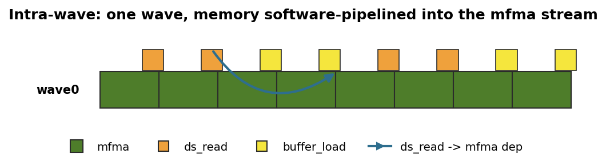
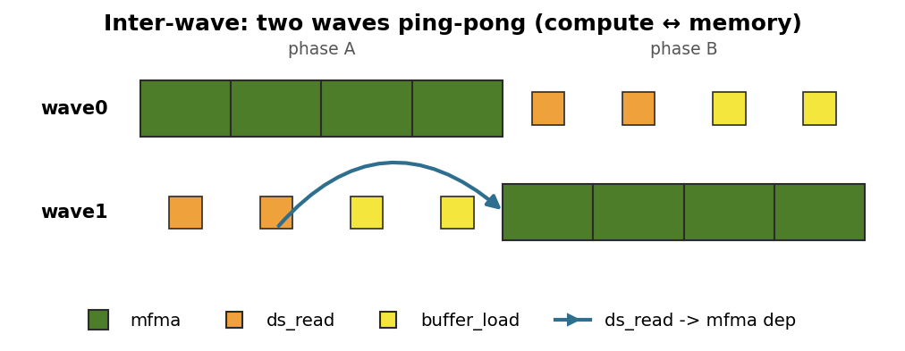
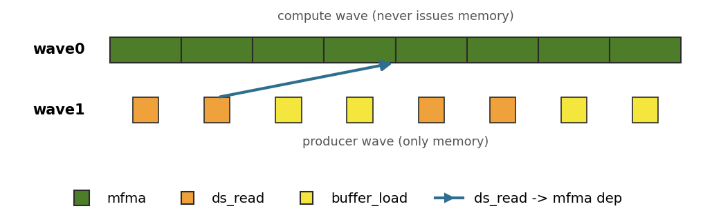
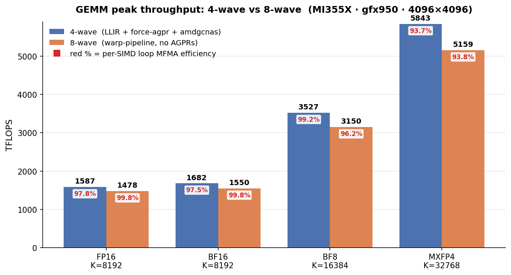

# GEMM Kernels in Gluon

This directory contains high-performance GEMM kernels written in Gluon for AMD MI350/355 (gfx950).

The objective of this repository is broader than implementing a fast GEMM.

It explores a fundamental systems question:

> **Where should scheduling intelligence live?**

Once memory hierarchy and tiling are optimized, peak GEMM performance depends on keeping the matrix unit issuing `mfma` every cycle while memory operations run concurrently. This tutorial frames that through three representative scheduling paradigms ([§1](#1-gpu-scheduling-models)); it implements and compares the two that gfx950 supports.

## 1. GPU scheduling models

On each SIMD, two kinds of instruction must issue: **memory instructions** — `buffer_load` (global → LDS) and `ds_read` (LDS → registers) — that *prepare* operands, and **tensor instructions** (`mfma`) that *compute* on them. They run on separate hardware pipes, so they can execute concurrently.

Memory **latency** is not the hard part — it is hidden by **prefetching** in the kernel design: a long-latency `buffer_load` is issued many stages ahead of the `mfma` that consumes its data, a quick `ds_read` only a few. Prefetch far enough ahead and the operands are always ready by the time an `mfma` runs.

The scheduling problem is therefore about **throughput, not latency**: how to keep the matrix pipe issuing an `mfma` on *every* cycle, so that the memory instructions the SIMD must also issue never open a bubble in the compute stream. Kernels differ in *which wave issues the memory, and when, relative to the compute*.

This tutorial focuses on three representative scheduling paradigms: **intra-wave** scheduling, **inter-wave** scheduling, and **warp specialization**. They differ in the granularity at which scheduling decisions are made — individual instructions, pipeline stages, or functional roles — and together they provide a useful framework for understanding many existing GPU kernel designs.

All three diagrams below model the same SIMD0 workload: **2 regions of 4 `mfma`** (8 `mfma` total); each region needs **2 `ds_read`** to stage its operands and issues **2 `buffer_load`** to prefetch later regions. A row is one wave's *issue timeline* — wide green = `mfma`, small orange/yellow = memory, and the arrow is the `ds_read → first mfma` dependency. Latencies are assumed fully hidden, so all three finish the 8 `mfma` in the same time; what differs is how each keeps the matrix pipe busy.

### 1.1 Intra-wave — one wave, software-pipelined



A **single wave per SIMD** does everything. Its one issue stream has to **weave** the `ds_read`/`buffer_load` in among the `mfma`, and — critically — issue the memory for a *future* region early enough that its latency is hidden behind the `mfma` executing now (the dependency arrow spans a full region). The matrix pipe stays busy only if that interleaving is created; nothing in the hardware does it automatically. Here the scheduling intelligence lives in the **compiler**: the LLIR scheduler recovers and preserves the interleaved schedule the Gluon kernel expresses.

This is the [`intra_wave/`](intra_wave/README.md) route (`a16w16` v0→v9, `a8w8`, `a4w4`): **one wave per SIMD**, compiler-interleaved.

### 1.2 Inter-wave — two waves ping-pong



Two waves share the SIMD and split the work evenly, running **phase-offset**: while `wave0` executes its 4-`mfma` region, `wave1` issues that region's `ds_read` + `buffer_load`; then they swap roles. Because at every instant *one* of the two waves is in its compute region, the SIMD's matrix pipe is never idle — the overlap is a property of the **ping-pong**, not of any within-wave instruction ordering. Each wave simply runs a compute block, then a memory block, so almost no compiler scheduling is required and these kernels build on stock upstream Triton + LLVM.

This is the [`inter_wave/`](inter_wave/README.md) route (`a16w16`, `a8w8`, `a4w4`): **two waves per SIMD**, driven by `warp_pipeline_stage`.

### 1.3 Warp specialization — dedicated producer + consumer waves



The third option splits waves by **role** rather than by tile: one **compute wave** issues *only* `mfma`, while a **producer wave** issues *only* `ds_read`/`buffer_load` and feeds the compute wave through LDS. The `ds_read → mfma` dependency now crosses *between* waves. This is the cleanest overlap of the three — the compute wave's matrix pipe is 100% busy with zero memory-issue overhead — but it needs a hardware **asynchronous-copy + cross-wave synchronization** primitive (NVIDIA's TMA plus named-barrier / warpgroup specialization on Hopper/Blackwell). **gfx950 has no such primitive**, so this repository does not implement warp specialization; it is shown to complete the design space and to frame what the two AMD-supported models are approximating.

---

Seen together, the three paradigms are less competing implementations of one idea than points on a spectrum of **where the scheduling decision is made** — and, correspondingly, how much of the work lands on the compiler versus the kernel structure. Intra-wave makes it at the level of individual instructions and leans hardest on the compiler; inter-wave lifts it to whole pipeline stages that two waves alternate; warp specialization raises it all the way to fixed per-wave roles. The same progression, side by side:

| Model | Scheduling unit | Compiler involvement |
|---|---|---|
| **Intra-wave** | Individual instructions | **Very high** |
| **Inter-wave** | Pipeline stages | **Medium** |
| **Warp specialization** | Functional roles | **Low** |

The larger question this repository asks is **where the scheduling intelligence should live** — pushed into the compiler (intra-wave) or expressed directly in the kernel's wave structure (inter-wave). Both reach near-peak MFMA utilization on gfx950 by different means.

## 2. Directory Structure

```
gemm/
├── utils/                                # shared Gluon device helpers (get_pids), used by both routes
├── intra_wave/                            # 4-wave — compiler interleaves MFMA + loads (LLIR sched + force-agpr + amdgcnas)
│   ├── a16w16/                            # FP16/BF16 — the v0→v9 optimization journey (start here)
│   │   ├── v0_naive/                      #   baseline: explicit layouts, correctness-first
│   │   ├── v1_buffer_load/                #   buffer_load for hardware OOB (branch elimination)
│   │   ├── v2_async_copy/                 #   direct-to-LDS async copy
│   │   ├── v3_lds/                        #   LDS layout design: swizzle vs padding
│   │   ├── v4_global_prefetch/            #   2-stage pipeline (double buffering)
│   │   ├── v5_local_prefetch/             #   3-stage pipeline + LLIR scheduler
│   │   ├── v6_loop_unroll/                #   loop unrolling
│   │   ├── v7_sliceN/                     #   N-slicing (register pressure)
│   │   ├── v8_sliceMN/                    #   M+N slicing
│   │   └── v9_beyond_hotloop/             #   XCD-aware PID remapping (L2 locality)
│   ├── a8w8/                              # BF8 (e5m2) — single kernel (no version subdirs)
│   └── a4w4/                              # MXFP4 (e2m1) — adds the per-group scale pipeline
│       ├── v0_sliceN/                     #   N-slicing + LDS round-trip scales
│       └── v1_sliceMN/                    #   M+N slicing + direct-to-LDS scales
└── inter_wave/                            # 8-wave — two waves ping-pong (warp_pipeline_stage, no AGPRs)
    ├── a16w16/                            # FP16/BF16 — 8-wave warp-pipeline (sliceMN, BLOCK_K=64) — single kernel
    ├── a8w8/                              # BF8 — 8-wave warp-pipeline (sliceMN, BLOCK_K=128) — single kernel
    └── a4w4/                              # MXFP4 — 8-wave warp-pipeline
        ├── v0_sliceMN/          #   byte-shuffle B scale (baseline)
        ├── v1_combineBsc/       #   combined transpose-read B scale
        └── v2_mfma32x32x64/     #   32×32×64 MFMA + conflict-free LDS layout (recommended)
```

## 3. Performance Summary

Measured on a single MI355X (gfx950), `rocm-smi` GPU[7], Triton built from the [`gfx950-tutorial-v2.1`](https://github.com/triton-lang/triton/releases/tag/gfx950-tutorial-v2.1) tag, rocprof
cold-rotating (1000 dispatches, last-100 average). The **4-wave** kernels run with the LLIR
scheduler + force-agpr + amdgcnas (see [`intra_wave/README.md §2.1`](intra_wave/README.md#21-triton-build-and-the-out-of-tree-plugins)); the
**8-wave** kernels run `warp_pipeline_stage` with no AGPRs (no env vars — see [`inter_wave/README.md`](inter_wave/README.md)).



Bars are peak TFLOPS at each precision's headline shape (FP16/BF16 K=8192, BF8 K=16384, MXFP4 K=32768); the **red** label inside each bar is the per-SIMD loop MFMA efficiency. The 4-wave bars are `intra_wave` (a16w16 v9, a8w8, a4w4 v1); the 8-wave bars are `inter_wave` (a16w16, a8w8, a4w4 v1). The MXFP4 8-wave bar is **v2** (32×32×64 MFMA, 5159 TFLOPS / 93.8% MFMA), which overtook **v1** (4885 / 75.1%) on this pin — each bar is its route's best variant at that shape.

> [!NOTE]
> The **4-wave** bars are the `gfx950-tutorial-v2.1`-build numbers from
> `scripts/run_perf_table.py --rocprof` (1000 dispatches, last-100 average). The **8-wave** bars
> come from `scripts/collect_perf.py`, whose MFMA efficiency is the ATT per-SIMD loop-only figure
> (2 waves/SIMD → per-wave fraction × 2).
> Numbers vary run to run (GPU clock) and across MI350-class parts / ROCm / Triton versions. The
> FP16 optimization journey's near-optimal headline (1587 TFLOPS on `gfx950-tutorial-v2.1`) is
> documented in [`a16w16/`](intra_wave/a16w16/).

The 4-wave kernels require the [LLIR Scheduler](../../plugins/llir_scheduler/README.md) and [amdgcnas](../../plugins/amdgcnas/README.md) plugins — build them and enable the stack per [`intra_wave/README.md §2.1`](intra_wave/README.md#21-triton-build-and-the-out-of-tree-plugins). The 8-wave kernels schedule themselves with `warp_pipeline_stage` (no plugins, no env vars).

## 4. ROCm

This tutorial assumes **ROCm ≥ 7.0**. The benchmarking and trace
collection scripts (`scripts/run_perf_table.py`, `scripts/run_att.py`,
`scripts/run_counter_collection.py`, `scripts/calc_kernel_time.py`) drive
`rocprofv3` from the ROCm 7.0 line; in particular they pass `-f csv`
where rocprofv3 7.0+ now defaults to a binary `.db` output, and
`scripts/install_att_decoder.sh` fetches the ROCm 7.0-style
`librocprof-trace-decoder.so` artifact. Earlier ROCm releases (notably
6.5) ship a different rocprofv3 with V2-style trace-decoder libraries
and different CLI defaults, and are not supported by these scripts.

## 5. Learning path

This repository is organized as both a tutorial and a comparison of two system designs.

For readers new to Gluon, we recommend the following path:

1. Start with [`intra_wave/a16w16/`](intra_wave/a16w16/) to learn the optimization journey from a naive GEMM to a near-peak implementation.
2. Continue with [`intra_wave/a8w8/`](intra_wave/a8w8/) and [`intra_wave/a4w4/`](intra_wave/a4w4/) to see how the same design extends to lower-precision kernels.
3. Continue with the [`inter_wave/`](inter_wave/README.md) kernels to compare an alternative scheduling model that reaches similar performance through a different system design.
4. Finally, read [`../attention/`](../attention/README.md), which builds on the `inter_wave` ping-pong and asks what happens when a *third* category of instruction — the softmax's vector math — competes for the same SIMD. It is where the intra-wave / inter-wave taxonomy above stops being a property of a kernel and becomes a property of a region.

Together, these kernels illustrate two complementary approaches to building high-performance GPU software: moving scheduling intelligence into the compiler, or expressing it directly in the kernel structure.
