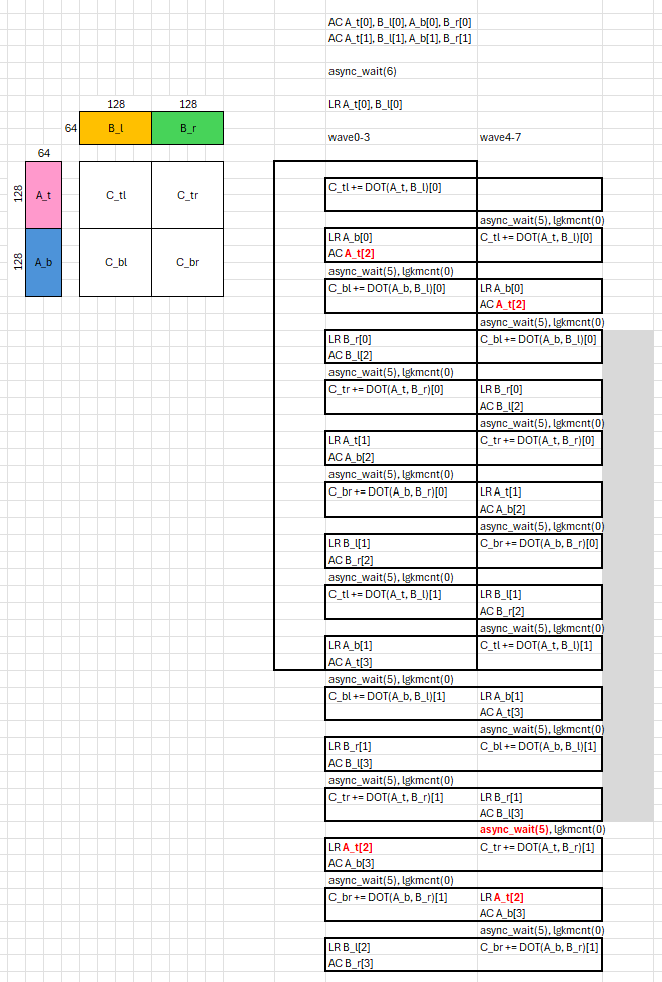

# v1_sliceMN_BK64_nS2 — 8-wave warp-pipeline, M/N-sliced (BLOCK_K=64, 2-buffer)

## 1. Directory Structure

```
v1_sliceMN_BK64_nS2/
├── matmul_kernel.py    # The kernel implementation
└── README.md           # This file
```

## 2. Motivation

[`v0_BK32_nS3`](../v0_BK32_nS3/README.md) drives a single 256×256 accumulator with a
BLOCK_K=32 triple-buffered ring, and uses **relaxed** local loads to dodge a
redundant LDS barrier (the membar analysis cannot disambiguate ring sub-buffers of
one allocation — see [v0 §3.1](../v0_BK32_nS3/README.md#31-relaxed-local_load-to-drop-a-redundant-lds-barrier)).

This version borrows the structure of the 4-wave [`a16w16/v8_sliceMN`](../../a16w16/v8_sliceMN/README.md):
slice the output tile into a **2×2 grid of [128×128] quadrants**, and give each
operand half-tile its **own** double-buffered LDS allocation. Two wins follow:

1. **No membar barrier, without relaxed loads.** Because `smemA_top`, `smemA_bot`,
   `smemB_left`, `smemB_right` are four *separate* allocations with distinct buffer
   IDs, the membar disambiguates LR vs AC by allocation — so the loads stay plain
   (non-relaxed) `smem.index().load()` and still carry no extra `s_barrier`.
2. **BLOCK_K=64 with only 2 buffers.** A larger K-step means more compute per
   async copy to hide its latency, and the four-region structure spreads the
   buffer loads across the K-step (the TCP-stall argument from
   [v8 §4](../../a16w16/v8_sliceMN/README.md#4-buffer-load-throughput-and-tcp-limitations)).

| | v0_BK32_nS3 | **v1_sliceMN_BK64_nS2** |
|---|---|---|
| Tile M×N×K | 256×256×32 | 256×256×**64** |
| LDS buffers | 3 (triple) | **2** (double) |
| LDS allocation | one `smemA[3]`/`smemB[3]` ring | **4 separate** per-quadrant allocs |
| local_load | relaxed (dodge membar) | **non-relaxed** (separate allocs) |
| K-unroll | 3× | 2× |

## 3. Loop structure

The output is split into four quadrants, each its own f32 accumulator:

```
acc_tl += DOT(A_top, B_left)     acc_tr += DOT(A_top, B_right)
acc_bl += DOT(A_bot, B_left)     acc_br += DOT(A_bot, B_right)
```

The loop is unrolled 2× → **8 mfma regions + 8 mem regions**. Each region is
wrapped in `warp_pipeline_stage`, with `cdna4_async.wait_group(5)` placed **before**
the mfma region (so the async copy whose data the upcoming load needs is drained
ahead of use, and the wait sits at an empty stage-cluster boundary so
`WarpPipeliner` accepts it):

```
cdna4_async.wait_group(5)
with warp_pipeline_stage("mfma", priority=0):
    acc_X = mfma(operand_a, operand_b, acc_X)
with warp_pipeline_stage("mem", priority=1):
    operand = smem.index(buf).load(dotOp)      # LR for the next region
    cdna4_async.buffer_load_to_shared(...)     # AC refills this buffer
    cdna4_async.commit_group()
```

The 8-wave global-load layouts are the 4-wave `v9` layouts with **one extra warp
dimension** (tiling M for A, N for B, since `warpsPerCTA=[2,4]` = 8 warps); the
shared / dot-operand / MFMA layouts are reused unchanged. B is pre-transposed to
`(N, K)` and fed as a logical `(K, N)` operand via strides, so K is contiguous for
the async copy.

<table>
<tr>
<td></td>
<td>

The 8 mfma regions and 8 mem regions are interleaved across the two co-resident wave
groups (**ping-pong**) via `warp_pipeline_stage`: one wave group's MFMAs issue while the
other group's loads are in flight, then they swap. Each region's `wait_group(5)` drains
the async copy whose data the upcoming load needs, so the load → MFMA dependency is
satisfied without stalling the issue pipe. The figure (left) shows the full unrolled
schedule — 8 mfma / 8 mem regions over the four quadrants × 2 buffers.

</td>
</tr>
</table>

## 4. Epilogue: register pressure and the spill fix

At 8 waves there are **2 waves/SIMD**, so the per-wave budget is 256 VGPR. The
four live f32 `[128×128]` accumulators alone are 128 VGPR; with the dot operands
(~96) and the store machinery, the **epilogue** (not the loop) overflowed and
spilled the accumulators to scratch — 67 spills, a 32,240-cycle epilogue (~11% of
the kernel at K=8192). The loop body itself never spills (it runs at ~99.8% MFMA).

Two kernel-side changes bring spills to **0**:

1. **Store-side pointer-walk.** All four quadrants have identical internal
   structure, so they share **one** within-quadrant offset tensor plus four
   **scalar** base pointers (`c_tl/bl/tr/br_base = c_base + const`), instead of
   four full `[128×128]` offset tensors (~32 VGPR each).
2. **De-interleave the epilogue.** Finish all four final mfmas *before* the
   convert+store phase. This lets the dot operands die first, so only the four
   accumulators (+ one in-flight `convert_layout`) are live during the stores.

> [!NOTE]
> The store downcasts f32→f16 (`v_cvt_pk_f16_f32`) **before** `convert_layout`, so
> the layout shuffle through LDS already moves f16, not f32. The remaining
> ~16,660-cycle epilogue is the inherent `convert_layout` LDS round-trip
> (`mfmaLayout → BlockedLayout`) plus the stores.

## 5. Performance

MI350X, gfx950, 4096×4096×8192, fp16, no-AGPR:

| Metric | Value |
|---|---|
| Correctness vs torch | ✅ PASS (K 512…16384, fp16 + bf16) |
| rocprof TFLOPS (cold, rotating) | **~1039** (v0: ~912) |
| MFMA efficiency (per-SIMD), loop-only | **~99.8%** |
| MFMA efficiency (per-SIMD), whole-kernel | ~94% |
| VGPRs / spills | 242 / **0** |

> [!IMPORTANT]
> `collect_perf.py` reports the **loop-only** MFMA efficiency (per-wave fraction ×
> 2 waves/SIMD). The loop is genuinely MFMA-bound at ~99.8%, but the prologue and
> the convert/store epilogue carry no MFMA, so the *whole-kernel* figure is ~94%
> at K=8192 (and improves with K as the epilogue amortizes). The epilogue is the
> main remaining lever — most of it is the `convert_layout` LDS round-trip.

```bash
# correctness + do_bench TFLOPS
TRITON_HIP_AGPR_ALLOC="0,0" python ../bench.py --version 1 --K 8192 --dtype fp16

# rocprof cold-rotating TFLOPS + MFMA efficiency (ATT) + VGPR/spill
TRITON_HIP_AGPR_ALLOC="0,0" python ../collect_perf.py --version 1 --K 8192 --dtype fp16
```
