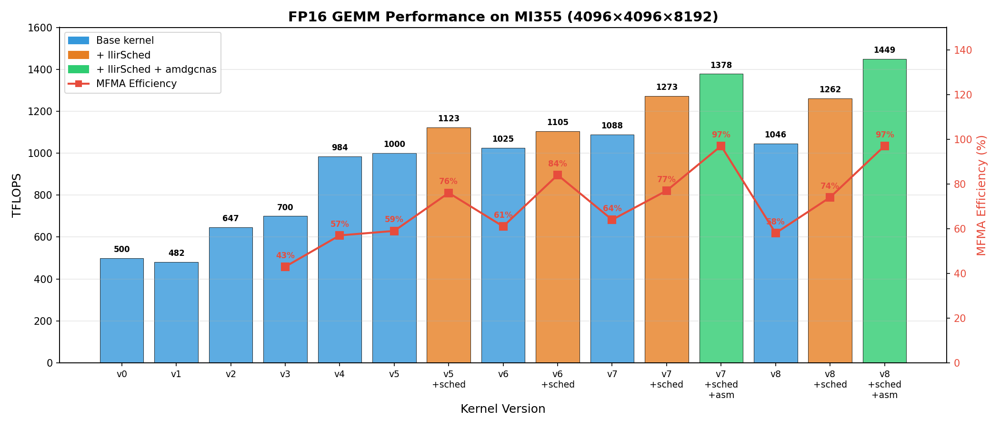

# FP16 GEMM Kernel Optimization on AMD GFX9 (Gluon)

This directory presents a **step-by-step optimization journey of an FP16 GEMM kernel written in Gluon**, targeting **AMD GFX9 GPUs**.

Rather than showing a single "final" kernel, this repository documents **how high performance is achieved**—from a naive baseline to a near-optimal design—covering **memory movement, layout design, latency hiding, and instruction scheduling** along the way.

If you are familiar with Triton, think of this as:

> [!IMPORTANT]
> Learning Gluon by learning layouts, pipelines, and hardware behavior.

## 1. Directory Structure

```
a16w16/
├── bench.py              # Benchmark and correctness test
├── images/               # Layout visualizations
├── v0_naive/             # Baseline kernel
├── v1_buffer_load/       # Buffer operations
├── v2_async_copy/        # Async copy to LDS
├── v3_lds/               # LDS performance tuning
├── v4_global_prefetch/   # 2-stage pipeline
├── v5_local_prefetch/    # 3-stage pipeline
├── v6_loop_unroll/       # Hot loop finalization
├── v7_slice/             # Sliced loads and stores
└── v8_beyond_hotloop/    # Kernel-level optimization
```

## 2. How to Run

From the `a16w16` directory:

```bash
# Edit bench.py to select the kernel version to test
# Change the import line, e.g.:
# from v0_naive.matmul_kernel import matmul

python bench.py
```

This runs correctness checks against torch.matmul and reports TFLOPS.

To run a specific shape and data type:

```bash
python bench.py --K 8192 --dtype fp16
```

## 3. What This Repository Is

- A **progressive sequence of GEMM kernels** (`v0` → `v8`)
- Each version introduces **one core optimization concept**
- A focus on **analysis-driven performance engineering**
- Deep coverage of AMD-specific features: MFMA, LDS, buffer operations, async copy, software pipelining

This is a **learning-oriented** repository, not a black-box kernel drop.

## 4. Optimization Philosophy

Writing a Gluon kernel is only the starting point. Real performance comes from:

- **Codegen quality** (instruction count, register pressure)
- **Latency hiding** (overlapping memory and compute)
- **Instruction scheduling** (MFMA utilization inside the hot loop)
- **Kernel-level effects** (epilogues, cache locality, PID mapping)

Every intermediate kernel version is kept intentionally, so readers can see *what changed*, *why it matters*, and *how it affects hardware execution*.

## 5. Kernel Versions

Each version introduces **one new idea** and builds on the previous one.

| Version | Name | Focus | Key Changes |
|---------|------|-------|-------------|
| v0 | naive | Baseline | Global loads only, no prefetching, no latency hiding |
| v1 | buffer_load | Codegen | Replace `global_load` with `buffer_load` |
| v2 | async_copy | Codegen | Async copy directly to LDS, eliminates register→LDS path |
| v3 | lds | Codegen | LDS vectorization, addressing, issue vs execution latency |
| v4 | global_prefetch | Latency hiding | 2-stage pipeline, software pipelining for global memory |
| v5 | local_prefetch | Latency hiding | 3-stage pipeline, partial prefetch, op-level scheduling |
| v6 | loop_unroll | Codegen | Unroll K loop, remove register copy overhead |
| v7 | slice | Register pressure | Sliced B matrix loads, sliced epilogue stores |
| v8 | beyond_hotloop | Kernel-level | PID remapping, workgroup swizzling, interleaved epilogue |

## 6. Performance Results

Measured on MI355 with shape 4096×4096×8192, FP16:



| Version | TFLOPS | VGPRs | MFMA Eff. | Notes                      |
|---------|--------|-------|-----------|----------------------------|
| v0      |    524 |     — |       25% | Baseline                   |
| v1      |    514 |     — |       24% |                            |
| v2      |    697 |     — |       36% |                            |
| v3      |    774 |   420 |       42% |                            |
| v4      |   1113 |   446 |       57% |                            |
| v5      |   1134 |   452 |       59% |                            |
| v5      |   1283 |   510 |       76% | + llirSched                |
| v6      |   1088 |   512 |       61% | 3 spills                   |
| v6      |   1260 |   500 |       88% | + llirSched                |
| v7      |   1279 |   496 |       65% |                            |
| v7      |   1411 |   512 |       79% | + llirSched                |
| v7      |   1523 |   460 |       98% | + llirSched + amdgcnas     |
| v8      |   1336 |   466 |       67% |                            |
| v8      |   1470 |   512 |       77% | + llirSched, 4 spills      |
| v8      |   1610 |     — |       99% | + llirSched + amdgcnas     |

Performance is measured and explained using:

- Microbenchmarking for throughput
- `rocprofv3` traces for cycle-level analysis
- A custom trace tool to compute **MFMA efficiency**

Reference slides and talks are linked where deeper background is helpful.

## 7. Beyond FP16

Although this directory focuses on **FP16 compute-bound GEMM**, the same strategy applies to lower precision:

| Data Type | Tile Size |
|-----------|-----------|
| 16-bit | 256 × 256 × 64 |
| 8-bit | 256 × 256 × 128 |
| 4-bit | 256 × 256 × 256 |

The optimization journey remains the same—only the tile shape changes.

## 8. How to Read This

Recommended order:

1. Start with `v0_naive`
2. Progress version by version
3. Read code and accompanying explanations together
4. Use traces and layout visualizations when available

If you only want the fastest kernel, jump to the last version. If you want to understand **why** it is fast, start from the beginning.
