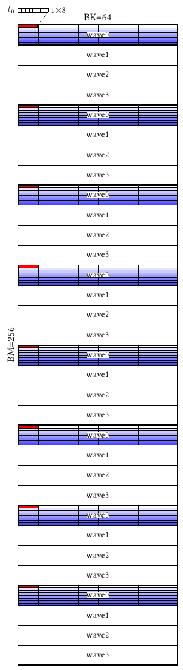
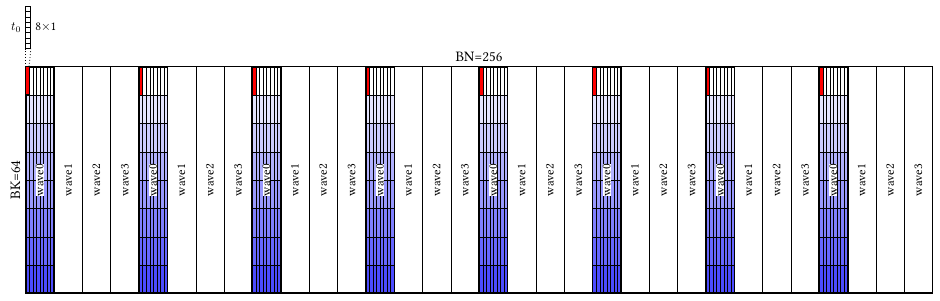
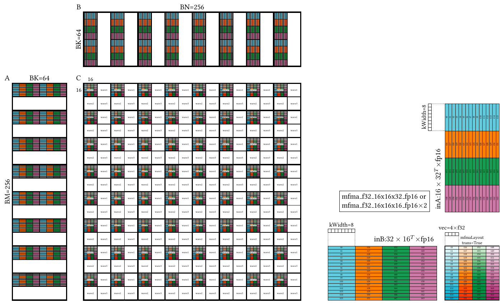

# v0_naive — Correctness First

This is the very first GEMM kernel in the FP16 optimization journey.

At this stage, the goal is not performance. The goal is to produce a **correct MFMA-based GEMM kernel** and to make all Gluon-specific concepts explicit. This version serves as a reference point for everything that follows.

If you are new to Gluon, this kernel answers a simple question:

> What does a correct GEMM kernel look like when nothing is hidden?

## 1. Directory Structure

```
v0_naive/
├── matmul_kernel.py      # The kernel implementation
├── README.md             # This file
└── ir_dump_K4096_fp16/   # IR dumps for analysis
```

## 2. Overview

The kernel implements a compute-bound FP16 GEMM using MFMA and produces correct results for all supported problem sizes. It intentionally avoids prefetching, pipelining, or latency hiding. As a result, performance is expected to be poor. That is by design—this version exists so that future optimizations have a solid and understandable baseline.

Structurally, this kernel is very close to the standard Triton GEMM tutorial. The important differences are not in control flow, but in **how data is described and moved**.

All data movement in this kernel uses **explicit layouts**. Global loads for operands A and B specify their layouts directly. The dot operation uses explicitly defined layouts for both operands and for the result tensor. Whenever the required layout changes, an explicit `convert_layout` operation is inserted.

In addition, the dot operation is written using `gl.amd.cdna3.mfma()` directly, rather than relying on a higher-level abstraction.

With the exception of this explicit MFMA usage, all differences from Triton come down to one idea:

> [!IMPORTANT]
> Learning Gluon kernels is learning layouts.

This kernel makes that idea concrete.

## 3. Code Walkthrough

### 3.1 Tile Configuration

The kernel uses a 256×256 output tile with K=64 reduction blocks:

```python
BLOCK_M, BLOCK_N, BLOCK_K = 256, 256, 64
num_warps = 4
```

### 3.2 Global Load Layouts

Each operand defines a blocked layout for global memory loads:

```python
gLoadLayoutA: gl.constexpr = gl.BlockedLayout(
    [1, 8],   # sizePerThread: each thread loads 1 row × 8 cols
    [8, 8],   # threadsPerWarp: 8×8 = 64 threads per warp
    [4, 1],   # warpsPerCTA: 4 warps along M, 1 along K
    [1, 0],   # order: K dimension is contiguous (column-major)
)
```

The layout for B mirrors this but transposed.

### 3.3 MFMA Layout

The accumulator and dot operation use an explicit MFMA layout:

```python
mfmaLayout: gl.constexpr = gl.amd.AMDMFMALayout(
    version=4,
    instr_shape=[16, 16, 32],  # MFMA_F16_16x16x32
    transposed=True,
    warps_per_cta=[2, 2]       # 2×2 = 4 warps
)
```

### 3.4 Layout Conversion

Operands must be converted from blocked layout to dot operand layout before MFMA:

```python
dotOpLayoutA: gl.constexpr = gl.DotOperandLayout(
    operand_index=0, parent=mfmaLayout, k_width=8
)

# In the loop:
ga = gl.load(a_ptrs, ...)
a = gl.convert_layout(ga, layout=dotOpLayoutA)  # Blocked → DotOperand
acc = gl.amd.cdna3.mfma(a, b, acc)
```

### 3.5 Main Loop

The K-loop is straightforward with no prefetching:

```python
for k in range(0, gl.cdiv(K, BLOCK_K)):
    ga = gl.load(a_ptrs, mask=..., other=0.0)
    gb = gl.load(b_ptrs, mask=..., other=0.0)
    a = gl.convert_layout(ga, layout=dotOpLayoutA)
    b = gl.convert_layout(gb, layout=dotOpLayoutB)
    acc = gl.amd.cdna3.mfma(a, b, acc)
    a_ptrs += BLOCK_K * stride_ak
    b_ptrs += BLOCK_K * stride_bk
```

This is the simplest possible implementation: load, convert, compute, repeat.

## 4. Layouts and Visualization

This README does not attempt to explain layout definitions in detail. If you are coming from Triton, the best introduction to bespoke layouts is Lei's blog post:

https://www.lei.chat/posts/triton-bespoke-layouts/

That post explains the *what* and the *why*. What this tutorial adds is a way to **see layouts directly** and connect them to MFMA execution.

To make layouts tangible, this repository includes a layout plotting tool. Instead of reasoning about layouts abstractly, you can render them and inspect how work is distributed across threads, warps, and MFMA instructions.

For this kernel, the following commands were used to generate the layout visualizations.

**Operand A (Blocked Layout):**



<details>
<summary>Command to generate</summary>

```bash
python3 plot_layout.py blocked \
  -b 256 64 \
  --rowName BM \
  --colName BK \
  --sizePerThread 1 8 \
  --threadsPerWarp 8 8 \
  --warpsPerCTA 4 1 \
  --order 1 0 \
  --output v0_naive_blocked-layout-A
```
</details>

**Operand B (Blocked Layout):**



<details>
<summary>Command to generate</summary>

```bash
python3 plot_layout.py blocked \
  -b 64 256 \
  --rowName BK \
  --colName BN \
  --sizePerThread 8 1 \
  --threadsPerWarp 8 8 \
  --warpsPerCTA 1 4 \
  --order 0 1 \
  --output v0_naive_blocked-layout-B
```
</details>

**Dot Operation Layout (MFMA):**



<details>
<summary>Command to generate</summary>

```bash
python3 plot_layout.py dot \
  --gfx 950 \
  --dotShape 256 256 64 \
  --warpsPerCTA 2 2 \
  --dtypeA fp16 \
  --dtypeB fp16 \
  --mfmaTrans \
  --output v0_naive_dot
```
</details>

This final visualization is particularly important. It shows the layouts of both dot operands, the resulting MFMA layout, and a zoomed-in view of a single MFMA instruction. Together, these views reveal how operand layouts map onto MFMA execution and how results are produced.

The layout plot tool is more than a convenience utility. It reflects a core idea behind Gluon:

> [!IMPORTANT]
> Layouts are not static properties of individual tensors.
> They are part of the lowering process and define how operations connect.

Understanding the relationship between operand layouts and result layouts is essential for writing efficient Gluon kernels. This tool makes those relationships visible.

## 5. What Comes Next

In this version, performance is not analyzed. There is no codegen inspection, no profiling, and no attempt to hide latency. That changes in the next version.

In `v1_buffer_load`, we will start looking at the generated code. A specific codegen issue will be identified and fixed using buffer operations. This marks the beginning of performance-driven kernel development.

The optimization journey starts there.
