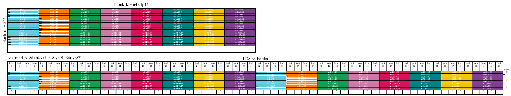
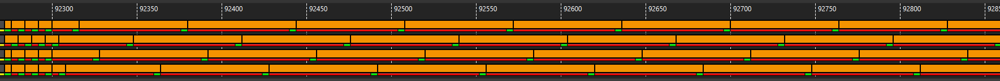
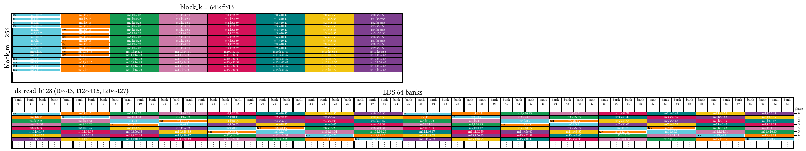
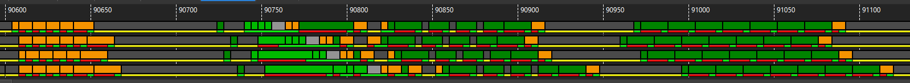
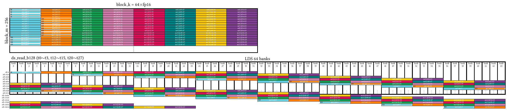
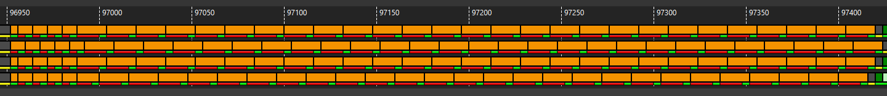

# v3_lds — Designing and Evaluating LDS Data Layouts

> [!NOTE]
> **Prerequisites:** This tutorial assumes familiarity with `ds_read` throughput concepts.
> Before proceeding, read [Understanding ds_read Throughput](../../../../docs/lds_throughput.md).

## 1. Directory Structure

```
v3_lds/
├── matmul_kernel.py      # The kernel implementation
├── README.md             # This file
└── ir_dump_K4096_fp16/   # IR dumps for analysis
    ├── no_swizzling/
    ├── swizzling_8-2-8/
    └── padding_512-16/
```

## 2. Motivation: How Do We Evaluate ds_read Performance?

In this version of the kernel, our goal is not to optimize the entire GEMM.
Instead, we focus on a narrower but fundamental question:

> [!IMPORTANT]
> How should we design LDS data layout so that `ds_read` achieves good performance?

To answer this question rigorously, we must first establish how `ds_read` performance should be evaluated.

From the [LDS throughput tutorial](../../../../docs/lds_throughput.md),
we know that steady-state issue latency of `ds_read_b128` reflects the effective service rate of the LDS system.
In an ideal, bank-conflict-free scenario, `ds_read_b128` issues every 16 cycles with 4 waves per CU.

> [!TIP]
> If we observe 32 cycles, that implies 2-way bank conflicts.
> If we observe 64 cycles, that implies 4-way conflicts.
> Throughput directly exposes bank behavior.

This immediately tells us something important:

LDS data layout is not just a storage detail.
It determines the mapping from logical tensor coordinates (row, col) to physical LDS offsets.
When this mapping is composed with the access pattern of threads — i.e., which thread reads which tensor element —
it produces a final mapping from (thread_id, wave_id) to LDS offset.
This final mapping determines which LDS bank each thread hits.

> [!NOTE]
> Bank conflicts are therefore not accidental.
> They are a direct consequence of layout design.

But bank conflicts are only half of the story.

In Triton/Gluon, we write kernels at the block (tensor) level.
A tensor tile is loaded via many `ds_read` instructions.
Evaluating a single instruction in isolation misses the bigger picture.
We must instead evaluate all `ds_read` instructions that load a tensor tile.

Ideally, all of those instructions should share a single base VGPR and use different offsets.
If multiple base VGPRs are required, register pressure increases.
Even if that does not immediately reduce performance, it signals that the layout may not be ideal.

This block-level evaluation mindset is critical.

> [!NOTE]
> We are not optimizing a single `ds_read`.
> We are designing a tensor-level access strategy.

Therefore, in this kernel, we evaluate LDS layouts using two criteria:
1. **Bank conflicts**, revealed through steady-state `ds_read` throughput.
2. **Base VGPR usage** across all `ds_read` instructions for the tensor.

With this foundation, we now examine three different LDS layouts.

## 3. Three LDS Layouts: Design and Evaluation

We evaluate three layouts in increasing sophistication:

- Raw (no swizzling, no padding)
- Swizzling
- Padding (padded shared layout)

Throughout this section, we connect observations back to the
[LDS throughput model](../../../../docs/lds_throughput.md) and use the layout plotting tool to visualize behavior.

### 3.1 Raw Layout (No Swizzling, No Padding)

The raw layout preserves a simple linear mapping from (row, col) to LDS offsets. It is conceptually straightforward and easy to reason about.

**Layout visualization for operand A (256x64):**



<details>
<summary>Command to generate</summary>

```bash
python3 plot_layout.py lds \
  --gfx 950 \
  --tensorShape 256 64 \
  --kWidth 8 \
  --nonKDim 16 \
  --layout none \
  --access read \
  --swizzleVec 8 \
  --output v3_lds_no-swizzling
```
</details>

**ATTViewer thread trace:**



From the plot — or from ATTViewer thread traces — we observe that each `ds_read_b128` experiences 4-way bank conflicts.

However, from the VGPR perspective, the raw layout performs well.
All `ds_read` instructions for the tensor share a single base VGPR.
Threads access vectors linearly along K, and the distance between vectors remains constant. Offsets suffice.

**Summary:** The raw layout is simple and register-efficient but suffers from severe bank conflicts.

### 3.2 Swizzling

Swizzling rearranges data in LDS to redistribute accesses across banks and eliminate conflicts.
The details are explained in [Lei's blog](https://www.lei.chat/posts/triton-bespoke-layouts/#swizzled-shared-layout) and [related documentation](https://amd.atlassian.net/wiki/spaces/MLSE/pages/744193312/Triton+Layout+Introduction).

**Layout visualization with swizzling:**



<details>
<summary>Command to generate</summary>

```bash
python3 plot_layout.py lds \
  --gfx 950 \
  --tensorShape 256 64 \
  --kWidth 8 \
  --nonKDim 16 \
  --layout swizzle \
  --access read \
  --swizzleVec 8 \
  --output v3_lds_swizzling
```
</details>

**ATTViewer thread trace:**



From thread traces, we observe that ds_read_b128 now issues every 16 cycles in steady state. Bank conflicts are eliminated.

However, this improvement introduces a new cost.
Because the swizzling transformation depends on column indices,
the distance between vectors along K is no longer constant across threads.
As a result, multiple base VGPRs are required for the tensor.

This increases register pressure.

Additionally, swizzling introduces overhead on the global-load side due to
hardware constraints in async copy instructions (check [Lei's blog](https://www.lei.chat/posts/triton-bespoke-layouts/#rationale) for more details).
For example, `ds_bpermute` is used for address calculation in [generated assembly](./ir_dump_K4096_fp16/swizzling_8-2-8/v3_lds_swizzling.s#L427).

**Summary:** Swizzling trades bank conflicts for increased complexity and register usage.

### 3.3 Padding (Padded Shared Layout)

Padding modifies the LDS layout to eliminate bank conflicts while preserving linearity in access patterns.
It achieves redistribution across banks without breaking offset regularity.
Details can be found at [Lei's blog](https://www.lei.chat/posts/triton-bespoke-layouts/#padded-shared-layout).

**Layout visualization with padding:**



<details>
<summary>Command to generate</summary>

```bash
python3 plot_layout.py lds \
  --gfx 950 \
  --tensorShape 256 64 \
  --kWidth 8 \
  --nonKDim 16 \
  --layout padding \
  --access read \
  --swizzleVec 8 \
  --sharedLayout "[[512, 16]], [[0, 1], [0, 2], [0, 4], [0, 8], [0, 16], [0, 32], [16, 0],[32, 0], [64, 0], [1, 0], [2, 0], [4, 0], [8, 0], [128, 0]]" \
  --dtype fp16 \
  --output v3_lds_padding_512-16
```
</details>

Note that the layout plot tool can take the shared layout as-is :sunglasses:

**ATTViewer thread trace:**



Thread traces confirm that `ds_read_b128` returns to 16-cycle steady-state issue latency, indicating no bank conflicts.

Unlike swizzling, padding preserves constant vector distance along rows.
As a result, all `ds_read` instructions for the tensor share a single base VGPR.

**Summary:** Padding achieves both conflict-free access and minimal base VGPR usage. From the evaluation criteria established in Section 2, padding is the most balanced design among the three.

More importantly, this section demonstrates a systematic workflow:

- Design a candidate layout.
- Visualize bank mapping using the plotting tool.
- Confirm steady-state throughput via thread trace.
- Evaluate base VGPR usage at the tensor level.
- Compare trade-offs holistically.

This is the intended design methodology.

## 4. Subtleties and Practical Considerations

Three additional subtleties are worth mentioning.

### 4.1 `ds_read` Offset Encoding

The `ds_read` instruction encodes offsets using 16 bits.
The maximum offset is therefore 65535 bytes.
If a required vector lies beyond this distance from the base address, a new base VGPR must be introduced.
While rare, this constraint can influence layout decisions for large tiles.

### 4.2 LLVM Scheduling

LLVM scheduling behavior differs across layouts.
In the raw ([code](./ir_dump_K4096_fp16/no_swizzling/v3_lds_swizzling.s#L476-L507)) and
padding ([code](./ir_dump_K4096_fp16/padding_512-16/v3_lds_padding.s#L483-L514)) cases,
all 32 `ds_read_b128` instructions are issued back-to-back.
In the swizzling ([code](./ir_dump_K4096_fp16/swizzling_8-2-8/v3_lds_swizzling.s#L559-L737)) case,
only the first few are consecutive, and the rest are interleaved with mfma.

We did not explicitly request rescheduling.
The difference arises from changes in generated IR and register dependencies, which trigger different LLVM heuristics.

> [!NOTE]
> LLVM scheduling triggers and heuristics are extremely complex and difficult to control from the Triton/Gluon side.
> Small structural differences can produce different scheduling decisions.

More importantly, we do not attempt to measure end-to-end performance in this version.
At the kernel level, there are still many improvements to be made
(e.g., local prefetching, deterministic scheduling control).
Therefore, we treat these scheduling differences as noise in this stage of exploration.

The purpose of this version is to understand layout behavior, not to finalize performance numbers.

### 4.3 Drawbacks of Padding

The padded shared layout is not entirely free of cost.
Its drawback is increased LDS usage due to padding.
On architectures such as gfx950, which provide 160 KB of LDS per CU,
this overhead is typically negligible and well worth the performance gain from eliminating bank conflicts
while preserving base VGPR efficiency.
However, on gfx942, where LDS capacity is limited to 64 KB,
padding can become a real constraint and may restrict tile size choices.
In those cases, layout design must balance bank conflict avoidance against total LDS footprint.
We will revisit gfx942-specific trade-offs and optimization strategies in a later chapter.

## 5. Summary

This kernel focuses on one central theme: LDS layout design must be evaluated systematically.

A good layout must:

- Avoid bank conflicts to preserve `ds_read` throughput.
- Minimize base VGPR usage across all ds_read instructions for a tensor.
- Respect instruction encoding constraints.
- Maintain structural clarity for future optimization.

By comparing raw, swizzling, and padding layouts under a unified evaluation framework,
we establish a clear design methodology.

Most importantly, this version reinforces a key mindset:

> [!IMPORTANT]
> Think at the tensor (block) level, not at the instruction level.

Once this mindset is adopted, layout design becomes less mysterious and more principled.

## 6. What Comes Next

In `v4_global_prefetch`, we introduce software pipelining with global data prefetch to hide memory latency.
