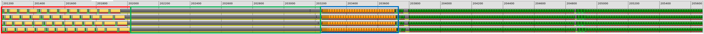
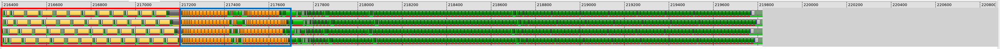

# v4_global_prefetch — Software Pipelining with Global Data Prefetch

## 1. Directory Structure

```
v4_global_prefetch/
├── matmul_kernel.py      # The kernel implementation
├── README.md             # This file
└── ir_dump_K4096_fp16/   # IR dumps for analysis
```

## 2. Motivation

In all previous versions, the main loop follows a simple sequential pattern:

```
for k in range(0, K // BLOCK_K):
    load A_tile, B_tile from global memory → LDS
    wait for load to complete
    load from LDS → registers
    compute MFMA
```

This structure has a fundamental inefficiency: **MFMA execution cannot begin until data arrives from global memory**. Global memory latency (hundreds of cycles) directly stalls compute.

> [!IMPORTANT]
> **Software pipelining** restructures the loop to overlap memory latency with computation. The key idea is to **prefetch the next iteration's data while computing on the current iteration's data**.

The simplest form is a 2-stage pipeline:
- Stage 0: Global memory → LDS (async copy)
- Stage 1: LDS → registers + MFMA compute

We use **double buffering** to implement this: while MFMA consumes data from one LDS buffer, async copy fills the other buffer with the next iteration's data.

## 3. Pipeline Design

This kernel implements a 2-stage software pipeline with the following structure:

```
Prologue:
    Async_Copy A0, B0 → buffer 0

Main Loop (iterMax - 1 iterations):
    Async_Copy A[k+1], B[k+1] → buffer g_idx      (prefetch next iteration)
    wait for buffer l_idx                  (wait for previous iteration's data)
    local_load A[k], B[k] ← buffer l_idx
    DOT(A[k], B[k])

Epilogue:
    wait for final buffer
    local_load A[last], B[last]
    DOT(A[last], B[last])
    store(acc)
```

Where `g_idx` and `l_idx` alternate between 0 and 1:
- `l_idx = k % 2` — buffer to consume (local load)
- `g_idx = 1 - l_idx` — buffer to fill (global prefetch)

### 3.1 Double Buffering

The key change from previous versions is allocating **two LDS buffers** instead of one:

```python
nBuffers: gl.constexpr = 2
smemA = gl.allocate_shared_memory(
    a_ptr.dtype.element_ty, [nBuffers, BLOCK_M, BLOCK_K], sharedLayoutA
)
smemB = gl.allocate_shared_memory(
    b_ptr.dtype.element_ty, [nBuffers, BLOCK_K, BLOCK_N], sharedLayoutB
)
```

The buffer dimension is added as the outermost axis, so `smemA.index(0)` and `smemA.index(1)` access the two separate buffers.

### 3.2 Prologue

Before entering the main loop, we issue the first async copy to fill buffer 0:

```python
## Prologue
g_idx = 0
gl.amd.cdna4.async_copy.buffer_load_to_shared(smemA.index(g_idx), a_base, a_offsets)
gl.amd.cdna4.async_copy.buffer_load_to_shared(smemB.index(g_idx), b_base, b_offsets)
gl.amd.cdna4.async_copy.commit_group()
a_base += BLOCK_K * stride_ak
b_base += BLOCK_K * stride_bk
```

### 3.3 Main Loop

Each iteration of the main loop:
1. Issues async copy for the **next** iteration's data
2. Waits for the **previous** iteration's async copy to complete
3. Loads from LDS and computes MFMA

```python
for k in range(0, iterMax - 1):
    l_idx = k % 2      # buffer to consume
    g_idx = 1 - l_idx  # buffer to fill

    # Prefetch next iteration's data
    gl.amd.cdna4.async_copy.buffer_load_to_shared(smemA.index(g_idx), a_base, a_offsets)
    gl.amd.cdna4.async_copy.buffer_load_to_shared(smemB.index(g_idx), b_base, b_offsets)
    gl.amd.cdna4.async_copy.commit_group()

    # Wait for previous iteration's data (1 group in flight)
    gl.amd.cdna4.async_copy.wait_group(1)

    # Consume from buffer l_idx
    a = gl.amd.cdna4.async_copy.load_shared_relaxed(smemA.index(l_idx), dotOpLayoutA)
    b = gl.amd.cdna4.async_copy.load_shared_relaxed(smemB.index(l_idx), dotOpLayoutB)
    acc = gl.amd.cdna3.mfma(a, b, acc)

    a_base += BLOCK_K * stride_ak
    b_base += BLOCK_K * stride_bk
```

> [!NOTE]
> `wait_group(1)` means "wait until at most 1 async copy group is still in flight." Since we just issued a new group for the next iteration, this effectively waits for all previous groups to complete.

### 3.4 Epilogue

After the loop, we process the final tile that was prefetched in the last loop iteration:

```python
## Epilogue
gl.amd.cdna4.async_copy.wait_group(0)  # Wait for all async copies
l_idx = (iterMax - 1) % 2
a = gl.amd.cdna4.async_copy.load_shared_relaxed(smemA.index(l_idx), dotOpLayoutA)
b = gl.amd.cdna4.async_copy.load_shared_relaxed(smemB.index(l_idx), dotOpLayoutB)
acc = gl.amd.cdna3.mfma(a, b, acc)
```

## 4. Performance Analysis

| Version            | TFLOPS | VGPRs | MFMA Eff. |
|--------------------|--------|-------|-----------|
| v3_lds             |    704 |   420 |       42% |
| v4_global_prefetch |    971 |   446 |       57% |

Software pipelining delivers a **38% performance improvement** (704 → 971 TFLOPS) by overlapping global memory latency with compute.

Performance is collected using:
```bash
python scripts/run_perf_table.py --kernel a16w16 --versions 3 4 --configs base --K 8192 --dtype fp16
```
This command can be run from anywhere in the repository. See [run_perf_table.py](../../../../scripts/README.md#run_perf_tablepy) for more details.

For an explanation of MFMA efficiency and how to measure it, see [MFMA Efficiency](../../../../docs/mfma_efficiency.md).

### 4.1. What Changed

Comparing the thread traces of v3 and v4 reveals the effect of software pipelining. Each screenshot shows one iteration of the main loop:





In v3 (top), there is a long waiting period between `buffer_load` and `ds_read`, marked by the **green rectangle**. This is the global memory latency that stalls the kernel — the kernel must wait for data to arrive from global memory before it can proceed.

In v4 (bottom), the waiting period is gone. By prefetching the next iteration's data while computing on the current iteration, the global memory latency is overlapped with useful work.

### 4.2. Bottleneck Analysis

Despite the improvement, MFMA efficiency is only 57%. Looking at the v4 trace above, MFMA executes only during the second half of the iteration.

At this point, latency hiding is working as expected:
- `buffer_load` latency (**red rectangle**) is hidden by global prefetch — the data was requested in the previous iteration
- `ds_read` latency (**blue rectangle**) is hidden by issuing multiple `ds_read` instructions back-to-back

However, latency hiding alone is not sufficient to achieve peak performance. The ultimate goal is to execute MFMA instructions throughout the entire loop iteration. This is clearly not the case — MFMA only runs in the second half.

The bottleneck is the dependency between `ds_read` and MFMA. While MFMA has no dependency on `buffer_load` (it does not wait for global loads), **MFMA must wait for `ds_read` to complete** because it consumes the data loaded from LDS into registers. This dependency prevents MFMA from starting until the `ds_read` results are ready.

> [!NOTE]
> For a deeper understanding of how to schedule `ds_read` and MFMA when they have dependencies, see David Tanner's talk on MFMA Ordering ([TR20241121](https://amd.atlassian.net/wiki/spaces/MLSE/pages/744185703/Presentation)).

## 5. What Comes Next

In `v5_local_prefetch`, we address this bottleneck by prefetching the LDS → register transfer. By issuing `ds_read` for the next iteration while the current iteration's MFMA is executing, we break the dependency between MFMA and `ds_read` within the same iteration, allowing MFMA to execute earlier and improving MFMA efficiency.
