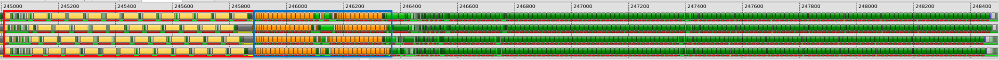
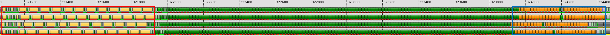
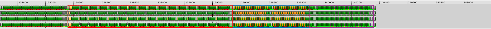

# v5_local_prefetch — 3-Stage Pipeline with Local Prefetch

## 1. Directory Structure

```
v5_local_prefetch/
├── matmul_kernel.py              # The kernel implementation
├── README.md                     # This file
├── ir_dump_K4096_fp16/           # IR dumps for analysis
└── ir_dump_K4096_fp16_llirSched/ # IR dumps with llirSched enabled
```

## 2. Motivation

In v4, we identified the bottleneck: MFMA must wait for `ds_read` to complete because it depends on data loaded from LDS to registers. This dependency prevents MFMA from starting at the beginning of each iteration.

> [!IMPORTANT]
> By issuing `ds_read` for the **next** iteration while the **current** iteration's MFMA is executing, we break the dependency between MFMA and `ds_read` within the same iteration.

This transforms the pipeline from 2 stages to 3 stages:
- Stage 0: Global memory → LDS (async copy)
- Stage 1: LDS → registers (ds_read / local load)
- Stage 2: MFMA compute

## 3. Pipeline Design

This kernel implements a 3-stage software pipeline:

```
Prologue:
    Async_Copy A0, B0 → buffer 0
    Async_Copy A1, B1 → buffer 1
    wait buffer 0
    local_load A0, B0 ← buffer 0

Main Loop (g_idx = k % 2, l_idx = 1 - g_idx):
    DOT(A[k], B[k])                        (consume prefetched data)
    wait buffer l_idx
    Async_Copy A[k+2], B[k+2] → buffer g_idx       (prefetch k+2)
    local_load A[k+1], B[k+1] ← buffer l_idx   (prefetch next for registers)

Epilogue:
    DOT(A[last-1], B[last-1])
    DOT(A[last], B[last])
    store(acc)
```

### 3.1 Key Difference from v4

In v4, each iteration looked like:
```
async_copy (next) → wait → ds_read → mfma
```

In v5, the structure becomes:
```
mfma (current) → wait → async_copy (next+1) → ds_read (next)
```

The critical change is that **MFMA executes first** using data that was prefetched in the previous iteration. Meanwhile, `ds_read` loads data for the *next* iteration. This decouples MFMA from the `ds_read` in the same iteration.

### 3.2 Prologue

The prologue now issues two async copies and one local load to prime the pipeline:

```python
## Prologue
## Async_Copy A0, B0 --> buffer 0
g_idx = 0
gl.amd.cdna4.async_copy.buffer_load_to_shared(smemA.index(g_idx), a_base, a_offsets)
gl.amd.cdna4.async_copy.buffer_load_to_shared(smemB.index(g_idx), b_base, b_offsets)
gl.amd.cdna4.async_copy.commit_group()

## Async_Copy A1, B1 --> buffer 1
g_idx = 1
gl.amd.cdna4.async_copy.buffer_load_to_shared(smemA.index(g_idx), a_base, a_offsets)
gl.amd.cdna4.async_copy.buffer_load_to_shared(smemB.index(g_idx), b_base, b_offsets)
gl.amd.cdna4.async_copy.commit_group()

## wait buffer 0, local_load A0, B0
gl.amd.cdna4.async_copy.wait_group(1)
l_idx = 0
a = gl.amd.cdna4.async_copy.load_shared_relaxed(smemA.index(l_idx), dotOpLayoutA)
b = gl.amd.cdna4.async_copy.load_shared_relaxed(smemB.index(l_idx), dotOpLayoutB)
```

### 3.3 Main Loop

In the main loop, three independent operations happen in parallel:
1. **MFMA** computes with data from buffer `g_idx` (loaded in previous iteration)
2. **Async copy** prefetches data for iteration `k+2` into buffer `g_idx`
3. **Local load** prefetches data for iteration `k+1` from buffer `l_idx`

> [!NOTE]
> Although MFMA computes with data from buffer `g_idx` while async copy fills the same buffer `g_idx`, there is no conflict. This is because the data required by MFMA has already been read out of buffer `g_idx` and placed into registers by the `local_load` in the previous iteration.

```python
for k in range(0, iterMax - 1):
    g_idx = k % 2
    l_idx = 1 - g_idx

    acc = gl.amd.cdna3.mfma(a, b, acc)  # Use prefetched data

    gl.amd.cdna4.async_copy.wait_group(0)

    # Async copy for k+2 (masked on last iteration)
    gl.amd.cdna4.async_copy.buffer_load_to_shared(
        smemA.index(g_idx), a_base, a_offsets, mask=(k != (iterMax - 2))
    )
    gl.amd.cdna4.async_copy.buffer_load_to_shared(
        smemB.index(g_idx), b_base, b_offsets, mask=(k != (iterMax - 2))
    )
    gl.amd.cdna4.async_copy.commit_group()

    # Local load for k+1
    a_next = gl.amd.cdna4.async_copy.load_shared_relaxed(smemA.index(l_idx), dotOpLayoutA)
    b_next = gl.amd.cdna4.async_copy.load_shared_relaxed(smemB.index(l_idx), dotOpLayoutB)

    a = a_next
    b = b_next
```

> [!NOTE]
> The `mask=(k != (iterMax - 2))` prevents issuing async copy on the last iteration when there's no more data to prefetch.

### 3.4 Epilogue

The epilogue processes the final tile:

```python
## Epilogue
acc = gl.amd.cdna3.mfma(a, b, acc)
```

## 4. Performance Analysis

| Version        | TFLOPS | VGPRs | MFMA Eff. |
|----------------|--------|-------|-----------|
| v4             |    967 |   446 |       57% |
| v5             |    984 |   452 |       59% |
| v5 + llirSched |   1119 |   510 |       76% |

The 3-stage pipeline provides a modest improvement in the baseline case (57% → 59%). However, when combined with the LLIR scheduler, MFMA efficiency increases to 76%.

Performance is collected using:
```bash
python scripts/run_perf_table.py --kernel a16w16 --versions 4 5 --configs base llir --K 8192 --dtype fp16
```
This command can be run from anywhere in the repository. See [run_perf_table.py](../../../../scripts/README.md#run_perf_tablepy) for more details.

For an explanation of MFMA efficiency and how to measure it, see [MFMA Efficiency](../../../../docs/mfma_efficiency.md).

### 4.1. What Changed (v4 → v5)

Comparing the thread traces of v4 and v5 reveals the effect of local prefetch. Each screenshot shows one iteration of the main loop:





In v4 (top), MFMA executes in the second half of the iteration after `ds_read` completes. In v5 (bottom), MFMA moves to the middle of the iteration thanks to local prefetch, reflecting the order of operations at the Gluon kernel level.

Although MFMA and `ds_read` in the same loop iteration are no longer dependent thanks to local prefetch, the MFMA efficiency does not improve significantly — as evidenced by the total iteration cycles remaining nearly unchanged. This is because:
- All `ds_read` instructions are issued back-to-back (**blue rectangle**)
- All `buffer_load` instructions are issued back-to-back (**red rectangle**)
- During these sections of the loop, MFMA is not running

Note that MFMA, `buffer_load`, and `ds_read` can co-execute on the hardware. However, this is not occurring in either the v4 or v5 kernel — the instructions are clustered rather than interleaved.

> [!IMPORTANT]
> The pipeline in the loop is designed to have independent operations: MFMA, `local_load`, and `buffer_load`. The expectation is that the backend compiler will interleave individual instructions to ensure MFMA is always running throughout the iteration.
>
> Gluon deliberately stays at the block level because this is far more productive for kernel developers. Fine-grained instruction scheduling breaks the block-level abstraction and belongs in the backend compiler — this separation of concerns allows both components to evolve efficiently.
>
> Currently, the backend does not yet produce the expected fine-grained scheduling in this case. This represents an opportunity for collaboration: Gluon kernels like this one serve as concrete use cases to guide backend improvements.

## 5. Introduction to the LLIR Scheduler

To address the scheduling gap identified above, we developed the **LLIR scheduler** as a solution for faster iteration and preview of optimal scheduling. This enables continued progress on analyzing other bottlenecks in the kernel — without it, exploration of remaining optimization opportunities would be blocked at this stage.

As discussed earlier, the Gluon pipeline design ensures that operations inside the loop are independent: MFMA, `local_load`, and `buffer_load` have no dependencies on each other within the same iteration. To achieve the best MFMA efficiency, we want MFMA to be running throughout the entire iteration, which requires interleaving MFMA with memory operations. The independence between these operations makes interleaving straightforward.

> [!IMPORTANT]
> Thanks to the Gluon pipeline design, the scheduling problem is reduced to an interleaving problem. This interleaving is also all we need from the backend regarding instruction scheduling.

The term "scheduler" may be an overstatement. Traditional instruction scheduling is NP-hard — optimal scheduling with resource constraints and register pressure is NP-complete, which is why production compilers rely on heuristics. In contrast, because Gluon's pipeline design eliminates dependencies between MFMA and memory operations, the problem becomes simple interleaving based on the throughput model — essentially O(n) where n is the number of instructions. The LLIR scheduler operates at the LLVM IR level, after Gluon/Triton lowering but before final code generation.

### 5.1. How It Works

The scheduler:
1. **Identifies scheduling regions** in the main loop based on MFMA clusters
2. **Analyzes MFMA dependencies** to determine which loads are from the same region vs. a previous region
3. **Interleaves instructions** based on hardware throughput requirements:
   - `ds_read_b128` requires a 16-cycle interval between issues
   - `buffer_load` requires a 64-cycle interval between issues
   - Based on the cycles per MFMA (e.g., 16 or 32 cycles), the scheduler calculates and inserts the appropriate number of MFMA instructions between memory operations
4. **Disables LLVM's default schedulers** (`misched` and `post-misched`) to prevent them from overriding the custom scheduling

### 5.2. How to Use It

The LLIR scheduler is available on the [`matmul_4waves`](https://github.com/ROCm/triton/tree/matmul_4waves) development branch.

Enable the LLIR scheduler by setting the environment variable:

```bash
TRITON_ENABLE_LLIR_SCHED=1 python bench.py --K 8192 --dtype fp16 --version 5
```

Or when using `run_perf_table.py`, use the `llir` config:

```bash
python scripts/run_perf_table.py --kernel a16w16 --versions 5 --configs llir --K 8192 --dtype fp16
```

The implementation is at `third_party/amd/lib/TritonAMDGPUToLLVM/LLIRSchedule.cpp`.

### 5.3. What Changed (v5 → v5 + llirSched)

Comparing the thread trace of v5 with llirSched to the v5 baseline (bottom image in section 4.1):



The LLIR scheduler interleaves MFMA instructions with `buffer_load` and `ds_read` operations. The improvements are significant:
- Total cycles per iteration are reduced substantially
- Stalls for `buffer_load` and `ds_read` are also reduced

This improvement directly reflects the throughput model of memory operations — by spacing memory instructions at their required intervals and filling the gaps with MFMA, we achieve better utilization of the compute units.

### 5.4. Bottleneck Analysis

Even with the LLIR scheduler, MFMA efficiency is 76% — there is still room for improvement. Looking at the trace above, at the end of the iteration (marked by the **purple rectangle**), there are many VALU instructions issued back-to-back.

Examining the generated assembly in [`ir_dump_K4096_fp16_llirSched/v5_local_prefetch.s`](./ir_dump_K4096_fp16_llirSched/v5_local_prefetch.s) (lines 814–907), we see a block of copy instructions at the end of each iteration:

```asm
v_accvgpr_mov_b32 a120, a128
v_accvgpr_mov_b32 a121, a129
...
v_accvgpr_mov_b32 a56, a204
v_accvgpr_mov_b32 a57, a205
...
```

These instructions copy the `ds_read` results (which landed in registers like `a[128:131]`, `a[204:207]`) to the registers that MFMA will consume in the next iteration (like `a[120:123]`, `a[56:59]`). This overhead is inherent to the prefetch design: since `a_next` and `b_next` are loaded into different registers than `a` and `b`, the data must be copied before the next iteration can use it.

A natural question arises: why do these copy instructions not appear in the v5 trace *without* the LLIR scheduler?

Without the LLIR scheduler, `ds_read` instructions are clustered at the very end of the iteration. Their results land in registers that can be directly consumed by the MFMA instructions at the beginning of the next iteration — no copies are needed because the register allocator can assign the same physical registers to both the `ds_read` destinations and the MFMA inputs.

However, when we interleave `ds_read` with MFMA, the situation changes. The `ds_read` results must remain live across intervening MFMA instructions until the next iteration. This extended live range overlaps with the registers actively used by the current iteration's MFMA. The register allocator must therefore place the `ds_read` results in a *different* set of registers to avoid conflicts. At the iteration boundary, the data must be copied from these temporary registers to the registers expected by the next iteration's MFMA.

This is a fundamental trade-off: interleaving improves instruction-level parallelism but increases register pressure and introduces copy overhead. The copies are the price we pay for the extended live ranges that interleaving creates.

This copy overhead is unavoidable in a single-iteration loop body—unless we unroll the loop.

## 6. What Comes Next

In `v6_loop_unroll`, we unroll the loop to eliminate this copy overhead. With unrolling, alternating iterations can use different register sets directly, avoiding the need to copy between them.

> [!TIP]
> **Looking ahead:** In section 2, we introduced a 3-stage pipeline to overlap MFMA with `ds_read`. The pattern here is general: if a kernel has operations with a chain of dependencies, we can increase the pipeline depth to overlap each pair of dependent operations. As a preview, we will use a **4-stage pipeline** for attention kernels to overlap memory, MFMA, and softmax.
