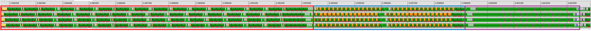
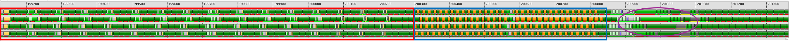

# v6_loop_unroll — Eliminating Copy Overhead via Loop Unrolling

## 1. Directory Structure

```
v6_loop_unroll/
├── matmul_kernel.py    # The kernel implementation
└── README.md           # This file
```

## 2. Motivation

In v5, we identified a bottleneck: copy instructions at the end of each iteration that move `ds_read` results from prefetch registers (`a_next`, `b_next`) to the registers MFMA consumes (`a`, `b`). This overhead is inherent to the prefetch design when using a single-iteration loop body.

> [!IMPORTANT]
> By unrolling the loop by a factor of 2, we alternate between two register sets directly. Odd iterations use `a/b`, even iterations use `a_next/b_next`—no copying required.

## 3. Loop Unrolling Design

### 3.1. Loop Step Size

The loop now iterates with step size 2:

```python
for k in range(0, iterMax - 2, 2):
```

Each unrolled iteration contains two sub-iterations that alternate register sets.

### 3.2. Unrolled Loop Body

```python
for k in range(0, iterMax - 2, 2):
    # --- First sub-iteration: use a/b, prefetch into a_next/b_next ---
    g_idx = 0
    l_idx = 1

    acc = gl.amd.cdna3.mfma(a, b, acc)

    gl.amd.cdna4.async_copy.wait_group(0)
    gl.amd.cdna4.async_copy.buffer_load_to_shared(smemA.index(g_idx), a_base, a_offsets, ...)
    gl.amd.cdna4.async_copy.buffer_load_to_shared(smemB.index(g_idx), b_base, b_offsets, ...)
    gl.amd.cdna4.async_copy.commit_group()

    a_next = gl.amd.cdna4.async_copy.load_shared_relaxed(smemA.index(l_idx), dotOpLayoutA)
    b_next = gl.amd.cdna4.async_copy.load_shared_relaxed(smemB.index(l_idx), dotOpLayoutB)

    a_base += BLOCK_K * stride_ak
    b_base += BLOCK_K * stride_bk

    # --- Second sub-iteration: use a_next/b_next, prefetch into a/b ---
    g_idx = 1
    l_idx = 0

    acc = gl.amd.cdna3.mfma(a_next, b_next, acc)

    gl.amd.cdna4.async_copy.wait_group(0)
    gl.amd.cdna4.async_copy.buffer_load_to_shared(smemA.index(g_idx), a_base, a_offsets, ...)
    gl.amd.cdna4.async_copy.buffer_load_to_shared(smemB.index(g_idx), b_base, b_offsets, ...)
    gl.amd.cdna4.async_copy.commit_group()

    a = gl.amd.cdna4.async_copy.load_shared_relaxed(smemA.index(l_idx), dotOpLayoutA)
    b = gl.amd.cdna4.async_copy.load_shared_relaxed(smemB.index(l_idx), dotOpLayoutB)

    a_base += BLOCK_K * stride_ak
    b_base += BLOCK_K * stride_bk
```

Key observations:
- First sub-iteration: MFMA consumes `a/b`, `ds_read` loads into `a_next/b_next`
- Second sub-iteration: MFMA consumes `a_next/b_next`, `ds_read` loads into `a/b`

The register sets alternate naturally—no copy instructions needed.

### 3.3. Epilogue

With loop unrolling, the epilogue handles the remaining iterations. Since the main loop ends at `iterMax - 2`, the epilogue processes the final two iterations:

```python
## Epilogue
## iterMax - 2
l_idx = 1
acc = gl.amd.cdna3.mfma(a, b, acc)
a_next = gl.amd.cdna4.async_copy.load_shared_relaxed(smemA.index(l_idx), dotOpLayoutA)
b_next = gl.amd.cdna4.async_copy.load_shared_relaxed(smemB.index(l_idx), dotOpLayoutB)

## iterMax - 1
acc = gl.amd.cdna3.mfma(a_next, b_next, acc)
```

Here we assume `iterMax` is even. With an unroll factor of 2 and the main loop ending at `iterMax - 2`, exactly two iterations remain. The epilogue alternates register sets like the main loop: iteration `iterMax - 2` uses `a/b`, iteration `iterMax - 1` uses `a_next/b_next`.

If `iterMax` is odd, only one iteration remains in the epilogue, containing just the final MFMA.

## 4. Performance Analysis

| Version              | TFLOPS | VGPRs | MFMA Eff. |
|----------------------|--------|-------|-----------|
| v5 + LLIR scheduler  |   1283 |   510 |       76% |
| v6 + LLIR scheduler  |   1260 |   500 |       88% |

With the LLIR scheduler, MFMA efficiency improves from 76% to 88% by eliminating copy overhead.

> [!NOTE]
> These numbers were collected on an earlier Triton snapshot. v6+llir hit an LLIR-scheduler regression in the previously pinned `ROCm/triton` `matmul_4waves` build that produced invalid IR for v6's unrolled loop and crashed during compilation. Whether the regression still reproduces against the current [`gfx950-tutorial-v0.1`](https://github.com/triton-lang/triton/releases/tag/gfx950-tutorial-v0.1) pin needs re-measurement; the kernel design and the relative performance story are unchanged.

Performance is collected using:
```bash
python scripts/run_perf_table.py --kernel a16w16 --versions 5 6 --configs llir --K 8192 --dtype fp16 --use-rocprof
```

For an explanation of MFMA efficiency and how to measure it, see [MFMA Efficiency](../../../../docs/mfma_efficiency.md).

### 4.1. Trace Comparison

Comparing thread traces of v5 and v6 with the LLIR scheduler. Each screenshot shows one iteration of the main loop:





In v5 (top), copy instructions appear at the end of each iteration. In v6 (bottom), these copies are eliminated—the register sets alternate naturally.

### 4.2. Remaining Bottlenecks

Even with 88% MFMA efficiency, room for improvement remains. The v6 trace shows MFMA gaps scattered throughout the iteration.

#### 4.2.1. VALU Stalls from Power Management

The area marked by the **purple circle** shows instructions across iteration boundaries. VALU instructions in this region take 40-80 cycles instead of the expected 4 cycles due to power management mechanisms.

When power consumption changes rapidly, the power delivery network cannot respond quickly enough, causing voltage instability. MI350 uses two mechanisms to prevent this:

- **DIDT (Digital Integrated Droop Tracking)**: Hardware that detects voltage droops and stretches the clock (lowering frequency) until voltage stabilizes.
- **PIT (Power Instruction Throttling)**: Firmware that looks ahead at upcoming instructions and proactively inserts stalls to smooth out power spikes before they trigger DIDT.

In the trace, a long period of low-power instructions (scalar operations, waits) across the iteration boundary is followed by a burst of high-power VALU and MFMA instructions. PIT detects this transition and inserts stalls to prevent a voltage droop.

**Solution**: Increase MFMA efficiency to maintain stable power draw. Keeping the MFMA unit continuously busy keeps current draw steady, so there is no voltage droop for DIDT to throttle on and no upcoming power spike for PIT to preempt. Both mechanisms stay dormant when the workload already looks smooth to the power delivery network.

#### 4.2.2. AGPR ↔ VGPR Copies

The generated assembly still contains copy instructions between AGPRs and VGPRs. While we eliminated the `a/b` ↔ `a_next/b_next` copies, the compiler inserts data movement between accumulator registers (AGPRs) and vector registers (VGPRs) for certain operations.

## 5. What Comes Next

The next versions address the two bottlenecks identified above:

- **Register pressure optimization** — to eliminate AGPR ↔ VGPR copy overhead
- **Increased MFMA efficiency** — to maintain stable power draw and avoid PIT stalls
