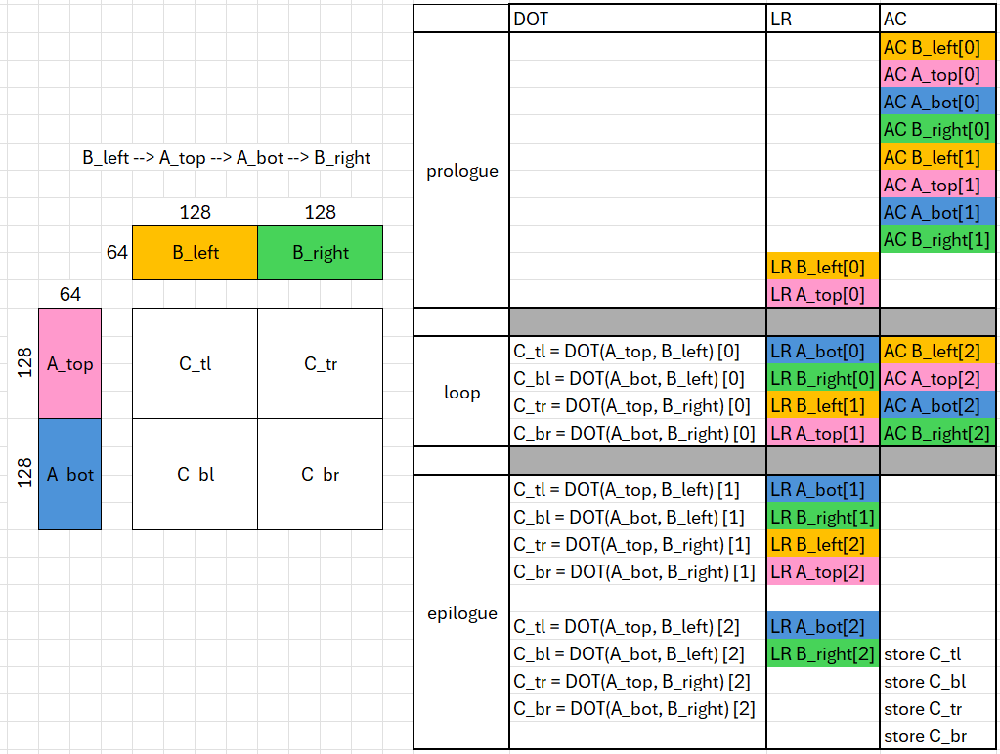
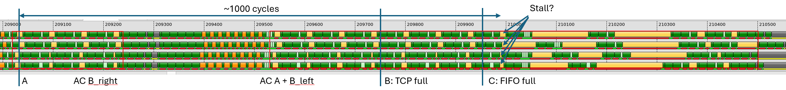
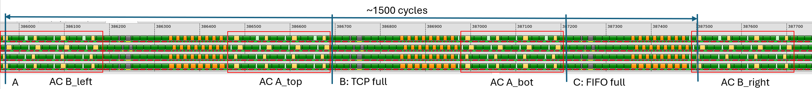

# v8_sliceMN — Slicing Both M and N

## 1. Directory Structure

```
v8_sliceMN/
├── matmul_kernel.py      # The kernel implementation
└── README.md             # This file
```

## 2. Motivation

In v7, we sliced the output tile along N to reduce B's register footprint from 128 to 64, bringing the block-level total from 512 to 448 registers. A remained full-sized at 128 registers (with prefetch).

This version applies the same idea to M: slice A into two halves (`a_top`, `a_bot`), reducing A's register footprint from 128 to 64. Combined with v7's N-slicing of B, the block-level total drops further:

| Tile | v7 size | v7 regs (prefetch) | v8 size | v8 regs (prefetch) |
|------|---------|--------------------|---------|--------------------|
| A | 256x64 (full) | 128 | 128x64 (half-M) | **64** |
| B | 64x128 (half-N) | 64 | 64x128 (half-N) | 64 |
| C | 256x256 | 256 | 256x256 | 256 |
| **Total** | - | **448** | - | **384** |

The 64-register headroom improvement (448 → 384) makes room for auxiliary operations (scales, bias, activation) in fused kernels.

But slicing both M and N changes the pipeline structure fundamentally. Instead of two regions per K-step (v7: left half, right half), we now have four regions (tl, bl, tr, br). This restructuring has two important consequences explored in this version:

1. **The copy problem from v5 is eliminated by design** (Section 3)
2. **A buffer load stall in v7 at large K is resolved** (Section 4)

## 3. Pipeline Design: Four Regions per K-Step

### 3.1. The 2x2 Tiling

The output tile is split into a 2x2 grid of quadrants:



A is sliced along M into `A_top` (upper 128 rows) and `A_bot` (lower 128 rows). B is sliced along N into `B_left` (left 128 columns) and `B_right` (right 128 columns). Each K-step computes four DOTs:

```
acc_tl += DOT(A_top, B_left)    # Region 0
acc_bl += DOT(A_bot, B_left)    # Region 1
acc_tr += DOT(A_top, B_right)   # Region 2
acc_br += DOT(A_bot, B_right)   # Region 3
```

### 3.2. Load Order: B_left -> A_top -> A_bot -> B_right

The load order within each K-step is carefully chosen. Each region performs three operations:

- **DOT**: matrix multiply-accumulate (expands to multiple MFMA instructions)
- **LR**: local read (`ds_read` from LDS to registers)
- **AC**: async copy (`buffer_load_to_lds` from global memory to LDS)

```
Region 0:  DOT(A_top, B_left)  →  LR A_bot     →  AC B_left
Region 1:  DOT(A_bot, B_left)  →  LR B_right   →  AC A_top
Region 2:  DOT(A_top, B_right) →  LR B_left'   →  AC A_bot
Region 3:  DOT(A_bot, B_right) →  LR A_top'    →  AC B_right
```

Where `B_left'` and `A_top'` denote data for the *next* K-step (loaded from the other LDS buffer).

This ordering ensures that:
- Each operand is loaded just before its first use
- Each operand's last use completes before its register is overwritten by the next load
- The load sequence `B_left -> A_top -> A_bot -> B_right` cycles through all four half-tiles

### 3.3. Why the Copy Problem Disappears

In [v5_local_prefetch](../v5_local_prefetch/README.md#54-bottleneck-analysis), we identified a fundamental problem: when the LLIR scheduler interleaves `ds_read` with MFMA inside a single iteration, the `ds_read` results must remain live across the MFMAs that follow. The register allocator is forced to place `ds_read` results in *different* registers from those expected by the next iteration's MFMA, requiring copy instructions (`v_accvgpr_mov_b32`) at the iteration boundary. This overhead motivated loop unrolling in v6.

With four regions per K-step, this problem disappears — but only because the **load order** is carefully chosen. Consider how the order `B_left -> A_top -> A_bot -> B_right` maps onto the regions:

- Region 0 consumes `A_top` and `B_left`, then loads `A_bot` (for Region 1)
- Region 1 consumes `A_bot` and `B_left`, then loads `B_right` (for Region 2)
- Region 2 consumes `A_top` and `B_right`, then loads `B_left'` (for next iter Region 0)
- Region 3 consumes `A_bot` and `B_right`, then loads `A_top'` (for next iter Regions 0 and 2)

Take `A_top` as an example: it is loaded in Region 3 of iteration k (`LR A_top'` from the next buffer) and first consumed in Region 0 of iteration k+1. Between the load and the first use, only Region 3's DOT (`DOT(A_bot, B_right)`) executes — and that DOT uses `A_bot`, not `A_top`. So `A_top`'s register is free to be written by the `ds_read` without conflicting with any live DOT operand.

The same holds for all four operands: each is loaded in one region and first consumed in the next, with no overlapping live ranges across the boundary. The register allocator can assign the same physical registers to `ds_read` destinations and DOT inputs — no copies needed, no unrolling required for this purpose.

This property depends on the load order. A different order — say, loading `A_top` in Region 0 instead of Region 3 — would force `A_top` to remain live across Regions 1–3 of the next iteration, recreating the overlap problem.

> [!IMPORTANT]
> The four-region structure naturally separates load and use across region boundaries, eliminating the copy overhead that v5 suffered. This is a structural advantage of slicing both M and N — register sets alternate within a single iteration, without explicit loop unrolling.

### 3.4. Loop Unrolling for Address Optimization

Although copies are eliminated, we still unroll the loop by a factor of 2 — but for a different reason: **eliminating per-K-step buffer index computation**.

Without unrolling, each iteration must compute `l_idx = k % 2` and derive the LDS buffer addresses from it. As we observed in the generated assembly, this produces scalar arithmetic (`s_and`, `s_mul`, `s_xor`, `s_lshl`, `s_lshr`, `s_or`) to compute the buffer index and padded LDS addresses at runtime.

With unrolling by 2:
- Sub-iteration 0 hardcodes buffer indices to `0` and `1`
- Sub-iteration 1 hardcodes them to `1` and `0`
- No runtime `k % 2` computation needed

Additionally, we pre-compute two sets of global memory offsets:
- **Base offsets** (`a_top_offsets`, etc.) for even K-steps
- **Next offsets** (`a_top_offsets_next = a_top_offsets + BLOCK_K * stride_ak`, etc.) for odd K-steps

This eliminates the per-K-step `a_base += BLOCK_K * stride_ak` update. Instead, `a_base` and `b_base` advance by `2 * BLOCK_K` once per unrolled iteration — halving the pointer update overhead.

### 3.5. Register Analysis

Using the formula from [v7](../v7_sliceN/README.md#21-register-usage-analysis):

```
registers = (M x N x elemType x sharing_factor) / (num_warps x waveSize)
```

| Tile | Size | elemType | sharing_factor | Base | With prefetch |
|------|------|----------|----------------|------|---------------|
| A (half-M) | 128x64 | 0.5 | 2 | 32 | 64 (x2) |
| B (half-N) | 64x128 | 0.5 | 2 | 32 | 64 (x2) |
| C | 256x256 | 1.0 | 1 | 256 | 256 |

**Total: 64 + 64 + 256 = 384 registers**

Compared to v7's 448, this is 64 fewer registers — headroom that accommodates backend allocation overhead, auxiliary operations (e.g., per-group scales in a4w4), and reduces the likelihood of AGPR↔VGPR copy instructions.

## 4. Buffer Load Throughput and TCP Limitations

This section explains a throughput limitation that affects v7 at large K values and how v8's four-region structure resolves it.

The central concept is the **TCP (Texture Cache Per-CU)** — a 32 KB L1 cache that all memory requests must pass through. The TCP limits how many bytes can be in flight per CU at any given time, and this limit governs whether `buffer_load` instructions stall waiting for earlier requests to complete. For a comprehensive treatment of how TCP capacity interacts with pipeline depth, occupancy, and HBM latency, see the [Memory Bandwidth Model](../../../../docs/memory_bandwidth_model.md).

### 4.1. Memory Hierarchy

On MI300/MI350, `buffer_load_to_lds` (direct-to-LDS) goes through the same path as regular `buffer_load`:

```
HBM → L2 → TCP (L1) → LDS
                    └→ CU (for regular buffer_load)
```

Both `buffer_load` and `buffer_load_to_lds` share the TCP, which is 32 KB. This means direct-to-LDS has the same throughput constraints as regular buffer loads regarding TCP capacity.

### 4.2. The VMEM Request Queue

When a kernel issues many `buffer_load(_to_lds)` back-to-back, the requests pass through a **per-CU FIFO queue** that holds approximately 12 entries. Since the CU runs 4 waves (one per SIMD), each wave can issue 3–4 `buffer_load` instructions without delay (at 4 cycles each).

Once the queue is full, subsequent `buffer_load` instructions must wait for entries at the head of the queue to be "processed" — meaning the TCP must find cache line(s) for the request and dequeue it.

### 4.3. TCP Processing Time

The TCP processing time depends on the instruction width:

| Instruction | Processing time | Efficiency |
|---|---|---|
| `buffer_load(_to_lds)_dwordx4` | 16 cycles | 16 bytes / 16 cycles |
| `buffer_load(_to_lds)_dword` | 4 cycles | 4 bytes / 4 cycles |
| `buffer_load(_to_lds)_dwordx2` | 16 cycles | 8 bytes / 16 cycles (inefficient) |

These processing times assume coalesced addresses (threads access contiguous memory). Non-coalesced accesses take longer because the TCP must service multiple cache lines per request.

Note that `dwordx4` and `dword` have the same efficiency (1 byte/cycle), while `dwordx2` is half as efficient.

### 4.4. Steady-State Issue Latency

Taking `dwordx4` as an example: when the queue is full, the next `buffer_load_dwordx4` must wait 64 cycles to be issued — 16 cycles per `buffer_load` x 4 waves sharing the TCP. This 64-cycle interval is the expected steady-state issue latency for the 5th through 11th `buffer_load` from each wave.

> [!NOTE]
> This 64-cycle issue latency is what the LLIR scheduler uses as the throughput model: 4 MFMAs (at 16 cycles each) per `buffer_load` in the interleaving schedule.

### 4.5. The v7 Stall Problem at Large K

In v7's loop structure, two consecutive regions issue AC for different tiles: one region issues AC for B_right (4 loads per wave), and the next issues AC for A + B_left (12 loads per wave — 8 for the full A tile and 4 for B_left). That is **16 `buffer_load_to_lds_dwordx4` per wave across consecutive regions**.

Let us trace what happens at large K (e.g., K=16384):



In the trace above (yellow rectangles = `buffer_load_to_lds`), the phases unfold as follows:

**Point A — AC B_right**: Each wave issues 4 `buffer_load_to_lds_dwordx4`. Each instruction requests 1 KB of data (64 lanes x 16 bytes). Assuming the TCP starts empty, all 4 waves together fill 4 x 4 x 1 KB = **16 KB**, well within the 32 KB TCP. The loads issue without delay.

**AC A + B_left**: Each wave now issues 12 more `buffer_load_to_lds_dwordx4`. After the first 4 of these (combined with the 4 from point A, that is 8 per wave), all 4 waves have issued 8 x 1 KB x 4 waves = **32 KB total in-flight** — the TCP is full.

**Point B — TCP full**: The next 3 `buffer_load_to_lds_dwordx4` per wave can still be absorbed by the FIFO queue (~12 entries). Each issues at the 64-cycle steady-state interval as the TCP processes requests. No stall yet.

**Point C — FIFO full**: Each wave has now issued 11 `buffer_load_to_lds_dwordx4` (4 from B_right + 7 from A+B_left). The TCP (32 KB) is full and the FIFO queue (~12 entries) is full. The situation is:
- 32 KB of in-flight data in the TCP
- 12 pending requests in the FIFO
- ~1000 cycles have elapsed since point A

**Stall?** — When each wave tries to issue the 12th `buffer_load_to_lds_dwordx4`, it must wait for the TCP to have space. This requires the very first `buffer_load` (issued at point A) to finish its HBM round-trip and retire from the TCP. Whether this stalls depends on HBM latency:
- If the HBM round-trip completes in less than ~1000 cycles → no stall, the retired entry frees TCP space in time
- If the HBM round-trip takes longer than ~1000 cycles → **stall**, as visible in the trace

> [!NOTE]
> **Why does HBM latency increase at large K?** The `buffer_load` round-trip time is not a fixed constant — it depends on L2 cache hit rate and HBM contention. At small K (e.g., K=8192), the working set per XCD fits reasonably in L2, and many requests are serviced from L2 rather than HBM. At large K (e.g., K=16384), each workgroup iterates over more K-tiles, increasing the total data footprint. With 256 CUs all streaming through larger regions of the A and B matrices, L2 capacity is exceeded and the miss rate rises. L2 misses must be serviced from HBM (or MALL), which has much higher latency. This pushes the effective `buffer_load` round-trip time beyond the ~1000-cycle budget, triggering the stall.

> [!IMPORTANT]
> The `s_waitcnt vmcnt(N)` instruction waits for HBM responses, which is a *different* latency from the TCP issue latency. A `buffer_load` can be "issued" (accepted by the TCP) long before the data arrives from HBM. The vmcnt tracks HBM completions; the TCP queue capacity governs issue rate.

### 4.6. How v8 Solves the Stall

In v8, each region issues only **4 `buffer_load_to_lds_dwordx4` per wave** (one half-tile), and there are 4 regions per K-step. The LLIR scheduler interleaves these 4 buffer loads with 32 MFMAs within each region — so buffer loads are evenly distributed rather than clustered.



Tracing through the phases for v8:

**Point A — AC B_left**: Each wave issues 4 `buffer_load_to_lds_dwordx4`, interleaved with MFMAs. All 4 waves fill 4 x 4 x 1 KB = 16 KB. No TCP pressure yet.

**AC A_top**: 4 more per wave. After this region, all 4 waves have issued 8 x 1 KB x 4 waves = **32 KB**. **Point B: TCP full.**

**AC A_bot**: 4 more per wave. These go into the FIFO queue (~12 entries, 3 per wave). **Point C: FIFO full.**

**AC B_right**: Each wave tries to issue 4 more `buffer_load_to_lds_dwordx4`. But now ~1500 cycles have elapsed since point A — three full regions of MFMA computation (32 MFMAs x 16 cycles = 512 cycles per region x 3 regions ≈ 1500 cycles). This is long enough to cover even the worst-case HBM latency at large K. The buffer loads issued at point A have finished and retired from the TCP, freeing space for the new requests.

> [!IMPORTANT]
> The key insight: both v7 and v8 interleave buffer loads with MFMAs within each region. The difference is the tiling structure. In v7, the AC for B_right and the AC for A + B_left land in consecutive regions, so 16 buffer loads per wave are issued within ~1000 cycles — not enough for HBM to respond at large K. In v8, the four half-tiles (B_left, A_top, A_bot, B_right) are each loaded in a separate region, spreading the 16 buffer loads across ~1500 cycles of MFMA computation. This gives HBM enough time to retire earlier requests and free TCP space before new ones arrive.

The total number of buffer loads per K-step is the same (16 per wave in both v7 and v8). The difference is purely in how the tiling structure distributes them over time.

### 4.7. Future hardware: relaxing TCP and buffer_load limits

The TCP-capacity bottleneck analyzed above is specific to current hardware. Several directions would relax it, and they split the same way as the LDS future-designs discussion in [lds_throughput §6](../../../../docs/lds_throughput.md#6-a-note-on-future-lds-designs): parametric changes that scale existing knobs, and architectural changes that shift what the kernel author has to reason about.

**Parametric: larger TCP, deeper VMEM FIFO, faster processing.** A larger TCP would directly remove the v7 stall at large K. With 64 KB instead of 32 KB, v7's 16 consecutive `buffer_load`s per wave would fit entirely in the TCP, and M-slicing would no longer be needed to spread loads over time — it would be a pure register-pressure optimization, matching its role in v7. Similarly, deeper VMEM FIFOs (today ~12 entries per CU) would absorb larger bursts before back-pressure, and faster TCP processing rates would raise the issue-rate ceiling in §4.3. Under all three, the mental model in §§4.1–4.4 applies unchanged; only the specific capacities shift.

**Architectural: a tensor-granularity load engine.** NVIDIA's Hopper GPUs introduced **TMA (Tensor Memory Accelerator)** as an example of what a different load design could look like. TMA has a dedicated HBM → shared-memory path that bypasses L1, and it loads an entire tensor tile with a single instruction. Both properties matter here. With a separate path, shared-memory-targeted transfers no longer compete with register-side loads for TCP capacity — the §4.5 stall analysis collapses for them. With one instruction per tile instead of 16 per wave, there are no throughput-distribution or FIFO-depth issues to schedule around; the kernel author stops reasoning about "how do I spread `buffer_load`s across enough MFMAs to stay in the 64-cycle issue budget?" and starts reasoning only about "how early do I issue the tile load so its HBM round-trip finishes before MFMA needs the data?"

The whole concern that drives v8's four-region structure disappears under this model. v7's concentrated-load structure would just work, and M-slicing would return to being a pure register-pressure optimization.

Unlike the parametric improvements, a tensor-granularity load engine *does* change the mental model — the pipeline-design problem reduces to pure HBM latency hiding, the one concern that remains after TCP pressure and instruction-interleaving are taken off the table.

## 5. Performance Analysis

The buffer load stall described above is directly measurable. We compare v7 (slice N only) and v8 (slice M and N) at two K values — K=8192 (moderate) and K=16384 (large, high HBM contention):

| Version | K | TFLOPS | MFMA Eff. |
|---|---|---|---|
| v7_sliceN + llir+amdgcnas | 8192 | 1550 | 98.40% |
| v7_sliceN + llir+amdgcnas | 16384 | 1519 | 93.64% |
| v8_sliceMN + llir+amdgcnas | 8192 | 1577 | 98.33% |
| v8_sliceMN + llir+amdgcnas | 16384 | 1569 | 98.32% |

Performance is collected using:
```bash
python scripts/run_perf_table.py --kernel a16w16 --versions 7 8 --configs llir+amdgcnas --K 8192 --dtype fp16 --use-rocprof
python scripts/run_perf_table.py --kernel a16w16 --versions 7 8 --configs llir+amdgcnas --K 16384 --dtype fp16 --use-rocprof
```

At K=8192, both kernels achieve ~98% MFMA efficiency — HBM latency is moderate and v7's ~1000-cycle budget is sufficient. At K=16384, v7 drops to 93.64% while v8 maintains 98.32%. The 4.7 percentage-point gap in MFMA efficiency is the direct consequence of the TCP stall: v7's 16 consecutive buffer loads per wave exceed the ~1000-cycle HBM budget, while v8's distributed 4-loads-per-region structure stays within the ~1500-cycle budget.

## 6. What Comes Next

In `v9_beyond_hotloop`, we shift focus to optimizations outside the loop — L2 cache locality via XCD-aware PID remapping and `GROUP_SIZE_M` workgroup swizzling.
