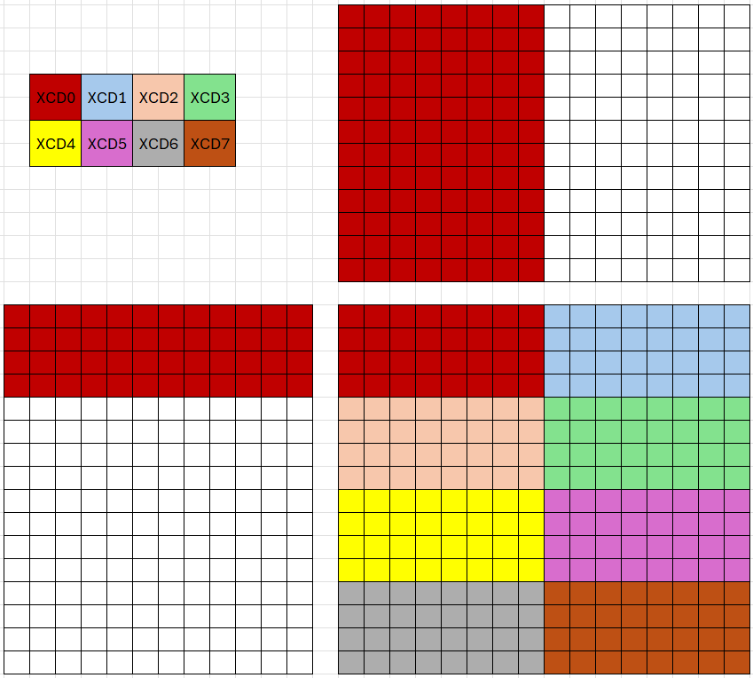

# v9_beyond_hotloop — Optimizations Beyond the Hot Loop

## 1. Directory Structure

```
v9_beyond_hotloop/
├── matmul_kernel.py                        # The kernel implementation
├── README.md                               # This file
├── ir_dump_K8192_fp16/                     # IR dumps for analysis
├── ir_dump_K8192_fp16_llirSched/           # IR dumps with llirSched
└── ir_dump_K8192_fp16_llirSched_amdgcnas/  # IR dumps with llirSched + amdgcnas
```

## 2. Motivation

Previous versions focused on improving MFMA efficiency inside the loop—maximizing compute utilization on each CU through pipelining, prefetching, and register pressure management.

However, TFLOPS depends on more than per-SIMD cycle efficiency. Two additional factors matter:

1. **Frequency**: Higher power consumption leads to lower sustained clock frequency. As discussed in v7 regarding DIDT protection, reducing power consumption is essential for achieving peak TFLOPS.

2. **Epilogue overhead**: After the loop completes, the epilogue converts accumulators to the output type and writes results to global memory. When K is large, the epilogue is a small fraction of total execution time. As K decreases, the epilogue takes a larger share and its inefficiencies directly reduce TFLOPS.

This version addresses both factors with two optimizations:

- **L2 cache locality** (Section 3): XCD-aware PID remapping and workgroup swizzling reduce L2 misses, lowering power consumption and sustaining higher frequency.
- **Interleaved epilogue** (Section 4): `extract_slice` breaks each accumulator half into sub-tiles along the M dimension and interleaves MFMA computation with stores, reducing `buffer_store` contention when CUs reach the epilogue simultaneously. This is distinct from v7's N-slicing (splitting the output into left/right halves along the N dimension for register pressure), which is present in both epilogue strategies discussed here.

## 3. L2 Cache Locality

Throughout this section, we use **GM** as shorthand for **GROUP_SIZE_M**.

### 3.1 The Problem: Poor L2 Reuse Across XCDs

gfx942 and gfx950 have 8 XCDs (Accelerator Compute Dies), each with its own L2 cache. The hardware distributes workgroups across XCDs in round-robin order: workgroup 0 goes to XCD 0, workgroup 1 to XCD 1, and so on.

This creates a problem for cache reuse. Adjacent output tiles often share input tiles from A or B. With naive PID assignment, adjacent tiles map to consecutive workgroup IDs—and thus to different XCDs. Since each XCD has a separate L2 cache, shared input data must be reloaded from HBM on each XCD, wasting memory bandwidth.

Consider v7 with shape 4096×4096 and BLOCK_M=BLOCK_N=256. The output is divided into 16×16 = 256 tiles. With row-major PID assignment and round-robin XCD distribution, workgroups on XCD 0 are spread across all rows:


XCD 0 receives workgroups from every row of the output grid. As a result, XCD 0 must load the **entire A matrix** (all 16 row-strips) but only 1/8 of B (2 column-strips). The same pattern applies to all XCDs—each requires the full A matrix, resulting in poor L2 cache reuse.

### 3.2 XCD-Aware PID Remapping

The first optimization remaps PIDs so that consecutive tiles land on the **same XCD**:

```python
@gluon.jit
def get_pids(M, N, BM, BN, GRID_MN, NUM_XCDS, GROUP_SIZE_M):
    pid = gl.program_id(axis=0)

    if NUM_XCDS != 1:
        pids_per_xcd = (GRID_MN + NUM_XCDS - 1) // NUM_XCDS
        tall_xcds = GRID_MN % NUM_XCDS
        tall_xcds = NUM_XCDS if tall_xcds == 0 else tall_xcds
        xcd = pid % NUM_XCDS
        local_pid = pid // NUM_XCDS

        if xcd < tall_xcds:
            pid = xcd * pids_per_xcd + local_pid
        else:
            pid = tall_xcds * pids_per_xcd + (xcd - tall_xcds) * (pids_per_xcd - 1) + local_pid
    ...
```

With XCD remapping alone (GM=1), each XCD receives a contiguous block of 32 tiles arranged in 2 rows × 16 columns:


However, this layout still requires the **entire B matrix** (all 16 column-strips) and only 1/8 of A (2 row-strips) per XCD. The total data footprint per XCD is unchanged—we have simply swapped which matrix is fully loaded.

### 3.3 Workgroup Swizzling with GROUP_SIZE_M

To reduce the data footprint per XCD, we reshape the workgroup layout using GROUP_SIZE_M:

```python
if GROUP_SIZE_M == 1:
    pid_m = pid // num_pid_n
    pid_n = pid % num_pid_n
else:
    num_pid_in_group = GROUP_SIZE_M * num_pid_n
    group_id = pid // num_pid_in_group
    first_pid_m = group_id * GROUP_SIZE_M
    group_size_m = min(num_pid_m - first_pid_m, GROUP_SIZE_M)
    pid_m = first_pid_m + ((pid % num_pid_in_group) % group_size_m)
    pid_n = (pid % num_pid_in_group) // group_size_m
```

With GM=4, the 32 workgroups per XCD are arranged in a 4×8 grid:



Now each XCD only requires **1/4 of A** (4 row-strips) and **1/2 of B** (8 column-strips). The total data footprint per XCD is significantly reduced compared to either v7 or v8 with GM=1.

### 3.4 Math Model for Optimal GM

The configurations above can be analyzed mathematically. Given:
- Total workgroups: 256
- Workgroups per XCD: P = 32
- Workgroup layout per XCD: GM × ⌈P/GM⌉

Each XCD loads:
- From A: GM row-strips
- From B: ⌈P/GM⌉ column-strips

Total data per XCD is proportional to GM + ⌈P/GM⌉.

**Optimization Problem**: Find integer GM that minimizes $f(\text{GM}) = \text{GM} + \lceil P/\text{GM} \rceil$.

For the continuous relaxation:

$$f(x) = x + \frac{P}{x}$$

$$f'(x) = 1 - \frac{P}{x^2} = 0 \quad \Rightarrow \quad x = \sqrt{P}$$

For P = 32, $\sqrt{32} \approx 5.66$.

Evaluating f(GM) for different values:

| GM | ⌈P/GM⌉ | f(GM) | Configuration |
|----|--------|-------|---------------|
| 16 |      2 |    18 | v7 (no XCD remapping) |
|  2 |     16 |    18 | v8 GM=1 (XCD remapping only) |
|  4 |      8 |    12 | v8 GM=4 |
|  6 |      6 |    12 | v8 GM=6 |
|  8 |      4 |    12 | v8 GM=8 |

The optimal values are GM = 4, 6, or 8, all achieving f(GM) = 12. The math model confirms:
- v7 (effectively GM=16) and v8 GM=1 (effectively GM=2) have the same suboptimal data footprint
- GM = 4, 6, or 8 all achieve the minimum data footprint

### 3.5 Validation

The math model predicts that GM = 4, 6, or 8 should achieve better L2 locality than v7 or v8 with GM=1. Hardware counter measurements confirm this:

| Configuration                  | TFLOPS | MFMA Eff. | TCC_EA0_RDREQ_DRAM_sum | TCP_TCC_READ_REQ_sum |
|--------------------------------|--------|-----------|------------------------|----------------------|
| v7 + llirSched + amdgcnas      |   1538 |     98.5% |              5,043,636 |           16,777,216 |
| v8 + llirSched + amdgcnas GM=1 |   1556 |     98.6% |              4,737,950 |           16,777,216 |
| v8 + llirSched + amdgcnas GM=4 |   1605 |     98.9% |              3,147,709 |           16,777,216 |
| v8 + llirSched + amdgcnas GM=6 |   1634 |     98.4% |              3,147,743 |           16,777,216 |
| v8 + llirSched + amdgcnas GM=8 |   1608 |     98.9% |              3,147,721 |           16,777,216 |

**Counter Definitions**:
- **TCP_TCC_READ_REQ_sum**: Requests from L1 to L2. All configurations have identical values since all workgroups perform the same computation.
- **TCC_EA0_RDREQ_DRAM_sum**: Requests from L2 to MALL (memory-side last-level cache), indicating L2 cache misses.

**Observations**:
- v7 and v8 GM=1 have similar L2 miss counts (~4.7–5.0M), confirming their equivalent data footprints as predicted by the math model.
- GM = 4, 6, and 8 all achieve ~3.1M L2 misses, matching the optimal f(GM) = 12 prediction.
- Despite similar MFMA efficiency (~98%), the reduced L2 traffic from GM = 4/6/8 leads to higher sustained TFLOPS due to lower power consumption and higher frequency.

Performance is collected using:
```bash
python scripts/run_perf_table.py --kernel a16w16 --versions 7 8 --configs llir+amdgcnas --K 8192 --dtype fp16 --use-rocprof
```

Counters are collected using:
```bash
python scripts/run_counter_collection.py --kernel a16w16 --versions 8 --configs llir+amdgcnas --K 8192 --dtype fp16 --counters TCC_EA0_RDREQ_DRAM_sum,TCP_TCC_READ_REQ_sum
```

For an explanation of MFMA efficiency and how to measure it, see [MFMA Efficiency](../../../../docs/mfma_efficiency.md).

## 4. Epilogue Optimization

### 4.1 The Problem: Store Contention at Small K

After the loop, the epilogue converts accumulators to the output type and writes results to global memory. A straightforward approach completes all remaining MFMAs, then issues all stores in a burst. This works well when K is large—CUs finish the loop at different times due to natural variation, so their stores are staggered. But when K is small, all CUs complete the loop nearly simultaneously and issue stores at the same time, saturating the L2/HBM write path.

### 4.2 Two Epilogue Strategies

Both strategies build on v8's M+N slicing, which gives **four 128×128 accumulator quadrants** (`acc_tl`, `acc_bl`, `acc_tr`, `acc_br`). The difference is the granularity at which the final MFMAs and stores are interleaved.

**Quadrant-level stores (v8-style)**: After finishing the last K-iteration's MFMAs, v8 issues one 128×128 store per quadrant, interleaving stores between quadrants:

```python
## Finish iterMax-1 MFMAs in region order, interleaving stores between quadrants
acc_tl = gl.amd.cdna3.mfma(a_top, b_left, acc_tl)
acc_bl = gl.amd.cdna3.mfma(a_bot, b_left, acc_bl)
c_tl = acc_tl.to(a_ptr.dtype.element_ty)
gl.amd.cdna3.buffer_store(ptr=c_base, offsets=c_tl_offsets, stored_value=c_tl)

acc_tr = gl.amd.cdna3.mfma(a_top, b_right, acc_tr)
c_tr = acc_tr.to(a_ptr.dtype.element_ty)
gl.amd.cdna3.buffer_store(ptr=c_base, offsets=c_tr_offsets, stored_value=c_tr)

acc_br = gl.amd.cdna3.mfma(a_bot, b_right, acc_br)
c_bl = acc_bl.to(a_ptr.dtype.element_ty)
gl.amd.cdna3.buffer_store(ptr=c_base, offsets=c_bl_offsets, stored_value=c_bl)

c_br = acc_br.to(a_ptr.dtype.element_ty)
gl.amd.cdna3.buffer_store(ptr=c_base, offsets=c_br_offsets, stored_value=c_br)
```

This yields **four 128×128 stores per CU** with one MFMA between each pair of adjacent stores. In practice, that single-MFMA spacing is enough to prevent the pathological burst — the ATT measurement in §4.5 shows the v8 epilogue is stable across K (12,312 cycles at K=8192 vs 12,356 at K=512). The design v9 builds on is therefore not "fix a broken epilogue" but "compress a working one further."

**Sub-tile-level stores (v9-style)**: v9 uses [`extract_slice`](https://github.com/ROCm/triton/tree/matmul_4waves) to split each 128×128 quadrant into **two 64×128 sub-tiles along M**, giving eight stores instead of four. Each sub-tile MFMA is immediately followed by the previous sub-tile's store, so stores are pipelined across the entire epilogue window rather than bunched at the end:

```python
## Region 0: acc_tl sub-tiles, interleaved with stores
a_top_0 = extract_slice(a_top, [64, 64], [0, 0])
acc_tl_0 = extract_slice(acc_tl, [64, 128], [0, 0])
acc_tl_0 = gl.amd.cdna3.mfma(a_top_0, b_left, acc_tl_0)

a_top_1 = extract_slice(a_top, [64, 64], [64, 0])
acc_tl_1 = extract_slice(acc_tl, [64, 128], [64, 0])
acc_tl_1 = gl.amd.cdna3.mfma(a_top_1, b_left, acc_tl_1)
c_tl0 = acc_tl_0.to(a_ptr.dtype.element_ty)
gl.amd.cdna3.buffer_store(stored_value=c_tl0, ptr=c_tl0_base, offsets=c_slice_offsets)

## Region 1: acc_bl sub-tiles, interleaved with acc_tl_1 and acc_bl_0 stores
## ... (same pattern continues for all eight 64×128 sub-tiles across regions 0–3)
```

`extract_slice` is not yet upstreamed; it lives on the `matmul_4waves` development branch. The full sub-tile schedule is in [`v9_beyond_hotloop/matmul_kernel.py`](./matmul_kernel.py). The net effect is eight smaller stores spread across the entire epilogue window, with MFMAs between each pair — so inter-CU store contention at small K is absorbed by MFMA time rather than serialized on the L2/HBM write path.

### 4.3 Performance Comparison

Comparing v8 (quadrant-level stores) and v9 (sub-tile-level stores) at two K values. v9 also adds the XCD-aware PID remapping from §3 on top of v8's baseline — so the gain at K=8192 is dominated by the L2-locality effect, while the gain at K=512 is dominated by the epilogue. Configs:

- **`base`**: Default LLVM instruction scheduler.
- **`llir`**: LLIR scheduler, which reorders instructions in the **loop body only**. The epilogue still uses the default LLVM scheduler.
- **`llir+amdgcnas`**: Same as `llir`, with additional AMD GCN assembly-level scheduling passes (also loop-only).

Performance collected on MI355 with:

```bash
python scripts/run_perf_table.py --kernel a16w16 --versions 8 9 --configs base llir llir+amdgcnas --K 8192 --dtype fp16 --use-rocprof
python scripts/run_perf_table.py --kernel a16w16 --versions 8 9 --configs base llir llir+amdgcnas --K 512  --dtype fp16 --use-rocprof
```

**K = 8192 (M=N=4096, fp16)**

| Config | v8 TFLOPS | v9 TFLOPS | Δ TFLOPS | v8 MFMA Eff. | v9 MFMA Eff. |
|---|---|---|---|---|---|
| `base`          | 1259 | 1305 | +46 | 67.89% | 68.52% |
| `llir`          | 1366 | 1383 | +17 | 81.03% | 82.26% |
| `llir+amdgcnas` | 1461 | 1486 | +25 | 99.42% | 97.66% |

**K = 512 (M=N=4096, fp16)**

| Config | v8 TFLOPS | v9 TFLOPS | Δ TFLOPS | v8 MFMA Eff. | v9 MFMA Eff. |
|---|---|---|---|---|---|
| `base`          |  706 |  739 | +33 | 67.75% | 68.59% |
| `llir`          |  758 |  796 | +38 | 81.55% | 82.40% |
| `llir+amdgcnas` |  785 |  821 | +36 | 99.39% | 98.49% |

### 4.4 Key Observations

**v9 wins at both K values.** At `llir+amdgcnas`, v9 is +25 TFLOPS (+1.7%) over v8 at K=8192 and +36 TFLOPS (+4.6%) at K=512. The K=8192 delta is dominated by the XCD remapping from §3; the K=512 delta includes both XCD remapping and the sub-tile epilogue. The pattern holds across `base` and `llir` too.

**MFMA efficiency is roughly flat across v8 and v9.** Both kernels reach ~98–99% MFMA efficiency under `llir+amdgcnas`. The v9 improvements do not come from the hot loop — they come from L2 locality (§3) and epilogue structure (§4), neither of which MFMA efficiency measures.

**v8's quadrant-level interleaving already handles store contention well at small K.** One of the surprises of the ATT measurement in §4.5 is that v8's epilogue is essentially flat across K (+44 cycles from K=8192 to K=512). The four quadrant stores, each separated by one MFMA, turn out to be enough to prevent the severe store burst that a completely bunched epilogue would cause. v9's sub-tile approach is not *rescuing* v8 from store contention; it is *further trimming* an already well-behaved epilogue by ~800 cycles through finer-grained pipelining.

### 4.5 ATT Analysis: Epilogue Cycles Across K

We collected Advanced Thread Trace (ATT) measurements for v8 and v9 at both K values to measure the epilogue effect directly. The `llir+amdgcnas` config was used for both kernels; the per-wave epilogue duration is averaged across the traced wave.

**Epilogue cycles vs K (llir+amdgcnas config)**

| Epilogue | K=8192 | K=512 | Δ across K | Δ vs v8 |
|---|---|---|---|---|
| v8 (quadrant-level) | 12,312 | 12,356 |  +44 | — |
| v9 (sub-tile)       | 11,484 | 11,484 |    0 | −828 / −872 |

Measurement commands:

```bash
cd kernels/gemm/a16w16
# Update att_matmul.json kernel_include_regex to v8_sliceMN / v9_beyond_hotloop as needed.
TRITON_ENABLE_LLIR_SCHED=1 TRITON_ENABLE_AMDGCN_AS=1 \
    python ../../../scripts/run_att.py --att-output att_output/v8_K8192 \
    python bench.py --K 8192 --dtype fp16 --version 8
# ...repeat for v8_K512, v9_K8192, v9_K512.
```

Two observations from the table:

1. **Both epilogues are stable across K.** v8 varies by 44 cycles between K=8192 and K=512; v9 varies by 0. v8's quadrant-level interleaving already absorbs the store burst effectively — the original concern that "plain stores at small K trigger severe contention" turns out to be mitigated even by v8's four-store design on MI355. The four 128×128 stores with one MFMA between each are enough to avoid the pathological case where 256 CUs issue a tight burst simultaneously.

2. **v9 is ~800 cycles shorter than v8 at both K values.** This is not a contention-relief story; it is a finer-pipelining story. Doubling the number of stores (8 × 64×128 instead of 4 × 128×128) halves the time between adjacent stores and lets the type-conversion and `convert_layout` work on one sub-tile overlap with the MFMA and `buffer_store` of the adjacent sub-tile. The result is a strictly shorter epilogue, independent of whether CUs are store-contending.

**Why a fully bunched epilogue would still suffer.** Even though v8 already does enough, a hypothetical fully-bunched epilogue — all four stores issued back-to-back with no intervening MFMAs — would concentrate the store traffic from all 256 CUs into a tight window, saturating the L2/HBM write path and extending the trailing `s_endpgm` drain. The progressive `wait_group(n)` → `wait_group(0)` pattern in both v8 and v9 additionally keeps async-copy draining from stalling the epilogue entry. The design lesson is not "v9 fixes a problem v8 has" — it is "both kernels design the epilogue so no pathological burst can form, and v9 goes further to compress cycles overall."

### 4.6 Summary

| Strategy | Pros | Cons |
|---|---|---|
| Quadrant-level (v8) | Four 128×128 stores with one MFMA between each; simpler code; no `extract_slice` dependency; already stable across K | ~800 cycles longer per-CU epilogue than the sub-tile approach |
| Sub-tile (v9) | Eight 64×128 stores finely pipelined with MFMAs; ~800 cycles shorter per-CU epilogue than v8 | More `v_accvgpr` data movement; relies on `extract_slice` (currently on the `matmul_4waves` branch) |

The sub-tile epilogue is used in v9 not because v8's epilogue is unsafe (it is already stable across K on MI355) but because finer pipelining compresses the epilogue by ~7% on top of v8's baseline. Over a full kernel invocation that ~800-cycle reduction per CU maps to a consistent 25–36 TFLOPS gain (§4.3).

## 5. Summary

This version demonstrates that achieving peak TFLOPS requires optimization beyond the hot loop:

- **L2 cache locality**: XCD-aware PID remapping and workgroup swizzling (GROUP_SIZE_M) reduce L2 misses by ~40%, lowering power consumption and sustaining higher frequency.
- **Sub-tile epilogue**: `extract_slice` breaks each accumulator quadrant into two sub-tiles and pipelines stores with MFMA computation. v8's quadrant-level epilogue is already stable across K on MI355; the sub-tile version compresses it by ~800 cycles per CU through finer store–MFMA overlap, which maps to +25–36 TFLOPS of steady improvement in §4.3.

Combined with optimizations from previous versions (pipelining, local prefetch, loop unrolling, M+N slicing), this kernel achieves **1486 TFLOPS** at K=8192 and **821 TFLOPS** at K=512 (FP16, M=N=4096, `llir+amdgcnas` config). Most of the absolute uplift lands in v7–v8; v9 contributes the last few percent — XCD-aware PID remapping for L2 locality at large K, and the sub-tile epilogue for small-K store-contention relief.
