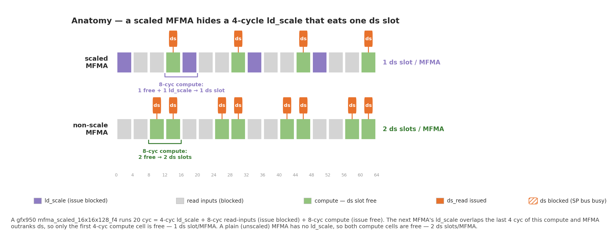
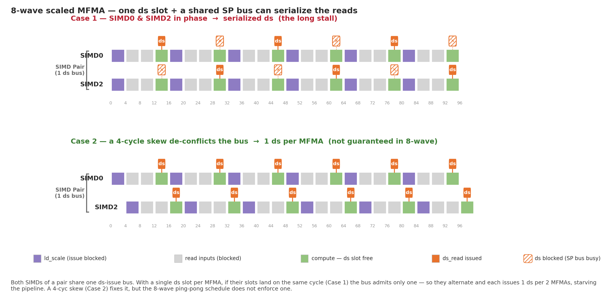
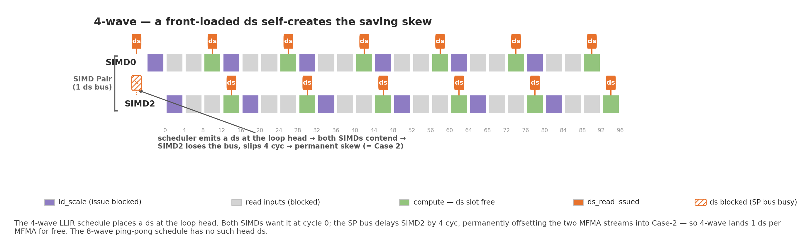
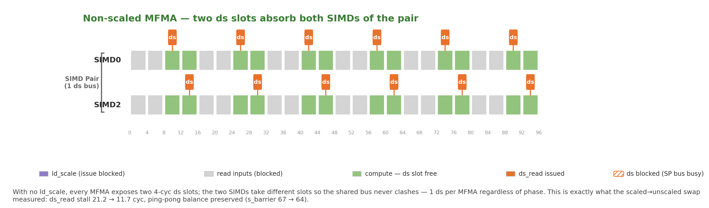

# v1_combineBsc_BK256_nS2 — 8-wave MXFP4, combined B-scale (transpose-read)

## 1. Directory Structure

```
v1_combineBsc_BK256_nS2/
├── matmul_kernel.py    # The kernel implementation
└── README.md           # This file
```

## 2. What this is

The same 8-wave warp-pipeline MXFP4 kernel as
[`v0_sliceMN_BK256_nS2`](../v0_sliceMN_BK256_nS2/README.md) — 2×2 `[128×128]` quadrants,
`warp_pipeline_stage` ping-pong, no-AGPR, load-side pointer-walk — with **one change: the
B scale is loaded combined instead of N-sliced**, so it reaches the MFMA via the hardware
transpose read (`ds_read_b64_tr_b8`) instead of per-byte `ds_read_u8` + `v_perm`.

Read [`v0`'s README](../v0_sliceMN_BK256_nS2/README.md) and the
[family README §2](../README.md#2-the-b-scale-bottleneck-and-how-v1-fixes-it) first — this
document only covers the B-scale delta.

## 3. The combined B-scale

**Problem (v0).** The MFMA scale operand is fed by a `ds_read_b64_tr_b8` transpose read that
needs **8 bytes/thread**. The B-scale layout inherits `WARPS_N=4`, so a `[128,8]` N-slice
gives each thread only 4 bytes → the read degrades to `ds_read_u8` + `v_perm` (118 `v_perm`
in the loop).

**Fix (v1).** Load the full **`[BLOCK_N, NG] = [256, 8]`** B scale as ONE combined buffer.
At `[2,4]` the un-sliced `[256,8]` gives each thread **8 bytes = 64 bits** → the read lowers
to `ds_read_b64_tr_b8`. Then recover the left/right halves for the two MFMA columns:

```python
sb = smem_b_sc.index(buf).load(scale_b_comb_layout)         # [256,8], one transpose read
left, right = gl.split(gl.permute(sb.reshape([2,128,8]), [1,2,0]))
b_sc_left  = gl.convert_layout(left,  scale_b_layout)       # free (slice-enc -> linear)
b_sc_right = gl.convert_layout(right, scale_b_layout)
```

This works because `get_mfma_scale_layout([256,8])` is exactly the per-quadrant
`get_mfma_scale_layout([128,8])` (= `scale_b_layout`) **plus one register base `[128,0]`**,
so the `split` is a register slice and the `convert_layout` is a no-op relabel. The
left/right operands handed to `mfma_scaled` are bit-identical to v0's.

### 3.1 The async-fill blocked layout (`[4,1],[64,1],[1,8]`)

The combined `[256,8]` fill must stay coalesced for gfx950 direct-to-LDS (32-bit dword per
thread, no scatter → each warp's writes must be one contiguous LDS run). `b_scales` is
**N-contiguous** in HBM (`(K/32, N).T`), so the fill is N-major, and each warp must own a
whole contiguous N-column:

- `sizePerThread=[4,1]`, `threadsPerWarp=[64,1]`, `warpsPerCTA=[1,8]`, `order=[0,1]`.
- Each warp = **64 N-lanes × 1 K-lane** → covers **256 N × 1 K** = one contiguous 256-byte
  K-column; the 8 warps cover the 8 K groups.

v0's `[4,1],[32,2],[2,4]` puts 2 K-groups per warp, which for `[256,8]` are 256 bytes apart
(a 128-byte gap) and fail `canCoalesceWriteIntoSharedMemory`; it only happens to coalesce
for a `[128,8]` half because there the 128-N span equals the tile's N. See the
[family README §2.1](../README.md#21-why-the-combined-2568-fill-needs-a-special-blocked-layout).

## 4. Performance (MI355X, current build, rocprof cold-rotating)

| K | v0 TFLOPS | **v1 TFLOPS** | v0 MFMA | **v1 MFMA** | speedup |
|---|---|---|---|---|---|
| 8192  | 3525 | **4071** | ~57% | **73.2%** | +15.5% |
| 16384 | 3986 | **4492** | 57.2% | **73.5%** | +12.7% |
| 32768 | 4064 | **4840** | ~57% | **73.6%** | +19.1% |

Codegen (K=8192): B-scale `v_perm` **118 → 0**, `ds_read_u8` **32 → 0**; VGPR/spills
**256 / 23 → 256 / 12**. Correctness ✅ vs dequantized torch, K = 1024…65536.

```bash
python bench.py --version 1 --K 8192                                    # correctness + do_bench
python collect_perf.py --version 1 --K 8192                             # rocprof + ATT MFMA eff
python collect_perf.py --version 1 --K 32768 --rotating-buffer-size 2048
```

## 5. The remaining `ds_read` stall — scaled MFMA vs the SP bus

§3 removed the B-scale *load* bottleneck. A subtler limit still sits on the **tile**
reads: in the 8-wave hot loop every `ds_read_b128` stalls **~21 cyc**, yet
`SQ_LDS_BANK_CONFLICT = 0` — so it is **not** a bank conflict. The cause is that a
**scaled** MFMA cannot freely co-issue with LDS reads. *(Thanks to Niels for confirming
the hardware details.)*

### 5.1 A scaled MFMA hides a 4-cycle `ld_scale`

`mfma_scaled_16x16x128_f4` is 16 cyc of matrix compute, but the hardware decouples it
into a hidden **4-cyc `ld_scale`** + the regular MFMA — **20 cyc total**, invisible to
software:

- **cyc 0–3** — `ld_scale` (fetch the block scales)
- **cyc 4–11** — read input VGPRs; **the SIMD cannot issue anything else**
- **cyc 12–19** — compute; **the SIMD is free to co-issue** a `ds_read`

A plain MFMA cannot overlap another MFMA, but an `ld_scale` **can** overlap an MFMA. So
the *next* scaled MFMA's `ld_scale` slides into the **last 4 cyc** of this one's compute —
and because MFMA outranks `ds`, the SIMD spends that half on `ld_scale`, not `ds`. Only
the **first** compute cell is free:

<p align="center"></p>

**→ one ds slot per scaled MFMA**, versus two for an unscaled MFMA.

### 5.2 One slot + a shared bus = serialized reads (8-wave)

SIMDs are paired (0&2, 1&3), and each **SIMD Pair shares one ds-issue bus** — only one
SIMD of a pair can start a `ds_read` in a given cycle. With a single ds slot per MFMA, if
the two SIMDs run in phase their slots collide every time: the bus admits one, the other
waits a whole MFMA. They **take turns — 1 ds per 2 MFMAs each** — and the reads fall
behind. That is the long stall.

<p align="center"></p>

A 4-cycle skew between the SIMDs would separate the slots (Case 2), but nothing in the
8-wave ping-pong schedule guarantees one.

### 5.3 Why 4-wave and unscaled don't stall

The **4-wave** LLIR schedule happens to place a `ds` at the loop head; both SIMDs contend
for it, the bus delays SIMD2 by 4 cyc, and that skew persists — landing 4-wave in the good
Case-2 for free:

<p align="center"></p>

An **unscaled** MFMA has no `ld_scale`, so every MFMA exposes **two** ds slots; the two
SIMDs take different slots and never clash — 1 ds/MFMA regardless of phase:

<p align="center"></p>

This is exactly what the **scaled→unscaled asm swap** measured (same kernel, only the MFMA
opcode changed): `ds_read` stall **21.2 → 11.7 cyc**, ping-pong balance preserved
(`s_barrier` 67 → 64), iteration **4881 → 4177 cyc**, MFMA eff **42% → 49%**.

### 5.4 In the real ATT trace

Scaled — note the periodic idle (pale) after each `ds` burst; the reads keep stalling:

<p align="center"></p>

Unscaled — denser, `ds` keeps pace with compute:

<p align="center"></p>

**Takeaway.** The stall is an inherent interaction between the **scaled** MFMA
(1 ds slot / MFMA) and the **SP bus** (1 ds / pair / cycle) when the 8-wave schedule keeps
SIMD0/SIMD2 in phase — not a bank conflict and not a layout bug. The lever is to induce a
SIMD0↔SIMD2 skew (which 4-wave gets by accident) or otherwise cut ds pressure in the hot
loop, weighed against the per-block scale the kernel needs.
