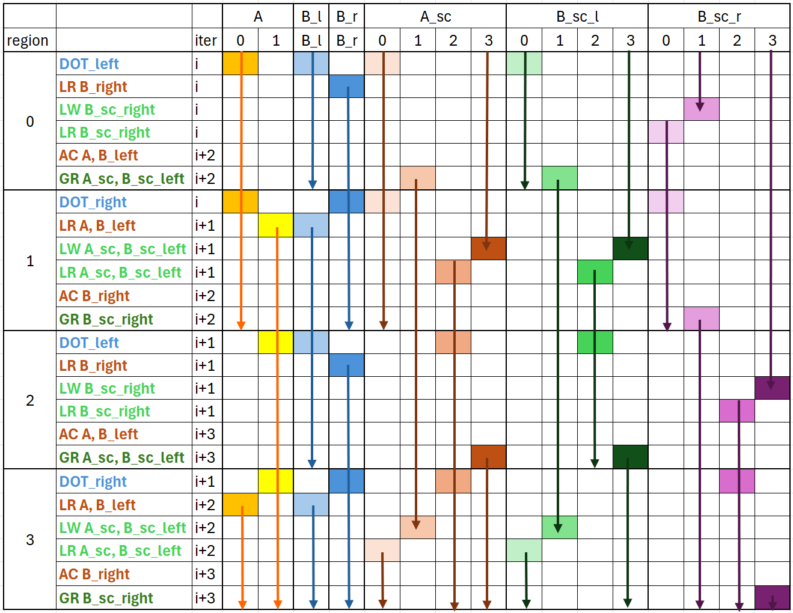

# MXFP4 GEMM Kernel (a4w4)

This kernel implements a high-performance MXFP4 (e2m1) GEMM targeting AMD MI350/355 GPUs (gfx950). It builds on the design principles from `a16w16/` and `a8w8/`, with additional complexity from per-group scaling and the microscaling (MX) data format.

## 1. Directory Structure

```
a4w4/
├── matmul_kernel.py      # The kernel implementation
├── bench.py              # Benchmark and correctness test
└── README.md             # This file
```

## 2. Key Differences from FP8

MXFP4 introduces per-group scaling factors that must be loaded, stored to LDS, and read back before MFMA can execute. This adds a new class of memory operations not present in FP8.

| Aspect | FP8 (a8w8) | MXFP4 (a4w4) |
|--------|------------|--------------|
| Data format | e5m2 (8-bit) | e2m1 (4-bit) |
| Tile size | 256x256x128 | 256x256x256 |
| MFMA instruction | `v_mfma_scale_f32_16x16x128_f8f6f4` | same |
| cbsz / blgp | 1 (E5M2) | 4 (E2M1) |
| MFMA cycles | 32 (cbsz/blgp <= 1) | 16 (cbsz/blgp > 1) |
| Scaling | None (pass `None`) | Per-group e8m0 scales for A and B |
| Scale group size | N/A | 32 elements |
| N-slicing | B split into left/right halves | Same, plus separate left/right scales |
| LDS padding | `[[1024, 16], [2048, 32]]` | `[[1024, 32]]` |

Both FP8 and MXFP4 use the same MFMA instruction (`v_mfma_scale_f32_16x16x128_f8f6f4`). The data format is controlled by the `cbsz` (input A) and `blgp` (input B) fields: 0=E4M3 (fp8), 1=E5M2 (bf8), 2=E2M3 (fp6), 3=E3M2 (bf6), 4=E2M1 (fp4). When both cbsz and blgp are <= 1, the instruction takes 32 cycles; otherwise it takes 16 cycles.

### 2.1 Microscaling (MX) Format

MXFP4 packs two 4-bit values per byte. Each group of 32 elements shares an 8-bit e8m0 scale factor. The `mfma_scaled` instruction takes both the data tile and its scale tensor:

```python
acc_left = gl.amd.cdna4.mfma_scaled(
    a=a, a_scale=a_sc_reg_buf0, a_format="e2m1",
    b=b_left, b_scale=b_sc_left_reg_buf0, b_format="e2m1",
    acc=acc_left,
)
```

### 2.2 Scale Pipeline

Scales follow a separate pipeline from tiles:

1. **GR** (Global Read): `buffer_load` scales into registers (`a_sc_buf1`, `b_sc_left_buf1`, etc.)
2. **LW** (Local Write): `smem_as.store(a_sc_buf1)` writes scales to shared memory
3. **LR** (Local Read): `load_shared_relaxed(smem_as, scale_a_layout)` reads scales back in the layout expected by MFMA

This store-to-LDS + load-from-LDS round-trip is necessary because `buffer_load` delivers scales in a blocked layout, but `mfma_scaled` requires them in a specific scale layout.

**Scale layouts through the pipeline:**

1. **HBM layout**: A scales are stored as `[M, K // SCALE_GROUP_SIZE]`, B scales as `[N, K // SCALE_GROUP_SIZE]` (split into left/right halves of `[N//2, K // SCALE_GROUP_SIZE]`). With `SCALE_GROUP_SIZE=32` and `BLOCK_K=256`, each tile loads `[256, 8]` for A scales or `[128, 8]` for B scales. Scales must be contiguous along the first dimension (M or N) for coalesced access, since each thread loads consecutive elements along that dimension.

2. **Global load layout**: Scales are loaded using `BlockedLayout`:
   - A scales (`blocked_scales_a`): `BlockedLayout([8, 1], [32, 2], [1, 4], [0, 1])` for shape `[256, 8]`. Each thread loads 8 elements along M. Within a warp, 32 threads cover M and 2 threads cover K-scale, giving `[256, 2]` per warp. Across 4 warps (`warpsPerCTA=[1, 4]`), the full `[256, 8]` is covered.
   - B scales (`blocked_scales_b`): `BlockedLayout([4, 1], [32, 2], [1, 4], [0, 1])` for shape `[128, 8]`. Each thread loads 4 elements along N. Within a warp, 32 threads cover N and 2 cover K-scale, giving `[128, 2]` per warp. Across 4 warps, the full `[128, 8]` is covered.

3. **LDS layout** (`shared_scales`): `SwizzledSharedLayout(1, 1, 1, order=[0, 1])` — a minimal shared layout since scale tiles are small and don't need the complex padding used for data tiles. Both A and B scales share the same LDS layout and the same shared memory allocation (reused via `smem_as` / `smem_bs`).

4. **MFMA scale layout**: Computed by `get_mfma_scale_layout()`, which derives the scale distribution from the dot operand layout so that each thread holds the scale values matching its MFMA data elements.

   A scales (`scale_a_layout`), shape `[256, 8]`:
   ```
   DistributedLinearLayout(
       reg_bases=[[0, 4], [32, 0], [64, 0], [128, 0]],
       lane_bases=[[1, 0], [2, 0], [4, 0], [8, 0], [0, 1], [0, 2]],
       warp_bases=[[0, 0], [16, 0]],
       shape=[256, 8]
   )
   ```
   Each thread holds 16 elements: 8 M-positions (stride 32) x 2 K-scale positions (0 and 4). Lane bits 0-3 index 16 consecutive M positions, lane bits 4-5 index 4 K-scale positions. Warps 0/1 cover M base [0..15], warps 2/3 cover M base [16..31], with register stride 32 extending to M=256.

   B scales (`scale_b_layout`), shape `[128, 8]`:
   ```
   DistributedLinearLayout(
       reg_bases=[[0, 4], [32, 0], [64, 0]],
       lane_bases=[[1, 0], [2, 0], [4, 0], [8, 0], [0, 1], [0, 2]],
       warp_bases=[[16, 0], [0, 0]],
       shape=[128, 8]
   )
   ```
   Each thread holds 8 elements: 4 N-positions (stride 32) x 2 K-scale positions (0 and 4). Lane bits 0-3 index 16 consecutive N positions, lane bits 4-5 index 4 K-scale positions. Warps 0/2 cover N base [0..15], warps 1/3 cover N base [16..31], with register stride 32 extending to N=128.

   Both layouts scatter the first dimension (M or N) at stride 32 to match the MFMA dot operand distribution, while the blocked global load layout groups consecutive elements for coalesced HBM access. The LDS round-trip bridges these two layouts.

The following diagram visualizes the complete layout for the MXFP4 GEMM, including the A, B, C matrices, their dot operand layouts, and the scale layouts used by `mfma_scale_f32_16x16x128_f8f6f4` with `CBSZ=4, BLGP=4`:


<details>
<summary>Command to generate this layout</summary>

```bash
python3 layout_plot/plot_layout.py --output mfma_scale_mxfp4 --force dot \
    --dotShape 256 256 256 --kWidth 32 --kGroup 1 --nonKDim 16 \
    --dtypeA f4 --dtypeB f4 --scale --mfmaTrans --warpsPerCTA 2 2
```

</details>

### 2.3 LDS Padding

MXFP4 uses single padding `[[1024, 32]]`, which matches the `a16w16` kernel. Both kernels share the same dotoperand layout, so the optimal padding parameters are identical despite different data types.

### 2.4 Why 16-Cycle MFMA?

With e2m1 format (cbsz > 1 or blgp > 1), the `mfma_scale_f32_16x16x128` instruction completes in 16 cycles instead of 32. This means each MFMA occupies less time, requiring more MFMAs to be interleaved with each memory operation to hide latency.

## 3. Pipeline Design


The diagram above shows the tiling and N-slicing strategy. The B matrix and its scales are split along the N dimension into left and right halves (B_l, B_r, B_sc_l, B_sc_r). The A matrix and A_sc scale are shared across both halves. Each iteration computes `C_left += A * B_l` (DOT_left) and `C_right += A * B_r` (DOT_right) as two separate `mfma_scaled` calls.

The kernel uses a double-buffered pipeline with loop unrolling by 2. Each unrolled iteration has 4 regions.



The diagram above shows the pipeline for one unrolled iteration (2 K-iterations across 4 regions). Columns represent register buffers. The arrows show the **liveness** of each register buffer — from when it is produced to when all consumers are done using it. (Note: we use the term "buffer" loosely here to refer to register groups holding a particular value; this is not buffer memory in the traditional sense, but makes the pipeline design easier to reason about.)

### 3-stage pipeline

This kernel follows the same **3-stage pipeline** design as the [a16w16 v5_local_prefetch](../a16w16/v5_local_prefetch/README.md) kernel:

- **Stage 0**: Global memory → LDS (AC for tiles) / Global memory → registers (GR for scales)
- **Stage 1**: LDS → registers (LR for tiles and scales)
- **Stage 2**: MFMA compute (DOT)

Data is prefetched 2 iterations ahead: while regions 0–1 compute iteration `i`, the AC/GR operations load data for iteration `i+2`. The LR operations in each region load data for the *next* iteration (`i+1`), so MFMA always consumes data that was locally prefetched in the previous region.

### Why scales need 4 register buffers

Tiles and scales use the same 3-stage pipeline and need the same number of **logical** buffers:

- **2 buffers for global load ping-pong**: While global load fills buffer 0, buffer 1 is being consumed. For tiles this means 2 LDS buffers (double-buffered `smemA`, `smemB_left`, `smemB_right`). For scales this means 2 register buffers holding the raw `buffer_load` results (e.g., `a_sc_buf1` and `a_sc_buf3`).
- **1 buffer for compute**: After the scale round-trip (LW → LR), the result lives in a separate register buffer in MFMA scale layout (e.g., `a_sc_reg_buf0`).

However, the liveness of the global-load register buffer **overlaps** with the compute register buffer — the GR result is still live (waiting for LW+LR round-trip) while the previous compute buffer is being consumed by MFMA. This overlap means each scale needs **2 + 2 = 4 register buffers** total: 2 for global-load results and 2 for post-round-trip compute values, ping-ponging between even (buf0/buf1) and odd (buf2/buf3) pairs.

For tiles, the situation is different because tiles use LDS (not registers) for the global-load stage, so there is no register-level overlap. Instead:

- **A** needs **2 register buffers** (A[0], A[1]) because A is consumed by both DOT_left and DOT_right within the same iteration — its liveness spans 2 regions. B tiles are sliced along N (B_left, B_right) and each half is only used in one region, so they need just **1 register buffer** each and are reloaded each region pair.

**Legend:**
- **AC**: `async_copy` (buffer_load_to_shared) for tiles
- **GR**: global read (`buffer_load`) for scales into registers
- **LR**: local read (`load_shared_relaxed`) for tiles and scales
- **LW**: local write (`store` to shared memory) for scales
- **A[0,1]**: tile A register buffers (2 for liveness across DOT_left + DOT_right)
- **B_l, B_r**: B_left and B_right tile registers (1 each, reloaded per region pair)
- **A_sc[0–3], B_sc_l[0–3], B_sc_r[0–3]**: scale register buffers (4 each, see above)

### How to read the pipeline diagram

The pipeline diagram has **4 row groups** (regions 0–3) and **columns for each register buffer**. Each row within a region is one operation. Here is how to read it:

**Rows**: Each row shows an operation (left side) and its K-iteration index (the `iter` column). For example, "DOT_left, i" means the DOT_left MFMA executes on data from iteration `i`, while "AC A, B_left, i+2" means tile prefetch for iteration `i+2`.

**Columns and arrows**: Each column is a register buffer (A[0], A[1], B_l, B_r, A_sc[0–3], etc.). A colored bar with an arrow (↓) shows the **liveness** of that buffer — from when the value is produced (top of the bar) to when the last consumer finishes (bottom of the arrow). If two bars overlap in the same column, that would be a conflict — the diagram is designed so this never happens.

**Reading a region**: Look at region 0 as an example. Follow the A[0] column: A[0] has a bar spanning DOT_left — it was produced earlier (in the previous unrolled iteration's region 3 LR) and is consumed here. Now look at A[1]: it is empty in region 0, meaning A[1] is free. In region 1, LR produces A[1] (for iteration `i+1`), and A[1] is then consumed in regions 2–3. This is the double-buffering of tile A.

**Scale buffers**: Follow the A_sc columns across regions. In region 0, A_sc[0] is consumed by DOT_left. In region 1, GR produces a new value into A_sc[1] (raw global load result for iter `i+2`), while LW+LR converts A_sc[1]'s predecessor into A_sc[2] (MFMA layout). In region 2, A_sc[2] is consumed by DOT_left. The 4 buffers allow the GR result and the compute value to coexist without conflicts.

**N-slicing pattern**: Refer back to the tiling diagram. Because B is split into B_l and B_r, each iteration has two DOT operations. Regions 0+1 handle one iteration: region 0 does DOT_left (A × B_l), region 1 does DOT_right (A × B_r). Regions 2+3 repeat the pattern for the next iteration. This is why A needs 2 register buffers (used across both DOT_left and DOT_right) while B_l and B_r each need only 1 (used in a single region).

**Prefetch distance**: Each region prefetches data 2 iterations ahead. In region 0, AC loads tiles for `i+2` into LDS, and GR loads scales for `i+2` into registers. The LR in region 0 loads tiles/scales for iteration `i` (which were prefetched 2 iterations ago). This 2-iteration prefetch distance is the hallmark of the 3-stage pipeline.

### Scale round-trip

Each scale goes through: GR (global → register) → LW (register → LDS) → LR (LDS → register in MFMA layout). The LW+LR round-trip is needed because `buffer_load` delivers scales in a blocked layout, but `mfma_scaled` requires the MFMA scale layout.

### Key design choices

- **Pre-computed `_next` offsets**: The loop advances base pointers by `2 * (BLOCK_K // 2)` once per unrolled iteration. Odd-iteration loads use `_next` offset variants instead of advancing pointers mid-iteration.
- **`commit_group()` / `wait_group()`**: Each commit group bundles tile async copies and scale buffer loads. With a recent LLVM feature (asyncmarkers), kernels that mix `buffer_load_to_lds` and regular `buffer_load` can now generate correct `vmcnt()` counter values.

## 4. LDS Port Contention and ds_write Latency

A critical hardware limitation affects scheduling: **ds_write and buffer_load_to_lds share the same LDS write port**. The texture data unit (TD) has higher priority than the shader sequencer (SQ), so ds_write can stall for up to ~400 cycles when buffer_load_to_lds data is ready.

Furthermore, the LDS has a FIFO queue per SIMD pair with only 8 slots. When ds_write occupies the head of the queue for ~400 cycles, subsequent ds instructions fill the remaining slots. Once full, the next ds instruction stalls until the head drains.

This means **ds_read cannot hide ds_write latency** due to queue slot limitations. Only MFMA instructions (which don't use the ds queue) can effectively hide it.

The LLIR scheduler addresses this by:
1. Placing ds_write (LW) after the ds_read (LR) chunk in each region
2. Allocating leftover MFMA instructions after the first LW to provide ~400+ cycles of coverage

## 5. Interleaved Epilogue with `extract_slice`

The epilogue (last 2 K iterations) uses `extract_slice` to split the [256, K//2] input tile, [256, K//SCALE_GROUP_SIZE] scale tensor, and [256, N//2] accumulator into 4 x [64, ...] slices along the M dimension. Each sliced `mfma_scaled` is interleaved with a `buffer_store` of the previous slice's result, overlapping the final computation with output writes.

## 6. LLIR Scheduler

The kernel requires the LLIR scheduler (`TRITON_ENABLE_LLIR_SCHED=1`) for optimal performance. The scheduler operates at the LLVM IR level (pre-register allocation) and performs two transformations per region:

1. **Anchor movement**: Moves LR instructions (and associated waitcnt/barrier) from between the last LW and first GR to after the 2nd-to-last GR, placing ds_write after the ds_read chunk.
2. **MFMA interleaving**: Distributes MFMA instructions among anchor instructions using a budget-based scheme:
   - 4 MFMAs after each GR (or 2 for 32-cycle MFMA), 1 if GR is followed by LR
   - 1 MFMA after each LR
   - Leftover MFMAs after the first LW (to hide ds_write latency)
   - 2 MFMAs at the end of each region

## 7. amdgcnas Post-Processor

The kernel also benefits from the amdgcnas assembly post-processor (`TRITON_ENABLE_AMDGCN_AS=1`), which performs:

- **LICM (Loop Invariant Code Motion)**: Hoists loop-invariant instructions (LDS address calculations) to the loop prologue, with register renaming when the output register is redefined in the loop
- **`.amdhsa_accum_offset` fix**: Ensures the full VGPR range (v0-v255) is available by setting `accum_offset=256`, preventing renamed VGPRs from aliasing with AGPRs

## 8. Performance

Measured on MI355 with shape 4096x4096x32768, MXFP4 (e2m1):

| Configuration | TFLOPS | VGPRs | Spills | MFMA Eff. |
|---------------|--------|-------|--------|-----------|
| base | 655 | 512 | 261 | 5% |
| llirSched | 4904 | 512 | 0 | 70% |
| llirSched + amdgcnas | 5270 | 512 | 0 | 92% |

The LLIR scheduler alone eliminates register spills and achieves 70% MFMA efficiency. The amdgcnas post-processor further improves to 92% by hoisting loop-invariant instructions and reducing register pressure.

## 9. How to Run

From the `a4w4` directory:

```bash
# With LLIR scheduler
TRITON_ENABLE_LLIR_SCHED=1 python bench.py --K 32768

# With both LLIR scheduler and amdgcnas
TRITON_ENABLE_LLIR_SCHED=1 TRITON_ENABLE_AMDGCN_AS=1 python bench.py --K 32768
```

For accurate performance measurement with rocprof:

```bash
TRITON_ENABLE_LLIR_SCHED=1 TRITON_ENABLE_AMDGCN_AS=1 \
    rocprofv3 --kernel-trace -d out -- python bench.py --K 32768 --rocprof
```
