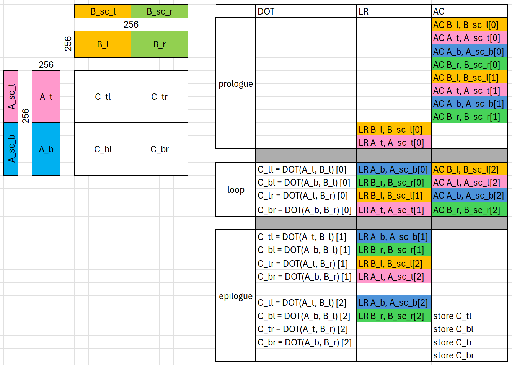

# MXFP4 GEMM Kernel — v1_sliceMN

This version reworks [v0_sliceN](../v0_sliceN/README.md) around the M+N slicing
pattern from [a16w16/v8_sliceMN](../../a16w16/v8_sliceMN/README.md), with one
MXFP4-specific addition: **scale tiles ride along with their input tiles
through async copy**, eliminating the `ds_write` round-trip v0 used for
scales. Read v0's README first for MXFP4 basics (e8m0 scales, `mfma_scaled`,
`ds_read_tr`); this document only covers what changes.

## 1. Design



A is sliced along M into `A_t` / `A_b`, B is sliced along N into `B_l` /
`B_r`, and the output tile is a 2x2 grid of 128x128 quadrants. Each K-step
runs four regions (one DOT + one LR + one AC each); the loop is unrolled by 2
so LDS buffer indices alternate without runtime computation. This is the
v8_sliceMN skeleton — its benefits (lower register pressure per quadrant,
natural-pipeline epilogue) carry over unchanged.

The MXFP4 delta: every `AC X` also issues `AC X_sc` in the same commit group,
and every `LR X` also issues `LR X_sc`. With BLOCK_M = BLOCK_N = BLOCK_K =
256 the half-tile scales are 128x8 uint8 = 1024 bytes = 4 bytes/thread, so
each scale AC lowers to a single `buffer_load_dword ... lds` riding right
behind its tile's `buffer_load_dwordx4`. The scale stays in LDS until the
`smem.load(scale_layout)` (`ds_read_tr`) right before its DOT.

Compared to v0_sliceN, this removes per-region `ds_write`s for scales and the
4-deep register double-buffering they required (v0 §3.4-3.6). The waitcnt
schedule needs only one count, since tiles and scales share commit groups.

## 2. Performance

Measured on MI355, 4096x4096xK, rocprof timing (1000 dispatches, last-100
average):

| Config (K=16384) | v0_sliceN | v1_sliceMN | v1 MFMA Eff. |
|------------------|-----------|------------|--------------|
| base | 4122 | 4433 | 60.4% |
| llirSched | 4532 | 4728 | 70.5% |
| llirSched + amdgcnas | 5002 | 5112 | 94.4% |
| llirSched + amdgcnas + nobar | — | 5163 | 95.7% |

`nobar` adds `TRITON_ENABLE_AMDGCN_AS_REMOVE_BARRIER=1`, which keeps only the
first `s_barrier` per loop iteration. The four waves progress uniformly in
this kernel, so the remaining 7 region barriers are redundant — verified
correct for v1_sliceMN; do not assume for other kernels.

At K=65536 v1 reaches 5561 TFLOPS (94.8% MFMA eff).

## 3. How to Run

From the `a4w4` directory:

```bash
TRITON_ENABLE_LLIR_SCHED=1 TRITON_ENABLE_AMDGCN_AS=1 \
python bench.py --version 1

# Full table:
python ../../../scripts/run_perf_table.py --kernel a4w4 --versions 0 1 \
  --configs base llir llir+amdgcnas llir+amdgcnas+nobar --K 16384 --rocprof
```
