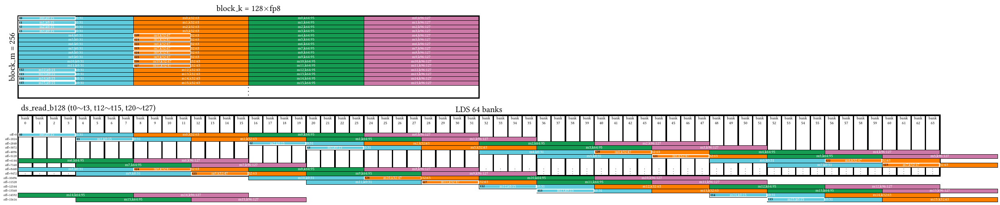
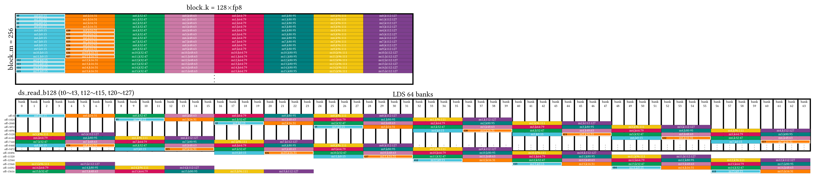

# BF8 GEMM Kernel (a8w8)

This kernel applies the design principles developed in the [a16w16/](../a16w16/) tutorial, adapted for BF8 (e5m2) compute. Only the final optimized version is provided. If you haven't completed the a16w16 journey (v0–v9), start there first — this kernel assumes familiarity with all techniques introduced in that series.

After understanding this kernel, proceed to [a4w4/](../a4w4/) for the MXFP4 kernel, which builds on the same design with additional complexity from per-group scaling.

## 1. Directory Structure

```
a8w8/
├── matmul_kernel.py      # The kernel implementation
├── bench.py              # Benchmark and correctness test
└── README.md             # This file
```

## 2. Key Differences from FP16

The BF8 kernel uses the same optimization techniques as `a16w16/v9_beyond_hotloop`, with parameters adjusted to match BF8 MFMA instruction characteristics.

| Aspect | FP16 (a16w16) | BF8 (a8w8) |
|--------|---------------|------------|
| Tile size | 256×256×64 | 256×256×128 |
| MFMA instruction | `mfma_f16_16x16x32` | `mfma_f8_16x16x128` |
| MFMA shape | [16, 16, 32] | [16, 16, 128] |
| k_width | 8 | 32 |
| Elements per thread | 8 (16-bit × 8 = 128 bits) | 32 (8-bit × 32 = 256 bits) |
| LDS padding | [[512, 16]] | [[1024, 16], [2048, 32]] |

### 2.1 Why Larger BLOCK_K?

BF8 MFMA processes 128 elements along the K dimension per instruction (vs. 32 for FP16). To maintain the same total MFMA compute time per iteration, BLOCK_K doubles from 64 to 128.

Each BF8 MFMA also takes 32 cycles to execute (vs. 16 for FP16), so pipelining works on a coarser grain: the LLIR scheduler interleaves half as many MFMAs between each memory operation (2 MFMAs per `buffer_load` instead of 4, 2 per `ds_read` instead of 4). `BLOCK_K=128` ensures each iteration still has enough MFMA work to fully hide memory latency behind compute.

### 2.2 Scaled MFMA

BF8 uses `mfma_scaled`, which supports per-tensor scaling factors:

```python
acc0 = gl.amd.cdna4.mfma_scaled(a, None, "e5m2", b0, None, "e5m2", acc0)
```

The `None` arguments are placeholders for optional scale tensors. `"e5m2"` specifies the BF8 format (5-bit exponent, 2-bit mantissa).

### 2.3 LDS Layout and kWidth

The LDS padding depends on the `kWidth` parameter of the dot operand layout. Without scales, `kWidth` can be either 16 or 32 as long as both A and B operands use the same value. However, **with scales** (as in the MXFP4 kernel), `kWidth` must be 16 to match the scale layout required by hardware.

**kWidth=32 (no scales)**: Requires dual padding `[[1024, 16], [2048, 32]]` to avoid bank conflicts:

```python
sharedLayoutA: gl.constexpr = gl.PaddedSharedLayout(
    [[1024, 16], [2048, 32]],  # Two padding rules
    ...
)
```



<details>
<summary>Command to generate this layout</summary>

```bash
python3 layout_plot/plot_layout.py --output lds_padding_1024-16_2048-32 --force lds \
  --gfx 950 \
  --tensorShape 256 128 \
  --kWidth 32 \
  --nonKDim 16 \
  --layout padding \
  --access read \
  --swizzleVec 16 \
  --sharedLayout "[[1024, 16], [2048, 32]], [[0, 1], [0, 2], [0, 4], [0, 8], [0, 16], [0, 32], [0, 64], [16, 0],[32, 0], [64, 0], [1, 0], [2, 0], [4, 0], [8, 0], [128, 0]]" \
  --dtype fp8
```

</details>

**kWidth=16 (required for scales)**: Only needs single padding `[[1024, 32]]`:

```python
sharedLayoutA: gl.constexpr = gl.PaddedSharedLayout(
    [[1024, 32]],  # Single padding rule
    ...
)
```



<details>
<summary>Command to generate this layout</summary>

```bash
python3 layout_plot/plot_layout.py --output lds_padding_1024-32_kWidth16 --force lds \
  --gfx 950 \
  --tensorShape 256 128 \
  --kWidth 16 \
  --nonKDim 16 \
  --layout padding \
  --access read \
  --dtype fp8 \
  --sharedLayout "[[1024, 32]], [[0, 1], [0, 2], [0, 4], [0, 8], [0, 16], [0, 32], [0, 64], [16, 0],[32, 0], [64, 0], [1, 0], [2, 0], [4, 0], [8, 0], [128, 0]]"
```

</details>

## 3. Optimization Techniques

This kernel incorporates all optimizations from the a16w16 tutorial series:

- **XCD-aware PID remapping** — Groups adjacent tiles on the same XCD for L2 cache reuse
- **Workgroup swizzling** — Uses `GROUP_SIZE_M=4` to improve L2 cache hit rate for the A matrix
- **N-slicing** — Separate `smemB0` and `smemB1` buffers to reduce peak register pressure
- **Loop unrolling by 2** — Eliminates register copy overhead at iteration boundaries
- **3-stage pipeline** — Overlaps global loads, LDS loads, and MFMA compute
- **Interleaved epilogue** — Overlaps final MFMA with stores using `extract_slice`

For detailed explanations of these techniques, refer to the corresponding versions in `a16w16/`:
- XCD remapping and workgroup swizzling: [v9_beyond_hotloop](../a16w16/v9_beyond_hotloop/README.md)
- N-slicing: [v7_sliceN](../a16w16/v7_sliceN/README.md)
- Loop unrolling: [v6_loop_unroll](../a16w16/v6_loop_unroll/README.md)
- Local prefetch: [v5_local_prefetch](../a16w16/v5_local_prefetch/README.md)
- Global prefetch: [v4_global_prefetch](../a16w16/v4_global_prefetch/README.md)

## 4. Performance

Measured on MI355 with shape 4096×4096×16384, BF8 (e5m2):

| Configuration                   | TFLOPS | VGPRs | Spills | MFMA Eff. |
|---------------------------------|--------|-------|--------|-----------|
| base                            |   2466 |   478 |      0 |       62% |
| llirSched                       |    747 |   512 |    111 |       20% |
| llirSched + amdgcnas            |   3383 |   444 |      0 |       99% |

The [LLIR Scheduler](https://github.com/ROCm/triton/tree/matmul_4waves) alone causes register spills, which severely degrades performance. The [amdgcnas](https://github.com/ROCm/triton/tree/matmul_4waves) post-processor resolves register allocation issues, achieving 99% MFMA efficiency.

## 5. How to Run

From the `a8w8` directory:

```bash
python bench.py --K 16384
```

This runs correctness checks against `torch.matmul` and reports TFLOPS.

For accurate performance measurement with rocprof:

```bash
rocprofv3 --kernel-trace -d out -- python bench.py --K 16384 --rocprof
```

The `--rocprof` flag runs the kernel 1000 times with rotating buffers to avoid GPU cache effects, producing cold-cache timings representative of real workloads.
