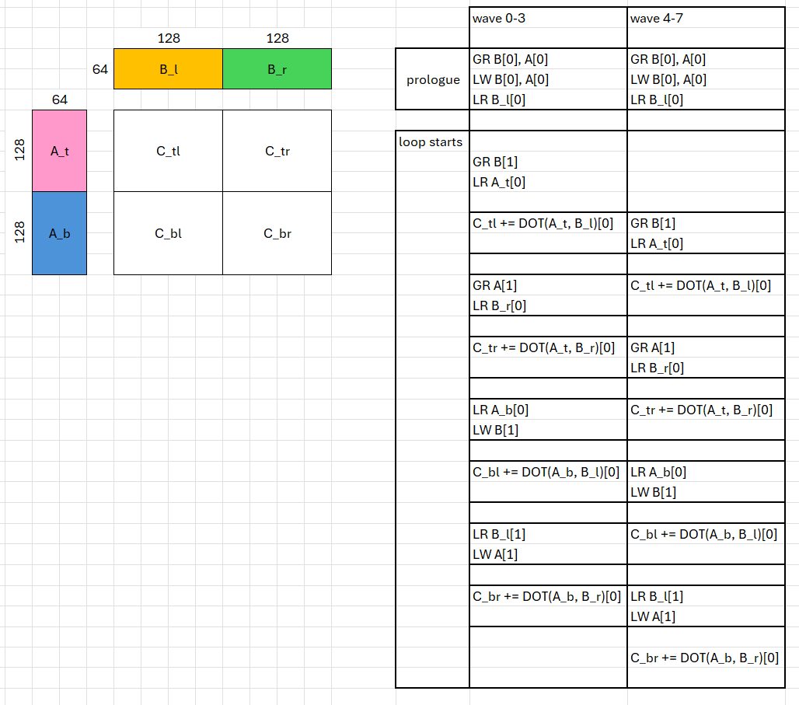

# inter_wave — 8-wave warp-pipeline a16w16 GEMM for gfx942 / MI300X

8 warps per CTA = **2 waves per SIMD**, `warps_per_cta = [2, 4]`, tile
256×256×64, `v_mfma_f32_16x16x16_f16`. The hot loop is eight barrier-delimited
regions with memory and matrix work **strictly alternating**, so the two wave
groups ping-pong: while one group holds the matrix unit the other issues its
global loads, LDS reads and LDS writes.

> **Read [`../README.md`](../README.md) first** for the performance numbers (§3)
> and the CDNA3 constraints (§4), and ideally
> [`../intra_wave/README.md`](../intra_wave/README.md) before this one — it shows
> the problem this kernel solves.

**This is the answer to intra_wave's ceiling.** That kernel has to absorb every
`local_store` and every barrier inside a single instruction stream, and a 16-cycle
MFMA cannot cover a ~20-cycle `ds_write`. Here two wave groups run one region out
of phase, so the group on the matrix unit is covered by the group in memory, and
the same traffic costs almost nothing: **~98% per-SIMD MFMA efficiency against
89%.**

```bash
cd ..                                              # kernels/gemm/gfx942
python bench.py -k inter_wave                      # correctness + TFLOPS
python tools/bench_prepared.py --kernel inter_wave --gpus all   # sustained timing
python tools/lds_conflict.py  --kernel inter_wave              # LDS bank conflicts
python tools/run_att.py inter_wave --K 8256 --out att_inter     # ATT trace
```

No environment variables needed — the no-AGPR setting is baked into the launch,
and unlike [`../intra_wave`](../intra_wave/) this kernel does **not** use the LLIR
scheduler plugin: its schedule is expressed directly with `warp_pipeline_stage`,
and letting the plugin reorder the loop undoes the region structure.

Codegen: **240 VGPR, 0 AGPR, 0 spills, 2 waves/SIMD, 64 KB LDS**, and
`SQ_LDS_BANK_CONFLICT` measures exactly **0**.

## The pipeline



Left: the 256×256 output tile as four 128×128 quadrants, with A split along M
into `A_t` / `A_b` and B split along N into `B_l` / `B_r`. Right: the schedule,
with the two wave groups (waves 0–3 and waves 4–7) offset by exactly one region.
That phase shift is what `warp_pipeline_stage` sets up, and it is the whole point
— one group is always on the matrix unit while the other is in memory.

### Whole-tensor global and LDS writes, sliced LDS reads

Global loads and LDS stores move whole tensors; reads and dots work on half-tiles
sliced out of the same buffers:

```
GR A / LW A    A[256 x 64]    4 x buffer_load_dwordx4  /  4 x ds_write_b128
GR B / LW B    B[64 x 256]    4 x buffer_load_dwordx4  /  4 x ds_write_b128

A_t = A[0:128, :]   A_b = A[128:256, :]   B_l = B[:, 0:128]   B_r = B[:, 128:256]
```

The slice is along M (for A) or N (for B) — never along K, the swizzled dimension
— so the shared layout is undisturbed by slicing.

### One LDS buffer; the registers are the pipeline

```
A[256 x 64] x 2 B  +  B[64 x 256] x 2 B  =  32 KB + 32 KB  =  64 KB
```

exactly MI300X's LDS, so double buffering is impossible — and unnecessary. **The
pipelining buffer is the registers holding the in-flight global loads, not LDS.**
LDS holds tile *k* while tile *k+1* is in flight from HBM; the `local_store` of
*k+1* lands only after the last `local_load` of *k*.

### The eight regions

Region *k* processes tile *k* and prefetches tile *k+1*:

| region | kind | work | instructions | cycles |
|---|---|---|---|---|
| 0 | mem | `GR B[k+1]`, `LR A_t[k]` | 4 `buffer_load_dwordx4` + 8 `ds_read_b128` | 256 |
| 1 | dot | `C_tl += A_t × B_l` | 32 mfma | 512 |
| 2 | mem | `GR A[k+1]`, `LR B_r[k]` | 4 `buffer_load_dwordx4` + 4 `ds_read_b128` | 128 |
| 3 | dot | `C_tr += A_t × B_r` | 32 mfma | 512 |
| 4 | mem | `LR A_b[k]`, `LW B[k+1]` | 8 `ds_read_b128` + 4 `ds_write_b128` | 384 |
| 5 | dot | `C_bl += A_b × B_l` | 32 mfma | 512 |
| 6 | mem | `LR B_l[k+1]`, `LW A[k+1]` | 4 `ds_read_b128` + 4 `ds_write_b128` | 256 |
| 7 | dot | `C_br += A_b × B_r` | 32 mfma | 512 |

Memory-region cycles are LDS-port time with 4 of the 8 waves in the memory phase
at 128 B/clk. **Every memory region fits inside the dot region it ping-pongs
against** (256/128/384/256 against 512) — that is the property which keeps the
matrix unit fed, and the reason this schedule reaches ~98% per-SIMD MFMA
efficiency.

### Why this order

**Dot order** `C_tl → C_tr → C_bl → C_br` together with **read order**
`B_l → A_t → B_r → A_b` halves the operand registers. A_t is live only across
regions 1–3 and A_b only across 5–7, so **the two share one register set**; B_l
(used in 1 and 5) and B_r (used in 3 and 7) both span the body and need their
own. Per lane, replicated across the warp grid:

```
A_t / A_b    [128x64] over WARPS_M=2     32 VGPR  (shared)
B_l , B_r    [64x128] over WARPS_N=4     16 VGPR each
C quadrants  4 x [128x128] f32          128 VGPR
A,B staging  whole tiles / 8 waves        32 VGPR
```

**The register wall is why this ordering exists at all.** Two waves per SIMD split
the unified 512-register file, so each wave gets **256 registers, VGPR and AGPR
together** — AGPRs buy no capacity here, which is why this kernel runs with
`amdgpu-agpr-alloc=0,0` while [`../intra_wave`](../intra_wave/) reserves 256 AGPRs.
Independent registers for all four half-tiles would cost 96 instead of 64:

```
accumulators   4 × [128×128] f32 / (8 × 64)  = 128
dot operands   4 live half-tiles             =  96
global staging whole tiles / 8 waves         =  32
                                               ---
                                               256   before addressing
```

which compiles to 256 VGPRs **with 28 spill slots**. An earlier version of this
kernel escaped that by reading K=32 slices instead of full half-tiles — 224 VGPR,
0 spills — but it doubled the region count to 16 and therefore the barriers. The
ordering above gets the same register saving for free by making `A_t` and `A_b`
non-overlapping, and keeps 8 regions.

**GR/LW order** is B before A on both sides. Each store sits 2 dot regions
(~1024 cycles) after its load, which is the global-latency cover; B is stored
first because `LR B_l[k+1]` in region 6 needs it.

**Hazards** are all closed by region boundaries: A is read in regions 0 and 4 and
written in 6; B is read in 2 (and in 6, for *k+1*) and written in 4.

### LDS layout

`SwizzledSharedLayout(8, 1, 8)`, derived in [`../README.md`](../README.md) §4.4.
It matters far more here than in [`../intra_wave`](../intra_wave/): the same
conflict-free layout is worth **−9.9% loop cycles** against −1.0% there, because
two resident waves per SIMD keep the LDS port roughly twice as busy. It was the
single largest win in this kernel — larger than halving the region count.

## Differences from the gfx950 kernel

Same starting point — [`../../inter_wave/a16w16`](../../inter_wave/a16w16) — same
tile, same 8 warps, same `warps_per_cta`, same quadrant decomposition, same
`warp_pipeline_stage` phase shift. Everything in this table is forced by CDNA3.

Same tile, same 8 warps, same `warps_per_cta`, same quadrant decomposition, same
`warp_pipeline_stage` phase shift as
[`../../inter_wave/a16w16`](../../inter_wave/a16w16). The *platform* differences
are in [`../README.md`](../README.md) §4; at the **kernel** level:

| | gfx950 | **this kernel** |
|---|---|---|
| LDS slots | 4 half-tiles × 2 buffers | **2 whole tensors** (A, B), 1 buffer |
| what LDS holds | the pipeline (tile *k+1* streams in) | tile *k* only — registers pipeline |
| mfma / K-step / wave | 64 | **128** |
| loop | 2× unrolled, 4 regions per K-step | **8 regions**, no unroll |
| dot order | `C_tl → C_bl → C_tr → C_br` | **`C_tl → C_tr → C_bl → C_br`** |
| memory stage contains | `local_load` + async copy | `local_load` + **`local_store`** + `buffer_load` |

Four consequences worth spelling out.

**1. There is no async copy, so LDS writes are real instructions in the
schedule.** On gfx950 a region's memory stage is a `local_load` plus an
`async_copy` that costs only an address computation — the HBM→LDS traffic never
occupies the LDS port from the wave's point of view. On gfx942 that same traffic
becomes 4 `ds_write_b128` per tensor competing with `ds_read` for the port. It is
why regions 4 and 6 are the expensive ones, and why *where* the writes go is a
design decision rather than a detail.

**2. Synchronisation is barriers, not a counter.** `wait_group(n)` is a per-wave,
ordered wait on outstanding async copies: cheap, and it does not serialise the two
wave groups. `s_barrier` does. That is the largest structural cost CDNA3 adds, and
it is why the region *count* matters here in a way it does not on gfx950 — going
from 16 regions to 8 removed 8 barriers per K-step.

**3. Single buffering inverts what LDS is for.** gfx950 double-buffers, so LDS
*is* the pipeline: tile *k+1* streams into buffer 1 while tile *k* is read out of
buffer 0. At 64 KB one 256×256×64 stage fills LDS exactly, so gfx942 pipelines in
**registers** instead — 32 VGPR of staging holding tile *k+1* in flight — and
commits to LDS only after the last read of tile *k*. That is what pins `LW` to
regions 4 and 6, late in the body.

**4. Padding is unaffordable, so the swizzle has to be right.**
`PaddedSharedLayout([[512, 16]])` spends LDS to sidestep bank conflicts. With LDS
full to the byte that option is gone, and a wrong swizzle costs 43% of LDS cycles.
The padded layout is also why the gfx950 kernel is insensitive to the global-load
lane mapping, whereas here the two had to be co-designed: lanes walk *consecutive
rows* so 16 lanes cover two adjacent 128 B rows = 256 B = all 64 banks exactly
once.

The differing dot order follows from (3). On gfx950 both A half-tiles can stay
live, so the order is free; here the operand budget forces `A_t`'s uses to be
adjacent and `A_b`'s to be adjacent, so the two can share registers.

Interestingly the region *cadence* ends up identical: gfx950 gets 4 regions of
16 × 32-cycle MFMA per K-step, gfx942 gets 4 dot regions of 32 × 16-cycle MFMA —
512 cycles either way. CDNA3's narrower MFMA does not change how often the wave
groups swap; it only doubles the instruction count inside each region.

---

That is the end of the reading path. To go further:
[`../README.md`](../README.md) §3 for the numbers,
[`../intra_wave/note.md`](../intra_wave/note.md) for the optimization log of the
4-wave kernel (much of which — the LDS swizzle, the prologue load ordering —
applies here too), and `tools/` for the measurement harnesses.
