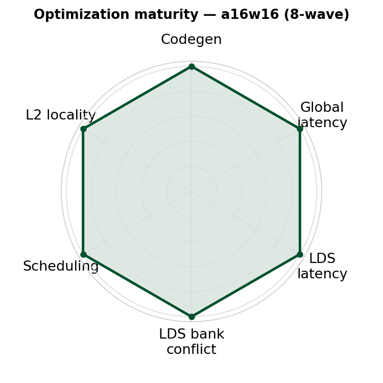
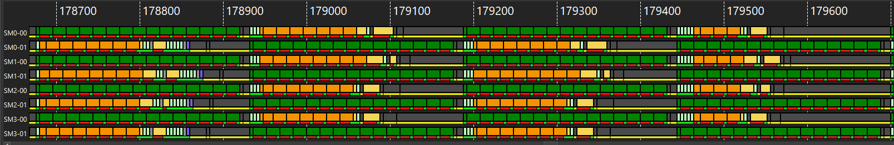
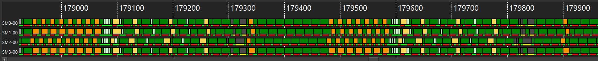

# inter_wave/a16w16 — 8-wave warp-pipeline FP16/BF16 GEMM (gfx950)

<p align="center">
  
</p>

**Optimization maturity (rough).** Axes — codegen, global latency, LDS latency, LDS bank conflict, scheduling, L2 locality — are defined in the [`v0_naive` README](../../intra_wave/a16w16/v0_naive/README.md); the polygon vs the dashed "optimal" envelope shows how mature this kernel is.


An **8-wave** (8 warps/CTA → **2 waves/SIMD**) FP16/BF16 GEMM for gfx950 / MI350X.
It schedules the hot loop at the **wave level** with `warp_pipeline_stage`, slices the
256×256 output tile into a **2×2 grid of [128×128] quadrants**, and runs with **no
AGPRs**.

## 1. Design

The kernel borrows the hot-loop
structure from the 4-wave [`a16w16/v9`](../../intra_wave/a16w16/v9_beyond_hotloop/README.md)
and runs it with 8-wave `warp_pipeline_stage` wave-level scheduling. The
256×256 tile is split into a **2×2 grid of [128×128] quadrants**, each operand half-tile
in its **own** double-buffered LDS allocation (`smemA_top/bot`, `smemB_left/right`).

| | **this kernel** (8-wave) | `a16w16/v9` (4-wave ref) |
|---|---|---|
| Warps / CTA | 8 (`[2,4]`) | 4 (`[2,2]`) |
| Waves / SIMD | 2 | 1 |
| Tile M×N×K | 256×256×64 | 256×256×64 |
| M/N slicing | 2×2 quadrants | 2×2 quadrants |
| LDS buffers | 2 (double) | 2 (double) |
| LDS allocation | 4 separate per-quadrant | 4 separate per-quadrant |
| K-unroll | 2× | 2× |
| `local_load` | non-relaxed (separate allocs) | non-relaxed (separate allocs) |
| Hot-loop scheduling | `warp_pipeline_stage` | LLIR scheduler + amdgcnas |
| XCD PID remap | yes (v9-style) | yes |

## 2. What changes from the 4-wave kernel

The 8-wave kernel is the 4-wave `a16w16/v9` with **three deltas**. Everything else — the
2×2 `[128×128]` quadrant slicing, the four separate double-buffered LDS allocations, the
`mfma` / `local_load` / `buffer_load_to_shared` operations, and the XCD PID remap — carries
over unchanged.

### 2.1 Loop structure — the same region, restaged

The output is four quadrants, each its own f32 accumulator, and the loop is unrolled 2×
into **8 regions** (one per quadrant × buffer):

```
acc_tl += DOT(A_top, B_left)     acc_tr += DOT(A_top, B_right)
acc_bl += DOT(A_bot, B_left)     acc_br += DOT(A_bot, B_right)
```

In the 4-wave `v9`, a region is a single block — one `mfma` immediately followed by the
`local_load` + async refill for the next region — and the LLIR scheduler interleaves the
two. The 8-wave kernel takes that **same region** and only splits its `mfma` and its memory
ops into two `warp_pipeline_stage` clusters; the wave-level pipeliner then stripes one wave
group's mfma cluster over the other group's mem cluster:

| 4-wave `v9` region (compiler-interleaved) | 8-wave region (wave-pipelined) |
|---|---|
| <pre>acc_tl = mfma(a_top, b_left, acc_tl)<br>wait_group(5)<br>a_bot  = smemA_bot.load(dotA)<br>buffer_load_to_shared(smemB_left, …)<br>commit_group()</pre> | <pre>wait_group(5)<br>with warp_pipeline_stage("mfma", priority=0):<br>    acc_tl = mfma(a_top, b_left, acc_tl)<br>with warp_pipeline_stage("mem", priority=1):<br>    a_bot = smemA_bot.load(dotA)<br>    buffer_load_to_shared(smemB_left, …)<br>    commit_group()</pre> |

Same instructions, near-identical order — the only edits are the two `with warp_pipeline_stage(...)`
wrappers and **hoisting the `wait_group`** from just before the load (4-wave) up to *before* the
mfma cluster (8-wave). The **memory** cluster carries the **higher** priority (1 vs 0) so it can
still issue its address-update VALU while the other group hammers the matrix unit (see
[`docs/warp_pipelining.md §5`](../../../../docs/warp_pipelining.md)).

> [!NOTE]
> Why is `wait_group(5)` hoisted **above the mfma stage** rather than left just before the
> **mem stage** that actually issues the `local_load` whose data it drains? That placement looks
> wrong at first glance — draining right before the consuming load would seem natural — and it is
> the crux of the 8-wave design. [§2.3](#23-where-async_wait-goes--the-counter-intuitive-part)
> explains it: the two wave groups run a stage apart, so the LDS hazard must be closed a full
> stage early.

### 2.2 Layout changes — one warp-grid edit, `[2,2] → [2,4]`

Doubling the waves changes exactly one thing in the layouts: `warpsPerCTA` goes from
**`[2,2]` (4 warps) to `[2,4]` (8 warps)**. Every layout delta follows mechanically from
that — the global-load layouts gain one extra warp dimension (tiling M for A, N for B) so
8 warps split the same tile, while the shared / dot-operand / MFMA layouts are
warp-count-independent and reused **verbatim**. Because all of them are constructed
**parametrically** from the `[WARPS_M, WARPS_N]` constants (`= [2, 4]`) by the layout
builders, the change is a one-line edit rather than a hand-rewrite of every layout — a small,
regular change for a16w16. B is still pre-transposed to `(N, K)` and fed as a logical
`(K, N)` operand via strides so K stays contiguous for the async copy, exactly as in `v9`.

### 2.3 Where `async_wait` goes — the counter-intuitive part

The tiling and ping-pong schedule are essentially identical to `intra_wave/a16w16/v9`, so
the figure below is **not** about the tile decomposition. It highlights the one thing the
8-wave kernel must get right that the 4-wave kernel does not: **where the `async_wait`
(`wait_group`) lands**.

<p align="center">
  
</p>

Read the two columns as the two co-resident wave groups (`wave0-3`, `wave4-7`), running a
full stage apart. Follow the red `A_t[2]`: `wave0-3` issues the async copy `AC A_t[2]` near
the top, but the `local_read` `LR A_t[2]` that consumes it does not happen until many stages
later — by which point `wave4-7` is the group *ahead*. The `async_wait(5)` guarding that read
(also red) therefore has to guarantee that **both** wave groups have committed their
outstanding async copies into LDS before the ahead group reads — not just the reader's own
group. Because the two groups run a stage apart, the LDS producer→consumer window spans
**`S-1 → S+1`** (two stages, across groups), which is exactly why every `wait_group(...)` is
placed *before* its mfma cluster rather than at the immediately following boundary. The full
derivation is in [`docs/warp_pipelining.md §7`](../../../../docs/warp_pipelining.md).

## 3. Performance

MI355X, gfx950, 4096×4096, fp16, **no-AGPR** (`amdgpu-agpr-alloc=0,0` via `llvm_fn_attrs`),
Triton `gfx950-tutorial-v1.1`, rocprof cold-rotating (`--rotating-buffer-size 2048`). This
kernel (`scripts/collect_perf.py`) vs the 4-wave [`intra_wave/v9`](../../intra_wave/a16w16/v9_beyond_hotloop/README.md)
reference (`scripts/run_perf_table.py --configs llir+force-agpr+amdgcnas --rocprof`):

| K | this kernel TFLOPS | this kernel MFMA eff | `intra_wave/v9` TFLOPS | `intra_wave/v9` MFMA eff |
|---|---|---|---|---|
| 8192  | **1479** | 99.84% | 1587 | 97.79% |
| 16384 | **1485** | 99.8% | 1460 | 97.7% | *(not re-measured)*
| 32768 | 1291 | 84.3% | **1305** | 62.7% | *(not re-measured)*

VGPRs / spills: this kernel **248 / 0**, `intra_wave/v9` **480 / 0** (both loop-spill-free).

The two routes are neck-and-neck. This kernel edges the 4-wave `intra_wave/v9` (LLIR scheduler +
force-agpr + amdgcnas) on TFLOPS at K ≤ 16384 (**~+1–2%**) and holds ~99.8% loop MFMA there;
at K=32768 `intra_wave/v9` edges it (1305 vs 1291) and both kernels' loop MFMA drops as the
buffer-load stall sets in. (MFMA-eff is a single-dispatch ATT reading — treat the last digit as
noise.)

### Trace (MI355X, K=8192)

Two single-dispatch ATT timelines at 4096²×8192 on MI355X, drawn at the same width — this
8-wave `inter_wave` kernel on top, the 4-wave `intra_wave/v9` below. Green = MFMA, orange =
memory:

<p align="center">
  <br>
  <em><b>this kernel (8-wave)</b>: two rows per SIMD (e.g. SM0-00 / SM0-01) ping-pong — while one wave group runs green MFMA, the other runs orange memory, then they swap.</em>
</p>

<p align="center">
  <br>
  <em><b>4-wave <code>intra_wave/v9</code></b>: one row per SIMD (e.g. SM0-00), near-solid green with the memory ops interleaved inline by the compiler.</em>
</p>

Both reach **near-solid MFMA issue** with the loads hidden behind compute — the same result
via the two different scheduling models (wave-level ping-pong vs compiler interleave).

## 4. Running

```bash
# correctness + do_bench TFLOPS (from this kernel dir)
python bench.py --K 8192 --dtype fp16

# rocprof cold-rotating TFLOPS + MFMA efficiency (ATT) + VGPR/spill (from the repo root)
python scripts/collect_perf.py --kernel a16w16 --K 8192 --dtype fp16

# large K needs a bigger rotating buffer to stay cold (≥3 copies)
python scripts/collect_perf.py --kernel a16w16 --K 32768 --dtype fp16 --rotating-buffer-size 2048
```

Drop `--K` to sweep all sizes, `--dtype` to run fp16 + bf16. Clear `~/.triton/cache` after
editing the kernel.

The **no-AGPR** setting is baked into the kernel's launch via Triton's built-in
`llvm_fn_attrs=(("amdgpu-agpr-alloc","0,0"),)` compile option — no env var or compiler
patch needed, and it survives a Triton rebuild.

## 5. Files

- `matmul_kernel.py` — the kernel; exposes `a16w16_kernel` (the jit kernel),
  `matmul_kernel_only` / `matmul` (launch wrappers), `MIN_K`, `KERNEL_NAME`.
- `get_pids` (XCD-aware PID remap + `GROUP_SIZE_M` swizzle) is imported from the shared
  [`kernels/gemm/utils/common.py`](../../utils/common.py) (`bench.py` puts it on the path).
- `bench.py` — correctness + do_bench TFLOPS + `--rocprof` rotating-tensor mode.
- Perf is collected with the shared [`scripts/collect_perf.py`](../../../../scripts/collect_perf.py)
  (`--kernel a16w16`); VMEM-latency counters with
  [`scripts/collect_counters.py`](../../../../scripts/collect_counters.py).
