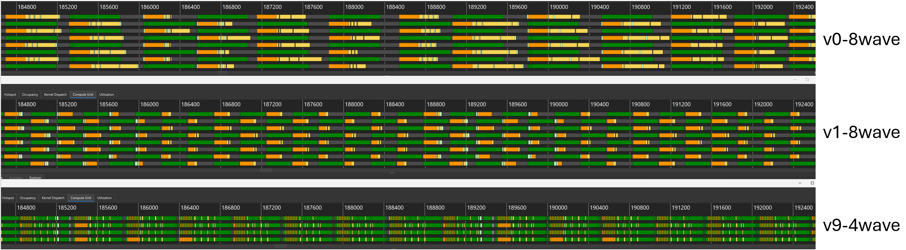

# inter_wave/a16w16 — 8-wave warp-pipeline FP16/BF16 GEMM (gfx950)

An **8-wave** (8 warps/CTA → **2 waves/SIMD**) FP16/BF16 GEMM for gfx950 / MI350X.
Two versions are selected with `--version`, mirroring the `a16w16/v0_naive …
v9_beyond_hotloop` layout. Both schedule the hot loop at the **wave level** with
`warp_pipeline_stage`, and run with **no AGPRs**.

> For the theory behind `warp_pipeline_stage` — the phase-shifted, two-group
> schedule, why it raises MFMA utilization, and the barrier/membar rules these
> kernels follow — see [`docs/warp_pipelining.md`](../../../../docs/warp_pipelining.md).

> [!IMPORTANT]
> The 4-wave `llir+amdgcnas` toolchain (`TRITON_ENABLE_LLIR_SCHED` /
> `TRITON_ENABLE_AMDGCN_AS`) is built around the 4-wave register/schedule model and
> **fails register allocation** at 8 waves. These kernels schedule themselves via
> `warp_pipeline_stage` and run with **no AGPRs** — each kernel sets
> `amdgpu-agpr-alloc=0,0` at launch via Triton's built-in `llvm_fn_attrs` option, so the
> f32 accumulators write VGPRs directly, which packs tighter than the default AGPR
> allocation.

## 1. Design comparison

| | `v0_BK32_nS3` (8-wave) | `v1_sliceMN_BK64_nS2` (8-wave) | `a16w16/v9` (4-wave ref) |
|---|---|---|---|
| Warps / CTA | 8 (`[2,4]`) | 8 (`[2,4]`) | 4 (`[2,2]`) |
| Waves / SIMD | 2 | 2 | 1 |
| Tile M×N×K | 256×256×**32** | 256×256×**64** | 256×256×64 |
| M/N slicing | none (full 256×256) | **2×2 quadrants** | 2×2 quadrants |
| LDS buffers | **3** (triple ring) | **2** (double) | 2 (double) |
| K-unroll | 3× | 2× | 2× |
| LDS allocation | one `smemA[3]`/`smemB[3]` ring | **4 separate** per-quadrant | 4 separate per-quadrant |
| `local_load` | **relaxed** (dodge membar) | non-relaxed (separate allocs) | non-relaxed (separate allocs) |
| Hot-loop scheduling | `warp_pipeline_stage` | `warp_pipeline_stage` | LLIR scheduler + amdgcnas |
| XCD PID remap | yes (v9-style) | yes (v9-style) | yes |

The two 8-wave kernels share the `warp_pipeline_stage` wave-level scheduling and the
v9 XCD remap; they differ in the loop body. v0 drives a single full 256×256
accumulator from a triple-buffered ring; v1 borrows v9's four-quadrant slicing.

## 2. v0_BK32_nS3 — a tuned port

`v0` is a port of
[`AMD-Triton/gluon-kernels`'s `f16_gemm_warp_pipeline_gfx950.py`](https://github.com/AMD-Triton/gluon-kernels/blob/main/kernels/cdna4/gemm/f16_gemm_warp_pipeline_gfx950.py)
into the tutorial layout, so the tutorial's `bench.py` / `collect_perf.py` rocprof +
ATT tooling can drive it. As ported, the loop was MFMA-starved (~36% per-wave /
~72% per-SIMD). The fix progression (rocprof cold-rotating, 4096²×8192 fp16):

> [!NOTE]
> The step-by-step TFLOPS / MFMA numbers in this fix-progression table are from the
> original **MI350X** tuning run — keep them for the *relative* gains each change bought.
> The current-build **MI355X** absolute figures are in [§4](#4-performance).

| Step | TFLOPS | MFMA (per-SIMD) | Optimization |
|---|---|---|---|
| as-ported | 760 | ~72% | baseline: 2×-unroll, default backend (f32 accumulator allocated in AGPRs), original PID map |
| + no-AGPR | 820 | 83.0% | `llvm_fn_attrs=(("amdgpu-agpr-alloc","0,0"),)` forbids AGPRs so the gfx950 MFMAs write VGPRs directly; the unified register file packs tighter (256 VGPR + 16 spills → 212 VGPR / 0 spills) |
| + 3× unroll | 839 | 83.7% | unroll = ring size (3) makes the LDS buffer indices compile-time constants `0,1,2`, removing the runtime `tile % 3` and wrap-around address math |
| + v9 XCD remap | 909 | 85.2% | XCD-aware PID remap + `GROUP_SIZE_M` swizzle (from `common.py`) for L2 locality — cut measured VMEM latency substantially |
| + relaxed `local_load` | ~915 | ~85% | each mem region reads `smem.index(k+1)` (LR) then writes `smem.index(k)` (AC) — same allocation, different ring index. The membar can't disambiguate `MemDescIndexOp` sub-buffers, so it inserts a redundant `lgkmcnt(0)`+`s_barrier`; `load_shared_relaxed` carries an async-wait token the AMD `membarFilter` skips |

Result @4096²×8192 (current build, MI355X): **~1190 TFLOPS, ~85% loop MFMA, 196 VGPR / 0 spills**. Because the
single triple-buffered ring covers the full 256×256 tile, its `buffer_load`s cluster
in time and hit the TCP/HBM buffer-load stall at large K — MFMA drops to ~78–80% at
K ≥ 16384 (see the [v8_sliceMN TCP analysis](../../intra_wave/a16w16/v8_sliceMN/README.md#4-buffer-load-throughput-and-tcp-limitations)).
The near-100% loop MFMA is reached by v1 below, which slices the tile to spread the
loads.

## 3. v1_sliceMN_BK64_nS2 — sliceMN × warp-pipeline

`v1` combines the hot-loop structure of
[`a16w16/v8_sliceMN`](../../intra_wave/a16w16/v8_sliceMN/README.md) — the slicing v9 uses — with the
8-wave `warp_pipeline_stage` scheduling. The 256×256 tile is split into a **2×2 grid
of [128×128] quadrants**, each operand half-tile in its **own** double-buffered LDS
allocation (`smemA_top/bot`, `smemB_left/right`). Two consequences:

- **Non-relaxed loads, no membar barrier.** The four separate allocations have
  distinct buffer IDs, so the membar disambiguates LR vs AC by allocation — the
  loads stay plain `smem.index().load()` and carry no extra barrier. v0's relaxed
  trick is unnecessary here.
- **BLOCK_K=64, 2 buffers, loads spread across four regions** — more compute per
  async copy and no clustering, so the K≥16384 stall that hurts v0 disappears.

The loop is unrolled 2× → **8 mfma regions + 8 mem regions**, each wrapped in
`warp_pipeline_stage` with `cdna4_async.wait_group(5)` placed **before** the mfma
region. A store-side pointer-walk + a de-interleaved epilogue eliminate the
epilogue's accumulator spills (see [v1 README](v1_sliceMN_BK64_nS2/README.md#4-epilogue-register-pressure-and-the-spill-fix)).

Result @4096²×8192 (current build, MI355X): **~1446 TFLOPS, ~99.8% loop MFMA, 242 VGPR / 0
spills** — it peaks ~1495 at K=16384, then eases to ~1287 (still ~92% loop MFMA) at K=32768,
staying far above v0 at every K.

## 4. Performance

MI355X, gfx950, 4096×4096, fp16, **no-AGPR** (`amdgpu-agpr-alloc=0,0` via `llvm_fn_attrs`),
current build (Triton 3.8.0), rocprof cold-rotating (`--rotating-buffer-size 2048`). v0/v1
are 8-wave; the 4-wave `a16w16/v9` reference uses the LLIR scheduler + force-agpr + amdgcnas
(`TRITON_ENABLE_LLIR_SCHED=1 TRITON_ENABLE_AMDGCN_AS=1`):

| K | v0 TFLOPS | v0 MFMA eff | v1 TFLOPS | v1 MFMA eff | v9 TFLOPS | v9 MFMA eff |
|---|---|---|---|---|---|---|
| 8192  | 1190 | ~85% | 1446 | 99.8% | **1485** | 97.0% |
| 16384 | 1100 | ~64% | 1495 | 99.3% | **1532** | 97.4% |
| 32768 | 1122 | ~58% | 1287 | 92.3% | **1310** | ~81% |

VGPRs / spills: **v0 196 / 0**, **v1 242 / 0** (both loop-spill-free).

The 4-wave `a16w16/v9` (LLIR scheduler + force-agpr + amdgcnas) edges 8-wave v1 on TFLOPS
at all three K (**~+3% / +2% / +2%**); v1 keeps the highest loop MFMA-eff (~99% at
K ≤ 16384, dipping to ~92% at K=32768 as the buffer-load stall sets in). Both clear v0 by a
wide margin — v0's full-tile triple-ring hits the buffer-load stall, so its loop MFMA-eff
falls to ~58–64% at K ≥ 16384. (MFMA-eff is a single-dispatch ATT reading — treat the last
digit as noise.)

> [!NOTE]
> **MFMA eff is per-SIMD and loop-only.** `process_json.py` reports one wave's
> MFMA-cycle fraction; with 2 waves/SIMD interleaving issue, `collect_perf.py`
> doubles it for the per-SIMD figure (the 4-wave kernels run 1 wave/SIMD, factor 1).
> The number is for the hot loop — v1's prologue/epilogue carry no MFMA, so its
> *whole-kernel* efficiency is lower (~94% at K=8192) and converges toward the loop
> number as K grows.

### Trace (MI355X, K=8192)



ATT timelines for v0, v1, and v9 at 4096²×8192 on MI355X. **v1 and v9 both reach very
high MFMA utilization** — near-solid MFMA issue, with the loads hidden behind compute.
**v0 is bound by HBM latency**: its full-tile triple-ring clusters the `buffer_load`s in
time, so the MFMA units stall waiting on memory (the gaps in the v0 lane).

## 5. Running

```bash
# correctness + do_bench TFLOPS
python bench.py --version 1 --K 8192 --dtype fp16

# rocprof cold-rotating TFLOPS + MFMA efficiency (ATT) + VGPR/spill
python collect_perf.py --version 1 --K 8192 --dtype fp16

# large K needs a bigger rotating buffer to stay cold (≥3 copies)
python collect_perf.py --version 1 --K 32768 --dtype fp16 --rotating-buffer-size 2048
```

`--version 0` selects `v0_BK32_nS3`, `--version 1` selects `v1_sliceMN_BK64_nS2`. Drop
`--K` to sweep all sizes, `--dtype` to run fp16 + bf16. Clear `~/.triton/cache` after
editing a kernel.

The **no-AGPR** setting is baked into each kernel's launch via Triton's built-in
`llvm_fn_attrs=(("amdgpu-agpr-alloc","0,0"),)` compile option — no env var or compiler
patch needed, and it survives a Triton rebuild.

## 6. Files

- `common.py` — shared `get_pids` (XCD-aware PID remap + `GROUP_SIZE_M` swizzle) and
  `store_result`, used by every version.
- `bench.py` — correctness + do_bench TFLOPS + `--rocprof` rotating-tensor mode.
- `collect_perf.py` — rocprof kernel-trace TFLOPS (cold/rotating) + ATT MFMA
  efficiency + VGPR/spill.
- `collect_counters.py` — VMEM-latency rocprof counters.
- `v0_BK32_nS3/`, `v1_sliceMN_BK64_nS2/` — the kernels, each with its own README;
  every `matmul_kernel.py` exposes `matmul_kernel_only`, `matmul`, `MIN_K`,
  `KERNEL_NAME`.
