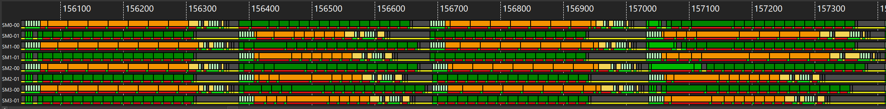

# v0_sliceMN — 8-wave warp-pipeline MXFP4, M/N-sliced

<p align="center">
  
</p>

**Optimization maturity (rough).** Axes — codegen, global latency, LDS latency, LDS bank conflict, scheduling, L2 locality — are defined in the [`v0_naive` README](../../../intra_wave/a16w16/v0_naive/README.md); the polygon vs the dashed "optimal" envelope shows how mature this kernel is.


## 1. What changed from the 4-wave kernel

`v0_sliceMN` is the **MXFP4 (4-bit) port** of the 8-wave
[`inter_wave/a16w16`](../../a16w16/README.md), carrying the scale pipeline of the 4-wave
[`a4w4/v1_sliceMN`](../../../intra_wave/a4w4/v1_sliceMN/README.md). For the general mechanics of
turning a 4-wave kernel into an 8-wave one — restaging each region's `mfma` and memory into
separate `warp_pipeline_stage` clusters, the `warpsPerCTA = [2,2] → [2,4]` warp-grid change, and
where `async_wait` lands — see
[`inter_wave/a16w16` §2](../../a16w16/README.md#2-what-changes-from-the-4-wave-kernel).

The 256×256 output tile is split into a **2×2 grid of `[128×128]` quadrants**, each operand
half-tile in its own double-buffered LDS allocation, and the hot loop runs **8 warps → 2
waves/SIMD** in ping-pong:

```
acc_tl += DOT(A_top, B_left)     acc_tr += DOT(A_top, B_right)
acc_bl += DOT(A_bot, B_left)     acc_br += DOT(A_bot, B_right)
```

## 2. Revisit of layout changes

The 4→8-wave change is the same `warpsPerCTA = [2,2] → [2,4]` warp-grid promotion described in
[`inter_wave/a16w16` §2](../../a16w16/README.md#2-what-changes-from-the-4-wave-kernel): the
global-load layouts gain one extra warp base, while the shared / dot-operand / MFMA layouts are
warp-count-independent and reused verbatim. For a16w16 that is the whole story. For MXFP4 it is
not — the **B scale** is where the extra warp dimension bites, and it is what makes this baseline
generate `ds_read_u8` + `v_perm` inside the loop.

Every tile carries an e8m0 scale that streams **straight into LDS** (`buffer_load_to_shared`, no
`ds_write`) and is read back with the MFMA scale layout just before its DOT.

**The A scale is fine; the B scale is the problem.** The MFMA scale operand is delivered by a
`ds_read_b64_tr_b8` hardware-transpose read, which needs **8 bytes/thread**. The scale operand
layout is derived from the dot-operand layout, so it inherits the warp tiling: the A scale is
tiled by `WARPS_M=2` (unchanged from 4-wave), but the B scale is tiled by `WARPS_N=4`. A `[128,8]`
B-scale half therefore gives each thread only **4 bytes** — below the 64-bit transpose-read width
— so it degrades to **per-byte `ds_read_u8` + `v_perm`** byte-shuffle reassembly. In this kernel's
hot loop that is **11 `v_perm` + 16 `ds_read_u8`**, purely for the B scale — VALU work that stalls
between MFMAs and inflates register pressure.

## 3. Performance

MI355X, gfx950, 4096×4096, MXFP4, Triton `gfx950-tutorial-v1.1`, rocprof cold-rotating
(`--rotating-buffer-size 2048` for K ≥ 16384). This **8-wave, no-AGPR** kernel
(`scripts/collect_perf.py`) vs the 4-wave
[`intra_wave/a4w4/v1`](../../../intra_wave/a4w4/v1_sliceMN/README.md) reference
(`scripts/run_perf_table.py --configs llir+force-agpr+amdgcnas --rocprof`):

| K | this kernel TFLOPS | this kernel MFMA eff | `intra_wave/a4w4 v1` TFLOPS | `intra_wave/a4w4 v1` MFMA eff |
|---|---|---|---|---|
| 8192  | 3673 | 64.6% | **4549** | **93.3%** |
| 16384 | 4140 | 64.9% | **4948** | **93.0%** |
| 32768 | 4237 | 66.2% | **5176** | **92.1%** |

The hot loop is spill-free but reaches only **~65% loop MFMA efficiency**, and this baseline
**trails the tuned 4-wave `intra_wave/a4w4/v1`** (~93% MFMA) on TFLOPS at every K. Two reasons:
the B-scale byte-shuffle (11 `v_perm` + 16 `ds_read_u8`, §2) keeps the loop
LDS/scale-throughput-bound rather than latency-bound — so the 8-wave's ping-pong latency-hiding
has little to hide — and the halved 8-wave VGPR budget (256 vs 492) is a real cost. Eliminating the
B-scale `v_perm` in [`v1_combineBsc`](../v1_combineBsc/README.md) closes most of the gap; see the
[family README §4](../README.md#4-performance) for the full v0 → v1 → v2 comparison.

<p align="center">
  
</p>

The single-dispatch ATT timeline (K=16384) shows the cost directly: each SIMD's two wave rows
(e.g. `SM0-00` / `SM0-01`) carry long **orange** memory stretches — the B-scale `ds_read_u8`
byte-shuffle plus the tile/scale loads — breaking up the **green** MFMA, so the matrix pipe idles
far more than in the a16w16 / a8w8 8-wave kernels.

```bash
# correctness + do_bench TFLOPS (from this v0_sliceMN dir)
python ../bench.py --version 0 --K 8192

# rocprof cold-rotating TFLOPS + MFMA eff + VGPR/spill (from the repo root)
python scripts/collect_perf.py --kernel a4w4 --version 0 --K 8192
```
