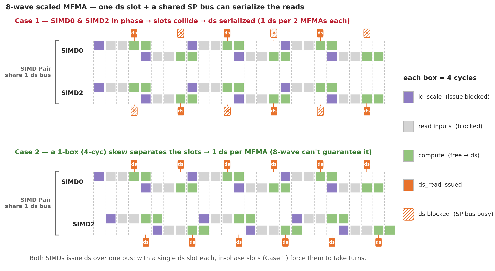
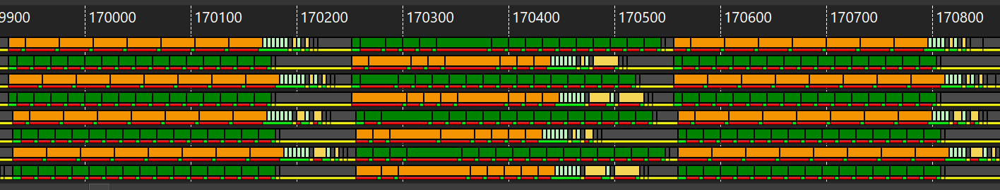
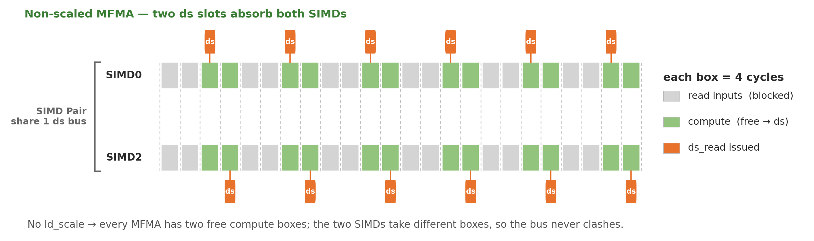
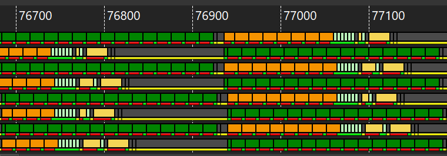

# v1_combineBsc — 8-wave MXFP4, combined B-scale (transpose-read)

<p align="center">
  
  &nbsp;&nbsp;
  
</p>

**Optimization maturity (rough).** Left = previous (v0_sliceMN), right = this version (v1_combineBsc). Axes — codegen, global latency, LDS latency, LDS bank conflict, scheduling, L2 locality — are defined in the [`v0_naive` README](../../../intra_wave/a16w16/v0_naive/README.md).


## 1. What changed from v0

**Problem (v0).** The MFMA scale operand is fed by a `ds_read_b64_tr_b8` transpose read that
needs **8 bytes/thread**. The B-scale layout inherits `WARPS_N=4`, so a `[128,8]` N-slice
gives each thread only 4 bytes → the read degrades to `ds_read_u8` + `v_perm` (**11 `v_perm` +
16 `ds_read_u8`** in v0's hot loop).

**Fix (v1).** Load the full **`[BLOCK_N, NG] = [256, 8]`** B scale as ONE combined buffer
(`NG = BLOCK_K / SCALE_GROUP_SIZE = 8`, the number of scale groups along K). At `[2,4]` the
un-sliced `[256,8]` gives each thread **8 bytes = 64 bits** → the read lowers to
`ds_read_b64_tr_b8` with **no `v_perm`**. Then recover the left/right halves for the two MFMA
columns:

```python
sb = smem_b_sc.index(buf).load(scale_b_comb_layout)         # [256,8], one transpose read
left, right = gl.split(gl.permute(sb.reshape([2,128,8]), [1,2,0]))
b_sc_left  = gl.convert_layout(left,  scale_b_layout)       # free (slice-enc -> linear)
b_sc_right = gl.convert_layout(right, scale_b_layout)
```

This works because `get_mfma_scale_layout([256,8])` is exactly the per-quadrant
`get_mfma_scale_layout([128,8])` (= `scale_b_layout`) **plus one register base `[128,0]`**,
so the `split` is a register slice and the `convert_layout` is a no-op relabel. The
left/right operands handed to `mfma_scaled` are bit-identical to v0's.

### 1.1 The async-fill blocked layout (`[4,1],[64,1],[1,8]`)

The combined `[256,8]` fill must stay coalesced for gfx950 direct-to-LDS (32-bit dword per
thread, no scatter → each warp's writes must be one contiguous LDS run). `b_scales` is
**N-contiguous** in HBM (`(K/32, N).T`), so the fill is N-major, and each warp must own a
whole contiguous N-column:

- `sizePerThread=[4,1]`, `threadsPerWarp=[64,1]`, `warpsPerCTA=[1,8]`, `order=[0,1]`.
- Each warp = **64 N-lanes × 1 K-lane** → covers **256 N × 1 K** = one contiguous 256-byte
  K-column; the 8 warps cover the 8 K groups.

v0's `[4,1],[32,2],[2,4]` puts 2 K-groups per warp, which for `[256,8]` are 256 bytes apart
(a 128-byte gap) and fail `canCoalesceWriteIntoSharedMemory`; it only happens to coalesce
for a `[128,8]` half because there the 128-N span equals the tile's N.

## 2. Performance

MI355X, gfx950, 4096×4096, MXFP4, no-AGPR, Triton `gfx950-tutorial-v1.1`, rocprof cold-rotating
(`--rotating-buffer-size 2048` for K ≥ 16384):

| K | v0 TFLOPS | **v1 TFLOPS** | v0 MFMA | **v1 MFMA** | speedup |
|---|---|---|---|---|---|
| 8192  | 3673 | **4111** | 64.6% | **79.2%** | +11.9% |
| 16384 | 4140 | **4578** | 64.9% | **79.5%** | +10.6% |
| 32768 | 4237 | **4923** | 66.2% | **79.6%** | +16.2% |

Codegen (K=8192): B-scale `v_perm` **11 → 0**, `ds_read_u8` **16 → 0**; VGPR/spills
**256 / 29 → 256 / 12**.

```bash
# correctness + do_bench TFLOPS (from this v1_combineBsc dir)
python ../bench.py --version 1 --K 8192

# rocprof cold-rotating TFLOPS + MFMA eff + VGPR/spill (from the repo root)
python scripts/collect_perf.py --kernel a4w4 --version 1 --K 8192
python scripts/collect_perf.py --kernel a4w4 --version 1 --K 32768 --rotating-buffer-size 2048
```

## 3. The remaining `ds_read` stall — scaled MFMA vs the SP bus

§1 removed the B-scale *load* bottleneck. A subtler limit still sits on the **tile** reads: in
the 8-wave hot loop every `ds_read_b128` stalls **~21 cyc**, yet `SQ_LDS_BANK_CONFLICT = 0` —
so it is **not** a bank conflict.

Per [`docs/lds_throughput.md`](../../../../../docs/lds_throughput.md), a conflict-free
`ds_read_b128` can be issued at most **once per 16 cycles** per SIMD in steady state (LDS serves
the compute unit's four SIMDs — 4096 B per round — at 256 B/cyc = 16 cyc). So ~16 cyc/read is the
floor; the measured ~21 cyc means the reads are already falling behind it. The cause is that a
**scaled** MFMA cannot freely co-issue with LDS reads. *(Thanks to Niels for confirming the
hardware details.)*

### 3.1 A scaled MFMA hides a 4-cycle `ld_scale`

`mfma_scaled_16x16x128_f4` is 16 cyc of matrix compute, but the hardware decouples it
into a hidden **4-cyc `ld_scale`** + the regular MFMA — **20 cyc total**, invisible to
software:

- **cyc 0–3** — `ld_scale` (fetch the block scales)
- **cyc 4–11** — read input VGPRs; **the SIMD cannot issue anything else**
- **cyc 12–19** — compute; **the SIMD is free to co-issue** a `ds_read`

A plain MFMA cannot overlap another MFMA, but an `ld_scale` **can** overlap an MFMA. So
the *next* scaled MFMA's `ld_scale` slides into the **last 4 cyc** of this one's compute —
and because MFMA outranks `ds`, the SIMD spends that half on `ld_scale`, not `ds`. Only
the **first** compute cell is free.

**→ one ds slot per scaled MFMA, versus two for an unscaled MFMA.** With scaled MFMAs issuing
back-to-back every 16 cyc, that single slot lets one `ds_read` start per MFMA — so `ds_read`
appears to issue **once every 16 cyc**, exactly the conflict-free floor above. A lone SIMD keeps
up.

<p align="center"></p>

### 3.2 One slot + shared bus = more ds_read stalls

SIMDs are paired (0&2, 1&3), and each **SIMD Pair shares one ds-issue bus** — only one
SIMD of a pair can start a `ds_read` in a given cycle. With a single ds slot per MFMA, if
the two SIMDs run in phase their slots collide every time: the bus admits one, the other
waits a whole MFMA. They **take turns — 1 ds per 2 MFMAs each** — so each SIMD's `ds_read` now
appears to issue only **once every 32 cyc** (twice the 16-cyc floor), and the reads fall behind.
That is the long stall.

<p align="center"></p>

A 4-cycle skew between the SIMDs would separate the slots (Case 2), but nothing in the
8-wave ping-pong schedule guarantees one.

In the real ATT trace, the scaled-MFMA loop shows the periodic idle (pale) after each `ds`
burst — the reads stalling behind at ~32 cyc:

<p align="center"></p>

### 3.3 Why 4-wave and unscaled mfma don't stall

**4-wave — one wave per SIMD.** With a single resident wave, the SIMD issues strictly in
program order, so the `ds_read` takes the co-execution slot of the *current* scaled MFMA and the
next scaled MFMA cannot begin until it has. If the shared bus delays that `ds_read`, the next
MFMA simply **waits for it** — the MFMA stream stretches to keep pace with the reads — instead of
the next MFMA's `ld_scale` grabbing the co-exec slot and pushing the `ds_read` back another
16 cyc. So the reads never fall behind: 1 ds/MFMA holds regardless of bus contention. (Two
resident waves break this: the second wave's MFMA can proceed while the first wave's `ds_read` is
stuck on the bus, so the read falls a full MFMA behind — the 32-cyc stall of §3.2.)

An **unscaled** MFMA has no `ld_scale`, so every MFMA exposes **two** ds slots; the two
SIMDs take different slots and never clash — 1 ds/MFMA regardless of phase:

<p align="center"></p>

Swapping the scaled MFMA for an unscaled one makes the trace denser — `ds` keeps pace with
compute, no stall:

<p align="center"></p>

**Takeaway.** The stall is an inherent interaction between the **scaled** MFMA (1 ds slot / MFMA)
and the **SP bus** (1 ds / pair / cycle) when the 8-wave schedule keeps SIMD0/SIMD2 in phase —
not a bank conflict and not a layout bug. 4-wave avoids it structurally (one wave per SIMD
serializes each `ds_read` with its own MFMA); at 8 waves the lever is to induce a SIMD0↔SIMD2
skew or otherwise cut ds pressure in the hot loop, weighed against the per-block scale the kernel
needs.
