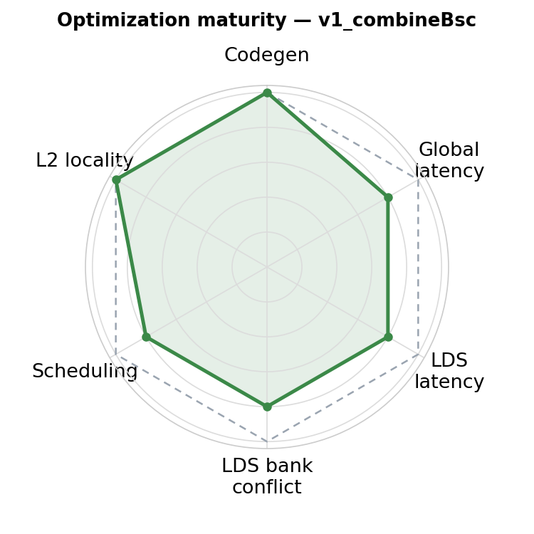
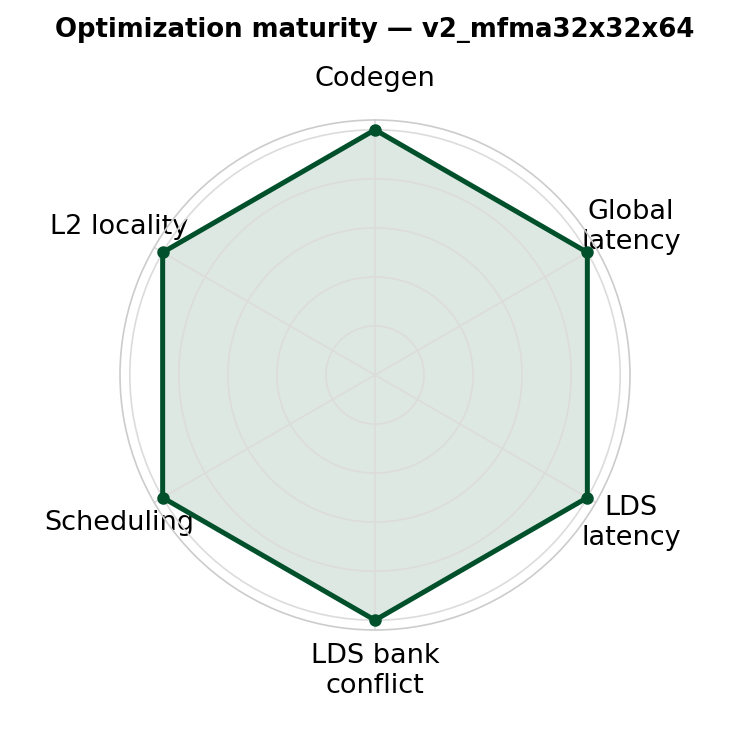
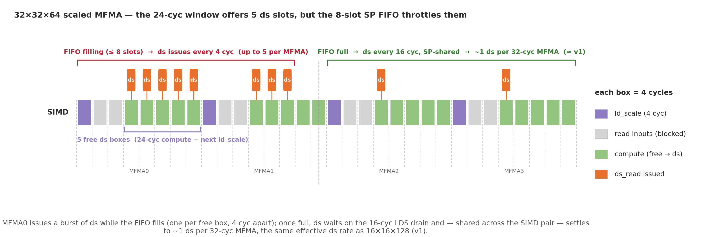

# v2_mfma32x32x64 — 8-wave MXFP4, 32×32×64 MFMA + conflict-free layout

<p align="center">
  
  &nbsp;&nbsp;
  
</p>

**Optimization maturity (rough).** Left = previous (v1_combineBsc), right = this version (v2_mfma32x32x64). Axes — codegen, global latency, LDS latency, LDS bank conflict, scheduling, L2 locality — are defined in the [`v0_naive` README](../../../intra_wave/a16w16/v0_naive/README.md).


## 1. Directory Structure

```
v2_mfma32x32x64/
├── matmul_kernel.py    # The kernel implementation
├── images/             # Figures used in this README
└── README.md           # This file
```

## 2. What this is

The [`v1_combineBsc`](../v1_combineBsc/README.md) kernel with the MFMA shape changed from
**16×16×128 → 32×32×64**, plus a **new LDS + global-load layout tuned to keep the wider read
bank-conflict-free**. The 2×2 `[128×128]` sliceMN quadrants, combined B-scale transpose read,
no-AGPR, and warp-pipeline are all unchanged. The changes:

```python
mfma_layout  = gl.amd.AMDMFMALayout(version=4, instr_shape=[32, 32, 64], ...)  # was [16, 16, 128]
dot_a_layout = gl.DotOperandLayout(..., k_width=16)                            # unchanged
# + gLoadLayout with reordered M bases, and
# PaddedSharedLayout([[1024, 16]], <M-reordered offset bases>)                 # was [[1024, 32]]
```

`mfma_scaled` is a **block op**, so the K-loop body is untouched — the compiler re-tiles the
`[128, 256 fp4]` operand into 32×32×64 MFMAs (128 → **64** MFMAs in the loop). Two subtleties:

- **k_width stays 16** — the tiles are uint8-packed (2 fp4/byte), so 16 uint8 = 32 fp4. (k_width=32,
  the logical-fp4 value, compiles but is wrong.)
- **The combine trick still holds:** `get_mfma_scale_layout([256,8]) == get_mfma_scale_layout([128,8])
  + register base [128,0]` for mdim=32 too, so the B-scale still reads with one `ds_read_b64_tr_b8`
  and a zero-cost register split — **0 `v_perm`, 0 `ds_read_u8`, 0 spills** (v1 has 12 spills).

## 3. Why 32×32×64 — the ds co-issue window

See v1 [§5 "scaled MFMA vs the SP bus"](../v1_combineBsc/README.md#5-the-remaining-ds_read-stall--scaled-mfma-vs-the-sp-bus).
A `mfma_scale_16x16x128` has only an **8-cyc compute window** and the next MFMA's `ld_scale` eats half
→ 1 free ds slot/MFMA → the SP bus serializes the reads. A `mfma_scale_32x32x64` is **36 cyc**: 4-cyc
`ld_scale` + 8-cyc read + a **24-cyc compute window** = **5 free ds slots** — enough room to hide the
tile reads and keep the MFMA fed.

<p align="center"></p>

(The 8-slot SP FIFO caps *peak* ds throughput, but with a conflict-free layout the reads still keep
pace with the MFMAs — see §4.)

## 4. The conflict-free layout — the actual unlock

The wider window only pays off if the reads don't stall. With v1's padded layout (`[[1024, 32]]`, tuned
for the 16-byte `b128` access) the 32×32×64 reads hit **bank conflicts** — MFMA occupancy is capped at
~81%. The fix is a layout **co-designed with the read width**: reorder the M offset bases and use
**`[[1024, 16]]`** padding. That makes the 16-byte read conflict-free and occupancy jumps to **~98%**.

| layout | SQ_LDS_BANK_CONFLICT | MFMA occ |
|---|---|---|
| `[[1024, 32]]` (v1's, on 32×32×64) | 7.47M | ~81% |
| **`[[1024, 16]]` (this kernel)** | **1.18M** | **~98%** |

Padding is width-specific: `[[1024,32]]` is bad for both, `[[1024,16]]` for `b128`, `[[1024,8]]` for
`b64`. Reading a layout with the wrong width tanks perf (a b128 read on the b64-tuned layout drops to
~1400 TFLOPS) — LDS layout and access width are one unit.

## 5. Performance — cycle-efficient, but clock-throttled

MI355X, rocprof cold-rotating, fence-on:

| K | kernel | TFLOPS | MFMA occ | GRBM active cyc |
|---|---|---|---|---|
| 8192  | v1 16×16×128 | **4116** | 79.7% | 1.25M |
| 8192  | v2 32×32×64  | 4114 | **97.4%** | **0.99M** |
| 32768 | v1 16×16×128 | **4938** | 80.0% | — |
| 32768 | v2 32×32×64  | 4799 | **98.0%** | — |

The conflict-free layout removes the ds stall → **~98% MFMA occupancy** (the matrix core is nearly
saturated *in cycles*), and v2 runs the loop in **~20% fewer cycles** than v1. **But the win is
cycle-based, not wall-clock:** the bigger 32×32×64 MFMAs are power-hungrier, so the GPU
**frequency-throttles ~21%** — the two effects cancel and wall-clock TFLOPS is essentially even with
v1 (neck-and-neck at K=8192; at large, loop-dominated K v1's higher datapath peak still wins). This is
the [MFMA-efficiency caveat](../../../../../docs/mfma_efficiency.md) in the extreme: MFMA efficiency is
clock-independent, TFLOPS is not.

## 6. Notes

- **SALU micro-opt (asm only):** the loop-header pointer-walk SALU (10 scalar address-math instrs)
  run serially before the first barrier; interleaving them into the first mfma region (co-execute with
  the matrix ops, ≤4 SALU/mfma) saves **~74 cyc/iter (−1.75%)**. It can't be produced from Gluon (LLVM
  hoists loop-carried address math) nor by relaxing the `sched_barrier` mask to allow SALU (tested —
  the scheduler doesn't sink them and makes counterproductive moves instead); it needs a forceful hint.
- **fence dependency:** the `fence_loads` warp-pipeline flag (on v1 and v2) needs `fence_loads` support
  (PR #10840) **not in the pinned `gfx950-tutorial-v1.0`**; those numbers require a Triton built with it.

## Conclusion

32×32×64 + a conflict-free, width-matched layout is a genuine **cycle-efficiency** result — ~98% MFMA
occupancy, spill-free — but clock throttling makes it a **wall-clock wash** with 16×16×128. Kept as the
reference 32×32×64 kernel; **v1 remains the production choice**.

```bash
python bench.py --version 2 --K 8192            # correctness + do_bench
python collect_perf.py --version 2 --K 8192     # rocprof + ATT MFMA eff
```
