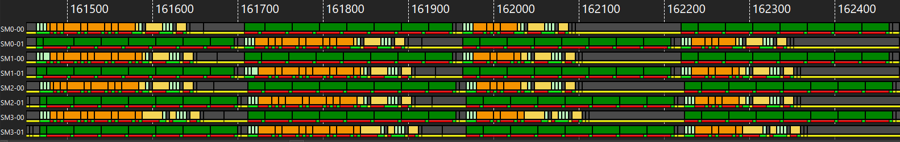

# v2_mfma32x32x64 — 8-wave MXFP4, 32×32×64 MFMA + conflict-free layout

<p align="center">
  
  &nbsp;&nbsp;
  
</p>

**Optimization maturity (rough).** Left = previous (v1_combineBsc), right = this version (v2_mfma32x32x64). Axes — codegen, global latency, LDS latency, LDS bank conflict, scheduling, L2 locality — are defined in the [`v0_naive` README](../../../intra_wave/a16w16/v0_naive/README.md).


## 1. What changed from v1

The [`v1_combineBsc`](../v1_combineBsc/README.md) kernel with the MFMA shape changed from
**16×16×128 → 32×32×64**, plus a **new LDS + global-load layout tuned to keep the wider read
bank-conflict-free**. The 2×2 `[128×128]` sliceMN quadrants, combined B-scale transpose read,
no-AGPR, and warp-pipeline are all unchanged. The changes:

```python
mfma_layout  = gl.amd.AMDMFMALayout(version=4, instr_shape=[32, 32, 64], ...)  # was [16, 16, 128]
dot_a_layout = gl.DotOperandLayout(..., k_width=16)                            # unchanged
# + gLoadLayout with reordered M bases, and
# PaddedSharedLayout([[1024, 16]], <M-reordered offset bases>)                 # was [[1024, 32]]
```

`mfma_scaled` is a **block op**, so the K-loop body is untouched — the compiler re-tiles the
`[128, 256 fp4]` operand into 32×32×64 MFMAs (128 → **64** MFMAs in the loop). Two subtleties:

- **k_width stays 16** — the tiles are uint8-packed (2 fp4/byte), so 16 uint8 = 32 fp4. (k_width=32,
  the logical-fp4 value, compiles but is wrong.)
- **The combine trick still holds:** `get_mfma_scale_layout([256,8]) == get_mfma_scale_layout([128,8])
  + register base [128,0]` for mdim=32 too, so the B-scale still reads with one `ds_read_b64_tr_b8`
  and a zero-cost register split — **0 `v_perm`, 0 `ds_read_u8`, 0 spills** (v1 has 12 spills).

## 2. Why 32×32×64 — the ds co-issue window

See v1 [§3 "scaled MFMA vs the SP bus"](../v1_combineBsc/README.md#3-the-remaining-ds_read-stall--scaled-mfma-vs-the-sp-bus).
A `mfma_scale_16x16x128` has only an **8-cyc compute window** and the next MFMA's `ld_scale` eats half
→ 1 free ds slot/MFMA → the SP bus serializes the reads. A `mfma_scale_32x32x64` is **36 cyc**: 4-cyc
`ld_scale` + 8-cyc read + a **24-cyc compute window** = **5 free ds slots** — enough room to hide the
tile reads and keep the MFMA fed.

<p align="center"></p>

(The 8-slot SP FIFO caps *peak* ds throughput, but the conflict-free, width-matched LDS layout — the
`[[1024, 16]]` padding co-designed with the 16-byte read — keeps the reads in pace with the MFMAs.)

## 3. Performance

| kernel | TFLOPS | MFMA eff |
|---|---|---|
| v1 | 4885 | 75.1% |
| v2 | **5159** | **93.8%** |

MI355X, gfx950, MXFP4, K=32768, Triton `gfx950-tutorial-v2.1`, GPU[7], rocprof cold-rotating.

The conflict-free layout removes the ds stall → **~94% MFMA efficiency** (the matrix core is nearly
saturated *in cycles*), and v2 runs the loop in far fewer cycles than v1. The bigger 32×32×64 MFMAs
are power-hungrier, so the GPU still **frequency-throttles** — but on `gfx950-tutorial-v2.1` that no
longer cancels the cycle win: v2 leads on wall-clock at **both** shapes, **+4.4%** at K=8192
(4336 vs 4155) and **+5.6%** at K=32768 (5159 vs 4885), and is the only spill-free version.

> [!NOTE]
> On the `v1.1` pin the two effects *did* cancel and this section read "the win is cycle-based, not
> wall-clock" (4094 vs 4107 at K=8192, 4800 vs 4919 at K=32768). That is no longer the case. The
> caveat below is still the right lesson about MFMA efficiency — it just no longer applies to v2.

This is
the [MFMA-efficiency caveat](../../../../../docs/mfma_efficiency.md) in the extreme: MFMA efficiency is
clock-independent, TFLOPS is not.

The single-dispatch ATT trace (K=16384) shows the near-solid MFMA the wider co-issue window buys —
`ds` keeps pace with compute, so the green MFMA runs with far fewer of the periodic idle gaps v1 has:

<p align="center"></p>

## Conclusion

32×32×64 + a conflict-free, width-matched layout is a genuine **cycle-efficiency** result — ~98% MFMA
efficiency, spill-free — but clock throttling makes it a **wall-clock wash** with 16×16×128. Kept as the
reference 32×32×64 kernel; **v1 remains the production choice**.

```bash
# correctness + do_bench TFLOPS (from this v2_mfma32x32x64 dir)
python ../bench.py --version 2 --K 8192

# rocprof cold-rotating TFLOPS + MFMA eff + VGPR/spill (from the repo root)
python scripts/collect_perf.py --kernel a4w4 --version 2 --K 8192
```
