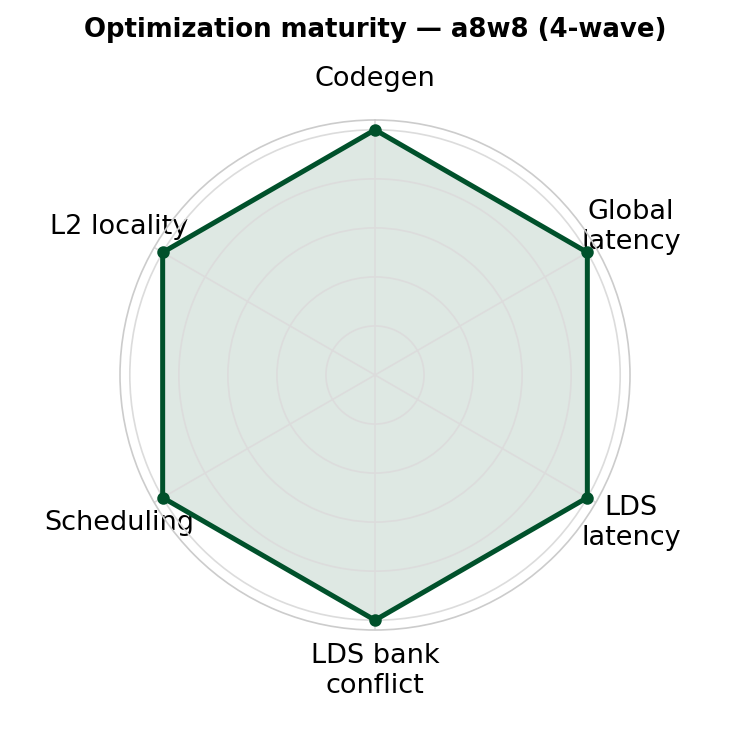

# inter_wave/a8w8 — 8-wave warp-pipeline BF8 (a8w8) GEMM (gfx950)

<p align="center">
  
  &nbsp;&nbsp;
  
</p>

**Optimization maturity (rough).** Left = 4-wave a8w8, right = 8-wave a8w8. Axes — codegen, global latency, LDS latency, LDS bank conflict, scheduling, L2 locality — are defined in the [`v0_naive` README](../../intra_wave/a16w16/v0_naive/README.md).


An **8-wave** (8 warps/CTA → **2 waves/SIMD**) BF8/e5m2 GEMM for gfx950 / MI350X /
MI355X. It is the **8-bit sibling** of [`inter_wave/a16w16`](../a16w16/README.md): the same
`sliceMN` warp-pipeline solution with the 16-bit numerics swapped for 8-bit. Read the
[`inter_wave/a16w16` README](../a16w16/README.md) first for the 8-wave design, loop
structure, and epilogue spill-fix — this document covers the 8-bit deltas and the measured
performance.

> [!IMPORTANT]
> Like the fp16 8-wave kernel, this schedules the hot loop at the **wave level** with
> `warp_pipeline_stage` and runs with **no AGPRs**: it sets `amdgpu-agpr-alloc=0,0` at
> launch via Triton's built-in `llvm_fn_attrs` option, so the f32 accumulators write VGPRs
> directly. The 4-wave `llir+amdgcnas` toolchain (`TRITON_ENABLE_LLIR_SCHED` /
> `TRITON_ENABLE_AMDGCN_AS`) is built around the 4-wave register/schedule model and is
> **not** used here.

## 1. What changes from 16-bit to 8-bit

The 8-wave skeleton — 8 warps `[2,4]`, the 2×2 `[128×128]` quadrant slicing with four
separate double-buffered LDS allocations, the `warp_pipeline_stage` ping-pong schedule,
no-AGPR, and the spill-free store-side pointer-walk epilogue — is **identical** to
[`inter_wave/a16w16`](../a16w16/README.md). Only the numerics move from 16-bit to 8-bit,
exactly as they do between the 4-wave `a16w16/v8_sliceMN` and `a8w8` kernels:

| | `inter_wave/a16w16` (16-bit) | **`inter_wave/a8w8` (8-bit)** |
|---|---|---|
| Operand dtype | fp16 / bf16 (2 B) | **BF8 / float8_e5m2 (1 B)** |
| `BLOCK_K` | 64 | **128** (same 128 B / row into LDS) |
| MFMA | `mfma` `[16,16,32]` | **`mfma_scaled(…,"e5m2",…,"e5m2")` `[16,16,128]`** |
| dot-operand `k_width` | 8 | **32** |
| Per-block scale | — | none (`scale=None`; plain BF8 GEMM) |
| Output C | fp16 / bf16 | **fp16** |

The MFMA is `mfma_scaled(a, None, "e5m2", b, None, "e5m2", acc)` with
`instr_shape=[16,16,128]` and dot-operand `k_width=32`. Scales are `None` — this is a plain
BF8 GEMM. On gfx950 it lowers to `v_mfma_scale_f32_16x16x128_f8f6f4 … cbsz:1 blgp:1` (the
BF8 format select). Two 8-wave-specific details carry over unchanged from the fp16 kernel:
the global-load layouts are the 4-wave a8w8 layouts with **one register base promoted to a
third warp base** (the extra warp dim, since `warpsPerCTA` goes `[2,2]→[2,4]`), and the
padded shared layouts are warp-independent so they are reused **verbatim** from the 4-wave
a8w8 kernel. B is pre-transposed to `(N, K)` and fed as a logical `(K, N)` operand so K is
contiguous for the async copy (no `permute` on the LDS load — the same as fp16).

The loop is unrolled 2× → **8 mfma regions + 8 mem regions**, each wrapped in
`warp_pipeline_stage` with `cdna4_async.wait_group(5)` placed **before** the mfma region.
Because the four LDS allocations are separate, the membar disambiguates the load-read (LR)
from the async-copy write (AC) by allocation — the loads stay plain (non-relaxed) and carry
no extra `s_barrier`. The **hot loop is spill-free** (~99.7% MFMA); the store-side
pointer-walk + de-interleaved epilogue keep the four live `[128×128]` accumulators inside
the 256-VGPR budget, leaving only 13 residual spills in the `convert_layout` + store
epilogue (which carries no MFMA).

## 2. Performance

MI355X, gfx950, 4096×4096, BF8, **no-AGPR**, current build (Triton 3.8.0), rocprof
cold-rotating tensors (last-100 average of 1000 dispatches; `--rotating-buffer-size 2048`
for K ≥ 16384). The 4-wave reference is `kernels/gemm/intra_wave/a8w8` measured on the same
machine:

| K | **8-wave TFLOPS** | 8-wave MFMA eff (per-SIMD, loop) | 4-wave base | 4-wave llir+amdgcnas |
|---|---|---|---|---|
| 8192  | **2894** | 99.7% | 2497 | 3216 |
| 16384 | **3147** | 99.9% | 2777 | 3455 |
| 32768 | **3129** | 99.1% | — | — |

On the current build the 8-wave kernel **beats the 4-wave base** (2894 vs 2497, +16% at
K=8192) but the tuned 4-wave `llir+amdgcnas` now **edges ahead** (3216 vs 2894, ~+11%). This
is a change from the original pinned-compiler numbers, where the 8-wave led every 4-wave
config (8-wave 2841 vs 4-wave base 2604 / llir+amdgcnas 2746): on newer LLVM the 4-wave BF8
`llir+amdgcnas` path improved more (~2746 → 3216) than the 8-wave (~2841 → 2894). The 8-wave
loop is still genuinely MFMA-bound at **~99.7%** (per-SIMD, loop-only). VGPRs: 256, spills:
13 — and the **hot loop is spill-free** (all 13 spills are in the `convert_layout` + store
epilogue).

> [!NOTE]
> **MFMA eff is per-SIMD and loop-only.** `process_json.py` reports one wave's MFMA-cycle
> fraction; with 2 waves/SIMD interleaving issue, `scripts/collect_perf.py` doubles it for the
> per-SIMD figure. The whole-kernel efficiency is lower (the prologue/epilogue carry no
> MFMA) and converges toward the loop number as K grows.

## 3. Running

```bash
# correctness + do_bench TFLOPS (from this kernel dir)
python bench.py --K 8192

# rocprof cold-rotating TFLOPS + MFMA efficiency (ATT) + VGPR/spill (from the repo root)
python scripts/collect_perf.py --kernel a8w8 --K 8192

# large K needs a bigger rotating buffer to stay cold
python scripts/collect_perf.py --kernel a8w8 --K 32768 --rotating-buffer-size 2048
```

Inputs are BF8 (`float8_e5m2`); the output is fp16. Drop `--K` to sweep all sizes. Clear
`~/.triton/cache` (or use `TRITON_ALWAYS_COMPILE=1`) after editing the kernel.

## 4. Files

- `matmul_kernel.py` — the kernel; exposes `a8w8_kernel` (the jit kernel),
  `matmul_kernel_only` / `matmul` (launch wrappers), `MIN_K`, `KERNEL_NAME`.
- `get_pids` (XCD-aware PID remap + `GROUP_SIZE_M` swizzle) is imported from the shared
  [`kernels/gemm/utils/common.py`](../../utils/common.py).
- `bench.py` — correctness (vs dequantized `torch.matmul`) + do_bench TFLOPS + `--rocprof`
  rotating-tensor mode.
- Perf is collected with the shared [`scripts/collect_perf.py`](../../../../scripts/collect_perf.py)
  (`--kernel a8w8`).
