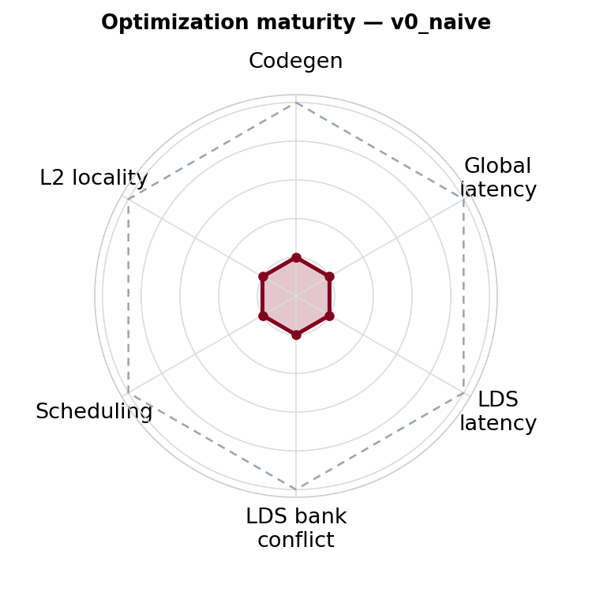
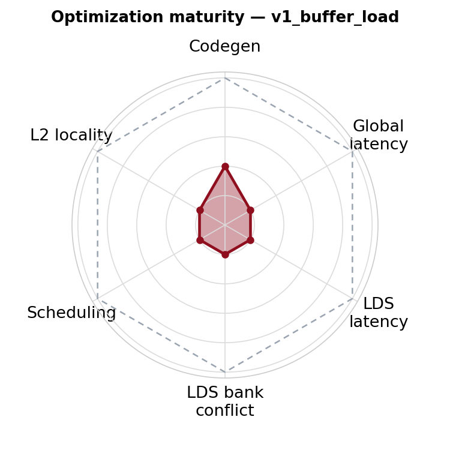

# v1_buffer_load — Buffer Operations

<p align="center">
  
  &nbsp;&nbsp;
  
</p>

**Optimization maturity (rough).** Left = previous (`v0_naive`), right = this version (`v1_buffer_load`). Axes — codegen, global latency, LDS latency, LDS bank conflict, scheduling, L2 locality — are defined in the [`v0_naive` README](../v0_naive/README.md); each version pushes the axes it improves toward the dashed "optimal" envelope.


This version replaces `global_load` with `buffer_load` to improve codegen quality for masked loads.

## 1. Directory Structure

```
v1_buffer_load/
├── matmul_kernel.py      # The kernel implementation
└── README.md             # This file
```

## 2. Background: Buffer Operations in Triton

Buffer operations are an AMD-specific memory access mechanism with built-in out-of-bounds (OOB) checking. Giuseppe Rossini laid the foundation for buffer op support in Triton and presented the details in a technical talk. The slide deck is intentionally omitted from this initial open-source release while it goes through separate publication review; the key concepts needed for this tutorial are summarized below.

The key insight is that buffer ops handle OOB checks in hardware, eliminating the need for branches in the generated code. This is particularly valuable for masked loads common in GEMM kernels.

### Evolution of Buffer Op Support

1. **Giuseppe Rossini** — Initial buffer op support, identified the 32-bit offset limitation and the need for range analysis
2. **Maksim Levental** (no longer at AMD) — Enhanced range analysis, enabled the assume mechanism to work with the pipeliner
3. **Shuxin Yang** — Fixed bugs in range analysis, revealed that 32-bit range is difficult to reason about inside the compiler

## 3. Pros and Cons

**Pros:**
- **Automatic OOB check** — Hardware handles out-of-bounds access, producing efficient codegen for masked loads
- **Fewer registers for addresses** — Buffer ops use a base pointer + 32-bit offset, reducing address register pressure

**Cons:**
- **32-bit offset limitation** — In theory, buffer ops cannot access address spaces larger than 4 GB
- **Range analysis constraints** — The compiler's range analysis only works reliably when the whole tensor is small (< 2 GB), further limiting use cases

## 4. Code Changes

The key change is replacing `gl.load()` with `gl.amd.cdna3.buffer_load()`:

**v0_naive (global_load):**
```python
ga = gl.load(a_ptrs, mask=offs_ak[None, :] < K - k * BLOCK_K, other=0.0)
```

**v1_buffer_load:**
```python
ga = gl.amd.cdna3.buffer_load(
    ptr=a_base, offsets=a_offsets, mask=offs_ak[None, :] < K - k * BLOCK_K, other=0.0
)
```

Note the change in addressing: buffer_load uses a base pointer (`a_base`) plus offsets (`a_offsets`), rather than fully computed pointers.

## 5. Impact on Generated Code

### Branch Reduction

Comparing the generated assembly:

| Metric | v0_naive | v1_buffer_load |
|--------|----------|----------------|
| Branch instructions | 140 | 4 |
| VGPR count | 430 | 512 |

**v0_naive.s** — Global loads with branches around each load for mask handling:
```asm
    global_load_dwordx4 a[0:3], v[10:11], off
.LBB0_5:
    s_or_b64 exec, exec, s[2:3]
    ...
    global_load_dwordx4 a[8:11], v[10:11], off
.LBB0_7:
    s_or_b64 exec, exec, s[2:3]
```

**v1_buffer_load.s** — Streamlined buffer loads with `v_cndmask` for masking (no branches):
```asm
    v_cndmask_b32_e32 v151, v7, v6, vcc
    buffer_load_dwordx4 v[6:9], v0, s[0:3], 0 offen
    buffer_load_dwordx4 v[10:13], v1, s[0:3], 0 offen
    buffer_load_dwordx4 v[14:17], v2, s[0:3], 0 offen
```

### Why Branches Are Bad

1. **Register pressure** — Branches can increase register pressure due to live range extension
2. **Instruction scheduling** — LLVM does not perform cross-block instruction scheduling, limiting optimization opportunities

### A Note on VGPR Usage

> [!IMPORTANT]
> The higher VGPR count in v1_buffer_load (512 vs 430) does **not** mean buffer_load uses more registers than global_load.

This is a common misconception. Register usage is heavily influenced by instruction scheduling. The removal of branches in v1_buffer_load leads to a very different schedule compared to v0_naive. The VGPR count reflects the overall kernel scheduling, not the intrinsic register cost of buffer_load vs global_load.

We will explore register pressure in more depth in later versions.

## Performance

Measured on MI355X, `rocm-smi` GPU[7], Triton `gfx950-tutorial-v2.1`, plain rocprofv3 with
rotating tensors (1000 dispatches, last-100 average), 4096x4096x8192 fp16.

Config: `base` (no compiler plugins).

| Version         | TFLOPS | VGPRs | Spills | MFMA Eff. |
|-----------------|--------|-------|--------|-----------|
| v0_naive |    525 |   450 |      0 |    22.54% |
| v1_buffer_load  |    614 |   512 |      0 |    27.41% |

## 6. What Comes Next

In `v2_async_copy`, we will introduce asynchronous copy operations to move data directly from global memory to LDS, eliminating the register-to-LDS copy path and further improving codegen.
