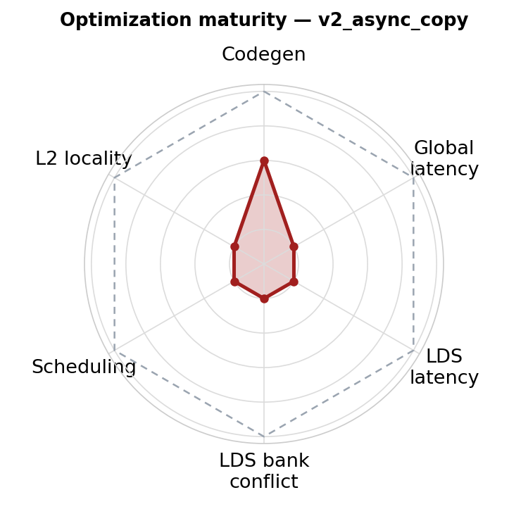

# v2_async_copy — Direct-to-LDS

<p align="center">
  
  &nbsp;&nbsp;
  
</p>

**Optimization maturity (rough).** Left = previous (`v1_buffer_load`), right = this version (`v2_async_copy`). Axes — codegen, global latency, LDS latency, LDS bank conflict, scheduling, L2 locality — are defined in the [`v0_naive` README](../v0_naive/README.md); each version pushes the axes it improves toward the dashed "optimal" envelope.


This version uses async copy (also known as direct-to-LDS) to load data directly from global memory into LDS, bypassing registers entirely.

## 1. Directory Structure

```
v2_async_copy/
├── matmul_kernel.py      # The kernel implementation
└── README.md             # This file
```

## 2. Background: Direct-to-LDS in Triton

Alexander Weinrauch presented a comprehensive overview of direct-to-LDS support in Triton in a technical talk. The slide deck is intentionally omitted from this initial open-source release while it goes through separate publication review. The talk covers:

- Triton support for lowering async copy operations
- Pipelining considerations
- Layout-related issues
- Limitations of the instruction

## 3. Benefits

The key benefit of async copy is straightforward:

> [!IMPORTANT]
> Data goes directly into LDS, saving both registers and `ds_write` instructions.

This has two immediate advantages:

1. **Register savings** — Data does not need to be staged in VGPRs before being written to LDS
2. **Instruction reduction** — Eliminates `ds_write` instructions entirely

Additionally, by placing data directly into LDS, it becomes more natural to implement **software pipelining** using LDS as the buffer. We will explore this in `v4_global_prefetch`.

## 4. Code Changes

The key changes involve allocating shared memory and using `buffer_load_to_shared`:

**Allocate shared memory:**
```python
sharedLayoutA: gl.constexpr = gl.SwizzledSharedLayout(1, 1, 1, order=[1, 0])
sharedLayoutB: gl.constexpr = gl.SwizzledSharedLayout(1, 1, 1, order=[0, 1])

smemA = gl.allocate_shared_memory(a_ptr.dtype.element_ty, [BLOCK_M, BLOCK_K], sharedLayoutA)
smemB = gl.allocate_shared_memory(b_ptr.dtype.element_ty, [BLOCK_K, BLOCK_N], sharedLayoutB)
```

**Load directly to LDS:**
```python
gl.amd.cdna4.async_copy.buffer_load_to_shared(
    smemA, a_base, a_offsets, mask=offs_ak[None, :] < K - k * BLOCK_K, other=0.0
)
gl.amd.cdna4.async_copy.commit_group()
gl.amd.cdna4.async_copy.wait_group(0)
a = smemA.load(dotOpLayoutA)
```

The flow is:
1. `buffer_load_to_shared` — Initiate async copy from global memory to LDS
2. `commit_group` — Commit the async copy group
3. `wait_group(0)` — Wait for all pending copies to complete
4. `smem.load` — Read from LDS into registers with the desired layout (see [CHANGELOG](../../../../../CHANGELOG.md) for the migration from `load_shared_relaxed`)

## 5. Impact on Generated Code

### Comparison with v1_buffer_load

| Metric | v1_buffer_load | v2_async_copy |
|--------|----------------|---------------|
| VGPR count | 512 | 408 |
| Branch instructions | 4 | 6 |
| `ds_write` instructions | 16 | 0 |

The generated assembly uses `buffer_load ... lds` to load directly into LDS:

```asm
buffer_load_dwordx4 v6, s[0:3], 0 offen lds
buffer_load_dwordx4 v6, s[0:3], 0 offen lds
buffer_load_dwordx4 v6, s[0:3], 0 offen lds
```

Note the `lds` suffix — this indicates data goes directly to LDS rather than to the destination VGPR.

### Register Savings

The VGPR reduction from 512 to 408 (104 fewer registers) demonstrates the benefit of not staging data in registers. With similar code structure and scheduling between v1 and v2, this comparison more accurately reflects the register savings from direct-to-LDS.

## 6. What Comes Next

In `v3_lds`, we will take a deeper look at LDS performance fundamentals — vectorization, addressing, and the difference between issue latency and execution latency.
