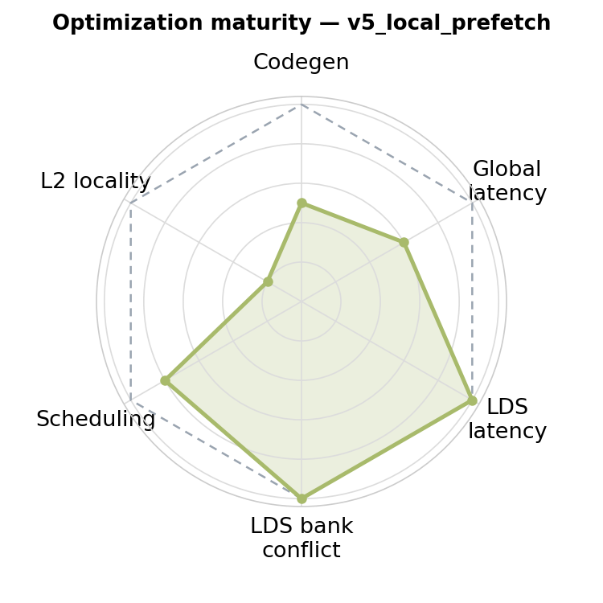
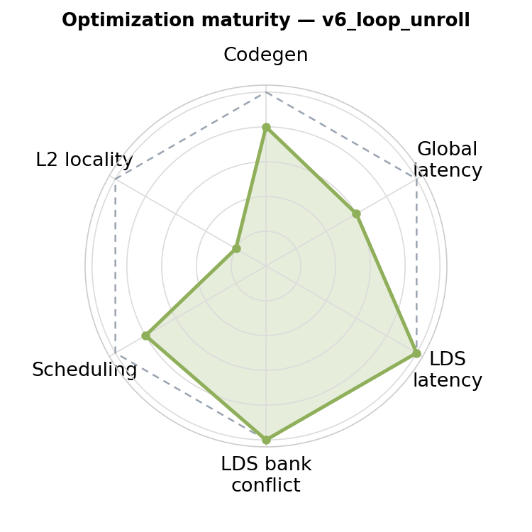

# v6_loop_unroll — Eliminating Copy Overhead via Loop Unrolling

<p align="center">
  
  &nbsp;&nbsp;
  
</p>

**Optimization maturity (rough).** Left = previous (`v5_local_prefetch`), right = this version (`v6_loop_unroll`). Axes — codegen, global latency, LDS latency, LDS bank conflict, scheduling, L2 locality — are defined in the [`v0_naive` README](../v0_naive/README.md); each version pushes the axes it improves toward the dashed "optimal" envelope.


## 1. Directory Structure

```
v6_loop_unroll/
├── matmul_kernel.py    # The kernel implementation
└── README.md           # This file
```

## 2. Motivation

In v5, we identified a bottleneck: copy instructions at the end of each iteration that move `ds_read` results from prefetch registers (`a_next`, `b_next`) to the registers MFMA consumes (`a`, `b`). This overhead is inherent to the prefetch design when using a single-iteration loop body.

> [!IMPORTANT]
> By unrolling the loop by a factor of 2, we alternate between two register sets directly. Odd iterations use `a/b`, even iterations use `a_next/b_next`—no copying required.

## 3. Loop Unrolling Design

### 3.1. Loop Step Size

The loop now iterates with step size 2:

```python
for k in range(0, iterMax - 2, 2):
```

Each unrolled iteration contains two sub-iterations that alternate register sets.

### 3.2. Unrolled Loop Body

```python
for k in range(0, iterMax - 2, 2):
    # --- First sub-iteration: use a/b, prefetch into a_next/b_next ---
    g_idx = 0
    l_idx = 1

    acc = gl.amd.cdna3.mfma(a, b, acc)

    gl.amd.cdna4.async_copy.wait_group(0)
    gl.amd.cdna4.async_copy.buffer_load_to_shared(smemA.index(g_idx), a_base, a_offsets, ...)
    gl.amd.cdna4.async_copy.buffer_load_to_shared(smemB.index(g_idx), b_base, b_offsets, ...)
    gl.amd.cdna4.async_copy.commit_group()

    a_next = smemA.index(l_idx).load(dotOpLayoutA)
    b_next = smemB.index(l_idx).load(dotOpLayoutB)

    a_base += BLOCK_K * stride_ak
    b_base += BLOCK_K * stride_bk

    # --- Second sub-iteration: use a_next/b_next, prefetch into a/b ---
    g_idx = 1
    l_idx = 0

    acc = gl.amd.cdna3.mfma(a_next, b_next, acc)

    gl.amd.cdna4.async_copy.wait_group(0)
    gl.amd.cdna4.async_copy.buffer_load_to_shared(smemA.index(g_idx), a_base, a_offsets, ...)
    gl.amd.cdna4.async_copy.buffer_load_to_shared(smemB.index(g_idx), b_base, b_offsets, ...)
    gl.amd.cdna4.async_copy.commit_group()

    a = smemA.index(l_idx).load(dotOpLayoutA)
    b = smemB.index(l_idx).load(dotOpLayoutB)

    a_base += BLOCK_K * stride_ak
    b_base += BLOCK_K * stride_bk
```

Key observations:
- First sub-iteration: MFMA consumes `a/b`, `ds_read` loads into `a_next/b_next`
- Second sub-iteration: MFMA consumes `a_next/b_next`, `ds_read` loads into `a/b`

The register sets alternate naturally—no copy instructions needed.

### 3.3. Epilogue

With loop unrolling, the epilogue handles the remaining iterations. Since the main loop ends at `iterMax - 2`, the epilogue processes the final two iterations:

```python
## Epilogue
## iterMax - 2
l_idx = 1
acc = gl.amd.cdna3.mfma(a, b, acc)
gl.amd.cdna4.async_copy.wait_group(0)
a_next = smemA.index(l_idx).load(dotOpLayoutA)
b_next = smemB.index(l_idx).load(dotOpLayoutB)

## iterMax - 1
acc = gl.amd.cdna3.mfma(a_next, b_next, acc)
```

Here we assume `iterMax` is even. With an unroll factor of 2 and the main loop ending at `iterMax - 2`, exactly two iterations remain. The epilogue alternates register sets like the main loop: iteration `iterMax - 2` uses `a/b`, iteration `iterMax - 1` uses `a_next/b_next`.

The `gl.amd.cdna4.async_copy.wait_group(0)` before the LDS reads is required for correctness: the last main-loop iteration issued `buffer_load_to_shared` async copies into the `l_idx = 1` LDS buffers, so the epilogue must wait for them to complete before `load`-ing `a_next`/`b_next` — otherwise the reads race the in-flight copies and the result is non-deterministic (the bug fixed in [PR #43](https://github.com/ROCm/gfx950-gluon-tutorials/pull/43)).

If `iterMax` is odd, only one iteration remains in the epilogue, containing just the final MFMA.

## 4. Performance Analysis

| Version              | TFLOPS | VGPRs | Spills | MFMA Eff. |
|----------------------|--------|-------|--------|-----------|
| v5 + LLIR scheduler  |   1212 |   512 |      0 |    80.00% |
| v6 + LLIR scheduler  |   1177 |   508 |      0 |    87.73% |

The unroll-by-2 in v6 eliminates the per-iteration copy as designed — the copies are gone in the generated assembly, not just in the IR. Removing them tightens the hot loop, and MFMA efficiency rises from 80% to **88%**: the scheduler no longer has to place a copy between the MFMA streams, so more of each iteration is MFMA.

The cost lands in register pressure. v6 alternates buffer roles instead of copying — the two operand sets are live concurrently by construction and cannot share registers. The footprint sits right at the ceiling: **508 VGPRs, spill-free.** Throughput holds near v5's, but there is no headroom left for the auxiliary work later kernels need — scales, bias, larger tiles. The closed-form register accounting, and the design change that opens headroom, is in [v7 §2.1, Register Usage Analysis](../v7_sliceN/README.md#21-register-usage-analysis).

Performance is collected using:
```bash
python scripts/run_perf_table.py --kernel a16w16 --versions 5 6 --configs llir --K 8192 --dtype fp16 --rocprof
```

For an explanation of MFMA efficiency and how to measure it, see [MFMA Efficiency](../../../../../docs/mfma_efficiency.md).

## 5. What Comes Next

v6 sits right at the register-budget ceiling — 508 of 512 VGPRs, with no room to spare. The remedy is not to coax the allocator into a tighter packing — that strategy plateaus quickly — but to design the kernel so the register footprint fits comfortably under 512 VGPRs *by construction*. v7 introduces slicing along N to halve the B tile's register cost, opening enough headroom to absorb the prefetch buffers and leave room for scales and larger tiles.
