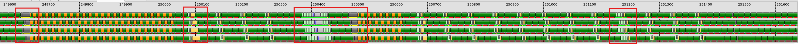
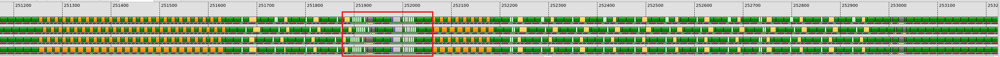

# v7_sliceN — Reducing Register Pressure via N-Slicing

## 1. Directory Structure

```
v7_sliceN/
├── matmul_kernel.py    # The kernel implementation
└── README.md           # This file
```

## 2. Motivation

Previous versions compute a full 256×256 output tile per iteration, requiring:
- A tile: 256×64
- B tile: 64×256
- C tile (accumulator): 256×256

As discussed in v5, local prefetch decouples `ds_read` from MFMA by loading data for the next iteration while the current MFMA executes. The tradeoff is increased register pressure: overlapping live ranges require two sets of registers per input tile.

This section quantifies register requirements and motivates slicing as a solution.

### 2.1. Register Usage Analysis

**Formula:**

```
registers = (M × N × elemType × sharing_factor) / (num_warps × waveSize)
```

Where:
- `M × N`: tile dimensions in elements
- `elemType`: element size in dwords (fp16 = 0.5, fp32 = 1.0)
- `sharing_factor`: number of warps sharing the tile (determined by `warpsPerCTA`)
- `num_warps`: 4 in our kernel
- `waveSize`: 64 on gfx9

**Understanding sharing_factor:**

The `warpsPerCTA` layout determines data sharing across warps:
- `warpsPerCTA = [2, 2]` (GEMM):
  - A tile: waves 0,1 share; waves 2,3 share → `sharing_factor = 2`
  - B tile: waves 0,2 share; waves 1,3 share → `sharing_factor = 2`
  - C tile: no sharing → `sharing_factor = 1`
- `warpsPerCTA = [4, 1]` (FlashAttention):
  - A tile: `sharing_factor = 1`
  - B tile: `sharing_factor = 4`
  - C tile: `sharing_factor = 1`

**Calculation for GEMM:**

| Tile | Size | elemType | sharing_factor | Base | With prefetch |
|------|------|----------|----------------|------|---------------|
| A | 256×64 | 0.5 | 2 | 64 | 128 (×2) |
| B | 64×256 | 0.5 | 2 | 64 | 128 (×2) |
| C | 256×256 | 1.0 | 1 | 256 | 256 |

**Total: 128 + 128 + 256 = 512 registers**

The gfx9 architecture provides exactly 512 VGPRs per SIMD. Additional registers are required for:
- `ds_read` addresses (1 per tensor)
- `buffer_load` addresses (1 per load)
- Temporaries and loop variables

### 2.2. Block-Level vs. Instruction-Level Analysis

The 512-register figure is a block-level upper bound. At the instruction level, the register allocator exploits non-overlapping live ranges to reuse registers. For instance, if `ds_read` is scheduled after the MFMA consuming its previous result, the two can share the same physical registers. This is why generated code avoids spills despite block-level analysis suggesting otherwise.

> [!IMPORTANT]
> In [v3_lds](../v3_lds/README.md), we established the principle of reasoning at the block level rather than the instruction level. The same applies to register analysis: we compute requirements at the block level and delegate fine-grained scheduling and reuse to the backend. Instruction-level optimizations may recover a few registers at the margins, but we should not depend on them to meet a tight budget — nor do we need to.
>
> Register allocation is tractable at the block level. We design the kernel in Gluon with sufficient headroom; the backend handles execution. This separation — block-level design, instruction-level execution — is central to the Gluon methodology.

### 2.3. The Need for Slicing

Register reuse prevents spills, but pressure remains high, leaving little margin for:
- Auxiliary operations (scales, bias, activation)
- Future kernel extensions

Reuse alone is insufficient. Register usage must be reduced **by design**.

> [!TIP]
> Slicing along M or N halves the register footprint for one input tile:
> - Slice along M → halve A tile registers
> - Slice along N → halve B tile registers

In this version, we slice along N, reducing B tile registers from 128 to 64:

**New total: 128 + 64 + 256 = 448 registers**

This headroom accommodates backend allocation overhead and future extensions.

> [!NOTE]
> M and N are output dimensions, not the reduction dimension K. Slicing along M or N doubles the number of output tiles per workgroup without increasing grid size. This is the principle behind **persistent kernels**: a workgroup iterates over multiple output tiles rather than terminating after one. The result is reduced per-tile register pressure with unchanged total computation.

## 3. Slicing Design

### 3.1. Separate LDS Allocations for B

Instead of a single B buffer, we allocate separate buffers for left and right halves:

```python
smemB_left = gl.allocate_shared_memory(
    b_ptr.dtype.element_ty, [nBuffers, BLOCK_K, BLOCK_N // 2], sharedLayoutB
)
smemB_right = gl.allocate_shared_memory(
    b_ptr.dtype.element_ty, [nBuffers, BLOCK_K, BLOCK_N // 2], sharedLayoutB
)
```

Similarly, two separate accumulators are maintained:

```python
acc_left = gl.zeros((BLOCK_M, BLOCK_N // 2), gl.float32, mfmaLayout)
acc_right = gl.zeros((BLOCK_M, BLOCK_N // 2), gl.float32, mfmaLayout)
```

### 3.2. Pipeline Structure

The pipeline contains 4 regions per unrolled iteration (2 sub-iterations × 2 slices):

```
Main Loop (step = 2):
    Region 0: MFMA(A, B_left) → acc_left       [registers: a, b_left]
              load B_right from LDS             [registers: b_right]
              async_copy A, B_left for next

    Region 1: MFMA(A, B_right) → acc_right     [registers: a, b_right]
              load A, B_left from LDS           [registers: a_next, b_left]
              async_copy B_right for next

    --- Loop unroll separator ---

    Region 2: MFMA(A, B_left) → acc_left       [registers: a_next, b_left]
              load B_right from LDS             [registers: b_right]
              async_copy A, B_left for next

    Region 3: MFMA(A, B_right) → acc_right     [registers: a_next, b_right]
              load A, B_left from LDS           [registers: a, b_left]
              async_copy B_right for next
```

### 3.3. Key Insight: Staggered B Loads

The critical optimization is staggering B_left and B_right loads:

1. Load A and B_left together (required for the first MFMA)
2. While MFMA computes with B_left, load B_right
3. While MFMA computes with B_right, load next iteration's A and B_left

This staggered pattern halves peak register usage for B operands.

### 3.4. Sliced Epilogue

The epilogue stores results in two separate operations:

```python
## Store left half
acc_left = gl.amd.cdna3.mfma(a, b_left, acc_left)
c_left = acc_left.to(a_ptr.dtype.element_ty)
gl.amd.cdna3.buffer_store(ptr=c_base, offsets=c_left_offsets, stored_value=c_left)

## Store right half
acc_right = gl.amd.cdna3.mfma(a, b_right, acc_right)
c_right = acc_right.to(a_ptr.dtype.element_ty)
gl.amd.cdna3.buffer_store(ptr=c_base, offsets=c_right_offsets, stored_value=c_right)
```

Storing `acc_left` overlaps with the final MFMA computing `acc_right`.

## 4. Performance Analysis

### 4.1. Performance Collection

Performance data is collected with:
```bash
python scripts/run_perf_table.py --kernel a16w16 --versions 6 7 --configs llir llir+force-agpr llir+force-agpr+amdgcnas --K 8192 --dtype fp16 --rocprof
```
This command can be run from anywhere in the repository. See [run_perf_table.py](../../../../../scripts/README.md#run_perf_tablepy) for details. For MFMA efficiency measurement methodology, see [MFMA Efficiency](../../../../../docs/mfma_efficiency.md).

| Version                                     | TFLOPS | VGPRs | Spills | MFMA Eff. |
|---------------------------------------------|--------|-------|--------|-----------|
| v6 + LLIR scheduler                         |   1166 |   508 |      0 |    87.07% |
| v7 + LLIR scheduler                         |   1332 |   512 |      0 |    84.77% |
| v7 + LLIR scheduler + force-agpr            |   1392 |   468 |      0 |    97.01% |
| v7 + LLIR scheduler + force-agpr + amdgcnas |   1386 |   468 |      0 |    98.43% |

### 4.2. The AGPR↔VGPR copy bottleneck

At 84.77% MFMA efficiency, v7 + LLIR scheduler is well short of the 98% ceiling. The gap is copy traffic inside the main loop. The MFMA accumulators are split between AGPRs and VGPRs, so the register allocator inserts `v_accvgpr_*` copies to move accumulator values into the register file each MFMA needs — and every such copy on the MFMA critical path opens a gap in the MFMA stream.

The copy count tracks the efficiency directly. Counting `v_accvgpr_*` instructions in one main-loop body (256 MFMAs each):

| Config              | in-loop `v_accvgpr_*` copies | MFMA Eff. |
|---------------------|------------------------------|-----------|
| v6 + LLIR scheduler |                           39 |    87.07% |
| v7 + LLIR scheduler |                          100 |    84.77% |

v7's N-slicing spreads the operands across more live ranges, so the allocator shuffles accumulators more often than in v6 — more copies, slightly lower MFMA efficiency. These in-loop copies are the dominant non-MFMA cost, and the next section removes them.

### 4.3. Register Allocation Workaround: force-agpr

The `force-agpr` config (`TRITON_FORCE_MFMA_AGPR=1`) constrains every MFMA accumulator — both the input accumulator (OpC) and the output (Dst) — to AGPRs, via two LLVM settings:

```
amdgpu-agpr-alloc=256      # reserve 256 AGPRs for accumulators
amdgpu-mfma-vgpr-form=0    # emit the AGPR form of MFMA
```

With every accumulator already in an AGPR, each MFMA reads and writes it in place, so the allocator never needs an in-loop shuffle. The main loop drops to **0** `v_accvgpr_*` copies, which frees VGPRs (512 → 468) and raises MFMA efficiency to **97%**.

The tradeoff: forcing all accumulators into AGPRs pushes the AGPR→VGPR reads into the epilogue, where the output `v_cvt` downcast requires VGPR inputs — paid once per kernel instead of every iteration. For compute-bound GEMM with large K (~95% of the time in the main loop), that is a good trade.



The trace above shows that removing the in-loop copies also eliminates the VALU stalls that DIDT protection was inducing. The remaining bottleneck is scattered non-MFMA regions — typically consecutive SALU instructions at iteration boundaries.

### 4.4. amdgcnas Assembly Processor

**amdgcnas** is an assembly post-processor that applies peephole optimizations to compress the remaining non-MFMA gaps. It ships as an out-of-tree plugin in this repo ([`plugins/amdgcnas/`](../../../../../plugins/amdgcnas/README.md)).

Enable it on top of the LLIR scheduler and force-agpr by setting the environment variables:

```bash
TRITON_FORCE_MFMA_AGPR=1 TRITON_AMDGCNAS_PLUGIN=1
```

Layered on force-agpr, the peephole packs the scattered SALU regions at iteration boundaries. With the full stack (LLIR scheduler + force-agpr + amdgcnas), v7 reaches **98% MFMA efficiency** — near the theoretical maximum.

The trace below shows tightly packed MFMA instructions with minimal gaps between iterations:



## 5. What Comes Next

With 98% MFMA efficiency, the hot loop of this design is effectively tight. In [`v8_sliceMN`](../v8_sliceMN/README.md), we push slicing further by also splitting A along M — reducing peak register pressure and resolving buffer-load throughput stalls at large K. Then [`v9_beyond_hotloop`](../v9_beyond_hotloop/README.md) shifts focus outside the loop, to L2 cache locality via XCD-aware PID remapping.
