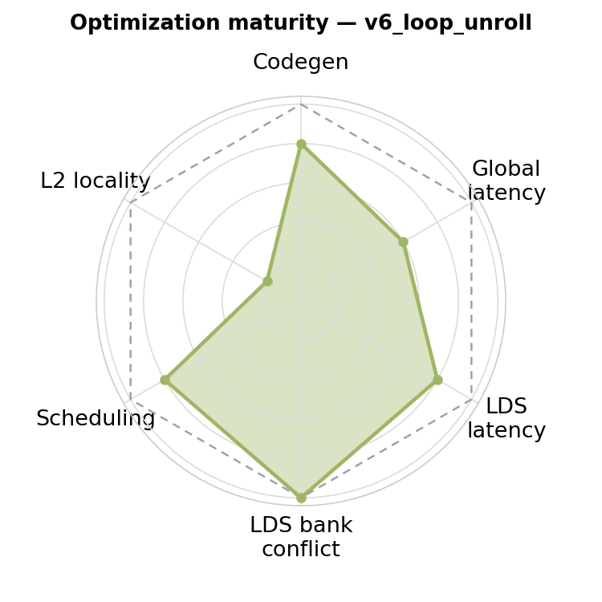
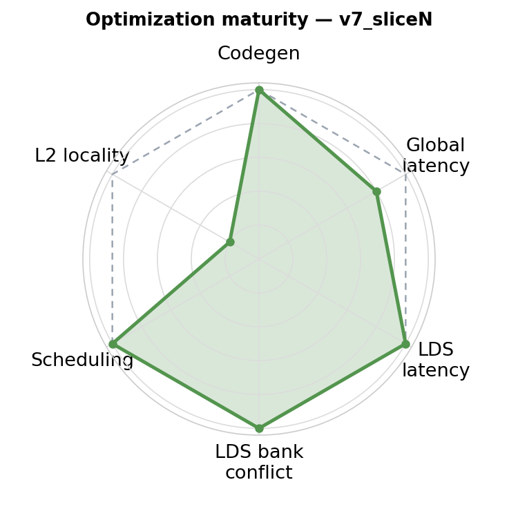
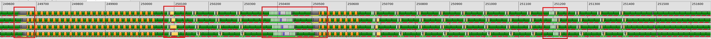
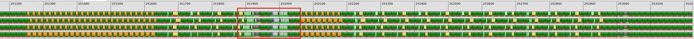

# v7_sliceN — Reducing Register Pressure via N-Slicing

<p align="center">
  
  &nbsp;&nbsp;
  
</p>

**Optimization maturity (rough).** Left = previous (`v6_loop_unroll`), right = this version (`v7_sliceN`). Axes — codegen, global latency, LDS latency, LDS bank conflict, scheduling, L2 locality — are defined in the [`v0_naive` README](../v0_naive/README.md); each version pushes the axes it improves toward the dashed "optimal" envelope.


## 1. Directory Structure

```
v7_sliceN/
├── matmul_kernel.py    # The kernel implementation
└── README.md           # This file
```

## 2. Motivation

Previous versions compute a full 256×256 output tile per iteration, requiring:
- A tile: 256×64
- B tile: 64×256
- C tile (accumulator): 256×256

As discussed in v5, local prefetch decouples `ds_read` from MFMA by loading data for the next iteration while the current MFMA executes. The tradeoff is increased register pressure: overlapping live ranges require two sets of registers per input tile.

This section quantifies register requirements and motivates slicing as a solution.

### 2.1. Register Usage Analysis

**Formula:**

```
registers = (M × N × elemType × sharing_factor) / (num_warps × waveSize)
```

Where:
- `M × N`: tile dimensions in elements
- `elemType`: element size in dwords (fp16 = 0.5, fp32 = 1.0)
- `sharing_factor`: number of warps sharing the tile (determined by `warpsPerCTA`)
- `num_warps`: 4 in our kernel
- `waveSize`: 64 on gfx9

**Understanding sharing_factor:**

The `warpsPerCTA` layout determines data sharing across warps:
- `warpsPerCTA = [2, 2]` (GEMM):
  - A tile: waves 0,1 share; waves 2,3 share → `sharing_factor = 2`
  - B tile: waves 0,2 share; waves 1,3 share → `sharing_factor = 2`
  - C tile: no sharing → `sharing_factor = 1`
- `warpsPerCTA = [4, 1]` (FlashAttention):
  - A tile: `sharing_factor = 1`
  - B tile: `sharing_factor = 4`
  - C tile: `sharing_factor = 1`

**Calculation for GEMM:**

| Tile | Size | elemType | sharing_factor | Base | With prefetch |
|------|------|----------|----------------|------|---------------|
| A | 256×64 | 0.5 | 2 | 64 | 128 (×2) |
| B | 64×256 | 0.5 | 2 | 64 | 128 (×2) |
| C | 256×256 | 1.0 | 1 | 256 | 256 |

**Total: 128 + 128 + 256 = 512 registers**

The gfx9 architecture provides exactly 512 VGPRs per SIMD. Additional registers are required for:
- `ds_read` addresses (1 per tensor)
- `buffer_load` addresses (1 per load)
- Temporaries and loop variables

### 2.2. Block-Level vs. Instruction-Level Analysis

The 512-register figure is a block-level upper bound. At the instruction level, the register allocator exploits non-overlapping live ranges to reuse registers. For instance, if `ds_read` is scheduled after the MFMA consuming its previous result, the two can share the same physical registers. This is why generated code avoids spills despite block-level analysis suggesting otherwise.

> [!IMPORTANT]
> In [v3_lds](../v3_lds/README.md), we established the principle of reasoning at the block level rather than the instruction level. The same applies to register analysis: we compute requirements at the block level and delegate fine-grained scheduling and reuse to the backend. Instruction-level optimizations may recover a few registers at the margins, but we should not depend on them to meet a tight budget — nor do we need to.
>
> Register allocation is tractable at the block level. We design the kernel in Gluon with sufficient headroom; the backend handles execution. This separation — block-level design, instruction-level execution — is central to the Gluon methodology.

### 2.3. The Need for Slicing

Register reuse prevents spills, but pressure remains high, leaving little margin for:
- Auxiliary operations (scales, bias, activation)
- Future kernel extensions

Reuse alone is insufficient. Register usage must be reduced **by design**.

> [!TIP]
> Slicing along M or N halves the register footprint for one input tile:
> - Slice along M → halve A tile registers
> - Slice along N → halve B tile registers

In this version, we slice along N, reducing B tile registers from 128 to 64:

**New total: 128 + 64 + 256 = 448 registers**

This headroom accommodates backend allocation overhead and future extensions.

> [!NOTE]
> M and N are output dimensions, not the reduction dimension K. Slicing along M or N doubles the number of output tiles per workgroup without increasing grid size. This is the principle behind **persistent kernels**: a workgroup iterates over multiple output tiles rather than terminating after one. The result is reduced per-tile register pressure with unchanged total computation.

## 3. Slicing Design

### 3.1. Separate LDS Allocations for B

Instead of a single B buffer, we allocate separate buffers for left and right halves:

```python
smemB_left = gl.allocate_shared_memory(
    b_ptr.dtype.element_ty, [nBuffers, BLOCK_K, BLOCK_N // 2], sharedLayoutB
)
smemB_right = gl.allocate_shared_memory(
    b_ptr.dtype.element_ty, [nBuffers, BLOCK_K, BLOCK_N // 2], sharedLayoutB
)
```

Similarly, two separate accumulators are maintained:

```python
acc_left = gl.zeros((BLOCK_M, BLOCK_N // 2), gl.float32, mfmaLayout)
acc_right = gl.zeros((BLOCK_M, BLOCK_N // 2), gl.float32, mfmaLayout)
```

### 3.2. Pipeline Structure

The pipeline contains 4 regions per unrolled iteration (2 sub-iterations × 2 slices):

```
Main Loop (step = 2):
    Region 0: MFMA(A, B_left) → acc_left       [registers: a, b_left]
              load B_right from LDS             [registers: b_right]
              async_copy A, B_left for next

    Region 1: MFMA(A, B_right) → acc_right     [registers: a, b_right]
              load A, B_left from LDS           [registers: a_next, b_left]
              async_copy B_right for next

    --- Loop unroll separator ---

    Region 2: MFMA(A, B_left) → acc_left       [registers: a_next, b_left]
              load B_right from LDS             [registers: b_right]
              async_copy A, B_left for next

    Region 3: MFMA(A, B_right) → acc_right     [registers: a_next, b_right]
              load A, B_left from LDS           [registers: a, b_left]
              async_copy B_right for next
```

### 3.3. Key Insight: Staggered B Loads

The critical optimization is staggering B_left and B_right loads:

1. Load A and B_left together (required for the first MFMA)
2. While MFMA computes with B_left, load B_right
3. While MFMA computes with B_right, load next iteration's A and B_left

This staggered pattern halves peak register usage for B operands.

### 3.4. Sliced Epilogue

The epilogue stores results in two separate operations:

```python
## Store left half
acc_left = gl.amd.cdna3.mfma(a, b_left, acc_left)
c_left = acc_left.to(a_ptr.dtype.element_ty)
gl.amd.cdna3.buffer_store(ptr=c_base, offsets=c_left_offsets, stored_value=c_left)

## Store right half
acc_right = gl.amd.cdna3.mfma(a, b_right, acc_right)
c_right = acc_right.to(a_ptr.dtype.element_ty)
gl.amd.cdna3.buffer_store(ptr=c_base, offsets=c_right_offsets, stored_value=c_right)
```

Storing `acc_left` overlaps with the final MFMA computing `acc_right`.

## 4. Performance Analysis

### 4.1. Performance Collection

Performance data is collected with:
```bash
python scripts/run_perf_table.py --kernel a16w16 --versions 6 7 --configs base llir llir+amdgcnas --K 8192 --dtype fp16 --rocprof --allow-unreported
```
This command can be run from anywhere in the repository. See [run_perf_table.py](../../../../../scripts/README.md#run_perf_tablepy) for details. For MFMA efficiency measurement methodology, see [MFMA Efficiency](../../../../../docs/mfma_efficiency.md).

| Version                        | TFLOPS | VGPRs | Spills | MFMA Eff. |
|--------------------------------|--------|-------|--------|-----------|
| v6 + LLIR scheduler            |   1158 |   511 |      8 |    89.83% |
| v7 (`base`)                    |   1186 |   512 |      8 |    65.99% |
| v7 + LLIR scheduler            |   1551 |   512 |      8 |    97.15% |
| v7 + LLIR scheduler + amdgcnas |   1569 |   512 |      8 |    97.92% |

v7 makes two changes, and the table shows their sum: under the LLIR scheduler it runs 34% ahead
of v6 (1551 vs 1158). The first is the N-slicing above, which brings the register budget under
the ceiling **by construction** instead of leaving it to the allocator (v6 spills 8 registers under
`llir` on this pin, and 241 in its stock build). The second is pinning every MFMA accumulator to an
AGPR (§4.3), which removes the copy traffic that slicing alone leaves in the loop (§4.2). Measured
side by side, slicing alone takes the `llir` build to 1435 TFLOPS and the pins add the rest.

### 4.2. The AGPR↔VGPR copy bottleneck

With the register budget fixed, the remaining gap is copy traffic inside the main loop. If the
MFMA accumulators are free to live in either register file, the allocator splits them between AGPRs
and VGPRs and inserts `v_accvgpr_*` copies to move accumulator values into the register file each
MFMA needs — and every such copy on the MFMA critical path opens a gap in the MFMA stream. The copy
problem started in [v5](../v5_local_prefetch/README.md#54-bottleneck-analysis) (105 copies once the
LLIR scheduler filled the register file) and v6's unroll did not remove it.

Counting `v_accvgpr_*` instructions in one main-loop body (256 MFMAs) of v7 built **without** the
pins:

| v7 without pins                | in-loop `v_accvgpr_*` copies | TFLOPS |
|--------------------------------|------------------------------|--------|
| `base`                         |                          280 |   1237 |
| + LLIR scheduler               |                          116 |   1435 |

116 copies against 256 MFMAs are the dominant non-MFMA cost under the LLIR scheduler, and the next
section removes them.

### 4.3. Pinning the accumulators: `cd_regclass`

From v7 on, every MFMA call passes Gluon's `cd_regclass="a"`
([triton-lang/triton#11792](https://github.com/triton-lang/triton/pull/11792)), which constrains the accumulator —
both the input (OpC) and the output (Dst) — to AGPRs:

```python
acc_left = gl.amd.cdna3.mfma(a, b_left, acc_left, cd_regclass="a")
```

Triton wraps the MFMA's C and D in empty tied inline asm (`"=a,0"`), which pins both to the AGPR
class, so the register allocator has no VGPR form to choose. The LLIR scheduler keeps each pin
next to its MFMA when it reorders the loop (see
[`plugins/llir_scheduler/`](../../../../../plugins/llir_scheduler/README.md#register-class-pins)).
(Before `gfx950-tutorial-v2.2` this was a process-wide switch, `TRITON_FORCE_MFMA_AGPR`, called
force-agpr in earlier versions of this tutorial.)

With every accumulator already in an AGPR, each MFMA reads and writes it in place, so the
allocator never needs an in-loop shuffle. The same v7 source with and without the pins, measured
side by side (two rounds each):

| v7, FP16 K=8192                | without pins               | with pins (this kernel)   |
|--------------------------------|----------------------------|---------------------------|
| `base`                         | 1237 (280 copies, 6 spills) | 1203 (0 copies, 8 spills) |
| + LLIR scheduler               | 1435 (116 copies)          | **1556** (0 copies)       |

Under the LLIR scheduler the pins are worth **+8.4%**: the loop keeps its interleave and loses all
116 copies, and MFMA efficiency reaches 97.2%. The stock build gives up about 3%: without the
scheduler the copies are not what limits it (the pinned stock loop still runs at only 66% MFMA
efficiency).
The pinned build spills 8 registers, all outside the main loop (no scratch access inside it).
amdgcnas ([§4.4](#44-amdgcnas-assembly-processor)) runs on top of the pinned build only: it
assumes the accumulators are in AGPRs.

The tradeoff: forcing all accumulators into AGPRs pushes the AGPR→VGPR reads into the epilogue, where the output `v_cvt` downcast requires VGPR inputs — paid once per kernel instead of every iteration. For compute-bound GEMM with large K (~95% of the time in the main loop), that is a good trade.



The trace above shows that removing the in-loop copies also eliminates the VALU stalls that DIDT protection was inducing. The remaining bottleneck is scattered non-MFMA regions — typically consecutive SALU instructions at iteration boundaries.

### 4.4. amdgcnas Assembly Processor

**amdgcnas** is an assembly post-processor that applies peephole optimizations to compress the remaining non-MFMA gaps. It ships as an out-of-tree plugin in this repo ([`plugins/amdgcnas/`](../../../../../plugins/amdgcnas/README.md)).

Enable it on top of the LLIR scheduler by setting the environment variable:

```bash
TRITON_AMDGCNAS_PLUGIN=1
```

The peephole packs the scattered SALU regions at iteration boundaries. With the full stack (LLIR scheduler + amdgcnas), v7 reaches **97.9% MFMA efficiency** — near the theoretical maximum.

The trace below shows tightly packed MFMA instructions with minimal gaps between iterations:



## 5. What Comes Next

With ~98% MFMA efficiency, the hot loop of this design is effectively tight. In [`v8_sliceMN`](../v8_sliceMN/README.md), we push slicing further by also splitting A along M — reducing peak register pressure and resolving buffer-load throughput stalls at large K. Then [`v9_beyond_hotloop`](../v9_beyond_hotloop/README.md) shifts focus outside the loop, to L2 cache locality via XCD-aware PID remapping.
