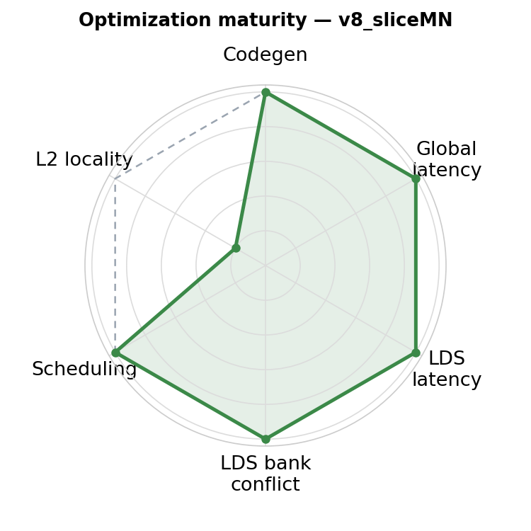
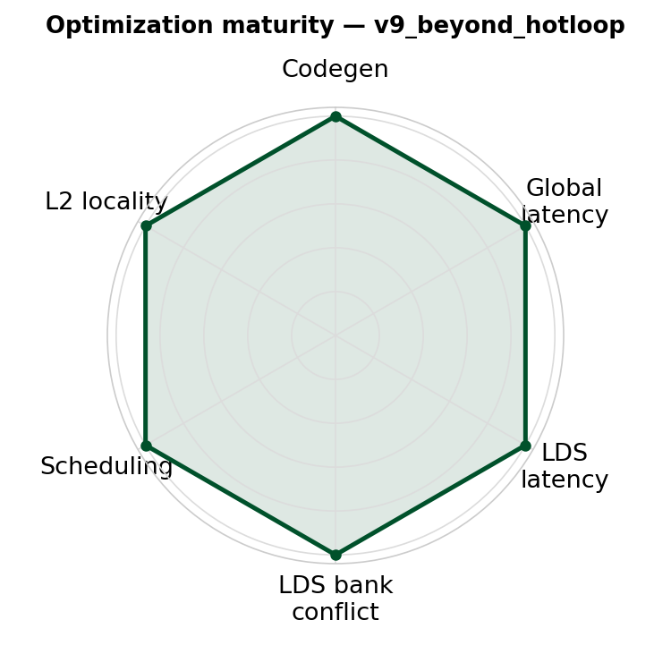
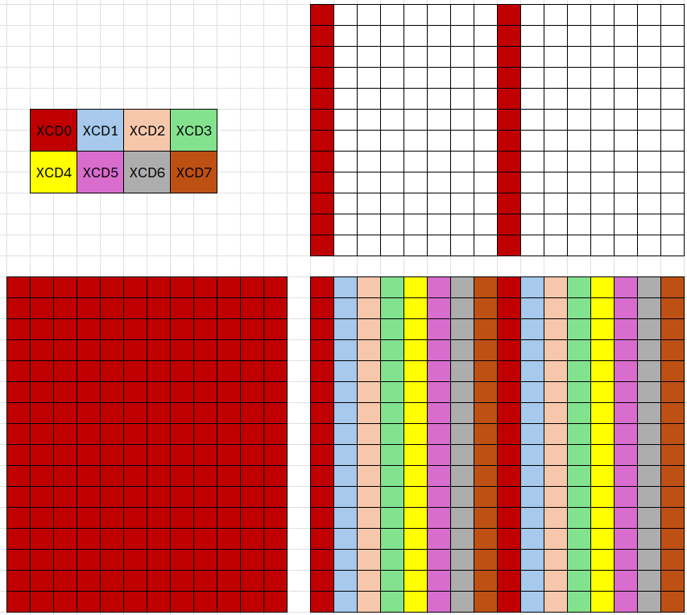
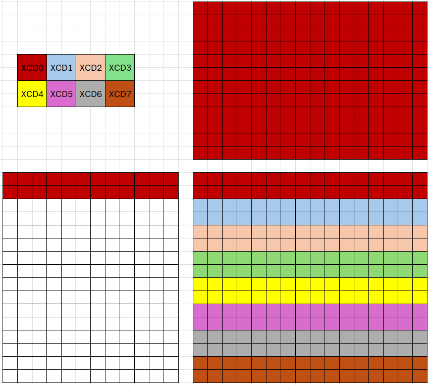

# v9_beyond_hotloop — Optimizations Beyond the Hot Loop

<p align="center">
  
  &nbsp;&nbsp;
  
</p>

**Optimization maturity (rough).** Left = previous (`v8_sliceMN`), right = this version (`v9_beyond_hotloop`). Axes — codegen, global latency, LDS latency, LDS bank conflict, scheduling, L2 locality — are defined in the [`v0_naive` README](../v0_naive/README.md); each version pushes the axes it improves toward the dashed "optimal" envelope.


## 1. Directory Structure

```
v9_beyond_hotloop/
├── matmul_kernel.py    # The kernel implementation
└── README.md           # This file
```

## 2. Motivation

Previous versions focused on improving MFMA efficiency inside the loop—maximizing compute utilization on each CU through pipelining, prefetching, and register pressure management. v8's epilogue (quadrant-level stores with single-MFMA spacing) already handles store-burst contention well across K, so this version focuses on a different lever entirely: **frequency**.

Higher power consumption leads to lower sustained clock frequency. As discussed in v7 regarding DIDT protection, reducing power consumption is essential for achieving peak TFLOPS. One way to lower power is to reduce off-chip and inter-XCD memory traffic, which is governed by L2 cache reuse across workgroups.

This version addresses that with one optimization:

- **L2 cache locality** (Section 3): XCD-aware PID remapping and workgroup swizzling reduce L2 misses, lowering power consumption and sustaining higher frequency.

## 3. L2 Cache Locality

Throughout this section, we use **GM** as shorthand for **GROUP_SIZE_M**.

### 3.1 The Problem: Poor L2 Reuse Across XCDs

gfx942 and gfx950 have 8 XCDs (Accelerator Compute Dies), each with its own L2 cache. The hardware distributes workgroups across XCDs in round-robin order: workgroup 0 goes to XCD 0, workgroup 1 to XCD 1, and so on.

This creates a problem for cache reuse. Adjacent output tiles often share input tiles from A or B. With naive PID assignment, adjacent tiles map to consecutive workgroup IDs—and thus to different XCDs. Since each XCD has a separate L2 cache, shared input data must be reloaded from HBM on each XCD, wasting memory bandwidth.

Consider v7 with shape 4096×4096 and BLOCK_M=BLOCK_N=256. The output is divided into 16×16 = 256 tiles. With row-major PID assignment and round-robin XCD distribution, workgroups on XCD 0 are spread across all rows:



XCD 0 receives workgroups from every row of the output grid. As a result, XCD 0 must load the **entire A matrix** (all 16 row-strips) but only 1/8 of B (2 column-strips). The same pattern applies to all XCDs—each requires the full A matrix, resulting in poor L2 cache reuse.

### 3.2 XCD-Aware PID Remapping

The first optimization remaps PIDs so that consecutive tiles land on the **same XCD**:

```python
@gluon.jit
def get_pids(M, N, BM, BN, GRID_MN, NUM_XCDS, GROUP_SIZE_M):
    pid = gl.program_id(axis=0)

    if NUM_XCDS != 1:
        pids_per_xcd = (GRID_MN + NUM_XCDS - 1) // NUM_XCDS
        tall_xcds = GRID_MN % NUM_XCDS
        tall_xcds = NUM_XCDS if tall_xcds == 0 else tall_xcds
        xcd = pid % NUM_XCDS
        local_pid = pid // NUM_XCDS

        if xcd < tall_xcds:
            pid = xcd * pids_per_xcd + local_pid
        else:
            pid = tall_xcds * pids_per_xcd + (xcd - tall_xcds) * (pids_per_xcd - 1) + local_pid
    ...
```

With XCD remapping alone (GM=1), each XCD receives a contiguous block of 32 tiles arranged in 2 rows × 16 columns:



However, this layout still requires the **entire B matrix** (all 16 column-strips) and only 1/8 of A (2 row-strips) per XCD. The total data footprint per XCD is unchanged—we have simply swapped which matrix is fully loaded.

### 3.3 Workgroup Swizzling with GROUP_SIZE_M

To reduce the data footprint per XCD, we reshape the workgroup layout using GROUP_SIZE_M:

```python
if GROUP_SIZE_M == 1:
    pid_m = pid // num_pid_n
    pid_n = pid % num_pid_n
else:
    num_pid_in_group = GROUP_SIZE_M * num_pid_n
    group_id = pid // num_pid_in_group
    first_pid_m = group_id * GROUP_SIZE_M
    group_size_m = min(num_pid_m - first_pid_m, GROUP_SIZE_M)
    pid_m = first_pid_m + ((pid % num_pid_in_group) % group_size_m)
    pid_n = (pid % num_pid_in_group) // group_size_m
```

With GM=4, the 32 workgroups per XCD are arranged in a 4×8 grid:


Now each XCD only requires **1/4 of A** (4 row-strips) and **1/2 of B** (8 column-strips). The total data footprint per XCD is significantly reduced compared to either v7 or v8 with GM=1.

### 3.4 Math Model for Optimal GM

The configurations above can be analyzed mathematically. Given:
- Total workgroups: 256
- Workgroups per XCD: P = 32
- Workgroup layout per XCD: GM × ⌈P/GM⌉

Each XCD loads:
- From A: GM row-strips
- From B: ⌈P/GM⌉ column-strips

Total data per XCD is proportional to GM + ⌈P/GM⌉.

**Optimization Problem**: Find integer GM that minimizes $f(\text{GM}) = \text{GM} + \lceil P/\text{GM} \rceil$.

For the continuous relaxation:

$$f(x) = x + \frac{P}{x}$$

$$f'(x) = 1 - \frac{P}{x^2} = 0 \quad \Rightarrow \quad x = \sqrt{P}$$

For P = 32, $\sqrt{32} \approx 5.66$.

Evaluating f(GM) for different values:

| GM | ⌈P/GM⌉ | f(GM) | Configuration |
|----|--------|-------|---------------|
| 16 |      2 |    18 | v7 (no XCD remapping) |
|  2 |     16 |    18 | v8 GM=1 (XCD remapping only) |
|  4 |      8 |    12 | v8 GM=4 |
|  6 |      6 |    12 | v8 GM=6 |
|  8 |      4 |    12 | v8 GM=8 |

The optimal values are GM = 4, 6, or 8, all achieving f(GM) = 12. The math model confirms:
- v7 (effectively GM=16) and v8 GM=1 (effectively GM=2) have the same suboptimal data footprint
- GM = 4, 6, or 8 all achieve the minimum data footprint

### 3.5 Validation

The math model predicts that GM = 4, 6, or 8 should achieve better L2 locality than v8 (no XCD remapping) or v9 with GM = 1. Hardware counter measurements on MI355 at M=N=4096, K=8192, fp16, llir+force-agpr+amdgcnas confirm this:

| Configuration                  | TCC_EA0_RDREQ_DRAM_sum | TCP_TCC_READ_REQ_sum |
|--------------------------------|------------------------|----------------------|
| v8 (no XCD remapping)          |              5,282,502 |           16,777,216 |
| v9 GM=1 (XCD remapping only)   |              6,070,335 |           16,777,216 |
| v9 GM=4                        |              4,100,918 |           16,777,216 |
| v9 GM=6                        |              4,331,455 |           16,777,216 |
| v9 GM=8                        |              4,362,222 |           16,777,216 |

**Counter Definitions**:
- **TCP_TCC_READ_REQ_sum**: Requests from L1 to L2. All configurations have identical values since all workgroups perform the same computation.
- **TCC_EA0_RDREQ_DRAM_sum**: Requests from L2 to MALL (memory-side last-level cache), indicating L2 cache misses.

**Observations**:
- v8 (no XCD remapping) and v9 GM=1 (XCD remapping with the suboptimal grouping) sit at the high end of L2 misses — ~5.3M and ~6.1M respectively. v9 GM=1 is *worse* than v8 because XCD remapping with GM=1 forces a column-heavy access pattern across each XCD's 32 workgroups, which is the f(GM) = 18 case in §3.4.
- GM = 4, 6, and 8 all land at ~4.1–4.4M, matching the math model's prediction that any of those three minimizes f(GM) = 12. GM=4 is slightly best at this shape, but the spread between GM=4/6/8 is small.
- Reduced L2 traffic translates to higher sustained TFLOPS in steady-state operation: lower L2 miss volume reduces HBM and inter-XCD traffic, lowering power consumption, which lets the GPU sustain a higher boost clock.

Counters are collected using:
```bash
# v8 (no XCD remapping)
python scripts/run_counter_collection.py --kernel a16w16 --versions 8 --configs llir+force-agpr+amdgcnas --K 8192 --dtype fp16 --counters TCC_EA0_RDREQ_DRAM_sum,TCP_TCC_READ_REQ_sum

# v9 with GM=1, 4, 6, 8 — vary GROUP_SIZE_M in v9_beyond_hotloop/matmul_kernel.py's matmul() launcher
python scripts/run_counter_collection.py --kernel a16w16 --versions 9 --configs llir+force-agpr+amdgcnas --K 8192 --dtype fp16 --counters TCC_EA0_RDREQ_DRAM_sum,TCP_TCC_READ_REQ_sum
```

For an explanation of MFMA efficiency and how to measure it, see [MFMA Efficiency](../../../../../docs/mfma_efficiency.md).

## 4. Summary

This version demonstrates one optimization beyond the hot loop:

- **L2 cache locality**: XCD-aware PID remapping and workgroup swizzling (GROUP_SIZE_M) reduce L2 misses by ~30% (5.28M → 4.10M for the optimal GM=4 configuration on MI355 at K=8192), lowering HBM and inter-XCD traffic. The math model in §3.4 makes the optimal GM choice predictable: minimize GM + ⌈P/GM⌉ where P is workgroups per XCD.

The hot loop and epilogue are unchanged from v8 — v8 already covers M+N slicing, async-copy pipelining, and quadrant-level store interleaving. v9's contribution sits entirely outside the loop, in workgroup placement.

Combined with optimizations from previous versions (pipelining, local prefetch, loop unrolling, M+N slicing), this kernel achieves measurable additional throughput over v8 in healthy GPU power state. Most of the absolute uplift in the a16w16 series lands in v7–v8; v9 contributes the last few percent through L2 locality.
