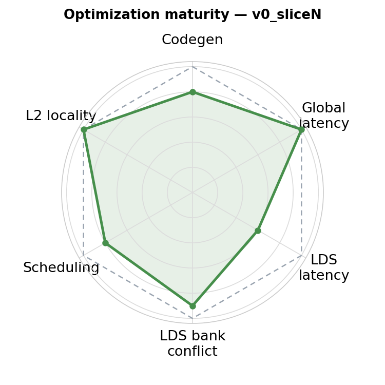
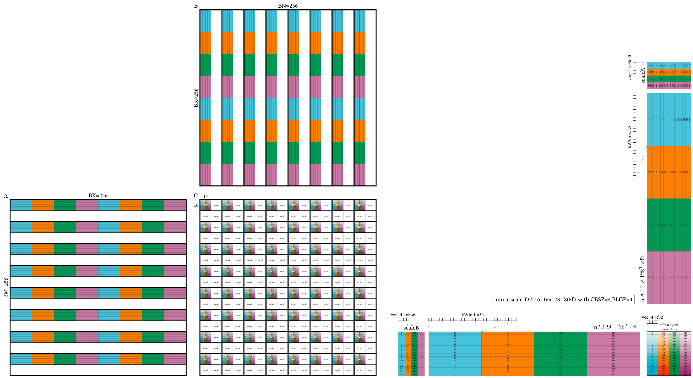
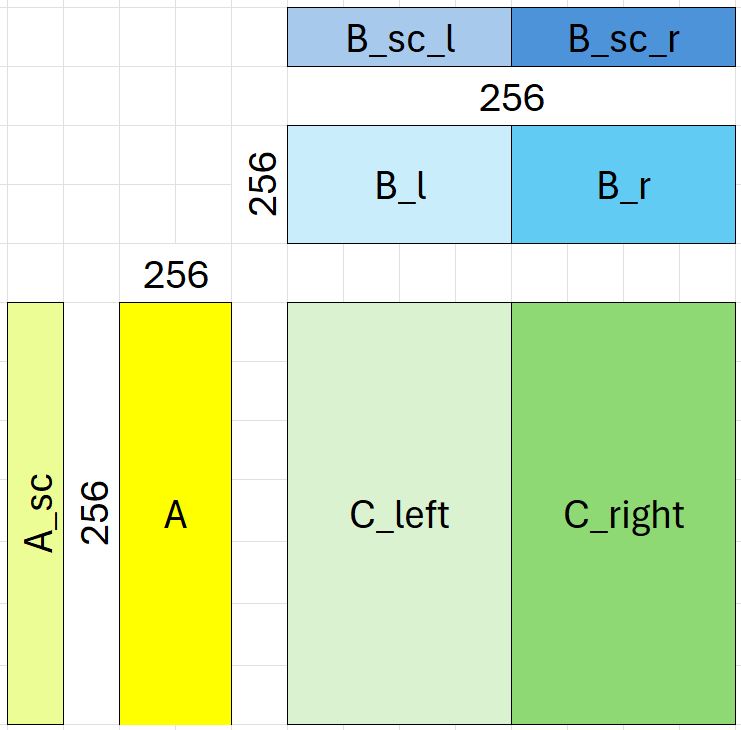

# MXFP4 GEMM Kernel — v0_sliceN

<p align="center">
  
</p>

**Optimization maturity (rough).** Axes — codegen, global latency, LDS latency, LDS bank conflict, scheduling, L2 locality — are defined in the [`v0_naive` README](../../a16w16/v0_naive/README.md); the polygon vs the dashed "optimal" envelope shows how mature this kernel is.


This kernel implements a high-performance MXFP4 (e2m1) GEMM targeting AMD MI350/355 GPUs (gfx950). The **tile pipeline** is unchanged from [a16w16](../../a16w16/) and [a8w8](../../a8w8/) — same double-buffered async copy, 3-stage pipeline, N-slicing, loop unrolling by 2, LLIR scheduler, and amdgcnas. What's new is a **separate scale pipeline**: per-group 8-bit scales require a GR → LW → LR round-trip through LDS for layout conversion, with its own register buffering and scheduling considerations. Read the rest of this README with the tile pipeline as inherited background; the new material — scale layouts (§2.2–§2.4), `ds_read_tr` (§2.5), and scale-pipeline scheduling (§3.5–§3.6) — is where the real work of this kernel lives.

If you haven't completed the a16w16 journey and reviewed the a8w8 kernel, start there first. This README assumes familiarity with N-slicing, 3-stage pipelining, loop unrolling, the LLIR scheduler, and amdgcnas. See [`/docs/performance_philosophy.md`](../../../../../docs/performance_philosophy.md) for the design rationale behind these tools.

## 1. Directory Structure

```
a4w4/
├── matmul_kernel.py      # The kernel implementation
├── bench.py              # Benchmark and correctness test
└── README.md             # This file
```

## 2. MXFP4 Basics and Layouts

MXFP4 is a microscaling format defined in the [OCP Microscaling Formats (MX) v1.0 Spec](https://www.opencompute.org/documents/ocp-microscaling-formats-mx-v1-0-spec-final-pdf). Data is stored in 4-bit e2m1 (2-bit exponent, 1-bit mantissa), with two values packed per byte. Each group of 32 elements shares an 8-bit e8m0 scale factor.

This kernel uses `v_mfma_scale_f32_16x16x128_f8f6f4` with `cbsz=4, blgp=4` (E2M1 format), which completes in 16 cycles per instruction. In Gluon, the `mfma_scaled` API takes data tiles, scale tensors, and the format string:

```python
acc = gl.amd.cdna4.mfma_scaled(a, a_scale, "e2m1", b, b_scale, "e2m1", acc)
```

### 2.1 Layouts: the heart of the design

Learning Gluon is learning layouts. The MXFP4 kernel introduces **scale layouts** on top of the tile and accumulator layouts from FP16/BF8. Understanding how scales are distributed across threads is essential to understanding the kernel.

The following diagram shows the complete layout for the MXFP4 GEMM — A, B, C matrices with their dot operand layouts, and the scale layouts used by `mfma_scale_f32_16x16x128_f8f6f4` with `CBSZ=4, BLGP=4`:



<details>
<summary>Command to generate this layout</summary>

```bash
python3 layout_plot/plot_layout.py --output mfma_scale_mxfp4 --force dot \
    --gfx 950 \
    --dotShape 256 256 256 --nonKDim 16 \
    --dtypeA f4 --dtypeB f4 --scale --mfmaTrans --warpsPerCTA 2 2
```

</details>

### 2.2 How scales map to MFMA instructions

A single `mfma_scale` instruction computes a 16x16x128 tile and requires a scale of shape [16, 4] (16 rows along M/N, 4 groups along K since 128 / 32 = 4). Each scale input occupies **one 32-bit register** per operand (A and B).

The [16, 4] = 64 scale values are distributed across 64 threads, so each thread holds exactly **1 scale value** per `mfma_scale`. However, the 4 scale values in the same row (the K-scale dimension) are assigned to 4 different threads.

The key optimization is that the compiler **packs 4 scale values into one 32-bit register** (4 x 8-bit e8m0 = 32 bits) rather than using a separate register for each `mfma_scale` invocation. Each `mfma_scale` instruction uses the `op_sel_hi` flag to select the appropriate byte within the register. This means every 4 `mfma_scale` instructions share the same scale register, with only `op_sel_hi` changing between them.

### 2.3 Why scales need an LDS round-trip

Unlike input tiles, scales **cannot use `buffer_load_to_lds`** (async copy) to load directly from global memory into LDS. Each thread loads only 32 or 64 bits of scale data, which is below the minimum granularity that `buffer_load_to_lds` supports.

Instead, scales must go through a 3-step pipeline:

1. **GR** (Global Read): `buffer_load` loads scales from HBM into registers in a `BlockedLayout` optimized for coalesced access
2. **LW** (Local Write): `store` writes scales from registers to LDS
3. **LR** (Local Read): `smem.load` reads scales back from LDS into the MFMA scale layout

The LDS round-trip exists because the two register layouts are fundamentally different. The `BlockedLayout` for global load groups consecutive M (or N) elements per thread for coalesced HBM access. The MFMA scale layout distributes M/N positions to match the MFMA dot operand thread mapping — each thread's scale values must correspond to the data elements it feeds to MFMA. These two distributions are incompatible, so LDS serves as the intermediary to redistribute data between them.

### 2.4 Scale layouts through the pipeline

1. **HBM layout**: A scales are stored as `[M, K // SCALE_GROUP_SIZE]`, B scales as `[N, K // SCALE_GROUP_SIZE]` (split into left/right halves of `[N//2, K // SCALE_GROUP_SIZE]`). With `SCALE_GROUP_SIZE=32` and `BLOCK_K=256`, each tile loads `[256, 8]` for A scales or `[128, 8]` for B scales. Scales must be contiguous along the first dimension (M or N) for coalesced access.

2. **Global load layout**: Scales are loaded using `BlockedLayout`:
   - A scales (`blocked_scales_a`): `BlockedLayout([8, 1], [32, 2], [1, 4], [0, 1])` for shape `[256, 8]`. Each thread loads 8 elements along M. Within a warp, 32 threads cover M and 2 threads cover K-scale, giving `[256, 2]` per warp. Across 4 warps (`warpsPerCTA=[1, 4]`), the full `[256, 8]` is covered.
   - B scales (`blocked_scales_b`): `BlockedLayout([4, 1], [32, 2], [1, 4], [0, 1])` for shape `[128, 8]`. Each thread loads 4 elements along N. Within a warp, 32 threads cover N and 2 cover K-scale, giving `[128, 2]` per warp. Across 4 warps, the full `[128, 8]` is covered.

3. **LDS layout** (`shared_scales`): `SwizzledSharedLayout(1, 1, 1, order=[0, 1])` — an identity layout with no swizzling or padding, chosen for simplicity. This layout will have bank conflicts when reading scale values with `ds_read`. However, this is acceptable because the pipeline design ensures enough instructions (MFMA and other memory operations) overlap with the scale `ds_read` to hide its latency, so bank conflicts are not the performance bottleneck. Both A and B scales reuse the same shared memory allocation (`smem_as` / `smem_bs`).

4. **MFMA scale layout**: Computed by `get_mfma_scale_layout()`, which derives the scale distribution from the dot operand layout so that each thread holds the scale values matching its MFMA data elements.

   A scales (`scale_a_layout`), shape `[256, 8]`:
   ```
   DistributedLinearLayout(
       reg_bases=[[0, 4], [32, 0], [64, 0], [128, 0]],
       lane_bases=[[1, 0], [2, 0], [4, 0], [8, 0], [0, 1], [0, 2]],
       warp_bases=[[0, 0], [16, 0]],
       shape=[256, 8]
   )
   ```
   Each thread holds 16 elements: 8 M-positions (stride 32) x 2 K-scale positions (0 and 4). Lane bits 0-3 index 16 consecutive M positions, lane bits 4-5 index 4 K-scale positions. Warps 0/1 cover M base [0..15], warps 2/3 cover M base [16..31], with register stride 32 extending to M=256.

   B scales (`scale_b_layout`), shape `[128, 8]`:
   ```
   DistributedLinearLayout(
       reg_bases=[[0, 4], [32, 0], [64, 0]],
       lane_bases=[[1, 0], [2, 0], [4, 0], [8, 0], [0, 1], [0, 2]],
       warp_bases=[[16, 0], [0, 0]],
       shape=[128, 8]
   )
   ```
   Each thread holds 8 elements: 4 N-positions (stride 32) x 2 K-scale positions (0 and 4). Lane bits 0-3 index 16 consecutive N positions, lane bits 4-5 index 4 K-scale positions. Warps 0/2 cover N base [0..15], warps 1/3 cover N base [16..31], with register stride 32 extending to N=128.

   Both layouts scatter the first dimension (M or N) at stride 32 to match the MFMA dot operand distribution, while the blocked global load layout groups consecutive elements for coalesced HBM access.

### 2.5 `ds_read_tr`: hardware-assisted layout conversion for scales

The LDS layout (§2.3) and the MFMA scale layout (§2.4) are related by a transpose: the LDS layout groups scale values for a coalesced LW, while the MFMA scale layout scatters them to match the dot-operand thread mapping. A plain `ds_read` followed by a VGPR shuffle would produce the right result, but MI350 provides a better option.

`ds_read_tr` is a variant of `ds_read` that transposes during the LDS→VGPR transfer. It reads from LDS the same way as `ds_read`, but writes the result into VGPRs in a transposed order — collapsing the layout-conversion step into the LDS read itself. The LR step of the scale pipeline uses `ds_read_tr`, so hardware does the work the software would otherwise have to do in a separate shuffle pass.

From a throughput standpoint, `ds_read_tr` uses the same SP-to-LDS pipeline, the same bank-conflict rules, and the same 8-entry FIFO as `ds_read`, so the throughput model in [`docs/lds_throughput.md`](../../../../../docs/lds_throughput.md) applies unchanged. The choice between `ds_read` and `ds_read_tr` is a layout-conversion decision, not a throughput decision.

`ds_read_tr` is gfx950-specific. The MXFP4 kernel's round-trip approach to scale layout conversion is practical largely because this instruction exists — on hardware without `ds_read_tr`, the same pipeline would still work, but with a more expensive LR step.

A deeper technical talk on `ds_read_tr` is planned as a follow-up appendix after separate publication review. The key behavior needed for this tutorial is summarized above.

## 3. Pipeline Design



**Legend:**
- **AC**: `async_copy` (buffer_load_to_shared) for tiles
- **GR**: global read (`buffer_load`) for scales into registers
- **LR**: local read (`smem.load`) for tiles and scales
- **LW**: local write (`store` to shared memory) for scales
- **A[0,1]**: tile A register buffers
- **B_l, B_r**: B_left and B_right tile registers
- **A_sc[0–3], B_sc_l[0–3], B_sc_r[0–3]**: scale register buffers

<br clear="right">

The tiling design uses **N-slicing only** — equivalent to the `a16w16/v7_sliceN` design rather than the M+N slicing now used by `a16w16/v8_sliceMN`, `a16w16/v9_beyond_hotloop`, and `a8w8`. The B matrix is split along N into left and right halves (B_l, B_r), and A is shared across both. Each iteration computes `C_left += A * B_l` (DOT_left) and `C_right += A * B_r` (DOT_right). For scales, we apply the same slicing — B_sc is split into B_sc_l and B_sc_r, while A_sc is shared. (Migrating a4w4 to M+N slicing would require redesigning the scale pipeline, which is closely tied to the current four-region cadence; the gain is small enough that this hasn't been done.)

### 3.1 3-stage pipeline

This kernel follows the same **3-stage pipeline** design as the [a16w16 v5_local_prefetch](../../a16w16/v5_local_prefetch/README.md) kernel:

- **Stage 0**: Global memory → LDS (AC for tiles) / Global memory → registers (GR for scales)
- **Stage 1**: LDS → registers (LR for tiles) / LW+LR round-trip (for scales)
- **Stage 2**: MFMA compute (DOT)

For scales, the LW+LR round-trip acts as a single composite operation serving the same purpose as LR for tiles: converting data from the global-load layout to the compute layout. The difference is that tiles go through LDS via `buffer_load_to_lds` (Stage 0) and come out via `ds_read` (Stage 1), while scales go through registers via `buffer_load` (Stage 0) and must round-trip through LDS via `ds_write` + `ds_read_tr` (Stage 1) for layout conversion (see §2.5).

Data is prefetched 2 iterations ahead: while regions 0–1 compute iteration `i`, the AC/GR operations load data for iteration `i+2`. The LR operations in each region load data for the *next* iteration (`i+1`), so MFMA always consumes data that was locally prefetched in the previous region.

### 3.2 Detailed pipeline

The pipeline design for tiles uses double-buffered async copy with loop unrolling by 2, the same general pattern as `a16w16/v8_sliceMN`, `a16w16/v9_beyond_hotloop`, and `a8w8` (with the caveat above that a4w4 stops at N-slicing rather than M+N slicing). This section focuses on the pipeline design for **scales**, which is the new element in the MXFP4 kernel.

The kernel uses loop unrolling by 2 with 4 regions per unrolled iteration:


The diagram shows the pipeline for one unrolled iteration (2 K-iterations across 4 regions). Columns represent register buffers. The arrows show the **liveness** of each register buffer — from when it is produced to when all consumers are done using it. (Note: we use the term "buffer" loosely here to refer to register groups holding a particular value; this is not buffer memory in the traditional sense, but makes the pipeline design easier to reason about.)

### 3.3 How to read the pipeline diagram

The pipeline diagram has **4 row groups** (regions 0–3) and **columns for each register buffer**. Each row within a region is one operation. Here is how to read it:

**Rows**: Each row shows an operation (left side) and its K-iteration index (the `iter` column). For example, "DOT_left, i" means the DOT_left MFMA executes on data from iteration `i`, while "AC A, B_left, i+2" means tile prefetch for iteration `i+2`.

**Columns and arrows**: Each column is a register buffer (A[0], A[1], B_l, B_r, A_sc[0–3], etc.). A colored bar with an arrow (↓) shows the **liveness** of that buffer — from when the value is produced (top of the bar) to when the last consumer finishes (bottom of the arrow). If two bars overlap in the same column, that would be a conflict — the diagram is designed so this never happens.

**Reading a region**: Look at region 0 as an example. Follow the A[0] column: A[0] has a bar spanning DOT_left — it was produced earlier (in the previous unrolled iteration's region 3 LR) and is consumed here. Now look at A[1]: it is empty in region 0, meaning A[1] is free. In region 1, LR produces A[1] (for iteration `i+1`), and A[1] is then consumed in regions 2–3. This is the double-buffering of tile A.

**Scale buffers**: Follow the A_sc columns across regions. In region 0, A_sc[0] is consumed by DOT_left. In region 1, GR produces a new value into A_sc[1] (raw global load result for iter `i+2`), while LW+LR converts A_sc[1]'s predecessor into A_sc[2] (MFMA layout). In region 2, A_sc[2] is consumed by DOT_left. The 4 buffers allow the GR result and the compute value to coexist without conflicts.

**N-slicing pattern**: Refer back to the tiling diagram. Because B is split into B_l and B_r, each iteration has two DOT operations. Regions 0+1 handle one iteration: region 0 does DOT_left (A × B_l), region 1 does DOT_right (A × B_r). Regions 2+3 repeat the pattern for the next iteration. This is why A needs 2 register buffers (used across both DOT_left and DOT_right) while B_l and B_r each need only 1 (used in a single region).

**Prefetch distance**: Each region prefetches data 2 iterations ahead. In region 0, AC loads tiles for `i+2` into LDS, and GR loads scales for `i+2` into registers. The LR in region 0 loads tiles/scales for iteration `i` (which were prefetched 2 iterations ago). This 2-iteration prefetch distance is the hallmark of the 3-stage pipeline.

### 3.4 Why scales need 4 register buffers

Tiles and scales use the same 3-stage pipeline and need the same number of **logical** buffers:

- **2 buffers for global load ping-pong**: While global load fills buffer 0, buffer 1 is being consumed. For tiles this means 2 LDS buffers (double-buffered `smemA`, `smemB_left`, `smemB_right`). For scales this means 2 register buffers holding the raw `buffer_load` results (e.g., `a_sc_buf1` and `a_sc_buf3`).
- **1 buffer for compute**: After the scale round-trip (LW → LR), the result lives in a separate register buffer in MFMA scale layout (e.g., `a_sc_reg_buf0`).

However, the liveness of the global-load register buffer **overlaps** with the compute register buffer — the GR result is still live (waiting for LW+LR round-trip) while the previous compute buffer is being consumed by MFMA. This overlap requires **4 register buffers per scale**: 2 for global-load results and 2 for post-round-trip compute values, alternating between even (buf0/buf1) and odd (buf2/buf3) pairs.

For tiles, the situation is different because tiles use LDS (not registers) for the global-load stage, so there is no register-level overlap. Instead:

- **A** needs **2 register buffers** (A[0], A[1]) because A is consumed by both DOT_left and DOT_right within the same iteration — its liveness spans 2 regions. B tiles are sliced along N (B_left, B_right) and each half is only used in one region, so they need just **1 register buffer** each and are reloaded each region pair.

> [!NOTE]
> It is possible to reduce B_sc_l and B_sc_r from 4 buffers to 2 by moving the GR for B_sc to the following region. This would break the overlap between the GR result and the compute buffer, allowing them to reuse the same registers. However, we choose not to do this for three reasons:
> 1. The register savings are small — 2 fewer register buffers for a kernel that doesn't spill.
> 2. GR and AC currently share the same structure (both appear together at the end of each region). Moving GR away breaks this symmetry and simplicity.
> 3. If GR moves to the next region, each region would start with scalar address update instructions (`s_add`, `s_lshl`, etc.). Having scalar instructions at the beginning of the loop is likely to trigger [PIT (Power Instruction Throttling)](../../a16w16/v6_loop_unroll/README.md), where the hardware inserts stalls at the transition from low-power scalar instructions to high-power MFMA/VALU bursts.

### 3.5 Where to place LW+LR for scales

The placement of scale LW+LR is the trickiest part of the pipeline design. Unlike other operations, scale LR depends on scale LW completing first, introducing a **within-region dependency** that breaks the usual independence between operations in the same region. We must place LW+LR carefully so the backend compiler has enough instructions to schedule between them to hide the LW latency.

Here are the options we considered:

**Option A: LW before tile LR, scale LR after tile LR** — Use ds_read for tiles to hide the ds_write latency. This **fails** because the LDS maintains a FIFO queue per SIMD pair with only 8 slots. The ds_write enters the queue and stays there for hundreds of cycles (see section 3.6). Subsequent ds_read instructions fill the remaining slots, and once the queue is full, the next ds instruction stalls waiting for the ds_write at the head to drain. So ds_read cannot hide ds_write latency.

**Option B: LW after tile LR, scale LR after AC** — This avoids the FIFO queue problem since AC (buffer_load_to_lds) uses a different path. However, placing scale LR after AC means it is too close to the DOT in the next region, which depends on the loaded scale values. We only have GR and a few MFMAs between the scale LR and the next DOT, which is not enough to hide the ds_read latency — especially in regions with only 1 GR instruction.

**Option C: LW after tile LR, scale LR right after LW** — This is what we use. By placing LW after the tile LR chunk, we let the AC instructions (buffer_load_to_lds) hide the ds_write latency. The scale LR follows immediately after LW in program order, but the backend scheduler pushes it back so that AC and MFMA instructions fill the gap between LW and LR. This gives enough cycles to hide both the ds_write and ds_read latencies.

### 3.6 Surprise: ds_write can take 400 cycles

A critical hardware limitation affects ds_write scheduling: **ds_write and buffer_load_to_lds share the same LDS write port**. The texture data unit (TD) handles buffer_load_to_lds data from global memory, while the shader sequencer (SQ) issues ds_write. Because TD has higher priority, ds_write is blocked at the LDS write port whenever buffer_load_to_lds data arrives. Including stall time, ds_write can take as long as ~400 cycles.

This is why Option A in section 3.5 fails — ds_read cannot hide ds_write latency because they share the same FIFO queue, and the slow ds_write at the head blocks everything behind it.

Fortunately, each region has 64 MFMA instructions (1024 cycles at 16 cycles each), which is more than enough to cover the 400-cycle ds_write latency. The LLIR scheduler places MFMA instructions after ds_write to provide this coverage (see section 4).

### 3.7 Other design choices

- **Pre-computed `_next` offsets**: The loop advances base pointers by `2 * (BLOCK_K // 2)` once per unrolled iteration instead of twice. Odd-iteration loads use pre-computed `_next` offset variants. This saves scalar instructions (`s_add`, `s_lshl`) that would otherwise be needed for the second pointer advance.
- **`commit_group()` / `wait_group()`**: Each commit group bundles tile async copies and scale buffer loads. With a recent LLVM feature (asyncmarkers), kernels that mix `buffer_load_to_lds` and regular `buffer_load` can now generate correct `vmcnt()` counter values.

## 4. Performance

Measured on MI355 with shape 4096x4096x32768, MXFP4 (e2m1):

| Configuration            | TFLOPS | VGPRs | Spills | MFMA Eff. |
|--------------------------|--------|-------|--------|-----------|
| base                     |   4423 |   494 |      0 |    55.87% |
| llir                     |    716 |   512 |    186 |     8.98% |
| llir+force-agpr          |   5429 |   492 |      0 |    80.26% |
| llir+force-agpr+amdgcnas |   5420 |   496 |      0 |    81.71% |

See the [gemm README section 2.1](../../README.md#21-triton-build-and-the-out-of-tree-plugins) for an overview of the LLIR scheduler and amdgcnas passes.

**Effect of the LLIR scheduler**: v0's scale pipeline is register-heavy — the MFMA accumulators plus the LDS scale buffers press against the 512-register budget — and the scheduler alone spills 40 VGPRs, collapsing the kernel to 1454 TFLOPS / 21.52% MFMA efficiency. The interleaving itself is correct, but with a full register file every spilled value adds a `scratch_load` / `s_waitcnt vmcnt(0)` round-trip the scheduler cannot hide.

**Effect of force-agpr**: The RA hints (`amdgpu-agpr-alloc=256` and `amdgpu-mfma-vgpr-form=0`, both set by `TRITON_FORCE_MFMA_AGPR=1`) force the MFMA accumulators into AGPRs, freeing VGPRs and clearing all 40 spills. The kernel recovers to 4927 TFLOPS / 79.70% MFMA efficiency.

**Effect of amdgcnas**: The post-assembly peephole — LICM hoisting loop-invariant LDS address math to the prologue, plus SALU packing at iteration boundaries — lifts MFMA efficiency to 81.00%.

## 5. How to Run

From the `a4w4` directory:

```bash
LLIR=$(git rev-parse --show-toplevel)/plugins/llir_scheduler/libLlirSched.so

# Without optimizations (base)
python bench.py --K 32768

# With LLIR scheduler only
LLVM_PASS_PLUGIN_PATH=$LLIR LLVM_PASS_PLUGIN_KEEP_TARGET_MACHINE=1 \
    python bench.py --K 32768

# With both LLIR scheduler and amdgcnas
LLVM_PASS_PLUGIN_PATH=$LLIR LLVM_PASS_PLUGIN_KEEP_TARGET_MACHINE=1 \
    TRITON_FORCE_MFMA_AGPR=1 \
    TRITON_AMDGCNAS_PLUGIN=1 python bench.py --K 32768
```

For accurate performance measurement with rocprof:

```bash
LLVM_PASS_PLUGIN_PATH=$(git rev-parse --show-toplevel)/plugins/llir_scheduler/libLlirSched.so \
    LLVM_PASS_PLUGIN_KEEP_TARGET_MACHINE=1 \
    TRITON_FORCE_MFMA_AGPR=1 \
    TRITON_AMDGCNAS_PLUGIN=1 \
    rocprofv3 --kernel-trace -d out -- python bench.py --K 32768 --rocprof
```
